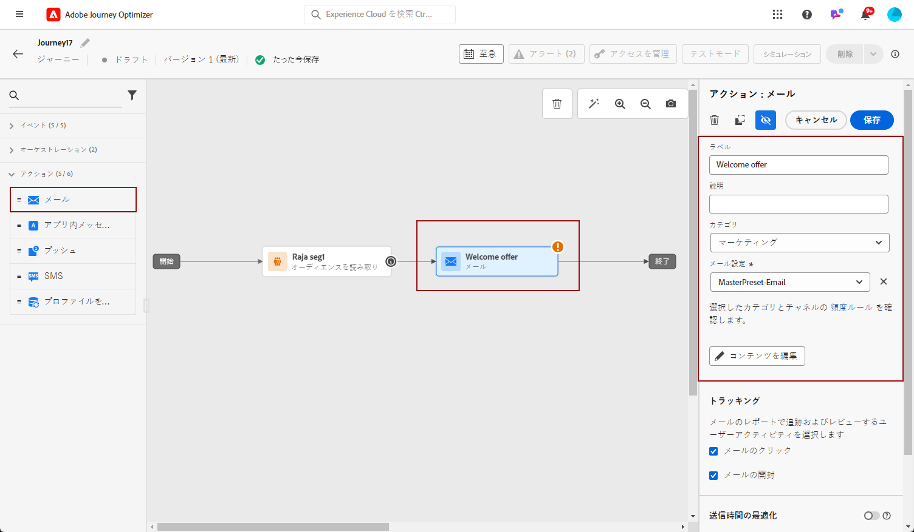
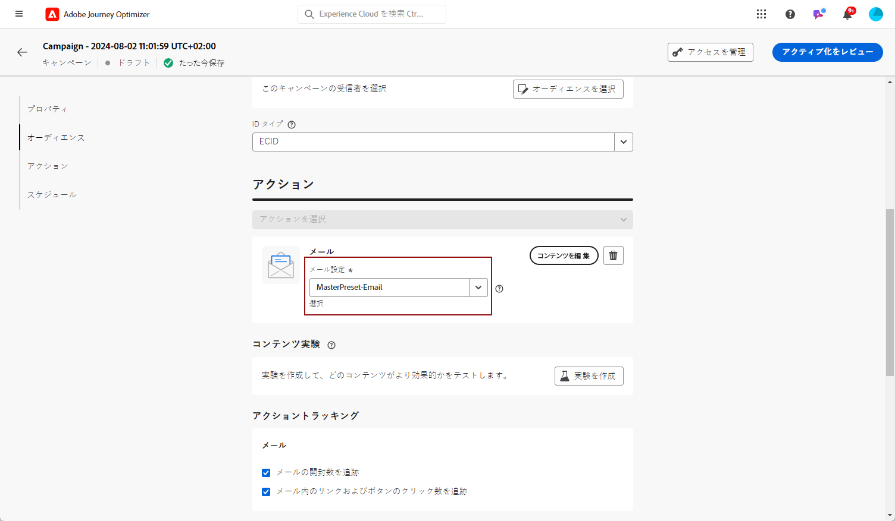

# メールの作成 {#create-email}

>[!CONTEXTUALHELP]
>id="ajo_message_email"
>title="メールの作成"
>abstract="メールのパラメーターを 3 つの簡単な手順で定義します。"

で E メールを作成するには、以下を実行します。 [!DNL Journey Optimizer]、次の手順に従います。

## ジャーニーまたはキャンペーンでの E メールの作成 {#create-email-journey-campaign}

を追加します。 **[!UICONTROL 電子メール]** アクションをジャーニーまたはキャンペーンに追加し、ケースに応じて以下の手順に従います。

>[!BEGINTABS]

>[!TAB ジャーニーへの E メールの追加]

1. ジャーニーを開き、 **[!UICONTROL 電子メール]** アクティビティ **[!UICONTROL アクション]** 」セクションに表示されます。

1. メッセージに関する基本情報（ラベル、説明、カテゴリ）を入力します。

1. を選択します。 [電子メール表面](email-settings.md) を使用します。

   

>[!NOTE]
>
>ジャーニーから E メールを送信する場合は、Adobe Journey Optimizerの送信時間の最適化機能を利用して、メッセージ送信の最適な時間を予測し、過去の開封率とクリック率に基づいてエンゲージメントを最大化できます。 [送信時間の最適化の操作方法を説明します。](../building-journeys/journeys-message.md#send-time-optimization)

ジャーニーの設定方法について詳しくは、 [このページ](../building-journeys/journey-gs.md).

>[!TAB キャンペーンへの E メールの追加]

1. スケジュール済みまたは API トリガーキャンペーンを新しく作成し、「 」を選択します。 **[!UICONTROL 電子メール]** を選択します。

1. を選択します。 [電子メール表面](email-settings.md) を使用します。

   

1. 「**[!UICONTROL 作成]**」をクリックします。

1. キャンペーンプロパティなどの E メールキャンペーンを作成する手順を実行します。 [audience](../segment/about-segments.md)、および [スケジュール](../campaigns/create-campaign.md#schedule).

   

<!--
From the **[!UICONTROL Action]** section, specify if you want to track how your recipients react to your delivery: you can track email opens, and/or clicks on links and buttons in your email.

-->

キャンペーンの設定方法について詳しくは、 [このページ](../campaigns/get-started-with-campaigns.md).

>[!ENDTABS]

## メールコンテンツの定義 {#define-email-content}

1. ジャーニーまたはキャンペーンの設定画面で、 **[!UICONTROL コンテンツを編集]** ボタンをクリックして、E メールのコンテンツを設定します。 [詳細情報](get-started-email-design.md)

   

1. 内 **[!UICONTROL ヘッダー]** セクション **[!UICONTROL コンテンツを編集]** screen, **[!UICONTROL 送信者名]**, **[!UICONTROL 送信元メール]** および **[!UICONTROL BCC]** フィールドは、選択した e メールサーフェスから取得されます。 [詳細情報](email-settings.md) <!--check if same for journey-->

   

1. 件名を追加できます。 対応するフィールドに直接プレーンテキストを入力するか、 [式エディター](../personalization/personalization-build-expressions.md) 件名をパーソナライズします。

1. 次をクリック： **[!UICONTROL メール本文を編集]** ボタンをクリックして、 [!DNL Journey Optimizer] E メールデザイナー。 [詳細情報](get-started-email-design.md)

   

1. キャンペーンに参加している場合は、 **[!UICONTROL コードエディター]** ボタンを使用して、表示されるポップアップウィンドウを使用して、プレーンHTMLで独自のコンテンツをコーディングします。

   

   >[!NOTE]
   >
   >E メールデザイナーで既にコンテンツを作成または読み込んでいる場合は、そのコンテンツがHTMLで表示されます。

## アラートの確認 {#check-email-alerts}

メッセージを設計する際、重要な設定が見つからない場合は、（画面の右上にある）インターフェイスにアラートが表示されます。

>[!NOTE]
>
>このボタンが表示されない場合、アラートは検出されていません。

システムでチェックされる設定と要素は以下のとおりです。また、設定を調整して対応する問題を解決する方法に関する情報もあります。

次の 2 種類のアラートが発生する可能性があります。

* **警告** 次のようなレコメンデーションとベストプラクティスを参照してください。

   * **[!UICONTROL メール本文にオプトアウトンクがありません]**：購読解除リンクをメール本文に追加するのがベストプラクティスです。設定方法について詳しくは、[この節](../privacy/opt-out.md#opt-out-management)を参照してください。

      >[!NOTE]
      >
      >マーケティングタイプの電子メールメッセージには、オプトアウトリンクを含める必要があります。これはトランザクションメッセージには必要ありません。メッセージカテゴリ (**[!UICONTROL マーケティング]** または **[!UICONTROL トランザクション]**) が [チャンネル表面](email-settings.md#email-type) レベルとタイミング [メッセージの作成](#create-email-journey-campaign) ジャーニーまたはキャンペーンから。

   * **[!UICONTROL HTML のテキストバージョンが空です]**：メール本文のテキストバージョンを必ず定義してください。このバージョンは、HTML コンテンツを表示できない場合に使用されます。テキストバージョンの作成方法については、[この節](text-version-email.md)を参照してください。

   * **[!UICONTROL メールの本文に空のリンクが存在します]**：メール内のすべてのリンクが正しいことを確認します。コンテンツとリンクの管理方法については、[この節](content-from-scratch.md)を参照してください。

   * **[!UICONTROL メールのサイズが 100KB の制限を超えています]**：配信を最適化するには、メールのサイズが 100KB を超えないようにしてください。メールコンテンツの編集方法については、[この節](content-from-scratch.md)を参照してください。

* **エラー** 次のような解決されていない限り、ジャーニー/キャンペーンをテストまたはアクティブ化できません。

   * **[!UICONTROL 件名行がありません]**：電子メールの件名は必須です。定義およびパーソナライズの方法については、[この節](create-email.md)で説明します。

   <!--HTML is empty when Amp HTML is present-->

   * **[!UICONTROL メッセージの電子メールバージョンが空です]**：このエラーは、電子メールのコンテンツが設定されていない場合に表示されます。メールコンテンツの設計方法については、[この節](get-started-email-design.md)を参照してください。

   * **[!UICONTROL サーフェスが存在しません]**:メッセージの作成後に選択したサーフェスを削除した場合は、メッセージを使用できません。 このエラーが発生した場合は、メッセージの&#x200B;**[!UICONTROL プロパティ]**&#x200B;で別のサーフェスを選択します。チャネルサーフェスについて詳しくは、[この節](../configuration/channel-surfaces.md)を参照してください。

>[!CAUTION]
>
>電子メールを使用してジャーニー/キャンペーンをテストまたはアクティブ化するには、以下の問題をすべて解決する必要があります **エラー** アラート。

## E メールをプレビューして送信

メッセージコンテンツを定義したら、プレビューして、E メールのレンダリングを制御し、テストプロファイルでパーソナライゼーション設定を確認できます。 [詳細情報](preview.md)

E メールの準備が整ったら、 [ジャーニー](../building-journeys/journey-gs.md) または [campaign](../campaigns/create-campaign.md)をクリックし、メッセージを送信するためにアクティブ化します。

>[!NOTE]
>
>E メールの開封やインタラクションを通じて受信者の行動を追跡するには、 **[!UICONTROL トラッキング]** セクションがジャーニーの [メールアクティビティ](../building-journeys/journeys-message.md) または E メール内 [campaign](../campaigns/create-campaign.md).<!--to move?-->

<!--

## Define your email content {#email-content}

Use [!DNL Journey Optimizer] Email Designer to [design your email from scratch](../email/content-from-scratch.md). If you have an existing content, you can [import it in the Email Designer](../email/existing-content.md), or [code your own content](../email/code-content.md) in [!DNL Journey Optimizer]. 

[!DNL Journey Optimizer] comes with a set of [built-in templates](email-templates.md) to help you start. Any email can also be saved as a template.

Use [!DNL Journey Optimizer] Expression editor to personalize your messages with profiles' data. For more on personalization, refer to [this section](../personalization/personalize.md).

Adapt the content of your messages to the targeted profiles by using [!DNL Journey Optimizer] dynamic content capabilities. [Get started with dynamic content](../personalization/get-started-dynamic-content.md)

## Email tracking {#email-tracking}

If you want to track the behavior of your recipients through openings and/or clicks on links, enable the following options: **[!UICONTROL Email opens]** and **[!UICONTROL Click on email]**. 

Learn more about tracking in [this section](message-tracking.md).

## Validate your email content {#email-content-validate}

Control the rendering of your email, and check personalization settings with test profiles, using the preview section on the left-hand side. For more on this, refer to [this section](preview.md).

You must also check alerts in the upper section of the editor.  Some of them are simple warnings, but others can prevent you from using the message. 

-->

