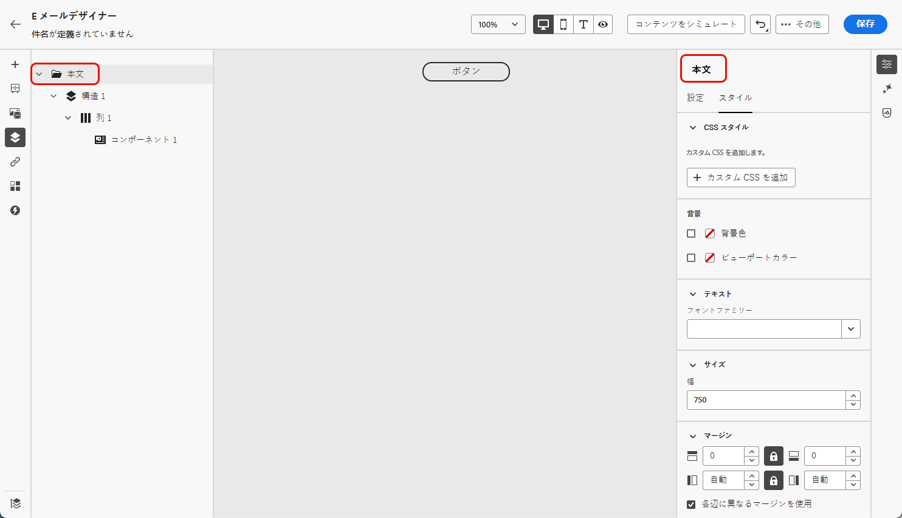

# メールコンテンツへのカスタム CSS の追加 {#email-metadata}

>[!CONTEXTUALHELP]
>id="ac_edition_css"
>title="独自の CSS の入力"
>abstract="コンテンツの外観に対する柔軟性と制御を高めるために、E メールデザイナー内でカスタム CSS を直接追加して、高度で特定のスタイル設定を適用できます。"

メールをデザインする際に、[!DNL Journey Optimizer][E メールデザイナー](get-started-email-design.md)内で独自のカスタム CSS を直接追加できます。この機能により、高度で特定のスタイル設定を適用して、コンテンツの外観に対する柔軟性と制御を高めることができます。

## カスタム CSS の定義 {#define-custom-css}

メールコンテンツにカスタム CSS を追加するには、次の手順に従います。

1. 1 つ以上の[コンポーネント](content-components.md)を追加して、E メールデザイナーにコンテンツが定義されていることを確認します。

1. 左側の&#x200B;**[!UICONTROL ナビゲーションツリー]**&#x200B;または右側のパネルの上部にある「**[!UICONTROL 本文]**」を選択します。右側に「**[!UICONTROL CSS スタイル]**」セクションが表示されます。

   {width="85%"}

   >[!NOTE]
   >
   >「**[!UICONTROL CSS スタイル]**」セクションは、エディターにコンテンツが既に存在する場合にのみ使用できます。

1. 「**[!UICONTROL カスタム CSS を追加]**」ボタンをクリックします。

   >[!NOTE]
   >
   >「**[!UICONTROL カスタム CSS を追加]**」ボタンは、「**[!UICONTROL 本文]**」が選択されている場合にのみ使用できます。 ただし、コンテンツ内のすべてのコンポーネントにカスタム CSS スタイルを適用できます。

1. ポップアップ表示される専用のテキスト領域に CSS コードを入力します。カスタム CSS が有効で、適切な構文に従っていることを確認します。[詳細情報](#use-valid-css)

   {width="65%"}

   >[!NOTE]
   >
   >コンテンツがロックされた [ テンプレート ](../content-management/content-locking.md#use) を使用する場合、カスタム CSS をコンテンツに追加することはできません。 ボタンのラベルが **[!UICONTROL カスタム CSS を表示]** に変わり、コンテンツに既に存在するカスタム CSS は読み取り専用です。

1. カスタム CSS を保存し、カスタム CSS がコンテンツに正しく適用されていることを確認します。該当しない場合は、[トラブルシューティング](#troubleshooting)の節を確認してください。

   {width="85%"}

1. すべてのコンテンツを削除すると、セクションは非表示になり、以前に定義したカスタム CSS は適用されなくなります。

1. コンテンツをエディターに追加し直すと、「**[!UICONTROL CSS スタイル]**」セクションが再表示されます。カスタム CSS が再度適用されます。

## 有効な CSS の使用の確認 {#use-valid-css}

「**[!UICONTROL カスタム CSS を追加]**」テキスト領域に有効な CSS 文字列を入力できます。適切に書式設定した CSS はコンテンツにすぐに適用されます。

>[!CAUTION]
>
>カスタム CSS のセキュリティについては、ユーザーが責任を負います。CSS によって脆弱性が発生したり、既存のコンテンツと競合したりしていないことを確認します。
>
>意図せずコンテンツのレイアウトや機能を損なう可能性がある CSS の使用は回避します。

+++ CSS のサンプル

有効な CSS の例を以下に示します。

```css
.acr-component[data-component-id="form"] {
  display: flex;
  justify-content: center;
  background: none;
}

.acr-Form {
  width: 100%;
  padding: 20px 100px;
  border-spacing: 0px 8px;
  box-sizing: border-box;
  margin: 0;
}

.acr-Form .spectrum-FieldLabel {
  width: 20%;
}

.acr-Form.spectrum-Form--labelsAbove .spectrum-FieldLabel,
.acr-Form [data-form-item="checkbox"] .spectrum-FieldLabel {
  width: auto;
}

.acr-Form .spectrum-Textfield {
  width: 100%;
}

#acr-form-error,
#acr-form-confirmation {
  width: 100%;
  padding: var(--spectrum-global-dimension-static-size-500);
  display: flex;
  align-items: center;
  flex-direction: column;
  justify-content: center;
  gap: var(--spectrum-global-dimension-static-size-200);
}

.spectrum-Form-item.is-required .spectrum-FieldLabel:after{
  content: '*';
  font-size: 1.25rem;
  margin-left: 5px;
  position: absolute;
}

/* Error field placeholder */
.spectrum-HelpText {
  display: none !important;
}

.spectrum-HelpText.is-invalid,
.is-invalid ~ .spectrum-HelpText {
  display: flex !important;
}
```

```css
@media only screen and (min-width: 600px) {
  .acr-paragraph-1 {
    width: 100% !important;
  }
}
```
+++

+++ 無効な CSS のサンプル

無効な CSS を入力すると、CSS を保存できないことを示すエラーメッセージが表示されます。無効な CSS の例を以下に示します。

`<style>` タグの使用は許可されていません。

```html
<style type="text/css">
  .acr-Form {
    width: 100%;
    padding: 20px 100px;
    border-spacing: 0px 8px;
    box-sizing: border-box;
    margin: 0;
  }
</style>
```

中括弧の欠落などの無効な構文は許可されていません。

```css
body {
  background: red;
```
+++

## 技術的な実装 {#implementation}

次の例に示すように、カスタム CSS は、`data-name="global-custom"` 属性を持つ `<style>` タグの一部として `<head>` セクションの末尾に追加されます。これにより、カスタムスタイルがコンテンツにグローバルに適用されます。

+++ サンプルを参照

```html
<!DOCTYPE html>
<html>
  <head>
    <meta charset="utf-8">
    <meta name="content-version" content="3.3.31">
    <meta name="x-apple-disable-message-reformatting">
    <meta name="viewport" content="width=device-width,initial-scale=1.0">
    <style data-name="default" type="text/css">
      td { padding: 0; }
      th { font-weight: normal; }
    </style>
    <style data-name="grid" type="text/css">
      .acr-grid-table { width: 100%; }
    </style>
    <style data-name="acr-theme" type="text/css" data-theme="default" data-variant="0">
      body { margin: 0; font-family: Arial; }
    </style>
    <style data-name="media-default-max-width-500px" type="text/css">
      @media screen and (max-width: 500px) {
        body { width: 100% !important; }
      }
    </style>
    <style data-name="global-custom" type="text/css">
      /* Add you custom CSS here */
    </style>
  </head>
  <body>
    <!-- Minimal content -->
  </body>
</html>
```
+++

カスタム CSS は、E メールデザイナーの&#x200B;**[!UICONTROL 設定]**&#x200B;パネルでは解釈または検証されません。これは完全に独立しており、「**[!UICONTROL カスタム CSS を追加]**」オプションを通じてのみ変更できます。

### ガードレール – 読み込まれたコンテンツ

E メールデザイナーに読み込んだコンテンツでカスタム CSS を使用する場合は、次の点を考慮します。

* CSS を含む外部 HTML コンテンツを読み込む場合、そのコンテンツを変換しない限り、**[!UICONTROL 互換性モード]**&#x200B;になり、「**[!UICONTROL CSS スタイル]**」セクションは使用できません。[既存のコンテンツの読み込みの詳細情報](existing-content.md)

* 「**[!UICONTROL カスタム CSS を追加]**」オプションを通じて適用された CSS を含む、E メールデザイナーで作成したコンテンツを読み込む場合、以前に適用された CSS は同じオプションから表示および編集できます。

<!--
* If importing content created with the Email Designer with CSS applied externally, the CSS code previously applied cannot be accessed within the **[!UICONTROL Add custom CSS]** pop-up window, but you can still override it with new custom CSS.-->

## トラブルシューティング {#troubleshooting}

カスタム CSS が適用されない場合は、以下のオプションを考慮します。

* CSS が有効で、構文エラー（中括弧の欠落、プロパティ名の誤りなど）がないことを確認します。[方法についてはこちらを参照](#use-valid-css)

* CSS が、`<style>` 属性を持つ `data-name="global-custom"` タグに追加されていることを確認します。

* `global-custom` スタイルタグの属性 `data-disabled` が `true` に設定されているかどうかを確認します。 その場合、カスタム CSS は適用されません。

+++ 例：

  ```html
  <style data-name="global-custom" type="text/css" data-disabled="true"> body: { color: red; } </style>
  ```

+++

* コンテンツに適用された[テーマ](apply-email-themes.md)を含む、他の CSS ルールによって CSS が上書きされないようにします。

   * ブラウザーの開発者ツールを使用してコンテンツを検査し、CSS が正しいセレクターをターゲットにしていることを確認します。

   * 必ず優先されるように、宣言に `!important` を追加することを検討してください。

+++ 例：

     ```css
     .acr-Form {
       background: red !important;
     }
     ```

+++
