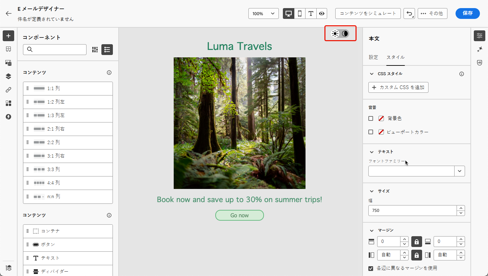
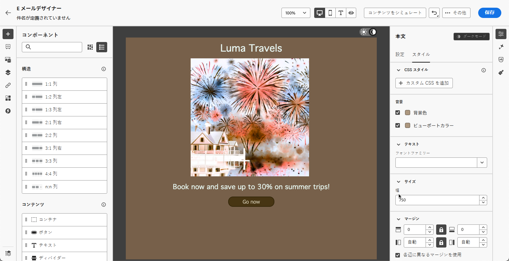
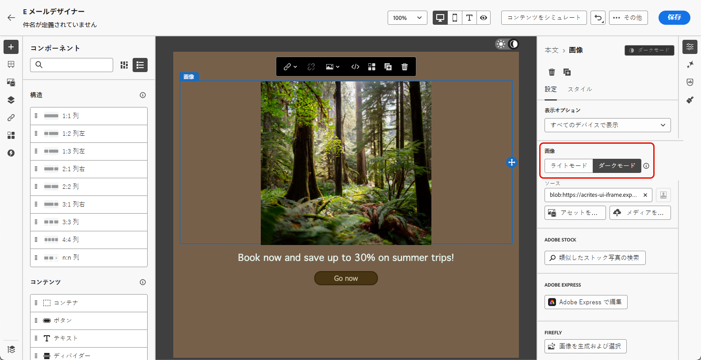
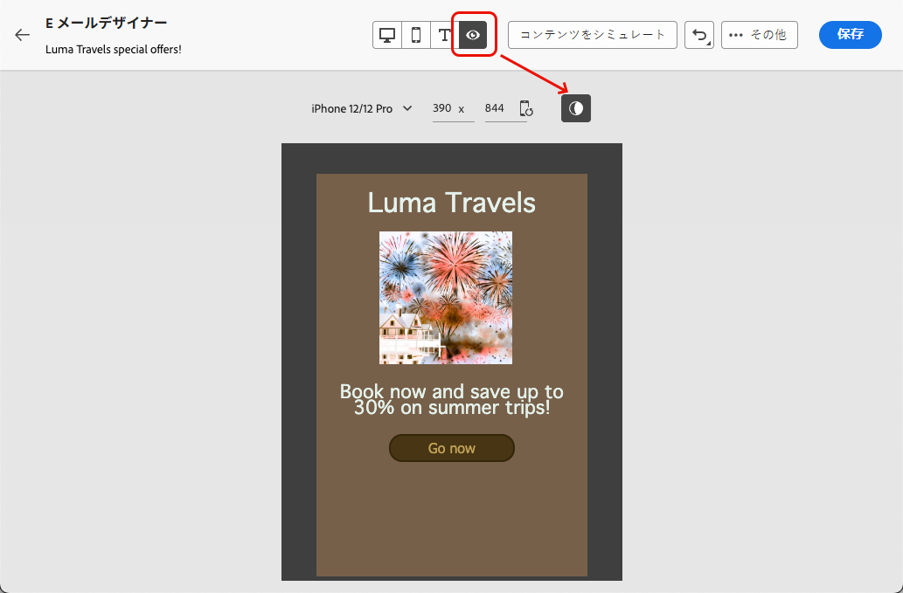
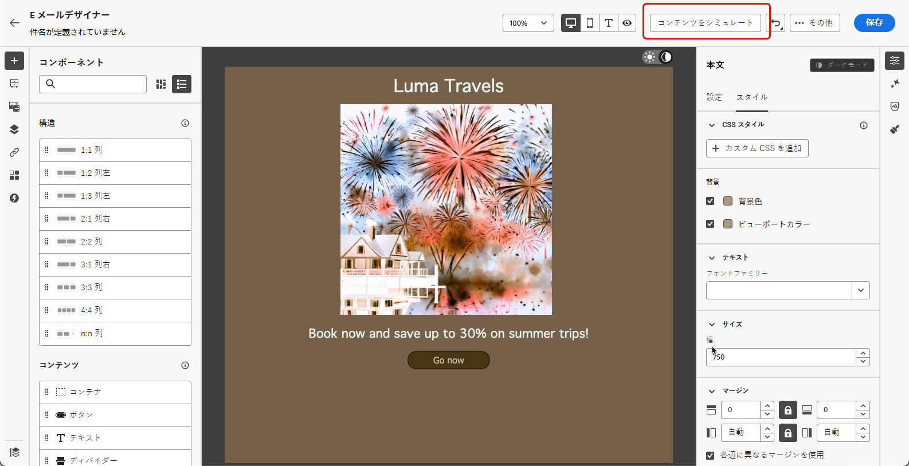

# ダークモードコンテンツの管理 {#dark-mode}

>[!CONTEXTUALHELP]
>id="ac_edition_darkmode"
>title="ダークモードに切り替え"
>abstract="ダークモードに切り替えると、レンダリング方法をプレビューし、特定のカスタム設定を定義できます。   最終的なレンダリングは、受信者のメールクライアントによって異なります。 なお、すべてのメールクライアントでカスタムダークモードがサポートされているわけではありません。"

>[!CONTEXTUALHELP]
>id="ac_edition_darkmode_preview"
>title="ダークモードに切り替え"
>abstract="ダークモードに切り替えると、サポートされているメールクライアントでどのようにレンダリングされるかをプレビューできます。   最終的なレンダリングは、受信者のメールクライアントによって異なります。 なお、すべてのメールクライアントがダークモードをサポートしているわけではありません。"

>[!AVAILABILITY]
>
>この機能は現在ベータ版で、ベータ版のお客様のみご利用いただけます。<!--To join the beta program, contact your Adobe representative.-->

メールをデザインする際に、[!DNL Journey Optimizer][ メールDesigner](get-started-email-design.md) を使用して **[!UICONTROL ダークモード]** ビューに切り替えることができます。

この <!--Email Designer --> ダークモード表示では、サポートしているメールクライアントがダークモードがオンの場合に表示する特定のカスタム設定を定義することもできます。

<!--When designing your emails, the Journey Optimizer Email Designer allows you to switch to Dark mode where you can define specific custom settings. When dark mode is on, the supporting email clients will display the settings that you defined for this mode.-->

## ダークモードとは {#what-is-dark-mode}

さまざまなメールクライアントでダークモードがレンダリングされる方法は複雑です。 まず、ダークモードを定義します。

ダークモードを使用すると、サポートされるメールクライアントやアプリで、テキスト、ボタン、その他の UI 要素に暗い背景と明るい色のメールを表示できます。 目への負担を軽減し、バッテリー寿命を短縮し、低照度環境での読みやすさを向上させて、より快適な視聴エクスペリエンスを実現します。

<!--Dark Mode uses a dark color palette with light text and UI elements to reduce eye strain, save battery life, and improve readability in low-light environments.-->

主要なオペレーティングシステムやアプリ全体で高まる傾向として <!-- (Apple Mail, Gmail, Outlook, Twitter, Slack)--> コンテンツをすべてのユーザーにとって読みやすく、視覚的に魅力あるものにするために、最新のメールデザインでは重要な検討事項となっています。

## ガードレール {#guardrails}

ダークモードのレンダリングに対する期待は、様々なメールクライアントによって適用される方法が大きく異なる可能性があるので、慎重に考慮する必要があります。

<!--The dark mode final rendering depends on the recipient's email client. It is not possible to guarantee that your email will look the same in dark mode across all devices.-->

[!DNL Journey Optimizer] Email Designerでダークモードを使用する前に、メインのメールクライアントでの処理方法を理解することが重要です。 区別すべきケースは次の 3 つです。

<!--
* Check out the list of [email clients supporting dark mode](https://www.caniemail.com/search/?s=dark){target="_blank"}

* Learn more on Dark mode in this [Litmus blog post](https://www.litmus.com/blog/the-ultimate-guide-to-dark-mode-for-email-marketers){target="_blank"}
-->

### ダークモードをサポートしていないクライアント {#not-supporting}

次のような一部のメールクライアントは、この機能をまったくサポートしていません。

* Yahoo! メール
* AOL

E メールDesignerでダークモードのカスタム設定を定義しているかどうかに関係なく、これらのメールクライアントはダークモードのレンダリングを表示しません。<!--Regardless of whether the interface is in light or dark mode, your email will render the same.-->

### 独自のダークモードを適用するクライアント {#default-support}

一部のメールクライアントは、受信するすべてのメールに対して独自のデフォルトのダークモードを体系的に適用しています。 色、背景、画像など。 はメールクライアントに固有のダークモード設定で自動的に調整されます。つまり、外部の変更はできません。

<!--It is important to note that less than 25% of email clients offer customization options for dark mode. Clients such as Gmail implement their own dark mode rendering, which is not subject to external modification.-->

次に例を示します。

* Gmail（デスクトップ web メール、iOS、Android、モバイル web メール）
* Outlook Windows
* Outlook Windows メール

この場合、メールDesignerでカスタムダークモード設定を定義すると、その設定はメールクライアントの設定で上書きされます。

これらのメールクライアントはダークモードを処理することを理解することが重要ですが、特定のダークモードデザインはレンダリングされません。

<!--In this case, the custom settings that you defined in the Email Designer cannot be rendered.-->

<!--Some visual changes may also be caused by the email app or device overriding the original design.-->

### カスタムダークモードをサポートするクライアント {#custom-support}

他のメールクライアントには、`@media (prefers-color-scheme: dark)` クエリを使用してカスタムダークモードをレンダリングするオプションが用意されています。これは、[!DNL Journey Optimizer] Email Designerで使用される方法です。

このオプションを処理する主なクライアントのリストを以下に示します。

* Apple メール macOS
* Apple メール iOS
* Outloook macOS
* Outlook.com
* Outlook iOS
* Outlook Android

この場合、メールDesignerで定義した具体的な設定が表示されます。

>[!NOTE]
>
>メールDesignerを使用してダークモードのカスタム設定を定義する方法については、[ この節 ](#define-custom-dark-mode) を参照してください。

ただし、電子メールクライアントごとに適用される制限もあります。 例えば、Apple Mail 16 （macOs 13）などの一部のクライアントでは、メールのコンテンツに画像が存在してもダークモードが生成されません。

最適な結果を得るには、ターゲット設定しているメールクライアントでコンテンツをテストします。 各クライアントの最終結果にできるだけ近いシミュレーションを確認するには、メールDesignerの「[ メールのレンダリング ](../content-management/rendering.md)」オプションを使用します。

## E メールデザイナーでのダークモード {#dark-mode-email-designer}

E メールデザイナーでのダークモードに関しては、考慮すべき 2 つの側面があります。

* サポートされているほとんどのメールクライアントで、デフォルトのダークモードがどのようにレンダリングされるかをプレビューできます。[詳細情報](#preview-dark-mode)

<!--
    >[!CAUTION]
    >
    >The final rendering may vary according to the recipient's email client. To see the exact rendering for each email client, use the [Email rendering](../content-management/rendering.md) option.-->

* サポートされているメールクライアントのデフォルト設定を上書きする場合は、編集中のメールに適用するカスタムダークモード設定を定義できます。[詳細情報](#define-custom-dark-mode)

<!--
    >[!WARNING]
    >
    >Not all email clients support custom dark mode. Some email clients only apply their own default dark mode for all emails that are received. In this case, the custom settings that you defined in the Email Designer cannot be rendered. [Learn more](#guardrails)-->

### デフォルトのダークモードのプレビュー {#preview-dark-mode}

E メールデザイナーでダークモードにアクセスし、デフォルトのダークモード設定のプレビューを取得するには、次の手順に従います。

1. E メールデザイナーのホームページで、「**[!UICONTROL ゼロからデザイン]**」オプションを選択します。[詳細情報](content-from-scratch.md)

<!--Should work with templates and themes, NOT for LP and fragments - but TBC with eng.
    >[!NOTE]
    >
    >Currently you may not be able to switch to dark mode if you select an [email template](use-email-templates.md) or if you apply a [theme](apply-email-themes.md).-->

1. [構造](content-from-scratch.md)と[コンテンツコンポーネント](content-components.md)をコンテンツに追加します。

1. 中央のキャンバスの右上で、切替スイッチを&#x200B;**[!UICONTROL ダークモード]**&#x200B;に切り替えます。

   

1. デフォルトのダークモードのプレビューが表示されます。

   

デフォルトでは、E メールデザイナーのダークモードのプレビューには、画像とアイコンを除くすべての要素に「フルカラー反転」カラースキームが適用されます。

つまり、明るい要素と暗い要素の領域を検出して反転させることで、明るい背景は暗く、暗いテキストは明るくなり、暗い背景は明るく、明るいテキストは暗くなります。

>[!CAUTION]
>
>最終的なレンダリングは、受信者のメールクライアントによって異なる場合があります。各メールクライアントの最終結果にできるだけ近いシミュレーションを表示するには、「[メールレンダリング](../content-management/rendering.md)」オプションを使用します。

<!--This is custom dark mode:

  

Here you can see that we have applied a different background, defined another image and change the color of the text and button.-->

### カスタムダークモードの定義 {#define-custom-dark-mode}

>[!CONTEXTUALHELP]
>id="ac_edition_darkmode_image"
>title="特定の画像をダークモードで使用"
>abstract="ダークモードがオンの場合に表示される別の画像を選択できます。   ダークモード用に特定の画像を追加しても、すべてのメールクライアントで正しくレンダリングされるとは限りません。 なお、すべてのメールクライアントでカスタムダークモードがサポートされているわけではありません。"

**[!UICONTROL ダークモード]**&#x200B;に切り替えたら、受信者のメールクライアントでダークモードが有効になっている場合にのみ表示されるコンテンツの特定のスタイル要素の編集を選択できます（その機能がサポートされている場合）。

>[!WARNING]
>
>ダークモードの最終的なレンダリングは、各メールクライアントに応じて異なるので、結果はクライアントごとに異なる場合があります。[詳細情報](#guardrails)

<!--
>[!WARNING]
>
>Not all email clients support dark mode. Moreover, some email clients only apply their own default dark mode for all emails that are received. In both cases, the custom settings that you defined in the Email Designer cannot be rendered.-->

E メールデザイナーのカスタムダークモードのスタイル設定を活用するには、Journey Optimizer では<!-- `@media (prefers-color-scheme: dark)` method--> `@media (prefers-color-scheme: dark)` CSS クエリを使用します。このクエリでは、ユーザーのメールクライアントがダークモードに設定されているかどうかを検出し、メールで定義したダークテーマのデザインが適用されます。

カスタムダークモードの設定を定義するには、次の手順に従います。

1. E メールデザイナーで&#x200B;**[!UICONTROL ダークモード]**&#x200B;プレビューに切り替えます。[詳細情報](#preview-dark-mode)

1. テキスト、背景、ボタンなどのスタイル設定の色属性を編集します。

1. 画像やアイコンの色は変更できませんが、特定のアセットはダークモード用にのみ定義できます。これを行うには、任意の画像を選択します。**[!UICONTROL 設定]**&#x200B;パネルの専用切替スイッチを使用して&#x200B;**[!UICONTROL ダークモード]**&#x200B;に切り替え、別のアセットを選択します。

   

   <!---->

1. いつでも&#x200B;**[!UICONTROL ライブビューに切り替えて]**、様々なデバイスサイズでコンテンツがどのようにレンダリングされる可能性があるかを確認できます。このビューから、画面上部のダークモード切替スイッチを選択すると、様々なデバイスをまたいでコンテンツのダークモードバージョンをプレビューできます。

   {width="80%" align="center"}

   >[!CAUTION]
   >
   >ライブビューは、様々なデバイスサイズをまたいでレンダリングがどのように表示される可能性があるかを比較するのにデザインされた汎用プレビューです。最終的なレンダリングは、受信者のメールクライアントによって異なる場合があります。

1. ダークモードの変更に満足したら、「**[!UICONTROL コンテンツをシミュレート]**」をクリックします。

   

1. 「**[!UICONTROL メールをレンダリング]**」を選択し、Litmus アカウントに接続します。様々なメールクライアントでの最終的なダークモードレンダリングを確認できます。詳しくは、[メールのレンダリング](../content-management/rendering.md)を参照してください。

   >[!WARNING]
   >
   >シミュレーションではダークモードでのメールの表示に非常に近いですが、メールサービスプロバイダーやデバイスレベルの設定の違いにより、実際のレンダリングは異なる場合があります。

## ベストプラクティス {#best-practices}

主要なメールクライアント間でダークモードの採用が増加するにつれて、[カスタムダークモード](#define-custom-dark-mode)を使用しているかどうかに関係なく、明るい環境と暗い環境の両方でメールがどのようにレンダリングされるかを考慮することが重要になります。

ダークモードでは、色、背景、画像が変更される可能性があり、場合によってはデザインの選択が上書きされることもあります。 視覚的な一貫性、アクセシビリティ、ブランドの整合性を確保するには、次に示すベストプラクティスに従ってください。

**画像とロゴの最適化**

* ロゴやアイコンを透明な背景の PNG として保存し、ダークモードで白いボックスが表示されないようにします。

* 白色の背景または明るい背景がハードコードされた画像は回避します。

* 透明度がオプションでない場合は、不自然な色の反転を防ぐために、デザインでは単色の背景に画像を配置します。

**背景に対する注意**

* ライトモードとダークモードの両方で読みやすくするには、テキストと背景色の間に十分なコントラストを確保します。

* 重要なコンテンツについては、背景色にのみ依存することは回避します。一部のクライアントでは、ダークモードで背景色を上書きすることがあるので、重要な情報が表示されていることを確認します。

<!--**Inline critical styles**

Inline CSS helps maintain more control over styling, as some clients strip external styles in dark mode.-->

**ダークモードでのアクセス可能なコンテンツのデザイン**

<!--KEEP dark mode accessibility best practices IN ONE SINGLE LOCATION - for now listed on this page.
If needed, it can be moved to the Design accessible content page:
The best practices for designing accesible content in dark mode are listed in [this section](accessible-content.md#dark-mode).-->

* 色覚異常のある人物でも簡単に区別できる色の組み合わせを使用します。

* 明るい背景と暗い背景の両方に対してコントラストを確保するのに、ミッドトーンパレットを使用します。

* 読みやすさを向上させ、Web コンテンツアクセシビリティガイドライン（WCAG）標準を満たすには、コントラストの高いアクセシブルな色の組み合わせを使用します。WebAIM のコントラストチェッカーなどのツールを使用して、色のコントラストを検証します。

* 読みやすさに影響する場合があるので、細いフォントは回避します。ブランドに細いフォントが必要な場合は、ダークモードで太字にします。

* 純粋な白色に純粋な黒色を重ねると、目への負担の原因となる場合があり、一部のメールクライアントにより自動的に反転される可能性があるので、これを回避します。

* ダークモードがサポートされていない場合は、アクセスできるフォールバックスタイル設定を指定します。

**ダークモード環境でのメールのテスト**

* 問題を早期に発見するには、反転したカラースキームを使用する E メールデザイナーの[ダークモードのプレビュー](#preview-dark-mode)を使用します。

* Litmus を活用した「[メールレンダリング](../content-management/rendering.md)」オプションを使用して、主要なメールクライアント（Apple メール、Gmail、Outlook）でデザインをシミュレートし、ダークモードでの色と画像の動作を確認します。

<!--

## Email clients supporting dark mode {#supporting-email-clients}

Below is a list of the main email clients supporting dark mode using the with the `@media (prefers-color-scheme: dark)` query.

>[!NOTE]
>
>Some versions of these email clients do not support dark mode, so they are also presented in this table for the sake of clarity.

| Email clients supporting custom dark mode| Compatible versions | *Unsupported versions* |
|---------|----------|---------|
| Apple Mail macOS| 12.4, 16.0 | *10.3* |
| Apple Mail iOS | 13.0, 16.1 | *12.2* |
| Outloook macOS | 2019, 16.70, 16.80 | NA |
| Outlook.com | 2019-07, 2022-12 | NA |
| Outloook iOS | 2020-01, 2022-12 | NA |
| Outloook Android | 2023-03 | *2020-01, 2022-12* |

| Other email clients supporting custom dark mode| Compatible versions | *Unsupported versions* |
|---------|----------|---------|
| Samsung Email (Android) | 6.1 | *6.0* |
| Mozilla Thunderbird (macOS) | 68.4 | *60.8, 78.5, 91.13* |
| Fastmail (Desktop Webmail)| 2022-12 | *2021-07* |
| HEY (Desktop Webmail)| 2020-06 | *2022-12* |
| Orange Desktop Webmail| 2019-08, 2021-03, 2022-12, 2024-04 | NA |
| Orange iOS | 2022-12, 2024-04 | *2020-01* |
| Orange Android | 2024-04 | *2020-01, 2022-12* |
| LaPoste.net | 2021-08, 2022-12 | NA |
| SFR  Desktop Webmail | 2019-08, 2022-12 | NA |
| GMX (iOs and Android) | 2022-06 | NA |
| 1&1 (Desktop Webmail and Android) | 2022-06 | NA |
| WEB.DE (iOs and Android) | 2022-06 | NA |
| Free.fr | 2022-12 | NA |

>[!WARNING]
>
>The dark mode final rendering depends on each email client, so results can vary from one to another.

## Email clients not supporting dark mode {#non-supporting-email-clients}

Some email clients allow users to switch their interface to dark mode, but this setting does not affect how HTML emails are displayed.  Here is a list of those clients:

| Main email clients with their own dark mode| 
|---------|
| Gmail (Desktop Webmail, iOS, Android, Mobile Webmail) | 
| Outloook Windows |
| Outlook Windows Mail |

Other email clients do not support dark mode at all:

| Main email clients not supporting dark mode| 
|---------|
| Yahoo!Mail | 
| AOL | 

| Other mail clients not supporting dark mode| 
|---------|
| ProtonMail |
| SFR iOS |
| SFR Android | 
| GMX Desktop Webmail | 
| Mail.ru | 
| WEB.DE Desktop Webmail | 
| T-online.de |

-->