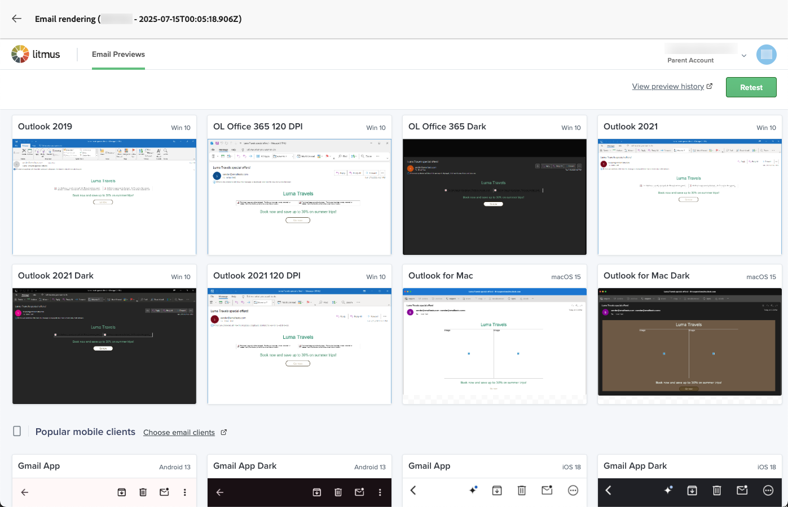

# ダークモードコンテンツの定義 {#dark-mode}

>[!CONTEXTUALHELP]
>id="ac_edition_darkmode"
>title="ダークモードに切り替える"
>abstract="ダークモードに切り替えると、レンダリング方法をプレビューし、特定のカスタム設定を定義できます。   注意：最終的なレンダリングは、受信者のメールクライアントに応じて異なります。 すべてのメールクライアントがカスタムダークモードをサポートしているわけではありません。"

>[!CONTEXTUALHELP]
>id="ac_edition_darkmode_image"
>title="ダークモード用に特定の画像を使用"
>abstract="ダークモードがオンの場合に表示される別の画像を選択できます。   注意：ダークモード用の特定の画像を追加しても、すべてのメールクライアントで正しくレンダリングされるとは限りません。 すべてのメールクライアントがカスタムダークモードをサポートしているわけではありません。"

>[!CONTEXTUALHELP]
>id="ac_edition_darkmode_preview"
>title="ダークモードに切り替える"
>abstract="ダークモードに切り替えて、サポートされているメールクライアントでのレンダリング方法をプレビューします。   注意：最終的なレンダリングは、受信者のメールクライアントに応じて異なります。 すべてのメールクライアントがカスタムダークモードをサポートしているわけではありません。"

メールをデザインする際、[!DNL Journey Optimizer][ メールDesigner](get-started-email-design.md) を使用すると、**[!UICONTROL ダークモード]** に切り替えて、特定のカスタム設定を定義できます。 ダークモードがオンの場合、サポートするメールクライアントには、このモード用に定義した設定が表示されます。

>[!WARNING]
>
>ダークモードの最終レンダリングは、受信者のメールクライアントによって異なります。
>
>すべてのメールクライアントがカスタムダークモードをサポートしているわけではありません。 <!--[See the list](#non-supporting-email-clients)--> さらに、一部のメールクライアントは、受信したすべてのメールに対して独自のデフォルトのダークモードのみを適用します。 この場合、メールDesignerで定義したカスタム設定はレンダリングできません。

ダークモードをサポートするメールクライアントのリストについては、[ この節 ](#supporting-email-clients) を参照してください。

## ダークモードとは {#what-is-dark-mode}

ダークモードを使用すると、サポートされているメールクライアントやアプリで、テキスト、ボタン、その他の UI 要素に対して、暗い背景と明るい色のメールを表示できます。 目への負担を軽減し、バッテリー寿命を短縮し、低照度環境での読みやすさを向上させて、より快適な視聴体験を実現します。

<!--Dark Mode uses a dark color palette with light text and UI elements to reduce eye strain, save battery life, and improve readability in low-light environments.-->

主要なオペレーティングシステムやアプリ（Apple Mail、Gmail、Outlook、Twitter、Slack）全体で高まる傾向として、コンテンツを常に読みやすく、すべてのユーザーに視覚的にアピールするために、最新のメールデザインにおける重要な検討事項となっています。

ただし、ダークモードでは、すべてのデバイスでメールの表示がまったく同じになることを保証することはできません。 メールアプリやデバイスが元のデザインを上書きした場合にも、視覚的な変更が生じる場合があります。

実際、メールクライアントでダークモードが適用される方法は、<!--between different devices and apps--> のように異なる場合があります。

* すべてのメールクライアントがこの機能をサポートしているわけではありません。

  >[!NOTE]
  >
  >ダークモードをサポートしていないメールクライアントのリストについては、[ この節 ](#non-supporting-email-clients) を参照してください。

* 一部のメールクライアントでは、カラー、背景、画像を自動的に調整します。 この場合、メールDesignerでカスタム設定を定義しても、その設定はレンダリングされない可能性があります。

* 他のメールクライアントには、カスタムダークモードをレンダリングするオプションが用意されています（`@media (prefers-color-scheme: dark)` メソッドを使用する場合など）。 この場合、メールDesignerで定義した具体的な設定が表示されます。 メールDesignerでダークモードのカスタム設定を定義する方法については、[ この節 ](#define-custom-dark-mode) を参照してください。

## メールDesignerのダークモード {#dark-mode-email-designer}

メールDesignerでダークモードに関して考慮すべき 2 つの側面があります。

* ほとんどのサポートメールクライアントでデフォルトのダークモードがどのようにレンダリングされるかをプレビューできます。 [詳細情報](#preview-dark-mode)

<!--
    >[!CAUTION]
    >
    >The final rendering may vary according to the recipient's email client. To see the exact rendering for each email client, use the [Email rendering](../content-management/rendering.md) option.-->

* サポートされるメールクライアントのデフォルト設定を上書きする場合は、編集するメールに適用するカスタムのダークモード設定を定義できます。 [詳細情報](#define-custom-dark-mode)

<!--
    >[!WARNING]
    >
    >Not all email clients support custom dark mode. Some email clients only apply their own default dark mode for all emails that are received. In this case, the custom settings that you defined in the Email Designer cannot be rendered. [Learn more](#guardrails)-->

### デフォルトのダークモードのプレビュー {#preview-dark-mode}

メールDesignerでダークモードにアクセスし、デフォルトのダークモード設定のプレビューを取得するには、次の手順に従います。

1. メールDesignerのホームページで、「**[!UICONTROL ゼロからデザイン]**」オプションを選択します。 [詳細情報](content-from-scratch.md)

   >[!NOTE]
   >
   >現在、[ メールテンプレート ](use-email-templates.md) または [ テーマ ](apply-email-themes.md) を適用した場合は、ダークモードに切り替えることができない場合があります。

1. [ 構造 ](content-from-scratch.md) および [ コンテンツコンポーネント ](content-components.md) をコンテンツに追加します。

1. 中央キャンバスの右上で、切り替えを **[!UICONTROL ダークモード]** に切り替えます。

   

1. デフォルトのダークモードプレビューが表示されます。

   
<!--
    >[!NOTE]
    >
    >Dark mode applies to all elements, except images and icons.-->

デフォルトでは、メールDesignerのダークモードプレビューは、画像とアイコンを除くすべての要素に「フルカラー反転」カラースキームを適用します。<!--It fully inverts all colors for all the elements (texts, buttons, etc.)-->

つまり、明るい要素と暗い要素の領域を検出してそれらを反転することで、明るい背景は暗くなり、暗いテキストは明るくなり、暗い背景は明るくなり、明るいテキストは暗くなります。

>[!CAUTION]
>
>最終的なレンダリングは、受信者のメールクライアントによって異なる場合があります。 各メールクライアントの最終結果にできるだけ近いシミュレーションを確認するには、「[ メールのレンダリング ](../content-management/rendering.md)」オプションを使用します。

<!--This is custom dark mode:

  

Here you can see that we have applied a different background, defined another image and change the color of the text and button.-->

### カスタムダークモードの定義 {#define-custom-dark-mode}

**[!UICONTROL ダークモード]** に切り替えた後、受信者のメールクライアントでダークモードが有効な場合にのみ表示される、コンテンツの特定のスタイル要素を編集できます（その機能をサポートしている場合）。

>[!WARNING]
>
>すべてのメールクライアントがダークモードをサポートしているわけではありません。 さらに、一部のメールクライアントは、受信したすべてのメールに対して独自のデフォルトのダークモードのみを適用します。 どちらの場合も、メールDesignerで定義したカスタム設定はレンダリングできません。

Journey Optimizerでは、メールDesignerのカスタムダークモードのスタイル設定を活用するために、<!-- `@media (prefers-color-scheme: dark)` method--> の機能を使用しています。 CSS クエリ `@media (prefers-color-scheme: dark)`、ユーザーのメールクライアントがダークモードに設定されているかどうかを検出し、メールで定義されたダークテーマのデザインを適用します。

ダークモードのカスタム設定を定義するには、次の手順に従います。

1. メールDesignerで **[!UICONTROL ダークモード]** が有効になっていることを確認します。 [詳細情報](#preview-dark-mode)

1. テキスト、背景、ボタンなどのスタイル設定色属性を編集します。

1. 画像やアイコンの色は変更できませんが、特定のアセットはダークモード用にのみ定義できます。 それには、任意の画像を選択します。 **[!UICONTROL 設定]** パネルの専用トグルを使用して **[!UICONTROL ダークモード]** に切り替え、別のアセットを選択します。

   

   <!---->

1. ダークモードのすべての変更を行ったら、「**[!UICONTROL コンテンツをシミュレート]**」をクリックします。

   

1. **[!UICONTROL メールをレンダリング]** を選択し、Litmus アカウントに接続します。 様々なメールクライアントでの最終的なダークモードレンダリングを確認できます。

   {width="80%"}

   >[!WARNING]
   >
   >シミュレーションはダークモードでのメールの表示に非常に近いものですが、メールサービスプロバイダーやデバイスレベルの設定の違いにより、実際のレンダリングは異なる場合があります。

## ベストプラクティス {#best-practices}

ダークモードの採用が主要なメールクライアント間で増加するにつれて、[ カスタムダークモード ](#define-custom-dark-mode) を使用しているかどうかにかかわらず、メールが明暗の両方の環境でどのようにレンダリングされるかを考慮することが重要になります。

ダークモードでは、カラー、背景、画像を変更でき、デザインの選択肢を上書きする場合もあります。 ビジュアルの一貫性、アクセシビリティ、ブランドの整合性を確保するには、次に示すベストプラクティスに従います。

**画像とロゴの最適化**

* 白または明るい背景をハードコードした画像は避けます。

* ロゴやアイコンを背景が透明な PNG として保存して、ダークモードで白いボックスが表示されないようにします。

* 透明度がオプションでない場合は、カラーがぎこちなく反転するのを防ぐために、デザインの実線の背景に画像を配置します。

**背景に注意**

* 明るいモードと暗いモードの両方で読みやすくするために、テキストと背景色の間に十分なコントラストを確保します。

* 重要なコンテンツを背景色だけに依存することは避けます。 一部のクライアントは、ダークモードでは背景色をオーバーライドするので、キー情報が表示されていることを確認します。

**アクセス可能なコンテンツをダークモードでデザイン**

* 色覚異常者には、簡単に区別できる色の組み合わせを使用します。

* ミッドトーンパレットを使用して、明るい背景と暗い背景の両方に対してコントラストを確保します。

* アクセシブルな色の組み合わせを高コントラストで使用して、読みやすさを向上し、web コンテンツアクセシビリティガイドライン（WCAG）標準を満たします。 WebAIM のコントラストチェッカーなどのツールを使用して、カラーコントラストを確認します。

* 読みやすさに影響する可能性があるので、細いフォントは避けます。 ブランドが薄いフォントを必要とする場合は、ダークモードで太字にします。

* 純粋な白を純粋な黒にスキップすると、目の疲れが生じる可能性があり、一部のメールクライアントによって自動的に反転する可能性があります。

* ダークモードがサポートされていない場合は、アクセシブルなフォールバックスタイル設定を提供します。

**ダークモード環境でのメールのテスト**

* メールDesigner[ ダークモードプレビュー ](#preview-dark-mode) を使用する。これは、反転したカラースキームを使用して問題を早期に発見します。

* Litmus を活用した [ メールのレンダリング ](../content-management/rendering.md) オプションを使用して、主要なメールクライアント（Apple Mail、Gmail、Outlook）をまたいでデザインをシミュレーションし、ダークモードでのカラーと画像の動作を確認します。

<!--**Inline critical styles**

Inline CSS helps maintain more control over styling, as some clients strip external styles in dark mode.-->

## ダークモードをサポートするメールクライアント {#supporting-email-clients}

ダークモードをサポートする主なメールクライアントのリストを以下に示します。 ただし、リストに表示されているメールクライアントの一部のバージョンはダークモードをサポートしていないので、明確さと精度を高めるために、この表にも示されています。

>[!WARNING]
>
>ダークモードの最終レンダリングはメールクライアントごとに異なるので、結果はクライアントによって異なる場合があります。 各メールクライアントの最終結果にできるだけ近いシミュレーションを確認するには、「[ メールのレンダリング ](../content-management/rendering.md)」オプションを使用します。

| ダークモードをサポートするメールクライアント | 互換性のあるバージョン | サポートされていないバージョン |
|---------|----------|---------|
| Apple メールmacOS | 12.4、16.0 | *103* |
| Apple メールiOS | 13.0、16.1 | *1220* |
| アウトルック macOS | 2019、16.70、16.80 | 該当なし |
| Outlook.com | 2019-07、2022-12 | 該当なし |
| アウトルック iOS | 2020-01、2022-12 | 該当なし |
| アウトルック Android | 2023-03 | *2020-01、2022-12* |
| Samsung メール （Android） | 6.1 | *60* |
| Mozilla Thunderbird （macOS） | 68.4 | *60.8、78.5、91.13* |
| Fastmail （デスクトップ Web メール） | 2022-12 | *2021-07* |
| 様（デスクトップ Web メール） | 2020-06 | *2022-12* |
| Orange Desktop Web メール | 2019-08、2021-03、2022-12、2024-04 | 該当なし |
| オレンジiOS | 2022-12、2024-04 | *2020-01* |
| オレンジAndroid | 2024-04 | *2020-01、2022-12* |
| LaPoste.net | 2021-08、2022-12 | 該当なし |
| SFR デスクトップ Web メール | 2019-08、2022-12 | 該当なし |
| GMX （iOs およびAndroid） | 2022-06 | 該当なし |
| 1&amp;1 （デスクトップ Web メールとAndroid） | 2022-06 | 該当なし |
| WEB.DE （iOs およびAndroid） | 2022-06 | 該当なし |
| Free.fr | 2022-12 | 該当なし |

<!--
* Check out the list of [email clients supporting dark mode](https://www.caniemail.com/search/?s=dark){target="_blank"}

* Learn more on Dark mode in this [Litmus blog post](https://www.litmus.com/blog/the-ultimate-guide-to-dark-mode-for-email-marketers){target="_blank"}
-->

## ダークモードをサポートしていないメールクライアント {#non-supporting-email-clients}

一部のメールクライアントでは、インターフェイスをダークモードに切り替えることができますが、この設定は、HTMLのメールの表示方法には影響しません。 インターフェイスがライトモードかダークモードかに関係なく、メールは同じレンダリングを行います。 次に、これらのクライアントのリストを示します。

| ダークモードをサポートしていないメールクライアント |
|---------|
| Gmail （デスクトップ Web メール、iOS、Android、モバイル Web メール） |
| Windows のチェックアウト |
| Outlook Windows メール |
| Yahoo！メール |
| AOL |
| ProtonMail |
| SFR IOS |
| SFR ANDROID |
| GMX デスクトップ Web メール |
| Mail.ru |
| WEB.DE デスクトップ Web メール |
| T-online.de |