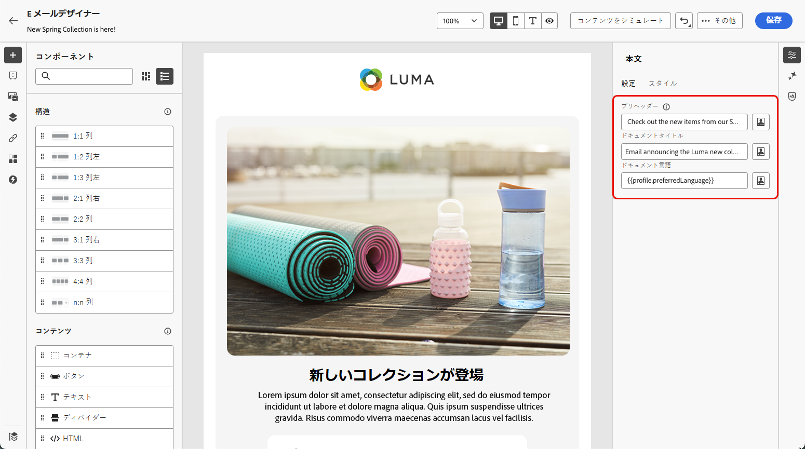
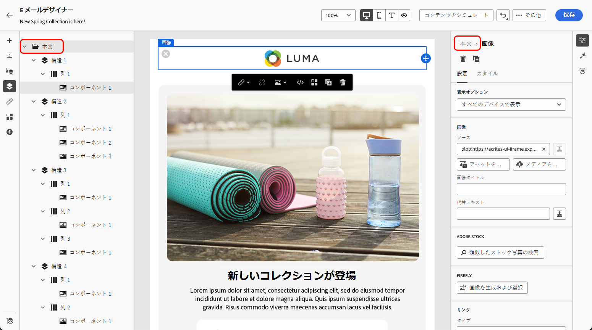
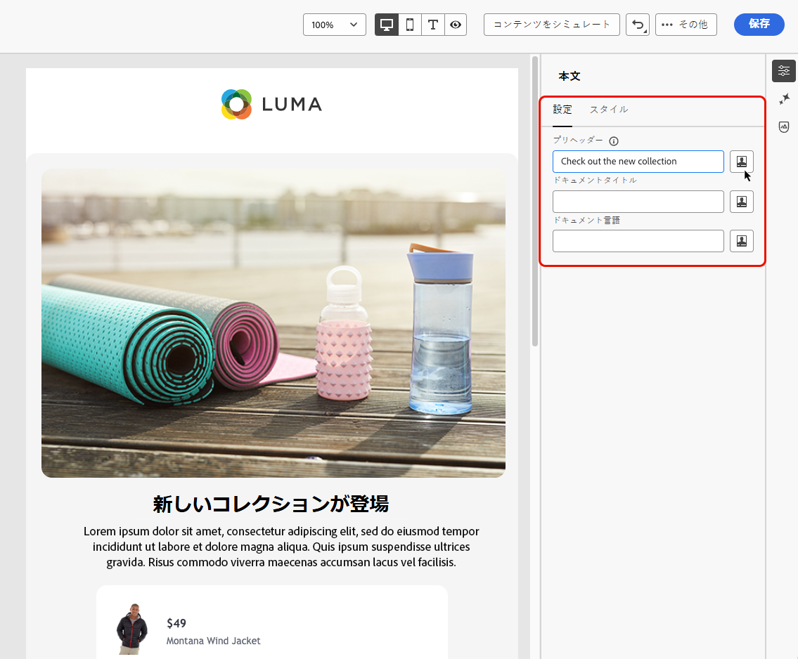

# メールコンテンツへのメタデータの追加 {#email-metadata}

>[!CONTEXTUALHELP]
>id="ac_edition_preheader"
>title="プリヘッダーを追加"
>abstract="プリヘッダーは、メールクライアントでメールを閲覧するときに、件名の後に表示される短い概要テキストです。多くの場合、メールの短い概要を提供し、通常は 1 文の長さです。"

読みやすさとアクセシビリティを向上させるためにメールをデザインする際に、コンテンツの追加のメタ属性を定義できます。 [!DNL Journey Optimizer] メールDesigner](get-started-email-design.md) を使用すると、次の [ 素を指定できます。

* **[!UICONTROL プリヘッダー]**：プリヘッダーは、メールクライアントでメールを表示するときに件名の後に表示される短い概要テキストです。 多くの場合、メールの短い概要を提供し、通常は 1 文の長さです。

  >[!NOTE]
  >
  >プリヘッダーは、すべてのメールクライアントでサポートされているわけではありません。サポートされていない場合、プリヘッダーは表示されません。

* **[!UICONTROL ドキュメントタイトル]**：このフィールドは `<title>` 要素に対応し、メールコンテンツに関する説明情報を提供します。通常、マウスのカーソルを合わせるとツールヒントとして表示されます。 追加のコンテキストを提供することで、障害のあるユーザーを支援し、検索エンジンでコンテンツをより深く理解するのに役立ちます。

* **[!UICONTROL ドキュメント言語]**：視覚障害や学習障害のあるユーザーが、スクリーンリーダーでテキストや画像を音声または点字に変換する際に使用する言語を指定して、アクセシビリティを確保できます。 この設定は、`<html>` 要素の `lang` 属性に対応します。

これらの設定を行うには、次の手順に従います。

1. [ メールDesigner](content-from-scratch.md) から、少なくとも **[!UICONTROL 構造コンポーネント]** を追加して、メールのデザインを開始します。

1. 左側の **[!UICONTROL ナビゲーションツリー]** か、右側のパネルの上部にある **[!UICONTROL 本文]** をクリックします。

   

1. 「**[!UICONTROL 設定]**」タブで、「**[!UICONTROL プリヘッダー]**」、「**[!UICONTROL ドキュメントのタイトル]**」、「**[!UICONTROL ドキュメント言語]**」フィールド内にテキストを入力します。

1. また、各フィールドの横にあるパーソナライゼーションアイコンをクリックして、プロファイル属性、オーディエンス、コンテキスト属性などからコンテンツをカスタマイズすることもできます。 [ パーソナライゼーションの詳細情報 ](../personalization/personalization-build-expressions.md)

   

1. 「 **[!UICONTROL 保存]**」をクリックして変更を確定します。