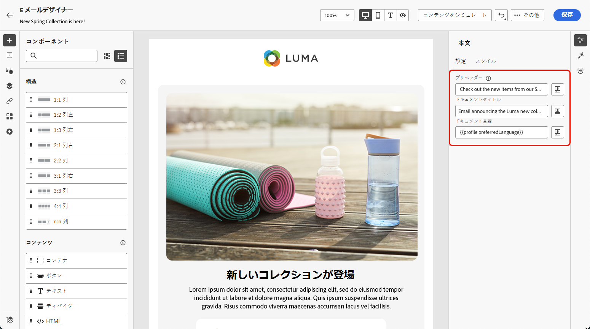
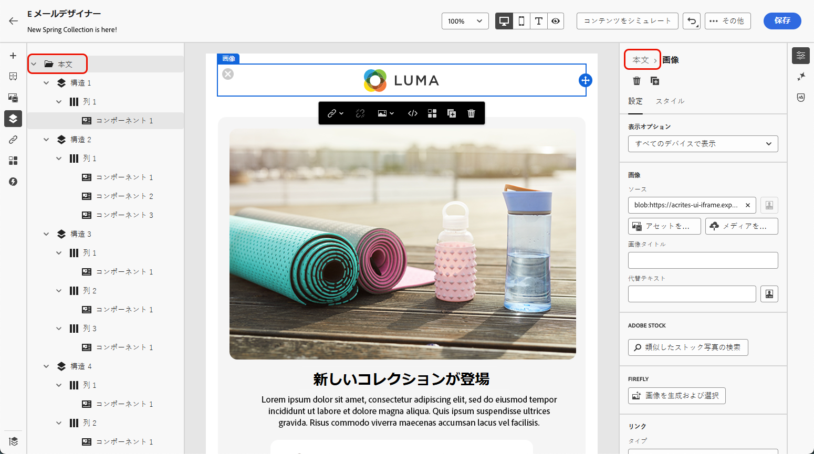
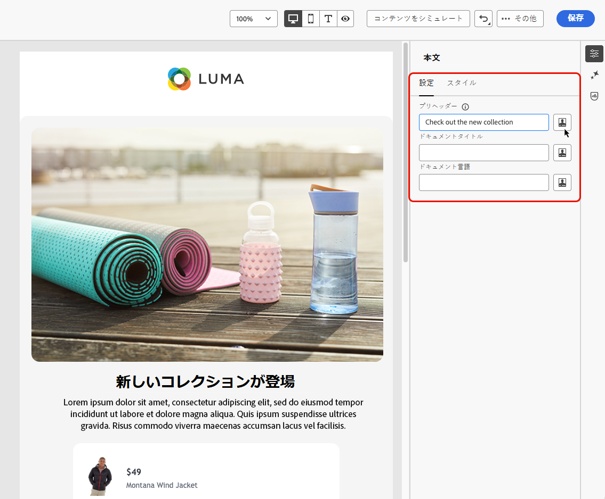

# メールコンテンツへのメタデータの追加 {#email-metadata}

>[!CONTEXTUALHELP]
>id="ac_edition_preheader"
>title="プリヘッダーの定義"
>abstract="プリヘッダーは、メールクライアントでメールを閲覧するときに、件名の後に表示される短い概要テキストです。 多くの場合、メールの短い概要を提供し、通常は 1 文の長さです。"

メールをデザインする際に、コンテンツの追加のメタ属性を定義することで、読みやすさとアクセシビリティを向上させることができます。 [!DNL Journey Optimizer] [E メールデザイナー](get-started-email-design.md)を使用すると、次の要素を指定できます。

* **[!UICONTROL プリヘッダー]**：プリヘッダーは、メールクライアントからメールを表示する際に件名の後に続く短い概要テキストです。 多くの場合、メールの短い概要を提供し、通常は 1 文の長さです。

  >[!NOTE]
  >
  >プリヘッダーは、すべてのメールクライアントでサポートされているわけではありません。 サポートされていない場合、プリヘッダーは表示されません。

* **[!UICONTROL ドキュメントタイトル]**：このフィールドは、`<title>` 要素に対応し、メールのコンテンツに関する説明情報を提供します。通常、ポインタを合わせるとツールヒントとして表示されます。 追加のコンテキストを提供することで、障害のあるユーザーを支援し、検索エンジンでコンテンツをより深く理解するのに役立ちます。

* **[!UICONTROL ドキュメント言語]**：視覚障害や学習障害のある人物が、スクリーンリーダーでテキストや画像を音声または点字に変換する際に使用する言語を指定して、アクセシビリティを確保できます。 この設定は、`<html>` 要素の `lang` 属性に対応します。

これらの設定を指定には、次の手順に従います。

1. [E メールデザイナー](content-from-scratch.md)から、少なくとも 1 つの&#x200B;**[!UICONTROL 構造コンポーネント]**&#x200B;を追加して、メールのデザインを開始します。

1. 左側の&#x200B;**[!UICONTROL ナビゲーションツリー]**&#x200B;または右側のパネルの上部にある「**[!UICONTROL 本文]**」をクリックします。

   

1. 「**[!UICONTROL 設定]**」タブで、「**[!UICONTROL プリヘッダー]**」、「**[!UICONTROL ドキュメントタイトル]**」、「**[!UICONTROL ドキュメント言語]**」の各フィールド内にテキストを入力します。

1. また、各フィールドの横にあるパーソナライゼーションアイコンをクリックして、プロファイル属性、オーディエンス、コンテキスト属性などからコンテンツをカスタマイズすることもできます。 [詳しくは、パーソナライゼーションを参照してください。](../personalization/personalization-build-expressions.md)

   

1. 「**[!UICONTROL 保存]**」をクリックして変更を確定します。