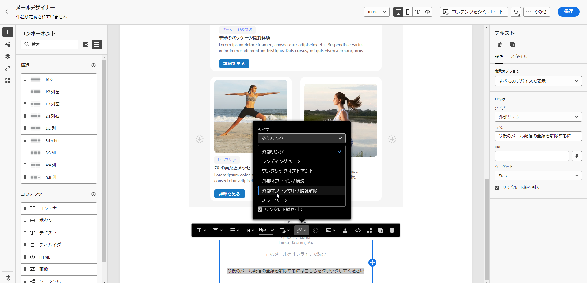
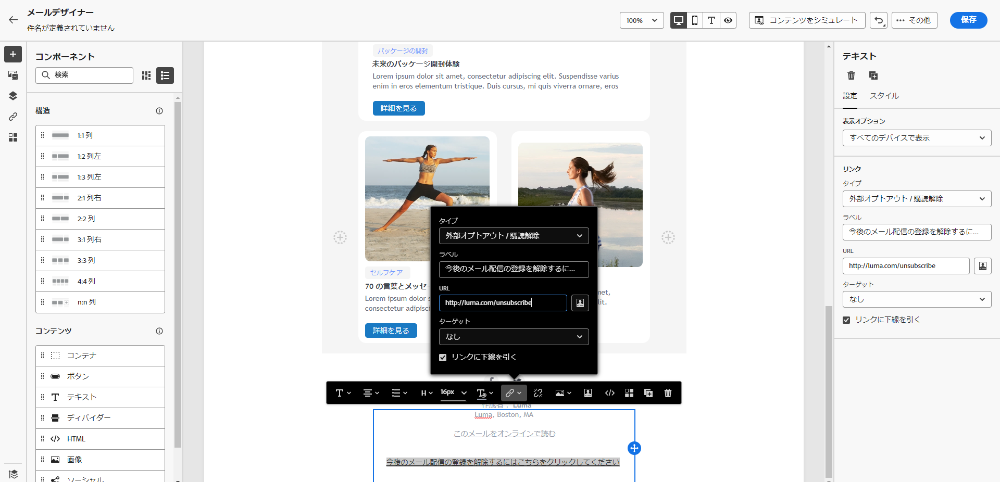

# メールオプトアウトの管理 {#email-opt-out}

ジャーニーやキャンペーンからメッセージを送信する場合は、顧客が今後の通信を登録解除できるようにする必要があります。登録解除すると、プロファイルは、今後のマーケティングメッセージのオーディエンスから自動的に削除されます。  詳しくは、[オプトアウトの管理](../privacy/opt-out.md)を参照してください。

>[!NOTE]
>
>すべてのマーケティングメッセージにオプトアウトリンクを含める必要があります。 これは、トランザクションメッセージには必要ありません。 メッセージカテゴリ - **[!UICONTROL Marketing]** または **[!UICONTROL トランザクション]**  – で定義されます [チャネルサーフェス](../configuration/channel-surfaces.md#email-type) レベルおよびメッセージの作成時。

メールコンテンツに購読解除リンクを挿入するには、次の操作を実行します。

* ワンクリック購読解除 URL をメールヘッダーに追加します。 の有効化 **[!UICONTROL List-Unsubscribe ヘッダー]** チャネルサーフェスレベルのオプションで、メールヘッダーにオプトアウトリンクを追加します。 詳しくは、[メールヘッダーの登録解除リンク](#unsubscribe-header)を参照してください。

* を有効にする **ワンクリックオプトアウトリンク** メールの場合。 詳しくは、[ワンクリックオプトアウト](#one-click-opt-out)を参照してください。

* を挿入 **ランディングページへのリンク**. [詳しくは、オプトアウトランディングページの追加方法を参照してください](#opt-out-external-lp)

## ワンステップのオプトアウト {#opt-out-one-step}

### メールヘッダーのワンクリック購読解除 URL {#unsubscribe-header}

<!--Do not modify - Legal Review Done -->

>[!CONTEXTUALHELP]
>id="ajo_admin_preset_unsubscribe"
>title="メールヘッダーに購読解除 URL を追加"
>abstract="List-Unsubscribe ヘッダーを有効にして、メールヘッダーに購読解除 URL を追加します。 購読解除 URL を設定するには、メールのコンテンツにワンクリックオプトアウトリンクを挿入します。"
>additional-url="https://experienceleague.adobe.com/docs/journey-optimizer/using/privacy/consent/opt-out.html?lang=ja#one-click-opt-out" text="ワンクリックオプトアウト"

ワンクリックリスト登録解除 URL は、メール送信者情報の横に表示される登録解除リンクまたはボタンです。受信者はワンクリックでメーリングリストから即座にオプトアウトできます。 Adobe Journey Optimizerでは、 **リストの購読解除を有効にする** オプションをオンにすると、メール受信者がメーリングリストの購読を解除するために使用できる mailto や URL の両方がメールヘッダーにデフォルトで含まれます。

この [リストの購読解除を有効にする](email-settings.md#list-unsubscribe) このサーフェスを使用するメールに、メールヘッダーにワンクリック購読解除 URL が含まれるように、チャネルサーフェスレベルで切り替えを有効にする必要があります。

>[!NOTE]
>
>メールヘッダーにワンクリック購読解除 URL を表示するには、受信者のメールクライアントがこの機能をサポートしている必要があります。


例えば、ワンクリック購読解除 URL は、Gmail 内に次のような購読解除リンクを表示します。


Adobe Journey Optimizerを使用すると、自動生成されたワンクリック購読解除 URL と宛先アドレスをメールヘッダーに含めたり、メール本文にワンクリックオプトアウト URL を含めたりして、メールサーフェスを設定できます。受信者がワンクリックオプトアウトリンクをクリックすると、受信者の購読解除リクエストが適切に処理されます。

>[!AVAILABILITY]
>
>ワンクリック購読解除 URL ヘッダーが、2024 年 6 月 3 日（PT）以降Adobe Journey Optimizerで使用可能になります。
>

E メールクライアントと [メールサーフェスの購読解除設定](email-settings.md#list-unsubscribe)の場合、メールヘッダーの購読解除リンクをクリックすると、次のような影響が出ることがあります。

* いつ **宛先（購読解除）** 機能を有効にすると、作成したサブドメインに基づいて、登録解除リクエストがデフォルトの登録解除アドレスに送信されます。
* いつ **ワンクリック登録解除 URL** この機能はユーザーが有効にしている場合、またはメール本文のコンテンツに購読解除 URL を挿入した場合、ユーザーが作成したサブドメインに基づくワンクリック購読解除 URL を受信者がクリックすると、受信者はチャネルレベルまたは ID レベル（同意の設定方法による）で直接オプトアウトされます。

どちらの場合も、受信者に対応するプロファイルは直ちにオプトアウトされ、この選択はExperience Platformで更新されます。 詳しくは、[Experience Platform ドキュメント](https://experienceleague.adobe.com/docs/experience-platform/profile/ui/user-guide.html?lang=ja#getting-started){target="_blank"}を参照してください。

リスト購読解除ヘッダーに関して有効にするをオンにした場合は、両方の機能メソッド（宛先およびワンクリックおよび購読解除 URL）を有効にすることをお勧めします。 すべてのメールクライアントが HTTP メソッドをサポートしているわけではありません。 代替の受信者を選択できる機能として提供されている宛先リストの購読解除機能を使用すると、送信者のレピュテーションをより適切に保護し、すべての受信者が購読解除機能を使用するためのアクセス権を持つ可能性があります。 [詳細情報](email-settings.md#list-unsubscribe)


### メールコンテンツからのワンクリックオプトアウト {#one-click-opt-out}

パーソナライズした購読解除 URL を設定するには、以下に示すように、メールメッセージコンテンツにワンクリックオプトアウトリンクを挿入し、選択した URL を入力します。

1. メールコンテンツにアクセスし、 [リンクの挿入](../email/message-tracking.md#insert-links).
1. を選択 **[!UICONTROL ワンクリックでのオプトアウト]** リンクのタイプとして設定します。

   

1. 購読解除後にユーザーがリダイレクトされるランディングページの URL を入力します。 このページは、オプトアウトが成功したことを確認するために表示されます。

   >[!NOTE]
   >
   >有効にした場合 **[!UICONTROL リスト – 購読解除]** のオプション [チャネルサーフェスレベル](email-settings.md#list-unsubscribe) を選択し、「デフォルトのワンクリックオプトアウト URL」オプションをオフにすると、ユーザーがメールヘッダーの購読解除リンクをクリックしたときにこの URL が使用されます。 [詳細情報](#unsubscribe-header)

   

   リンクをパーソナライズできます。パーソナライズされた URL について詳しくは、[この節](../personalization/personalization-syntax.md)を参照してください。

1. オプトアウトを適用する方法として、チャネル、ID、購読のいずれかのレベルを選択します。

   

   * **[!UICONTROL チャネル]**：オプトアウトは、現在のチャネルのプロファイルのターゲット（メールアドレスなど）に今後送信されるメッセージに適用されます。複数のターゲットが 1 つのプロファイルに関連付けられている場合、オプトアウトはそのチャネルのプロファイル内のすべてのターゲット（メールアドレスなど）に適用されます。
   * **[!UICONTROL ID]**：オプトアウトは、現在のメッセージに使用されている特定のターゲット（メールアドレスなど）に今後送信されるメッセージに適用されます。
   * **[!UICONTROL 購読]**：オプトアウトは、特定の購読リストに関連付けられた今後のメッセージに適用されます。このオプションは、現在のメッセージが購読リストに関連付けられている場合にのみ選択できます。

1. 変更を保存します。


## 2 ステップのオプトアウト {#opt-out-external-lp}

標準のオプトアウトメカニズムは、2 つの手順に依存します。購読者がメールのオプトアウトリンクをクリックすると、購読解除を確認するためにオプトアウトランディングページにリダイレクトされます。

この購読解除モードを実装するには、オプトアウトランディングページを作成して公開し、メールメッセージに購読解除リンク（ランディングページへのリンクを含む）を追加する必要があります。 これらの手順の概要を以下に示します。


### 前提条件 {#prereq-lp}

2 段階のオプトアウトメカニズムを設定するには、独自の購読解除ランディングページを作成する必要があります。 最初のランディングページはメッセージからリンクされ、コールトゥアクションボタンを含む必要があります。 ユーザーがボタンをクリックすると、確認メッセージが表示されます。

Adobe Journey Optimizerでランディングページを作成して、での購読解除を管理する方法を説明します [このページ](../landing-pages/lp-use-cases.md#opt-out).

外部のランディングページを使用することもできます。 その場合は、受信者が登録解除したときにAdobe Journey Optimizerに情報を送信するように API を設定します。

+++ オプトアウト API 呼び出しの実装方法を説明します

受信者がランディングページから選択内容を送信する際にオプトアウトするには、[Adobe Developer](https://developer.adobe.com){target="_blank"} を使用して&#x200B;**Subscription API 呼び出し**&#x200B;を実装し、対応するプロファイルの環境設定を更新する必要があります。

この POST 呼び出しは次の通りです。

エンドポイント：https://platform.adobe.io/journey/imp/consent/preferences

クエリパラメーター：

* **params**：暗号化されたペイロードが格納されています
* **pid**：暗号化されたプロファイル ID

次の 3 つのパラメーターが、受信者に送信されるサードパーティのランディングページ URL に含まれます。


ヘッダー要件：

* x-api-key
* x-gw-ims-org-id
* x-sandbox-name
* 認証（技術アカウントからのユーザートークン） 

リクエスト本文：

```
{
   "marketing": [
       {
            "type": "email",           
            "choice": "no",          
            "scope": "channel"       
        }
    ],
 
}
```

[!DNL Journey Optimizer] はこれらのパラメーターを使用し、 [Adobe Developer](https://developer.adobe.com){target="_blank"} API 呼び出し。

+++


### 購読解除リンクの追加 {#add-unsubscribe-link}

最初にメッセージに購読解除リンクを追加する必要があります。これを行うには、以下の手順に従います。

1. メッセージを作成し、 [リンクの挿入](../email/message-tracking.md#insert-links) コンテキストツールバーの使用。

   

1. 「」を選択します **[!UICONTROL ランディングページ]** から **[!UICONTROL タイプ]** 」ドロップダウンリストに移動し、「」でオプトアウトランディングページを選択します。 **[!UICONTROL ランディングページ]** フィールド。

   外部のランディングページを使用している場合は、 **[!UICONTROL 外部オプトアウト /購読解除]** から **[!UICONTROL タイプ]** ドロップダウンリスト。

   

   「**[!UICONTROL リンク]**」フィールドに、サードパーティ製のランディングページへのリンクを貼り付けます。

   

1. 「**[!UICONTROL 保存]**」をクリックします。


### 購読解除リンク付きでメッセージを送信 {#send-message-unsubscribe-link}

ランディングページの購読解除リンクを設定すると、メッセージを作成して送信できます。

1. 購読解除リンクを使用してメッセージを設定し、購読者に送信します。

1. メッセージを受け取った受信者が購読解除リンクをクリックすると、ランディングページが表示されます。

   

1. 受信者がフォームを送信した場合 – ここでは、 **[!UICONTROL 購読解除]** ランディングページのボタン – プロファイルデータは、API 呼び出しを通じて更新されます。

1. その後、オプトアウトした受信者は、オプトアウトが成功したことを示す確認メッセージ画面にリダイレクトされます。

   

   その結果、購読を再度登録しない限り、このユーザーはブランドから連絡を受けることはありません。

1. 対応するプロファイルの選択が更新されたことを確認するには、Experience Platform に移動し、ID 名前空間と対応する ID 値を選択してプロファイルにアクセスします。詳しくは、[Experience Platform ドキュメント](https://experienceleague.adobe.com/docs/experience-platform/profile/ui/user-guide.html?lang=ja#getting-started){target="_blank"}を参照してください。

   

   「**[!UICONTROL 属性]**」タブで、**[!UICONTROL choice]** の値が **[!UICONTROL no]** に変更されたことを確認できます。

