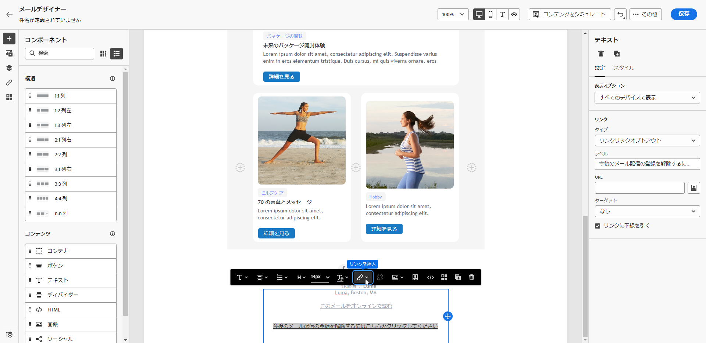

# メールオプトアウトの管理 {#email-opt-out}

ジャーニーやキャンペーンからメッセージを送信する場合は、顧客が今後の通信を登録解除できるようにする必要があります。購読を解除すると、プロファイルは、今後のマーケティングメッセージのオーディエンスから自動的に削除されます。[詳しくは、プライバシーとオプトアウトの管理を参照してください](../privacy/opt-out.md)

>[!NOTE]
>
>すべてのマーケティングのメッセージには、オプトアウトリンクを含める必要があります。トランザクションメッセージの場合、これは必須ではありません。メッセージカテゴリ（**[!UICONTROL マーケティング]**&#x200B;または&#x200B;**[!UICONTROL トランザクション]**）は、メッセージの作成時に[チャネル設定](../configuration/channel-surfaces.md#email-type)レベルで定義されます。

メールコンテンツに購読解除リンクを挿入するには、次の操作を実行します。

* ワンクリック登録解除 URL をメールヘッダーに追加します。チャネル設定レベルで「**[!UICONTROL リスト登録解除ヘッダー]**」オプションを有効にすると、メールヘッダーにオプトアウトリンクが追加されます。[詳しくは、メールヘッダーのオプトアウトを参照してください](#unsubscribe-header)

* メールの&#x200B;**ワンクリックオプトアウトリンク**&#x200B;を有効にします。[詳しくは、ワンクリックオプトアウトリンクを追加する方法を参照してください](#one-click-opt-out)

* **ランディングページへのリンク**&#x200B;を挿入します。[詳しくは、オプトアウトランディングページの追加方法を参照してください](#opt-out-external-lp)


## ワンステップオプトアウト {#opt-out-one-step}

### メールヘッダーのワンクリック登録解除 URL {#unsubscribe-header}

<!--Do not modify - Legal Review Done -->

>[!CONTEXTUALHELP]
>id="ajo_admin_preset_unsubscribe"
>title="メールヘッダーに登録解除 URL を追加"
>abstract="List-Unsubscribe ヘッダーを有効にして、メールヘッダーに登録解除 URL を追加します。 登録解除 URL を設定するには、メールのコンテンツにワンクリックオプトアウトリンクを挿入します。"
>additional-url="https://experienceleague.adobe.com/docs/journey-optimizer/using/privacy/consent/opt-out.html?lang=ja#one-click-opt-out" text="ワンクリックオプトアウト"

ワンクリックリスト登録解除 URL は、メールの送信者情報の横に表示される登録解除リンクまたはボタンであり、受信者は 1 回のクリックでメーリングリストから即座にオプトアウトできます。Adobe Journey Optimizer では、「**リスト登録解除を有効にする**」オプションをオンにすると、メールヘッダーには、受信者がメーリングリストから登録解除に使用できる宛先と URL の両方がデフォルトで含まれます。

この設定を使用するメールのメールヘッダーにワンクリック登録解除 URL が含まれるようにするには、チャネル設定レベルで[リスト登録解除を有効にする](email-settings.md#list-unsubscribe)切替スイッチをアクティブ化する必要があります。

>[!NOTE]
>
>メールヘッダーにワンクリック登録解除 URL を表示するには、受信者のメールクライアントがこの機能をサポートしている必要があります。


例えば、ワンクリック登録解除 URL は、Gmail で次のような登録解除リンクが表示されます。


Adobe Journey Optimizer を使用すると、メールヘッダーに自動生成されたワンクリック登録解除 URL と宛先アドレスを使用してメール設定を行ったり、メール本文にワンクリックオプトアウト URL を含めたりすることができます。受信者がワンクリックオプトアウトリンクをクリックすると、受信者の登録解除リクエストがそれに応じて処理されます。

<!--
>[!AVAILABILITY]
>
>One-click Unsubscribe URL Header will be available in Adobe Journey Optimizer starting June 3, 2024.
>
-->

メールクライアントと[メール設定の登録解除設定](email-settings.md#list-unsubscribe)に応じて、メールヘッダーの登録解除リンクをクリックすると、次のような影響を受ける可能性があります。

* **宛先（登録解除）**&#x200B;機能を有効にすると、登録解除リクエストは、作成したサブドメインに基づいてデフォルトの登録解除アドレスに送信されます。
* **ワンクリック登録解除 URL** 機能が有効になっている場合や、メール本文コンテンツに登録解除 URL を挿入した場合、受信者が、作成したサブドメインに基づくワンクリック登録解除 URL をクリックすると、チャネルレベルまたは ID レベル（同意の設定方法によって異なる）で直接オプトアウトされます。

どちらの場合も、受信者の対応するプロファイルは直ちにオプトアウトされ、この選択が Experience Platform で更新されます。詳しくは、[Experience Platform ドキュメント](https://experienceleague.adobe.com/docs/experience-platform/profile/ui/user-guide.html?lang=ja#getting-started){target="_blank"}を参照してください。

リスト登録解除ヘッダーに関して「**[!UICONTROL リスト登録解除を有効にする]**」オプションをオンにしている場合は、**宛先（登録解除）**&#x200B;と&#x200B;**ワンクリック登録解除 URL** の両方の方法を有効にすることをお勧めします。すべてのメールクライアントが HTTP メソッドをサポートしているわけではありません。代替方法を選択する機能として提供されている宛先リスト登録解除機能を使用すると、送信者の評判をより適切に保護でき、すべての受信者が登録解除機能を使用できます。[詳細情報](email-settings.md#list-unsubscribe)


### メールコンテンツからのワンクリックオプトアウト {#one-click-opt-out}

パーソナライズされた登録解除 URL を設定するには、メールメッセージコンテンツにワンクリックオプトアウトリンクを挿入し、以下のように任意の URL を入力します。

1. メールコンテンツにアクセスして、[リンクを挿入](../email/message-tracking.md#insert-links)します。
1. リンクのタイプとして「**[!UICONTROL ワンクリックオプトアウト]**」を選択します。

   

1. 登録解除後にユーザーがリダイレクトされるランディングページの URL を入力します。このページは、オプトアウトが成功したことを確認できるように表示されます。

   >[!NOTE]
   >
   >「**[!UICONTROL リスト登録解除]**」オプションを[チャネル設定レベル](email-settings.md#list-unsubscribe)で有効にし、デフォルトの「ワンクリックオプトアウト URL」オプションをオフにした場合は、ユーザーがメールヘッダーの登録解除リンクをクリックしたときに、この URL が使用されます。[詳細情報](#unsubscribe-header)

   

   リンクをパーソナライズできます。パーソナライズされた URL について詳しくは、[この節](../personalization/personalization-syntax.md)を参照してください。

1. オプトアウトを適用する方法として、チャネル、ID、購読のいずれかのレベルを選択します。

   

   * **[!UICONTROL チャネル]**：オプトアウトは、現在のチャネルのプロファイルのターゲット（メールアドレスなど）に今後送信されるメッセージに適用されます。複数のターゲットが 1 つのプロファイルに関連付けられている場合、オプトアウトはそのチャネルのプロファイル内のすべてのターゲット（メールアドレスなど）に適用されます。
   * **[!UICONTROL ID]**：オプトアウトは、現在のメッセージに使用されている特定のターゲット（メールアドレスなど）に今後送信されるメッセージに適用されます。
     <!--* **[!UICONTROL Subscription]**: The opt-out applies to future messages associated with a specific subscription list. This option can only be selected if the current message is associated with a subscription list.-->

1. 変更を保存します。


## オプトアウトの 2 つの手順 {#opt-out-external-lp}

標準のオプトアウトメカニズムは、2 つの手順に基づいています。購読者がメールのオプトアウトリンクをクリックすると、購読解除を確認できるようにオプトアウトランディングページにリダイレクトされます。

この購読解除モードを実装するには、オプトアウトランディングページを作成して公開し、メールメッセージに購読解除リンク（ランディングページへのリンクを含む）を追加する必要があります。これらの手順の概要を以下に示します。


### 前提条件 {#prereq-lp}

2 つの手順のオプトアウトメカニズムを設定するには、独自の購読解除ランディングページを作成する必要があります。最初のランディングページはメッセージからリンクされ、コールトゥアクションボタンを含める必要があります。ユーザーがボタンをクリックすると、確認メッセージが表示されます。

Adobe Journey Optimizer でランディングページを作成して購読解除を管理する方法について詳しくは、[このページ](../landing-pages/lp-use-cases.md#opt-out)を参照してください。

また、外部のランディングページを使用することもできます。その場合は、受信者が登録解除したときに Adobe Journey Optimizer に情報を送信するように API を設定します。

+++ オプトアウト API 呼び出しの実装方法について説明します。

受信者がランディングページから選択内容を送信する際にオプトアウトするには、[Adobe Developer](https://developer.adobe.com){target="_blank"} を使用して&#x200B;**Subscription API 呼び出し**&#x200B;を実装し、対応するプロファイルの環境設定を更新する必要があります。

この POST 呼び出しは次の通りです。

エンドポイント：https://platform.adobe.io/journey/imp/consent/preferences

クエリパラメーター：

* **params**：暗号化されたペイロードが格納されています
* **pid**：暗号化されたプロファイル ID

次の 3 つのパラメーターが、受信者に送信されるサードパーティのランディングページ URL に含まれます。


ヘッダー要件：

* x-api-key
* x-gw-ims-org-id
* x-sandbox-name
* 認証（技術アカウントからのユーザートークン） 

リクエスト本文：

```
{
   "marketing": [
       {
            "type": "email",           
            "choice": "no",          
            "scope": "channel"       
        }
    ],
 
}
```

[!DNL Journey Optimizer] では、これらのパラメーターを使用して、[Adobe Developer](https://developer.adobe.com){target="_blank"} API 呼び出しを通じて対応するプロファイルの選択内容を更新します。

+++


### 購読解除リンクの追加 {#add-unsubscribe-link}

最初にメッセージに購読解除リンクを追加する必要があります。これを行うには、以下の手順に従います。

1. メッセージを作成し、コンテキストツールバーを使用して[リンクを挿入](../email/message-tracking.md#insert-links)します。

   

1. **[!UICONTROL タイプ]**&#x200B;ドロップダウンリストから「**[!UICONTROL ランディングページ]**」を選択し、「**[!UICONTROL ランディングページ]**」フィールドでオプトアウトランディングページを選択します。

   外部のランディングページを使用する場合は、**[!UICONTROL タイプ]**&#x200B;ドロップダウンリストから「**[!UICONTROL 外部オプトアウト / 購読解除]**」を選択します。

   

   「**[!UICONTROL リンク]**」フィールドに、サードパーティ製のランディングページへのリンクを貼り付けます。

   

1. 「**[!UICONTROL 保存]**」をクリックします。


### 登録解除リンク付きでメッセージを送信 {#send-message-unsubscribe-link}

ランディングページへの登録解除リンクを設定したら、メッセージを作成して送信できます。

1. メッセージに購読解除リンクを設定して、購読者に送信します。

1. メッセージを受け取った受信者が登録解除リンクをクリックすると、ランディングページが表示されます。

   

1. 受信者がフォームを送信（ここではランディングページの「**[!UICONTROL 登録解除]**」ボタンをクリック）した場合、API 呼び出しを通じてプロファイルデータが更新されます。

1. その後、オプトアウトした受信者は、オプトアウトが成功したことを示す確認メッセージ画面にリダイレクトされます。

   

   その結果、購読を再度登録しない限り、このユーザーはブランドから連絡を受けることはありません。

1. 対応するプロファイルの選択が更新されたことを確認するには、Experience Platform に移動し、ID 名前空間と対応する ID 値を選択してプロファイルにアクセスします。詳しくは、[Experience Platform ドキュメント](https://experienceleague.adobe.com/docs/experience-platform/profile/ui/user-guide.html?lang=ja#getting-started){target="_blank"}を参照してください。

   

   「**[!UICONTROL 属性]**」タブで、**[!UICONTROL choice]** の値が **[!UICONTROL no]** に変更されたことを確認できます。

