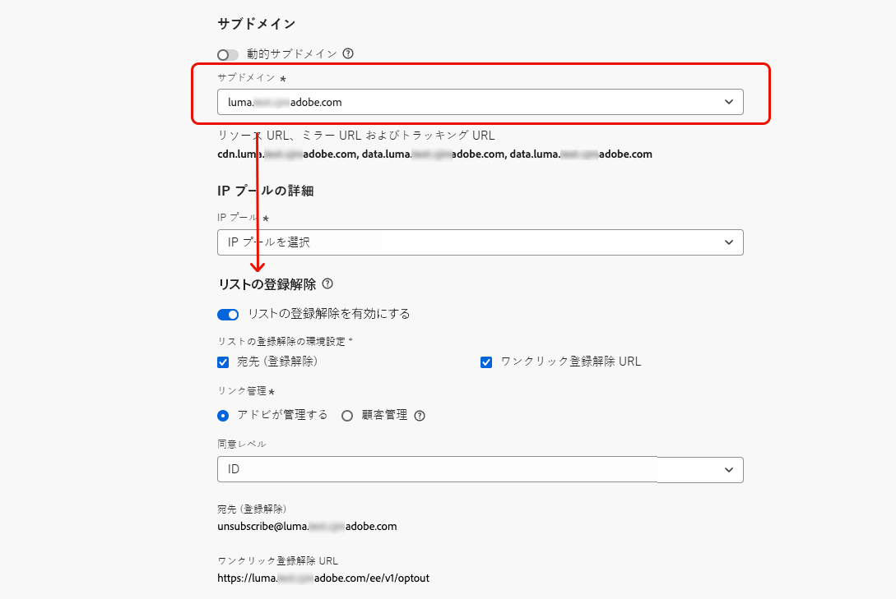
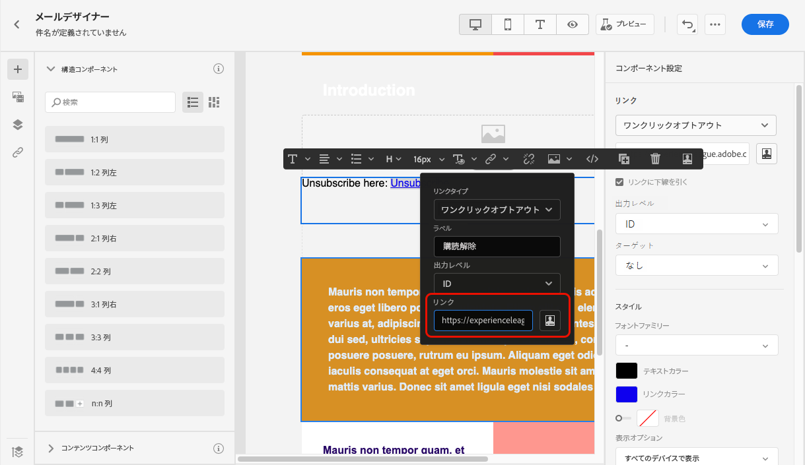
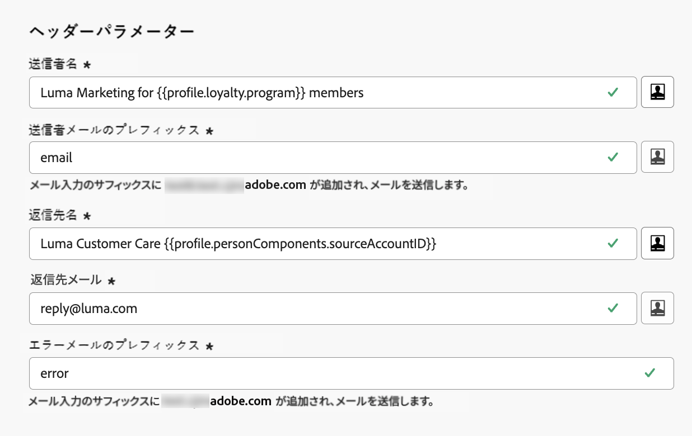

# メール設定 {#email-settings}

メールの作成を開始するには、メッセージに必要なすべての技術的パラメーターを定義するメールチャネルサーフェスを設定する必要があります。[詳しくは、サーフェスの作成方法を参照してください](../configuration/channel-surfaces.md)

>[!NOTE]
>
>評判を保持し、配信品質を向上させるには、メールサーフェスを作成する前にメールの送信に使用するサブドメインを設定します。[詳細情報](../configuration/about-subdomain-delegation.md)

以下で詳しく説明するように、チャネルサーフェス設定の専用セクションでメール設定を定義します。

メールサーフェスの設定は、次のロジックに従って、通信を送信するためにピックアップされます。

* バッチジャーニーの場合、メールサーフェスの設定が行われる前に既に開始されていたバッチ実行には適用されません。変更は、次回の繰り返し時または新しい実行時にピックアップされます。

* トランザクションメッセージの場合、変更は次の通信で直ちにピックアップされます（遅延は 5 分以内です）。

>[!NOTE]
>
>更新されたメールサーフェスの設定は、サーフェスが使用されているジャーニーまたはキャンペーンで自動的にピックアップされます。

## メールのタイプ {#email-type}

>[!CONTEXTUALHELP]
>id="ajo_admin_presets_emailtype"
>title="電子メールカテゴリの定義"
>abstract="このサーフェスを使用する際に送信されるメールのタイプを選択します。ユーザーの同意が必要なプロモーションメール用の「マーケティング」または、特定のコンテキストで購読解除済みのプロファイルにも送信できる非商用メール用の「トランザクション」です。"

「**メールタイプ**」セクションで、サーフェスと共に送信されるメッセージのタイプ（「**[!UICONTROL マーケティング]**」または「**[!UICONTROL トランザクション]**」）を選択します。

* 小売店の毎週のプロモーションなど、プロモーションメールの場合は、「**マーケティング**」を選択します。これらのメッセージには、ユーザーの同意が必要です。

* 注文確認、パスワードリセット通知、配信情報など、非商用メールの場合は、「**トランザクション**」を選択します。これらのメールは、アドビからのお知らせの&#x200B;**登録解除**&#x200B;したプロファイルに送信できます。これらのメッセージは、特定のコンテキストでのみ送信できます。

メッセージの作成時に、メールに対して選択したカテゴリに一致する有効なチャネルサーフェスを選択する必要があります。

## サブドメインおよび IP プール {#subdomains-and-ip-pools}

「**サブドメインおよび IP プール**」セクションで、以下の手順に従って必須フィールドに入力します。

1. メールの送信に使用するサブドメインを選択します。

   ドメインのレピュテーションを保持し、IP ウォーミングプロセスを高速化し、配信品質を向上させるには、送信サブドメインをアドビにデリゲートします。[詳細情報](../configuration/about-subdomain-delegation.md)

<!--If needed, you can define dynamic subdomains. [Learn more](../email/surface-personalization.md#dynamic-subdomains)-->

1. サーフェスに関連付ける IP プールを選択します。[詳細情報](../configuration/ip-pools.md)

   

   選択した IP プールが[編集中](../configuration/ip-pools.md#edit-ip-pool)（**[!UICONTROL 処理中]**&#x200B;ステータス）となっており、選択したサブドメインに関連付けられていない場合は、サーフェスの作成を続行できません。それ以外の場合は、IP プール／サブドメインの関連付けの最も古いバージョンが引き続き使用されます。その場合は、サーフェスをドラフトとして保存し、IP プールが&#x200B;**[!UICONTROL 成功]**&#x200B;ステータスになったら再試行します。

   >[!NOTE]
   >
   >非実稼動環境の場合、アドビは、標準のテストサブドメインの作成や、共有送信 IP プールへのアクセスを許可しません。[独自のサブドメインをデリゲート](../configuration/delegate-subdomain.md)して、組織に割り当てられたプールの IP を使用する必要があります。

1. IP プールが選択された後、IP プールのドロップダウンリストの下に表示される IP アドレスにカーソルを合わせると、PTR 情報が表示されます。[PTR レコードの詳細情報](../configuration/ptr-records.md)

   

   >[!NOTE]
   >
   >PTR レコードが設定されていない場合は、アドビ担当者に問い合わせてください。

## List-Unsubscribe {#list-unsubscribe}

リストの[サブドメインの選択](#subdomains-and-ip-pools)から、「**[!UICONTROL List-Unsubscribe を有効にする]**」オプションが表示されます。

このオプションは、デフォルトでは有効になっています。

有効にしたままにすると、次のような登録解除リンクが電子メールヘッダーに自動的に含まれます。

このオプションを無効にした場合、電子メールヘッダーに登録解除リンクは表示されません。

登録解除リンクは、次の 2 つの要素で構成されます。

* すべての登録解除リクエストの送信先となる&#x200B;**登録解除メールアドレス**。

  [!DNL Journey Optimizer] の場合、登録解除のメールアドレスは、[選択したサブドメイン](#subdomains-and-ip-pools)に基づいてチャネルサーフェスに表示されるデフォルトの&#x200B;**[!UICONTROL 宛先（登録解除）]**&#x200B;アドレスです。

  

* 購読解除後にユーザーがリダイレクトされるランディングページの URL である&#x200B;**登録解除 URL**。

  [ワンクリックオプトアウトリンク](../privacy/opt-out.md#one-click-opt-out)をこのサーフェスを使用して作成されたメッセージに加える場合、登録解除 URL は、ワンクリックオプトアウトリンク用に定義された URL になります。

  

  >[!NOTE]
  >
  >メッセージコンテンツにワンクリックオプトアウトリンクを追加しない場合、ユーザーにランディングページは表示されません。

メッセージにヘッダー登録解除リンクを追加する方法について詳しくは、[この節](../privacy/opt-out.md#unsubscribe-header)を参照してください。

<!--If you have added one or more dynamic subdomains, URLs will be populated based on the resolved dynamic subdomain. [Learn more](../email/surface-personalization.md#dynamic-subdomains)-->

<!--Select the **[!UICONTROL Custom List-Unsubscribe]** option to enter your own Unsubscribe URL and/or your own Unsubscribe email address.(to add later)-->

## ヘッダーパラメーター {#email-header}

「**[!UICONTROL ヘッダーパラメーター]**」セクションでは、そのサーフェスを使用して送信されるメールのタイプに関連付けられた送信者の名前とメールアドレスを入力します。

* **[!UICONTROL 送信者名]**：送信者の名前（会社のブランド名など）。

* **[!UICONTROL 送信者のメール]**：コミュニケーションに使用するメールアドレス。

* **[!UICONTROL 返信先（名前）]**：受信者がメールクライアントソフトウェアの「**返信**」ボタンをクリックしたときに使用する名前。

* **[!UICONTROL 返信先（メール）]**：受信者がメールクライアントソフトウェアの「**返信**」ボタンをクリックしたときに使用するメールアドレス。[詳細情報](#reply-to-email)

* **[!UICONTROL エラーメール]**：メールを配信してから数日後に ISP で発生したすべてのエラー（非同期バウンス）は、このアドレスで受信されます。また、このアドレスでは、不在通知とチャレンジ応答も受信されます。

  アドビにデリゲートされていない特定のメールアドレスで不在通知とチャレンジ応答を受信したい場合は、[転送プロセス](#forward-email)を設定する必要があります。その場合は、このインボックスにランディングするメールを処理するために、手動または自動のソリューションを用意してください。

>[!CAUTION]
>
>**[!UICONTROL 送信者メール]**&#x200B;および&#x200B;**[!UICONTROL エラーメール]**&#x200B;アドレスでは、現在選択されている[デリゲートされたサブドメイン](../configuration/about-subdomain-delegation.md)を使用する必要があります。例えば、デリゲートされたサブドメインが *marketing.luma.com* の場合は、*contact@marketing.luma.com* と *error@marketing.luma.com* を使用できます。

>[!NOTE]
>
>アドレスは、文字（A ～ Z）で始まる必要があり、英数字のみを使用できます。アンダースコア（`_`）、ドット（`.`）、ハイフン（`-`）も使用できます。

### メールへの返信 {#reply-to-email}

**[!UICONTROL （メール）への返信]**&#x200B;アドレスを定義する場合、有効なアドレスで、正しい形式でタイプミスがない限り、任意のメールアドレスを指定できます。

返信に使用するインボックスは、**[!UICONTROL エラーメール]**&#x200B;アドレスで受信される不在通知とチャレンジ応答を除く、すべての返信メールを受信します。

返信を適切に管理するには、次の推奨事項に従ってください。

* 専用のインボックスに、メールサーフェスを使用して送信されたすべての返信メールを受信するのに十分な受信処理能力があることを確認します。インボックスがバウンスを返す場合、顧客からの返信が受信されない場合があります。

* 返信には個人を特定できる情報（PII）が含まれている可能性があるので、プライバシーとコンプライアンスの義務に留意して返信を処理する必要があります。

* 返信インボックスでメッセージをスパムとしてマークしないでください。このアドレスに送信される他のすべての返信に影響を与えます。

さらに、**[!UICONTROL 返信先（メール）]**&#x200B;アドレスを定義する場合は、有効な MX レコード設定を持つサブドメインを使用します。使用しない場合、メールサーフェスの処理が失敗します。

メールサーフェスの送信時にエラーが発生した場合は、入力したアドレスのサブドメインに対して MX レコードが設定されません。対応する MX レコードの設定について管理者に問い合わせるか、有効な MX レコード設定を持つ別のアドレスを使用します。

>[!NOTE]
>
>入力したアドレスのサブドメインがアドビに[完全にデリゲート](../configuration/delegate-subdomain.md#full-subdomain-delegation)されたドメインである場合は、アドビアカウント担当者にお問い合わせください。

### メールの転送 {#forward-email}

デリゲートされたサブドメインの [!DNL Journey Optimizer] で受信したすべてのメールを特定のメールアドレスに転送するには、アドビカスタマーケアにお問い合わせください。

>[!NOTE]
>
>**[!UICONTROL 返信先（メール）]**&#x200B;アドレスに使用するサブドメインがアドビにデリゲートされていない場合、このアドレスでは転送は機能しません。

以下を指定する必要があります。

* 選択した転送メールアドレス。転送メールアドレスドメインは、アドビにデリゲートされたサブドメインと同じにはできないことに注意してください。
* サンドボックス名。
* 転送メールアドレスを使用するサーフェス名またはサブドメイン。
  <!--* The current **[!UICONTROL Reply to (email)]** address or **[!UICONTROL Error email]** address set at the channel surface level.-->

>[!NOTE]
>
>サブドメインごとに転送メールアドレスを 1 つだけ指定できます。したがって、複数のサーフェスで同じサブドメインを使用する場合は、それらすべてに同じ転送メールアドレスを使用する必要があります。

転送メールアドレスはアドビが設定します。これには 3～4 日かかる場合があります。

完了すると、**[!UICONTROL 返信先（メール）]**&#x200B;および&#x200B;**[!UICONTROL エラーメール]**&#x200B;アドレスで受信したすべてのメッセージが、指定した特定のメールアドレスに転送されます。

## BCC メール {#bcc-email}

[!DNL Journey Optimizer] から送信された電子メールの同一のコピー（またはブラインドカーボンコピー）を BCC インボックスに送信できます。BCC インボックスは、コンプライアンスやアーカイブの目的で保存されます。

これを行うには、チャネルサーフェスレベルの「**[!UICONTROL BCC メール]**」オプション機能を有効化します。[詳細情報](../configuration/archiving-support.md#bcc-email)

さらに、**[!UICONTROL BCC メール]**&#x200B;アドレスを定義する場合は、有効な MX レコード設定を持つサブドメインを使用します。使用しない場合、メールサーフェスの処理が失敗します。

メールサーフェスの送信時にエラーが発生した場合は、入力したアドレスのサブドメインに対して MX レコードが設定されません。対応する MX レコードの設定について管理者に問い合わせるか、有効な MX レコード設定を持つ別のアドレスを使用します。

## 抑制されたメールアドレスへの送信 {#send-to-suppressed-email-addresses}

>[!CONTEXTUALHELP]
>id="ajo_surface_suppressed_addresses"
>title="抑制リストの優先順位の上書き"
>abstract="スパムの苦情が原因でメールアドレスが Adobe Journey Optimizer の抑制リストに登録されている場合でも、プロファイルへのトランザクションメッセージの送信を決定することができますこのオプションはデフォルトでは無効です。"
>additional-url="https://experienceleague.adobe.com/docs/journey-optimizer/using/configuration/monitor-reputation/manage-suppression-list.html?lang=ja" text="抑制リストの管理"

>[!IMPORTANT]
>
>このオプションは、**[!UICONTROL トランザクション]**&#x200B;のメールタイプを選択している場合にのみ使用できます。[詳細情報](#email-type)

[!DNL Journey Optimizer] では、ハードバウンス、ソフトバウンスおよびスパムの苦情としてマークされたすべてのメールアドレスは、自動的に[抑制リスト](../configuration/manage-suppression-list.md)に収集され、ジャーニーやキャンペーンでの送信から除外されます。

ただし、ユーザーからのスパムの苦情によりメールアドレスが抑制リストに登録されている場合でも、**トランザクション**&#x200B;タイプのメッセージをプロファイルに送信する決定をすることができます。

実際、トランザクションメッセージには、通常、注文の確認やパスワードのリセット通知など、有用で期待される情報が含まれます。したがって、顧客がマーケティングメッセージのうち 1 件をスパムとして報告した場合でも、ほとんどの場合、このタイプの非商用メールを顧客に受信してもらうことが望まれます。

スパムの苦情によって抑制されたメールアドレスをトランザクションメッセージオーディエンスに含めるには、「**[!UICONTROL 抑制されたメールアドレスに送信]**」セクションで該当するオプションを選択します。

>[!NOTE]
>
>このオプションはデフォルトでは無効です。

配信品質のベストプラクティスとして、このオプションは、オプトアウトした顧客が連絡を受けないように、デフォルトで無効になっています。ただし、このデフォルトオプションを変更すると、顧客にトランザクションメッセージを送信できるようになります。

このオプションを有効にすると、顧客がマーケティングメールをスパムとしてマークしても、その顧客は現在のサーフェスを使用してトランザクションメッセージを受信することができます。配信品質のベストプラクティスに従って、必ずオプトアウト設定を管理してください。

## シードリスト {#seed-list}

>[!CONTEXTUALHELP]
>id="ajo_surface_seed_list"
>title="シードリストを追加"
>abstract="希望するシードリストを選択して、特定の内部アドレスをオーディエンスに自動的に追加します。これらのシードアドレスは配信の実行時に含まれ、保証の目的でこのアドレスにメッセージのコピーが送られます。"
>additional-url="https://experienceleague.adobe.com/docs/journey-optimizer/using/configuration/seed-lists.html?lang=ja#use-seed-list" text="シードリストとは"

[!DNL Journey Optimizer] のシードリストを使用すると、配信に特定のメールシードアドレスを自動的に含めることができます。[詳細情報](../configuration/seed-lists.md)

>[!CAUTION]
>
>現在、この機能はメールチャネルにのみ適用されます。

「**[!UICONTROL シードリスト]**」セクションで、自分に関連するリストを選択します。シードリストの作成方法については、[この節](../configuration/seed-lists.md#create-seed-list)を参照してください。

>[!NOTE]
>
>一度に選択できるシードリストは 1 つのみです。

現在のサーフェスをキャンペーンまたはジャーニーで使用する場合、選択したシードリストのメールアドレスは配信の実行時に含まれ、保証の目的でこのアドレスに配信のコピーが送られます。

キャンペーンまたはジャーニーでのシードリストの使用方法について詳しくは、[この節](../configuration/seed-lists.md#use-seed-list)を参照してください。

## メールの再試行パラメーター {#email-retry}

>[!CONTEXTUALHELP]
>id="ajo_admin_presets_retryperiod"
>title="再試行期間の調整"
>abstract="一時的なソフトバウンスエラーが原因でメール配信が失敗した場合は、3.5 日間（84 時間）再試行が実行されます。このデフォルトの再試行期間は、ニーズに合わせて調整できます。"
>additional-url="https://experienceleague.adobe.com/docs/journey-optimizer/using/configuration/monitor-reputation/retries.html?lang=ja" text="再試行について"

**メールの再試行パラメーター**&#x200B;を設定できます。

デフォルトでは、[再試行期間](../configuration/retries.md#retry-duration)は 84 時間に設定されていますが、必要に応じてこの設定を調整できます。

次の範囲内の整数値（時間または分）を入力する必要があります。

* マーケティングメールの場合、再試行期間の下限は 6 時間です。
* トランザクションメールの場合、再試行期間の下限は 10 分です。
* どちらのメールタイプでも、再試行期間の上限は 84 時間（5040 分）です。

再試行の詳細については、[この節](../configuration/retries.md)を参照してください。

## URL トラッキング {#url-tracking}

>[!CONTEXTUALHELP]
>id="ajo_admin_preset_utm"
>title="URL トラッキングパラメーターの定義"
>abstract="このセクションを使用すると、メールコンテンツに存在する URL にトラッキングパラメーターを自動的に追加できます。この機能はオプションです。"

>[!CONTEXTUALHELP]
>id="ajo_admin_preset_url_preview"
>title="URL トラッキングパラメーターのプレビュー"
>abstract="メールコンテンツに存在する URL にトラッキングパラメーターを追加する方法を確認します。"

**[!UICONTROL URL トラッキングパラメーター]**&#x200B;を使用し、チャネルをまたいでマーケティング活動の有効性を測定することができます。この機能はオプションです。

このセクションで定義されたパラメーターは、メールメッセージコンテンツに含まれる URL の末尾に追加されます。その後、これらのパラメーターを Adobe Analytics や Google Analytics などの web 分析ツールで取得し、様々なパフォーマンスレポートを作成できます。

「**[!UICONTROL 新しいパラメーターを追加]**」ボタンを使用して最大 10 個のトラッキングパラメーターを追加できます。

URL トラッキングパラメーターを設定するには、目的の値を&#x200B;**[!UICONTROL 名前]**&#x200B;および&#x200B;**[!UICONTROL 値]**&#x200B;フィールドに直接入力することができます。

また、[式エディター](../personalization/personalization-build-expressions.md)を使用して各&#x200B;**[!UICONTROL 値]**&#x200B;フィールドを編集することもできます。「編集」アイコンをクリックして、エディターを開きます。ここから、利用可能なコンテキスト属性を選択したり、テキストを直接編集したりできます。

式エディターでは、次の事前定義済みの値を使用できます。

* **ソースアクション ID**：ジャーニーまたはキャンペーンに追加されたメールアクションの ID。

* **ソースアクション名**：ジャーニーまたはキャンペーンに追加されたメールアクションの名前。

* **ソース ID**：メールの送信に使用されたジャーニーまたはキャンペーンの ID。

* **ソース名**：メールの送信に使用されたジャーニーまたはキャンペーンの名前。

* **ソースバージョン ID**：メールの送信に使用されたジャーニーまたはキャンペーンのバージョンの ID。

* **オファー ID**：メールで使用されるオファーの ID。

>[!NOTE]
>
>テキスト値の入力と、式エディターからのコンテキスト属性の使用を組み合わせることができます。各「**[!UICONTROL 値]**」フィールドには、5 KB の制限までの文字数を含めることができます。

<!--You can drag and drop the parameters to reorder them.-->

以下に、Adobe Analytics および Google Analytics 互換 URL の例を示します。

* Adobe Analytics 互換 URL：`www.YourLandingURL.com?cid=email_AJO_{{context.system.source.id}}_image_{{context.system.source.name}}`

* Google Analytics 互換 URL：`www.YourLandingURL.com?utm_medium=email&utm_source=AJO&utm_campaign={{context.system.source.id}}&utm_content=image`

結果のトラッキング URL を動的にプレビューできます。パラメーターを追加、編集、または削除するたびに、プレビューが自動的に更新されます。

>[!NOTE]
>
>また、メールコンテンツ内に存在するリンクに動的にパーソナライズされたトラッキングパラメーターを追加することもできますが、サーフェスレベルでは追加できません。これは、E メールデザイナーを使用してメッセージを作成する際に行う必要があります。[詳細情報](message-tracking.md#url-tracking)
