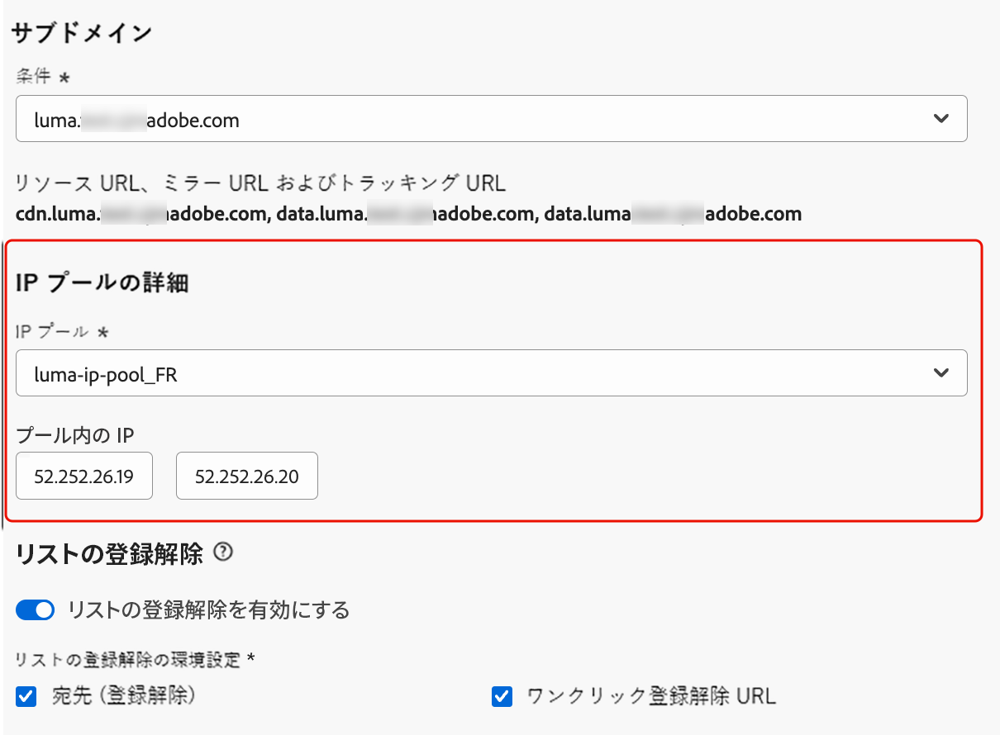
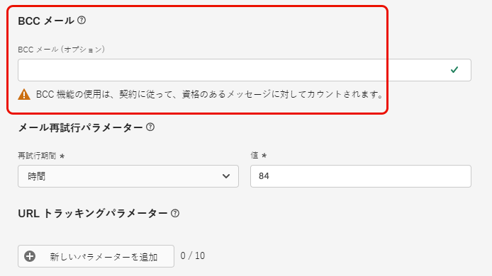

# メール設定の指定 {#email-settings}

メールの作成を開始するには、メッセージに必要なすべての技術的パラメーターを定義するメールチャネル設定を指定する必要があります。[設定の作成方法を学ぶ](../configuration/channel-surfaces.md)

>[!NOTE]
>
>評判を保持し、配信品質を向上させるには、メール設定を作成する前にメールの送信に使用するサブドメインを設定します。[詳細情報](../configuration/about-subdomain-delegation.md)

以下で詳しく説明するように、チャネル設定の専用セクションでメール設定を定義します。

{width="50%" align="left"}

メール設定は、次のロジックに従って、通信を送信するためにピックアップされます。

* バッチジャーニーの場合、メールサーフェスの設定が行われる前に既に開始されていたバッチ実行には適用されません。変更は、次回の繰り返し時または新しい実行時にピックアップされます。

* トランザクションメッセージの場合、変更は次の通信で直ちにピックアップされます（遅延は 5 分以内です）。

>[!NOTE]
>
>更新されたメール設定は、設定が使用されているジャーニーまたはキャンペーンで自動的にピックアップされます。

## メールタイプ {#email-type}

>[!CONTEXTUALHELP]
>id="ajo_admin_presets_emailtype"
>title="メールタイプの定義"
>abstract="この設定を使用する際に送信されるメールのタイプを選択します。ユーザーの同意が必要なプロモーションメール用の「マーケティング」または、特定のコンテキストで購読解除済みのプロファイルにも送信できる非商用メール用の「トランザクション」です。"

「**メールタイプ**」セクションで、設定のメッセージのタイプ（「**[!UICONTROL マーケティング]**」または「**[!UICONTROL トランザクション]**」）を選択します。

* 小売店の毎週のプロモーションなど、プロモーションメールの場合は、「**マーケティング**」を選択します。これらのメッセージには、ユーザーの同意が必要です。

* 注文確認、パスワードリセット通知、配信情報など、非商用メールの場合は、「**トランザクション**」を選択します。これらのメールは、アドビからのお知らせの&#x200B;**登録解除**&#x200B;したプロファイルに送信できます。これらのメッセージは、特定のコンテキストでのみ送信できます。

メッセージの作成時に、メールに対して選択したカテゴリに一致する有効なチャネル設定を選択する必要があります。

## サブドメイン {#subdomains}

メールの送信に使用するサブドメインを選択します。

>[!NOTE]
>
>メール設定の制御を高めるために、動的サブドメインを定義できます。[詳細情報](../email/surface-personalization.md#dynamic-subdomains)

ドメインのレピュテーションを保持し、IP ウォーミングプロセスを高速化し、配信品質を向上させるには、送信サブドメインをアドビにデリゲートします。[詳細情報](../configuration/about-subdomain-delegation.md)

## IP プールの詳細 {#ip-pools}

設定に関連付ける IP プールを選択します。[詳細情報](../configuration/ip-pools.md)

{width="50%" align="left"}

選択した IP プールが[編集中](../configuration/ip-pools.md#edit-ip-pool)（**[!UICONTROL 処理中]**&#x200B;ステータス）で、選択したサブドメインに関連付けられていない場合は、設定の作成を続行できません。それ以外の場合は、IP プール／サブドメインの関連付けのうち、最も古いバージョンが引き続き使用されます。その場合は、設定をドラフトとして保存し、IP プールが&#x200B;**[!UICONTROL 成功]**&#x200B;ステータスになったら再試行します。

>[!NOTE]
>
>非実稼動環境の場合、アドビは、標準のテストサブドメインの作成や、共有送信 IP プールへのアクセスを許可しません。[独自のサブドメインをデリゲート](../configuration/delegate-subdomain.md)して、組織に割り当てられたプールの IP を使用する必要があります。

IP プールが選択された後、IP プールのドロップダウンリストの下に表示される IP アドレスにカーソルを合わせると、PTR 情報が表示されます。[PTR レコードについての詳細情報](../configuration/ptr-records.md)

>[!NOTE]
>
>PTR レコードが設定されていない場合は、アドビ担当者に問い合わせてください。

## リスト登録解除 {#list-unsubscribe}

リストからサブドメインを選択すると、「**[!UICONTROL リスト登録解除を有効にする]**」オプションが表示されます。これは、デフォルトで有効です。

ワンクリック登録解除 URL をメールヘッダーに含めることができます。[詳細情報](list-unsubscribe.md)

## ヘッダーパラメーター {#email-header}

「**[!UICONTROL ヘッダーパラメーター]**」セクションでは、その設定を使用して送信されるメールのタイプに関連付けられた送信者の名前とメールアドレスを入力します。[詳細情報](header-parameters.md)

## BCC メール {#bcc-email}

[!DNL Journey Optimizer] から送信された電子メールの同一のコピー（またはブラインドカーボンコピー）を BCC インボックスに送信できます。BCC インボックスは、コンプライアンスやアーカイブの目的で保存されます。

これを行うには、チャネル設定レベルの「**[!UICONTROL BCC メール]**」オプション機能を有効にします。[詳細情報](../configuration/archiving-support.md#bcc-email)

さらに、**[!UICONTROL BCC メール]**&#x200B;アドレスを定義する場合は、有効な MX レコード設定を持つサブドメインを使用します。使用しない場合、メール設定の処理が失敗します。

メール設定の送信時にエラーが発生した場合は、入力したアドレスのサブドメインに対して MX レコードが設定されません。対応する MX レコードの設定について管理者に問い合わせるか、有効な MX レコード設定を持つ別のアドレスを使用します。

## 抑制されたメールアドレスへの送信 {#send-to-suppressed-email-addresses}

>[!CONTEXTUALHELP]
>id="ajo_surface_suppressed_addresses"
>title="抑制リストの優先順位の上書き"
>abstract="スパムの苦情が原因でメールアドレスが Adobe Journey Optimizer の抑制リストに登録されている場合でも、プロファイルへのトランザクションメッセージの送信を決定することができますこのオプションはデフォルトでは無効です。"
>additional-url="https://experienceleague.adobe.com/docs/journey-optimizer/using/configuration/monitor-reputation/manage-suppression-list.html?lang=ja" text="抑制リストの管理"

>[!IMPORTANT]
>
>このオプションは、**[!UICONTROL トランザクション]**&#x200B;のメールタイプを選択している場合にのみ使用できます。[詳細情報](#email-type)

[!DNL Journey Optimizer] では、ハードバウンス、ソフトバウンスおよびスパムの苦情としてマークされたすべてのメールアドレスは、自動的に[抑制リスト](../configuration/manage-suppression-list.md)に収集され、ジャーニーやキャンペーンでの送信から除外されます。

ただし、ユーザーからのスパムの苦情によりメールアドレスが抑制リストに登録されている場合でも、**トランザクション**&#x200B;タイプのメッセージをプロファイルに送信する決定をすることができます。

実際、トランザクションメッセージには、通常、注文の確認やパスワードのリセット通知など、有用で期待される情報が含まれます。したがって、顧客がマーケティングメッセージのうち 1 件をスパムとして報告した場合でも、ほとんどの場合、このタイプの非商用メールを顧客に受信してもらうことが望まれます。

スパムの苦情によって抑制されたメールアドレスをトランザクションメッセージオーディエンスに含めるには、「**[!UICONTROL 抑制されたメールアドレスに送信]**」セクションで該当するオプションを選択します。

>[!NOTE]
>
>このオプションはデフォルトでは無効です。

配信品質のベストプラクティスとして、このオプションは、オプトアウトした顧客が連絡を受けないように、デフォルトで無効になっています。ただし、このデフォルトオプションを変更すると、顧客にトランザクションメッセージを送信できるようになります。

このオプションを有効にすると、顧客がマーケティングメールをスパムとしてマークしても、その顧客は現在の設定を使用してトランザクションメッセージを受信することができます。配信品質のベストプラクティスに従って、必ずオプトアウト設定を管理してください。

## シードリスト {#seed-list}

>[!CONTEXTUALHELP]
>id="ajo_surface_seed_list"
>title="シードリストを追加"
>abstract="希望するシードリストを選択して、特定の内部アドレスをオーディエンスに自動的に追加します。これらのシードアドレスは配信の実行時に含まれ、保証の目的でこのアドレスにメッセージのコピーが送られます。"
>additional-url="https://experienceleague.adobe.com/docs/journey-optimizer/using/configuration/seed-lists.html?lang=ja#use-seed-list" text="シードリストとは"

[!DNL Journey Optimizer] のシードリストを使用すると、配信に特定のメールシードアドレスを自動的に含めることができます。[詳細情報](../configuration/seed-lists.md)

>[!CAUTION]
>
>現在、この機能はメールチャネルにのみ適用されます。

「**[!UICONTROL シードリスト]**」セクションで、自分に関連するリストを選択します。シードリストの作成方法については、[この節](../configuration/seed-lists.md#create-seed-list)を参照してください。

{width="80%"}

>[!NOTE]
>
>一度に選択できるシードリストは 1 つのみです。

現在の設定をキャンペーンまたはジャーニーで使用する場合、選択したシードリストのメールアドレスは配信の実行時に含まれ、保証の目的でこのアドレスに配信のコピーが送られます。

キャンペーンまたはジャーニーでのシードリストの使用方法について詳しくは、[この節](../configuration/seed-lists.md#use-seed-list)を参照してください。

## メールの再試行パラメーター {#email-retry}

>[!CONTEXTUALHELP]
>id="ajo_admin_presets_retryperiod"
>title="再試行期間の調整"
>abstract="一時的なソフトバウンスエラーが原因でメール配信が失敗した場合は、3.5 日間（84 時間）再試行が実行されます。このデフォルトの再試行期間は、ニーズに合わせて調整できます。"
>additional-url="https://experienceleague.adobe.com/docs/journey-optimizer/using/configuration/monitor-reputation/retries.html?lang=ja" text="再試行について"

**メールの再試行パラメーター**&#x200B;を設定できます。

デフォルトでは、[再試行期間](../configuration/retries.md#retry-duration)は 84 時間に設定されていますが、必要に応じてこの設定を調整できます。

次の範囲内の整数値（時間または分）を入力する必要があります。

* マーケティングメールの場合、再試行期間の下限は 6 時間です。
* トランザクションメールの場合、再試行期間の下限は 10 分です。
* どちらのメールタイプでも、再試行期間の上限は 84 時間（5040 分）です。

再試行について詳しくは、[この節](../configuration/retries.md)を参照してください。

## URL トラッキング {#url-tracking}

**[!UICONTROL URL トラッキングパラメーター]**&#x200B;を使用し、チャネルをまたいでマーケティング活動の有効性を測定できます。[詳細情報](url-tracking.md)

## 実行アドレス {#execution-address}

プロファイルをターゲットにする際に、使用できるメールアドレスがデータベース内に複数ある（仕事用のメールアドレス、個人用のメールアドレスなど）場合があります。

その場合、[!DNL Journey Optimizer] は、サンドボックスレベルで&#x200B;**[!UICONTROL 実行フィールド]**&#x200B;に指定されたアドレスを使用して、優先してプロファイルサービスから使用するメールアドレスを決定します。[詳細情報](../configuration/primary-email-addresses.md)

>[!NOTE]
>
>現在デフォルトで使用されているフィールドを確認するには、**[!UICONTROL 管理]**／**[!UICONTROL チャネル]**／**[!UICONTROL 一般設定]**／**[!UICONTROL 実行フィールド]**&#x200B;メニューにアクセスします。

ただし、このデフォルトの実行フィールドは、メールチャネル設定レベルで変更できます。その後、この設定を特定のキャンペーンやジャーニーに適用できます。

これを行うには、「**[!UICONTROL 配信アドレス]**」フィールドを編集し、使用可能なメールタイプの XDM フィールドのリストから項目を選択します。 [詳細情報](../configuration/primary-email-addresses.md#override-execution-address-channel-config)

