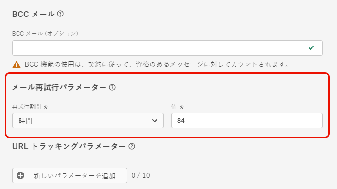
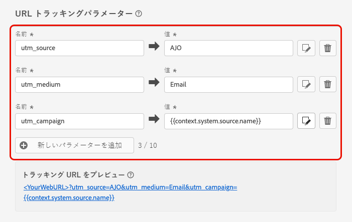

# 電子メール設定の設定 {#email-settings}

電子メールの作成を開始するには、メッセージに必要なすべての技術パラメーターが定義されている電子メールチャンネルサーフェスを設定する必要があります。 [サーフェスの作成方法について](../configuration/channel-surfaces.md)

チャネルサーフェス設定の専用セクションで電子メール設定を定義します。

電子メールのサーフェス設定では、以下のようなロジックを使用して送信されます。

* Batch およびバースト journeys については、電子メールのサーフェス設定が行われる前に開始されていたバッチまたはバースト実行には適用されません。 変更は、次の繰り返しまたは新規実行時に取得されます。

* トランザクションメッセージについては、次の通信 (最大5分間の遅延) に向けて、変更が直ちに反映されます。

>[!NOTE]
>
>更新された電子メールのサーフェス設定は、そのサーフェスが使用されている旅またはキャンペーンの中で自動的に選択されます。

## 電子メールのタイプ {#email-type}

>[!CONTEXTUALHELP]
>id="ajo_admin_presets_emailtype"
>title="電子メールカテゴリーの定義"
>abstract="このサーフェスを使用している場合に送信される電子メールのタイプを選択します。例えば、ユーザーの同意が必要な販促用のマーケティングや、商用以外の電子メールの場合は、特定のコンテキストのサブスクライブされていないプロファイルに送信することもできます。"

「電子メールタイプ **」セクションで、その** サーフェス **とともに送信されるメッセージのタイプとして、「販売** 」または **「トランザクション** 」を選択します。

* 広告宣伝用にマーケティング **を選択** : このようなメッセージについては、ユーザーの同意が必要です。

* 「取引先企業以外の電子メールの場合は、注文確認、パスワードリセット通知、配信情報などの取引 **を行う」を選択** します。

>[!CAUTION]
>
>**取引** 先電子メールは、マーケティングコミュニケーションによってサブスクライブが解除されたプロファイルに送信することができます。 このようなメッセージは特定のコンテキストでのみ送信できます。

メッセージを作成するときは、電子メールに選択したカテゴリに一致する有効なチャンネルサーフェスを選択する必要があります。

## サブドメイン &amp; IP プール {#subdomains-and-ip-pools}

**「ドメイン &amp;** マイドメイン」セクションで、次の手順を実行する必要があります。

1. 電子メールの送信に使用するサブドメインを選択します。 [詳細情報](../configuration/about-subdomain-delegation.md)

1. サーフェスに関連付ける IP プールを選択します。 [詳細情報](../configuration/ip-pools.md)

選択された IP プールが [ エディション ](../configuration/ip-pools.md#edit-ip-pool) ( **[!UICONTROL Processing]** ステータス) で、選択されたサブドメインに対して一度も関連付けられていない場合は、サーフェスを作成することはできません。 それ以外の場合は、IP プール/サブドメイン関連付けの最も古いバージョンが使用されます。 このような場合は、サーフェスをドラフトとして保存し、IP プールのステータスが **[!UICONTROL Success]** 完了してからやり直します。

>[!NOTE]
>
>本番以外の環境では、標準のテストサブドメインは作成されず、共有送信 IP プールへのアクセスは許可されません。 独自のサブドメイン ](../configuration/delegate-subdomain.md) を委任し、組織に割り当てられたプールから IPs を [ 使用する必要があります。

## リスト-購読中止 {#list-unsubscribe}

リストからサブドメイン ](#subdomains-and-ip-pools) を選択した **[!UICONTROL Enable List-Unsubscribe]** とき [ に、このオプションが表示されます。

このオプションは初期設定では有効になっています。

この設定を有効にしたままにすると、次のように、購読中止リンクが電子メールヘッダーに自動的に追加されます。

このオプションを無効にした場合、購読中止リンクは電子メールヘッダーに表示されません。

サブスクライブ解除リンクは、次の2つの要素で構成されます。

* **購読中止の電子メールアドレス** 。これにより、購読中止のリクエストはすべてに送信されます。

   で [!DNL Journey Optimizer] は、購読中止の電子メールアドレスは、選択されたサブドメイン ](#subdomains-and-ip-pools) に [ 基づいてチャンネルの表面に表示されるデフォルト **[!UICONTROL Mailto (unsubscribe)]** のアドレスです。

   

* **登録解除用 url** 。これは、ユーザーが購読解除されたときにリダイレクトされるランディングページの url です。

   このサーフェスを使用して作成されたメッセージにワンクリック停止のリンク ](../privacy/opt-out.md#one-click-opt-out) を追加 [ した場合は、購読解除 url がワンクリックオプトアウトリンクに対して定義されている url になります。

   

   >[!NOTE]
   >
   >ワンクリックのオプトアウトのリンクをメッセージコンテンツに追加していない場合は、ユーザーに対して表示されるランディングページはありません。

このセクション ](../privacy/opt-out.md#unsubscribe-header) で [ は、ヘッダーの購読解除リンクをメッセージに追加する方法について説明しています。

<!--Select the **[!UICONTROL Custom List-Unsubscribe]** option to enter your own Unsubscribe URL and/or your own Unsubscribe email address.(to add later)-->

## ヘッダパラメーター {#email-header}

**[!UICONTROL Header parameters]**&#x200B;セクションで、そのサーフェスを使用して送信される電子メールのタイプに関連付けられた差出人名と電子メールアドレスを入力します。

* **[!UICONTROL Sender name]**: メーカーの名前など、差出人の名前を指定します。

* **[!UICONTROL Sender email]**: 通信に使用する電子メールアドレスを指定します。

* **[!UICONTROL Reply to (name)]**: 電子メールクライアントソフトウェアの「返信 **」ボタンが** クリックされたときに使用される名前を指定します。

* **[!UICONTROL Reply to (email)]**: 電子メールクライアントソフトウェアの「返信 **」ボタンが** クリックされたときに使用される電子メールアドレスを入力します。[詳細情報](#reply-to-email)

* **[!UICONTROL Error email]**: 数日経過後に Isp によって生成されたすべてのエラー (非同期バウンス) は、このアドレスで受信されます。

>[!CAUTION]
>
>And **[!UICONTROL Error email]** アドレスには **[!UICONTROL Sender email]** 、現在選択さ [ れている委任サブドメイン ](../configuration/about-subdomain-delegation.md) を使用する必要があります。例えば、委任されたサブドメインが *marketing.luma.com* の場合は、contact@marketing.luma.com *と* error@marketing.luma.com *を使用* できます。

>[!NOTE]
>
>住所は文字 (A-z) で始まる必要があり、英数字のみを使用できます。 アンダースコア `_` 、ドット `.` 、ハイフン `-` 文字を使用することもできます。

### 電子メールへの返信 {#reply-to-email}

住所を定義 **[!UICONTROL Reply to (email)]** するときに、住所が正しく入力されている場合は任意の電子メールアドレスを指定することができます。

適切に応答が管理されるようにするには、次の手順に従います。

* 返信に使用される受信トレイは、不在通知とチャレンジ応答を含むすべての返信メールを受信するので、この受信トレイに電子メールを送信する場合は、手動または自動でプロセスを実行する必要があります。

* 電子メールの領域を使用して送信されたすべての返信電子メールの受信について、専用の受信トレイに十分な受信容量があることを確認します。 受信トレイがバウンスを返した場合は、ユーザーからの返信が受け取られないことがあります。

* 返信には、個人を特定できる情報 (PII) が含まれている可能性があるため、プライバシーと法令順守の義務を維持する必要があります。

* メッセージは、このアドレスに送信される他の返信すべてに影響を与えるので、返信用受信トレイではスパムとしてマークしないでください。

### 電子メールの転送 {#forward-email}

委任されたサブドメインのすべて [!DNL Journey Optimizer] の電子メールアドレスに、特定の電子メールアドレスを転送する場合は、Adobe カスタマーケアにご連絡ください。 次の情報を入力する必要があります。

* 選択した宛先の電子メールアドレスを指定します。 転送先の電子メールアドレスドメインは、Adobe に委任されたサブドメインと一致することはできません。
* サンドボックス名を指定します。
* 転送先電子メールアドレスを使用するサーフェスの名前。
* チャンネルのサーフェスレベルで現在 **[!UICONTROL Reply to (email)]** 設定されているアドレスです。

>[!NOTE]
>
>サブドメインごとに1つの送信電子メールアドレスを指定することができます。 したがって、複数のサーフェスが同じサブドメインを使用している場合は、そのすべてに同じ転送電子メールアドレスを使用する必要があります。

電子メールアドレスは、Adobe によって設定されます。 これには 3 ~ 4 日かかります。

## BCC 電子メール {#bcc-email}

によって [!DNL Journey Optimizer] 送信された電子メールを BCC 受信トレイに送信すると、コンプライアンスやアーカイブに使用することができます。

これを行うには、チャネルのサーフェスレベルでオプション機能を有効 **[!UICONTROL BCC email]** にします。 [詳細情報](../configuration/archiving-support.md#bcc-email)

## 電子メール再送パラメーター {#email-retry}

>[!CONTEXTUALHELP]
>id="ajo_admin_presets_retryperiod"
>title="再試行の間隔を調整します。"
>abstract="電子メールの配信が一時的なソフトバウンスエラーにより失敗した場合、再試行は3.5 日 (84 時間) に実行されます。 必要に応じて、このデフォルトのリトライ時間帯を調整することができます。"
>additional-url="https://experienceleague.adobe.com/docs/journey-optimizer/using/configuration/configuration-message/email-configuration/monitor-reputation/retries.html" text="再試行について"

電子メール再送パラメーター **を設定** することができます。

デフォルト [ では、リトライ時間 ](../configuration/retries.md#retry-duration) は84時間に設定されていますが、必要に応じてこの設定を調整することもできます。

次の範囲内の整数値 (時間または分) を入力してください。

* マーケティング電子メールの場合、再試行の最短時間は6時間です。
* トランザクション電子メールの場合は、リトライ回数が10分になります。
* どちらの電子メールタイプについても、再試行回数が最大84時間 (5040 分) になります。

この節 ](../configuration/retries.md) では、 [ リトライについて詳しく説明しています。

## URL の追跡 {#url-tracking}

>[!CONTEXTUALHELP]
>id="ajo_admin_preset_utm"
>title="URL 追跡パラメーターの定義"
>abstract="このセクションを使用して、電子メールのコンテンツに含まれている Url に、追跡パラメーターを自動的に追加します。 この機能はオプションです。"

>[!CONTEXTUALHELP]
>id="ajo_admin_preset_url_preview"
>title="プレビュー URL 追跡パラメーター"
>abstract="電子メールコンテンツに含まれている Url に、追跡パラメーターが追加される方法を確認してください。"

を使用 **[!UICONTROL URL tracking parameters]** して、様々なチャンネル間でのマーケティング工数の有効性を測定できます。 この機能はオプションです。

このセクションで定義されたパラメーターは、電子メールメッセージのコンテンツに含まれている Url の末尾に追加されます。 これにより、Adobe アナリティクスまたは Google アナリティクスなどの web analytics ツールでこれらのパラメーターを取得したり、様々なパフォーマンスレポートを作成することができます。

<!--Three URL tracking parameters are auto-populated as an example when you create a channel surface. You can edit these and add up to 10 tracking parameters using the **[!UICONTROL Add new parameter]** button.-->

ボタンを使用して最大10個の **[!UICONTROL Add new parameter]** 追跡パラメーターを追加できます。

URL 追跡パラメーターを設定するには、and フィールドと **[!UICONTROL Value]** fields に **[!UICONTROL Name]** 目的の値を直接入力します。

<!--You can also choose from a list of predefined values by navigating to the following objects:
* Journey attributes: **Source id**, **Source name**, **Source version id**
* Action attributes: **Action id**, **Action name**
* Offer decisioning attributes: **Offer id**, **Offer name**

>[!CAUTION]
>
>Do not select a folder: make sure to browse to the necessary folder and select a profile attribute to use as a tracking parameter value.-->

また、 [ エクスプレッションエディター ](../personalization/personalization-build-expressions.md) を使用して各 **[!UICONTROL Value]** フィールドを編集することもできます。「版」アイコンをクリックして、エディターを開きます。 ここでは、選択したコンテキスト属性を選択したり、テキストを直接編集したりすることができます。

>[!NOTE]
>
>入力テキストの値を組み合わせて、エクスプレッションエディターからコンテキスト属性を使用することができます。 各 **[!UICONTROL Value]** フィールドには、最大255文字の文字を使用できます。

<!--You can drag and drop the parameters to reorder them.-->

次の例は、Adobe アナリティクスおよび Google アナリティクス互換の Url を示しています。

* Adobe アナリティクス互換の URL: `www.YourLandingURL.com?cid=email_AJO_{{context.system.source.id}}_image_{{context.system.source.name}}`

* Google アナリティクスと互換性のある URL: `www.YourLandingURL.com?utm_medium=email&utm_source=AJO&utm_campaign={{context.system.source.id}}&utm_content=image`

作成した追跡 URL は、動的にプレビューすることができます。 パラメーターを追加、編集、または削除するたびに、プレビューは自動的に更新されます。

