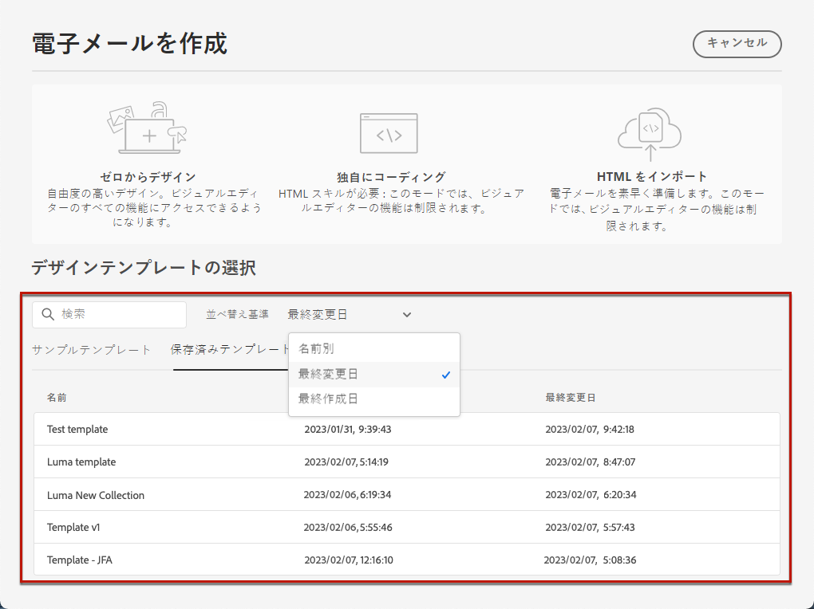
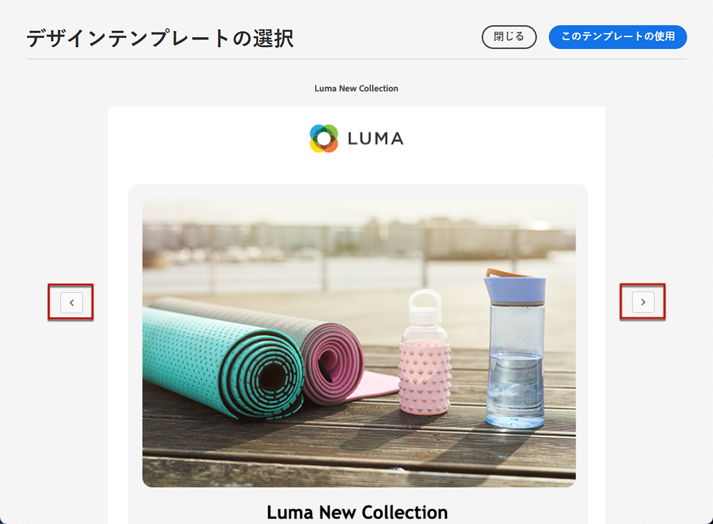

# 電子メールテンプレートを使用 {#email-templates}

次の **[!UICONTROL メールを作成]** 画面、 **[!UICONTROL デザインテンプレートを選択]** 「 」セクションを使用して、テンプレートからコンテンツを作成します。

次の中から選択できます。
* **サンプルテンプレート**. この [!DNL Journey Optimizer] インターフェイスには、標準で 20 個の電子メールテンプレートが用意されており、このテンプレートから選択できます。
* **保存済みのテンプレート**. また、次のいずれかの方法でカスタムテンプレートを使用することもできます。
   * を使用して最初から作成 **[!UICONTROL コンテンツテンプレート]** メニュー [詳細情報](content-templates.md#create-template-from-scratch)
   * を使用して、ジャーニーまたはキャンペーンの E メールから保存 **[!UICONTROL コンテンツテンプレートとして保存]** オプション。 [詳細情報](content-templates.md#save-as-template)

サンプルまたは保存済みのテンプレートの 1 つを使用してコンテンツの作成を開始するには、次の手順に従います。

1. [E メールデザイナーへのアクセス](get-started-email-design.md) 電子メールから **[!UICONTROL コンテンツを編集]** 画面

1. の **[!UICONTROL メールを作成]** screen, **[!UICONTROL サンプルテンプレート]** 「 」タブがデフォルトで選択されています。

1. カスタムテンプレートを使用するには、 **[!UICONTROL 保存済みのテンプレート]** タブをクリックします。

   

1. すべての [コンテンツテンプレート](content-templates.md#create-content-templates) 現在のサンドボックスに作成されたが表示されます。 **[!UICONTROL 名前別]**、**[!UICONTROL 最終変更日]**&#x200B;および&#x200B;**[!UICONTROL 最終作成日]**&#x200B;で並べ替え可能です。

   

1. リストから目的のテンプレートを選択します。

1. 選択したら、左右の矢印を使用して、1 つのカテゴリのすべてのテンプレート（選択内容に応じてサンプルまたは保存）間を移動できます。

   

1. クリック **[!UICONTROL このテンプレートを使用]** をクリックします。

1. E メールデザイナーを使用して、必要に応じてコンテンツを編集します。
