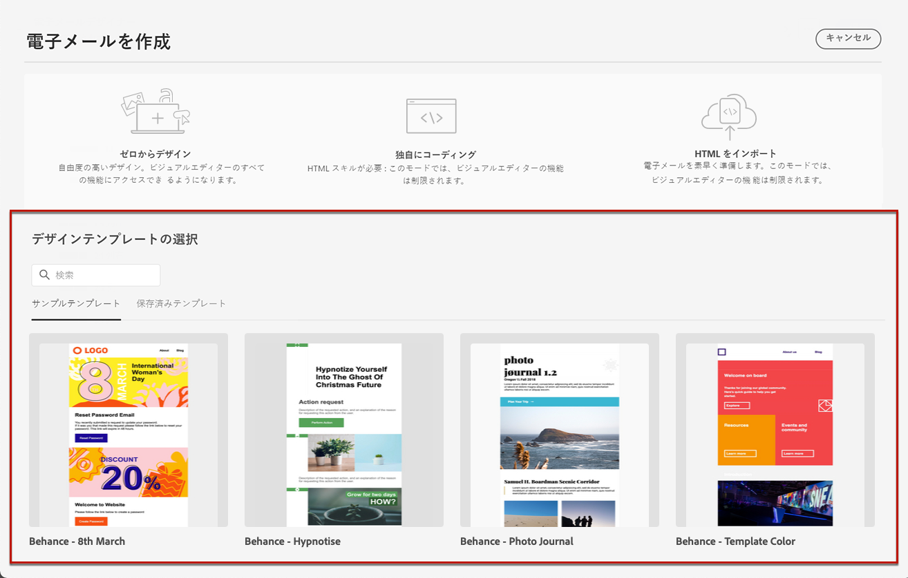
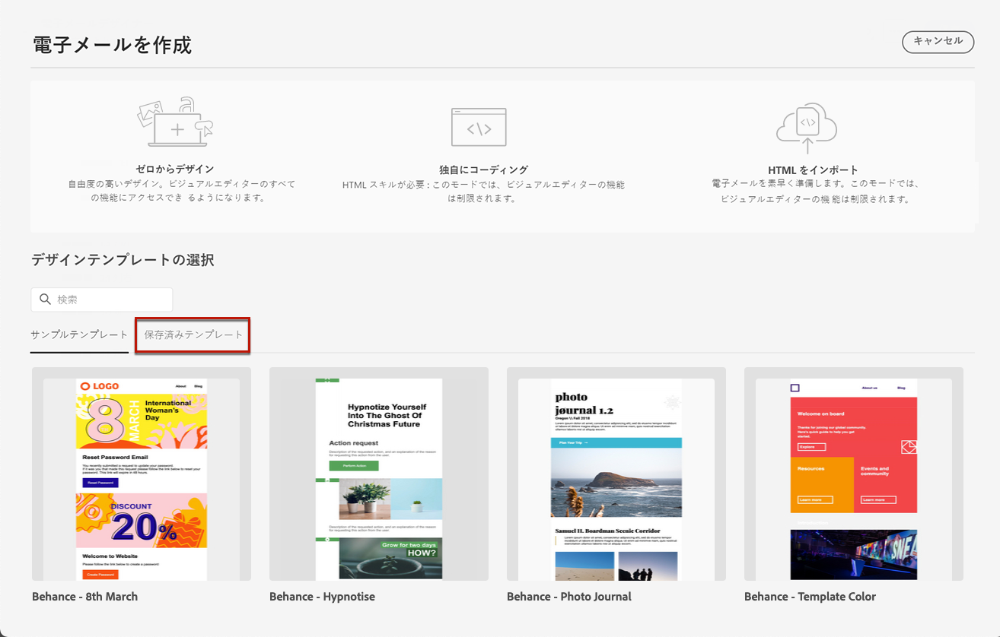

# 電子メールテンプレートを使用した作業 {#email-templates}

**[!UICONTROL Select design template]**「」セクションを使用して、テンプレートからのコンテンツの作成を開始します。

次のいずれかを選択できます。
* 電子メールでは、電子メールテンプレートを20個ご利用いただくことができます。
* 保存されたテンプレート [詳細情報](#use-saved-template)

## テンプレートとして保存 {#save-as-template}

>[!CONTEXTUALHELP]
>id="ajo_messages_depecrated_inventory"
>title="メッセージを移行する方法について説明します。"
>abstract="25 2022 年7月に、メッセージメニューが表示されなくなり、メッセージは旅から直接オーサリングされるようになりました。 Journeys で従来のメッセージを再利用する場合は、それらをテンプレートとして保存する必要があります。"

電子メールコンテンツ ](get-started-email-design.md) を作成した [ 後は、それを保存して後で再利用することができます。これを行うには、次の手順を実行します。

1. 画面の右上にある省略記号をクリックします。

1. ドロップダウンメニューから「」を選択 **[!UICONTROL Save design template]** します。

   

1. このテンプレートの名前を追加します。

   

1. をクリック **[!UICONTROL Save]** します。

次に電子メールを作成するときに、このテンプレートを使用してコンテンツを作成できます。 [方法について説明します。](#use-saved-template)

## 保存されたテンプレートの使用 {#use-saved-template}

1. 電子メールデザイナー ](content-from-scratch.md) を [ 開きます。

1. **[!UICONTROL Create your email screen]** **[!UICONTROL Sample templates]** では、このタブはデフォルトで選択されています。**[!UICONTROL Saved templates]**&#x200B;タブを選択します。

   

1. 以前 [ に保存したすべてのテンプレート ](#save-as-template) の一覧が表示されます。 これは、 **[!UICONTROL Last modified]** および **[!UICONTROL Last created]** を並べ替える **[!UICONTROL By name]** ことができます。

   

1. リストから、選択したテンプレートを選択します。

1. このボタンを選択すると、すべての保存されているテンプレート間を移動できます。また、すべてのレコードを移動することもできます。

   

1. 画面の右上をクリック **[!UICONTROL Use this email]** します。

1. 電子メールデザイナーを使用して、必要に応じてコンテンツを編集します。
