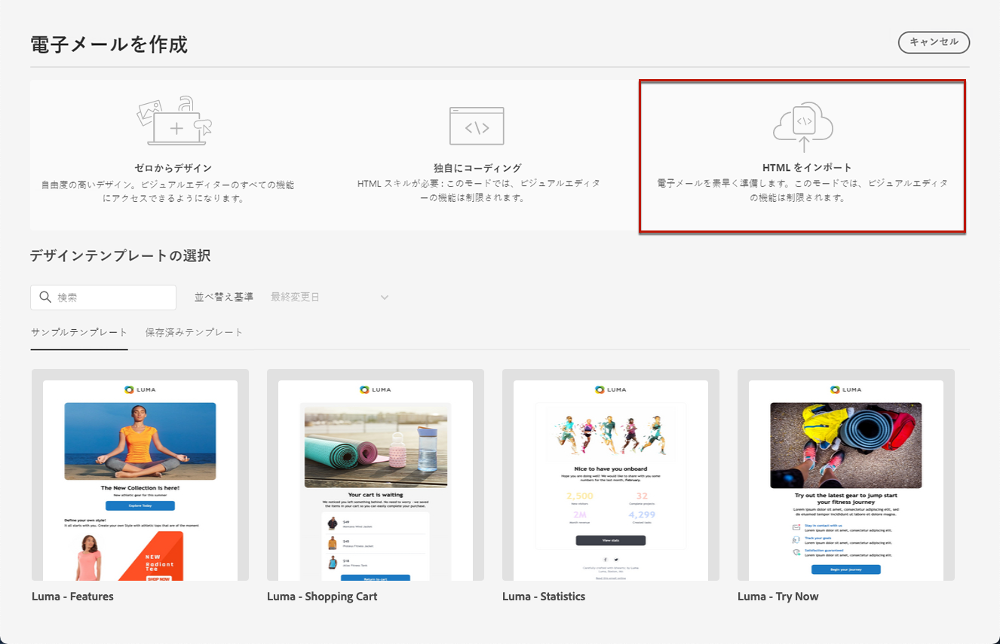
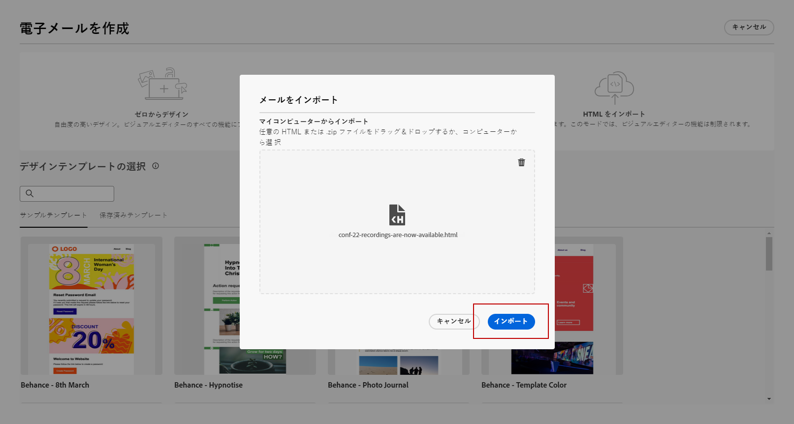
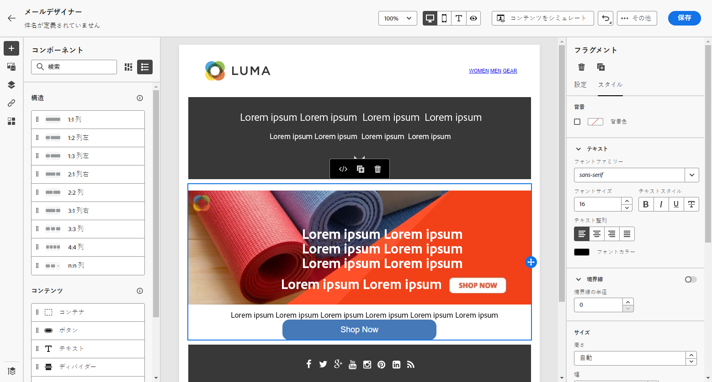

# メールコンテンツのインポート {#existing-content}

[!DNL Journey Optimizer] では、既存の HTML コンテンツをインポートしてメールをデザインできます。 このコンテンツには次のようなものがあります。

* スタイルシートが組み込まれた **HTML ファイル**
* HTML ファイル、スタイルシート（.css）および画像を含んだ **.zip フォルダー**

  >[!NOTE]
  >
  >.zip ファイル構造に制限はありません。 ただし、.zip フォルダーのツリー構造に合わせて、相対参照を指定する必要があります。

>[!TIP]
>
>HTML ファイルの代わりに画像デザイン（JPEG または PNG）がある場合は、[画像から HTML へのコンバーター](../content-management/image-to-html.md)を使用して、AI によって編集可能な HTML メールテンプレートに自動的に変換できます。

HTML コンテンツを含んだファイルをインポートするには、次の手順に従います。

1. E メールデザイナーのホームページで、「**[!UICONTROL HTML をインポート]**」を選択します。

   

1. HTML コンテンツを含んだ HTML または .zip ファイルをドラッグ＆ドロップし、「**[!UICONTROL 読み込み]**」をクリックします。

   

1. HTML コンテンツをアップロードすると、コンテンツは&#x200B;**[!UICONTROL 互換性モード]**&#x200B;になります。

   このモードでは、テキストのパーソナライズ、リンクの追加またはコンテンツへのアセットの組み込みのみ可能です。

1. E メールデザイナーのコンテンツコンポーネントを活用できるようにするには、「**[!UICONTROL HTML コンバーター]**」タブにアクセスし、「**[!UICONTROL 変換]**」をクリックします。

   

   >[!NOTE]
   >
   > `<table>` タグを HTML ファイルの最初のレイヤーとして使用すると、上部レイヤータグの背景や幅の設定などのスタイルが失われる可能性があります。

1. これで、E メールデザイナーの機能を使用して、読み込んだファイルを必要に応じてパーソナライズできるようになりました。 [詳細情報](content-from-scratch.md)

## チュートリアルビデオ {#video}

既存の HTML コンテンツの読み込み、デザインの調整、ミラーページと購読解除リンクの追加およびコンテンツのコーディング方法について説明します。

>[!VIDEO](https://video.tv.adobe.com/v/334102?quality=12)
