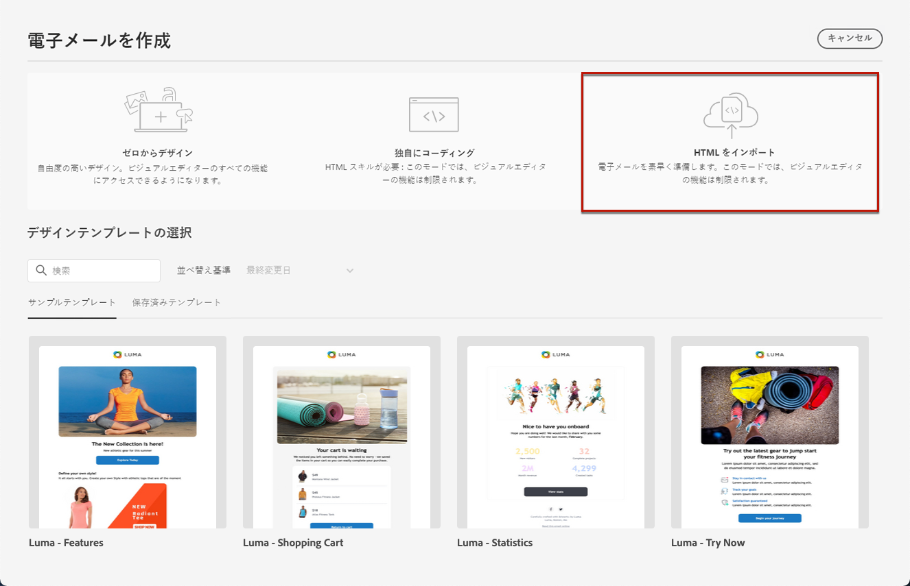

# メールコンテンツの読み込み {#existing-content}

[!DNL Journey Optimizer] では、既存の HTML コンテンツをインポートしてメールをデザインできます。このコンテンツには次のようなものがあります。

* スタイルシートが組み込まれた **HTML ファイル**
* HTML ファイル、スタイルシート（.css）および画像を含んだ **.zip フォルダー**

   >[!NOTE]
   >
   >.zip ファイル構造に制限はありません。ただし、.zip フォルダーのツリー構造に合わせて、相対参照を指定する必要があります。

HTML コンテンツを含んだファイルをインポートするには、次の手順に従います。

1. 電子メールデザイナーのホームページで、「**[!UICONTROL HTML をインポート]**」を選択します。

   

1. HTML コンテンツを含む HTML または .zip ファイルをドラッグ＆ドロップします。

1. HTML コンテンツがアップロードされると、E メールデザイナーの機能を利用してメールの編集とプレビューをおこなうことができます。[詳細情報](content-from-scratch.md)

   

## ハウツービデオ {#video}

既存の HTML コンテンツの読み込み、デザインの調整、ミラーページと購読解除リンクの追加およびコンテンツのコーディング方法について説明します。

>[!VIDEO](https://video.tv.adobe.com/v/334102?quality=12)
