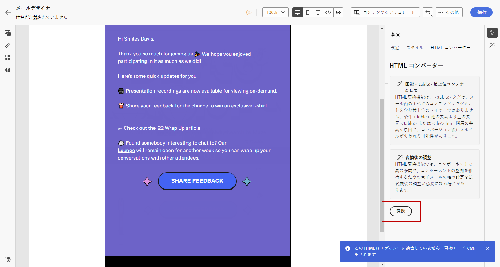

# メールコンテンツの読み込み {#existing-content}

[!DNL Journey Optimizer] では、既存の HTML コンテンツをインポートしてメールをデザインできます。このコンテンツには次のようなものがあります。

* スタイルシートが組み込まれた **HTML ファイル**
* HTML ファイル、スタイルシート（.css）および画像を含んだ **.zip フォルダー**

  >[!NOTE]
  >
  >.zip ファイル構造に制限はありません。ただし、.zip フォルダーのツリー構造に合わせて、相対参照を指定する必要があります。

HTML コンテンツを含んだファイルをインポートするには、次の手順に従います。

1. 電子メールデザイナーのホームページで、「**[!UICONTROL HTML をインポート]**」を選択します。

   

1. HTML コンテンツを含む HTML または .zip ファイルをドラッグ＆ドロップし、「**[!UICONTROL 読み込み]**」をクリックします。

   

1. HTMLコンテンツがアップロードされると、コンテンツは **[!UICONTROL 互換性モード]**.

   このモードでは、テキストのパーソナライズ、リンクの追加、コンテンツへのアセットの組み込みのみが可能です。

1. E メールデザイナーのコンテンツコンポーネントを活用するには、 **[!UICONTROL HTML変換器]** タブをクリックし、 **[!UICONTROL 変換]**.

   

   >[!NOTE]
   >
   > の使用 `<table>` タグをHTMLファイルの最初のレイヤーとして使用すると、最上部のレイヤータグの背景や幅の設定など、スタイルが失われる場合があります。

1. これで、E メールデザイナー機能を使用して、必要に応じて読み込んだファイルをパーソナライズできます [詳細情報](content-from-scratch.md).

## チュートリアルビデオ {#video}

既存の HTML コンテンツの読み込み、デザインの調整、ミラーページと購読解除リンクの追加およびコンテンツのコーディング方法について説明します。

>[!VIDEO](https://video.tv.adobe.com/v/334102?quality=12)
