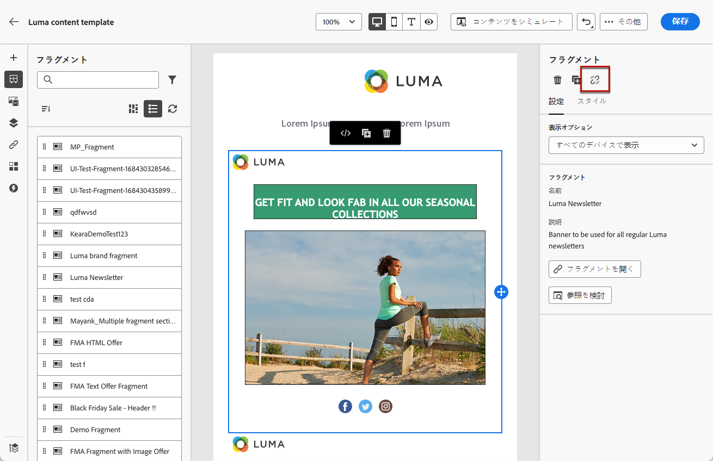

# フラグメントの操作 {#fragments}

フラグメントは、複数のメールで参照できる再利用可能なコンポーネントです [!DNL Journey Optimizer] キャンペーンとジャーニー。

この機能を使用すると、複数のカスタムコンテンツブロックを事前に作成して、非技術的なマーケティングユーザーが使用できるので、E メールコンテンツをすばやく組み立てて、デザインプロセスを改善できます。

<!--
➡️ [Learn how to create and use templates in this video](#video-templates)-->

>[!CAUTION]
>
>フラグメントを作成、編集、アーカイブするには、 **[!DNL Manage Library Items]** 次に含まれる権限 **[!DNL Content Library Manager]** 製品プロファイル。 [詳細情報](../administration/ootb-product-profiles.md#content-library-manager)

フラグメントを最大限に活用するには：

* 独自のフラグメントを作成します。 詳しくは、 [フラグメントの作成](#create-fragments)
* 電子メールで必要な回数だけ使用します。 詳しくは、 [フラグメントを使用](#use-fragments)

>[!NOTE]
>
>現在、この機能は E メールでのみ使用できます。

## フラグメントへのアクセスと管理 {#access-manage-fragments}

フラグメントリストにアクセスするには、「 **[!UICONTROL コンテンツ管理]** > **[!UICONTROL フラグメント]** を選択します。

現在のサンドボックスで作成されたすべてのフラグメント ( **[!UICONTROL フラグメント]** メニュー ( [フラグメントとして保存](#save-as-fragment) オプション — が表示されます。

作成日または変更日にフラグメントをフィルタリングできます。 すべてのフラグメントを表示するか、現在のユーザーが作成または変更した項目のみを表示するかを選択できます。 また、 **[!UICONTROL アーカイブ済み]** フラグメント。 [詳細情報](#archive-fragments)

次の **[!UICONTROL その他のアクション]** 各フラグメントの横にあるアイコンを使用すると、次の操作を実行できます。

* フラグメントを複製します。

* 以下を使用： **[!UICONTROL 参照を参照]** オプションを使用して、使用されているジャーニー、キャンペーン、テンプレートを表示できます。 [詳細情報](#explore-references)

* フラグメントをアーカイブします。 [詳細情報](#archive-fragments)

### フラグメントを編集 {#edit-fragments}

フラグメントを編集するには、次の手順に従います。

1. 次の場所から目的の項目をクリックします。 **[!UICONTROL フラグメント]** リスト。
1. フラグメントのプロパティから、次の操作を実行できます。 [参照を参照する](#explore-references), [アクセスを管理](../administration/object-based-access.md) フラグメントの詳細を更新します。

   

1. フラグメントを最初から作成する場合と同様に、対応するボタンを選択してコンテンツを編集します。 [詳細情報](#create-from-scratch)

>[!NOTE]
>
>フラグメントを編集すると、その変更内容は、そのフラグメントを含むすべての E メールまたはテンプレートに自動的に反映されます。ただし、E メールは **[!UICONTROL ライブ]** ジャーニーまたはキャンペーン。 元のフラグメントからの継承を解除することもできます。 [詳細情報](#break-inheritance)

<!--Changes made to a fragment are not propagated to live journeys or campaigns where it is used.-->

<!--When added to an email, if you want to modify a fragment for a specific email, you can break the synchronization with the original fragment. The fragment becomes part of the email content and the changes will not be synchronized anymore. [Learn more](#break-inheritance)-->

### 参照を参照 {#explore-references}

フラグメントを現在使用しているジャーニー、キャンペーン、コンテンツテンプレートのリストを表示できます。

それには、「 **[!UICONTROL 参照を参照]** 次のいずれかから **[!UICONTROL その他のアクション]** メニューを使用します。

タブを選択して、ジャーニー、キャンペーン、テンプレートを切り替えます。 ステータスを確認し、名前をクリックすると、フラグメントが参照されている対応する項目にリダイレクトされます。

>[!NOTE]
>
>フラグメントがアクセスできないラベルの付いたジャーニー、キャンペーンまたはテンプレートで使用されている場合は、選択したタブの上にアラートメッセージが表示されます。 [オブジェクトレベルのアクセス制御（OLAC）について詳しくはこちらを参照してください](../administration/object-based-access.md)

### フラグメントのアーカイブ {#archive-fragments}

ブランドと関係がなくなった項目からフラグメントリストを消去できます。

これをおこなうには、 **[!UICONTROL その他のアクション]** 目的のフラグメントの横にあるアイコンをクリックし、「 」を選択します。 **[!UICONTROL アーカイブ]**. フラグメントリストに表示されなくなり、今後の E メールやテンプレートでユーザーがフラグメントを使用できなくなります。

>[!NOTE]
>
>E メールまたはコンテンツテンプレートで使用されるフラグメントをアーカイブする場合は、 <!--it will remain in the email or template, but you won't be able to select it from the fragment list to edit it-->電子メールまたはテンプレートは影響を受けません。

フラグメントのアーカイブを解除するには、 **[!UICONTROL アーカイブ済み]** 項目と選択 **[!UICONTROL アーカイブ解除]** から **[!UICONTROL その他のアクション]** メニュー これで、フラグメントリストから再びアクセスでき、任意の E メールまたはテンプレートで使用できるようになりました。

## フラグメントの作成 {#create-fragments}

フラグメントを作成する方法は 2 つあります。

* を使用して、最初からフラグメントを作成する **[!UICONTROL フラグメント]** 専用のメニュー。 [方法についてはこちらを参照](#create-template-from-scratch)

* E メールまたはコンテンツテンプレートをデザインする際は、コンテンツの一部をフラグメントとして保存します。 [方法についてはこちらを参照](#save-as-template)

保存すると、フラグメントをジャーニー、キャンペーンまたはテンプレートで使用できるようになります。 最初から作成した場合も、既存のコンテンツから作成した場合も、このフラグメントを使用して、 [電子メール](get-started-email-design.md) または [コンテンツテンプレート](content-templates.md) 範囲 [!DNL Journey Optimizer]. [詳細情報](#use-fragments)

### ゼロから作成 {#create-from-scratch}

>[!CONTEXTUALHELP]
>id="ajo_create_fragment"
>title="独自のフラグメントを定義する"
>abstract="スタンドアロンフラグメントをゼロから作成して、複数のジャーニーやキャンペーンでコンテンツを再利用可能にします。"

フラグメントを最初から作成するには、次の手順に従います。

1. フラグメントリストにアクセスするには、 **[!UICONTROL コンテンツ管理]** > **[!UICONTROL フラグメント]** 左メニュー

1. 選択 **[!UICONTROL フラグメントを作成]**.

1. フラグメントの詳細 ( 名前や説明（必要に応じて）を入力します。

   

   >[!NOTE]
   >
   >現在、 **[!UICONTROL ビジュアルフラグメント]** と入力し、 **電子メール** チャネルがサポートされています。

1. カスタムまたはコアのデータ使用ラベルをフラグメントに割り当てるには、「 **[!UICONTROL アクセスを管理]**. [オブジェクトレベルのアクセス制御（OLAC）についての詳細はこちらを参照してください](../administration/object-based-access.md)。

1. 「**[!UICONTROL 作成]**」をクリックします。

1. [メールデザイナー](get-started-email-design.md)が表示されます。ジャーニーやキャンペーン内の E メールと同じ方法で、必要に応じてコンテンツを編集します。

   >[!NOTE]
   >
   >パーソナライゼーションフィールドと動的コンテンツを追加できますが、コンテキスト属性はフラグメントではサポートされていません。

   

1. フラグメントの準備が整ったら、 **[!UICONTROL 保存]**.

1. 必要に応じて、フラグメント名の横にある矢印をクリックし、 **[!UICONTROL 詳細]** 画面を表示して編集します。

   

これで、このフラグメントをビルド時に使用する準備が整いました。 [電子メール](get-started-email-design.md) または [コンテンツテンプレート](content-templates.md) 範囲 [!DNL Journey Optimizer]. [方法についてはこちらを参照](#use-fragments)

### フラグメントとして保存 {#save-as-fragment}

を設計する場合 [コンテンツテンプレート](content-templates.md) または [電子メール](get-started-email-design.md) キャンペーンまたはジャーニーでは、後で再利用するために、コンテンツの一部をフラグメントとして保存できます。 それには、次の手順に従います。

1. 内 [メールデザイナー](get-started-email-design.md)をクリックし、画面の右上にある省略記号をクリックします。

1. 選択 **[!UICONTROL フラグメントとして保存]** を選択します。

   

1. この **[!UICONTROL フラグメントとして保存]** 画面が表示されます。 パーソナライゼーションフィールドや動的コンテンツなど、フラグメントに含める要素を選択します。 コンテキスト属性は、フラグメントではサポートされていません。

   >[!CAUTION]
   >
   >互いに隣接するセクションのみを選択できます。 空の構造や別のフラグメントは選択できません。

   

1. 「**[!UICONTROL 作成]**」をクリックします。フラグメントの詳細 ( 名前や説明（必要に応じて）を入力します。

   

   >[!NOTE]
   >
   >現在、 **[!UICONTROL ビジュアルフラグメント]** と入力し、 **電子メール** チャネルがサポートされています。

1. カスタムまたはコアのデータ使用ラベルをフラグメントに割り当てるには、「 **[!UICONTROL アクセスを管理]**. [オブジェクトレベルのアクセス制御（OLAC）についての詳細はこちらを参照してください](../administration/object-based-access.md)。

1. クリック **[!UICONTROL 作成]** 再び フラグメントは **[!UICONTROL フラグメント]** リスト（からアクセス可能） [!DNL Journey Optimizer] 専用のメニュー。

   これは、次のことが可能なスタンドアロンフラグメントになります。 [アクセス](#access-manage-fragments), [編集済み](#edit-fragments) および [アーカイブ](#archive-fragments) を選択します。

これで、このフラグメントを使用して、 [電子メール](get-started-email-design.md) または [コンテンツテンプレート](content-templates.md) 範囲 [!DNL Journey Optimizer]. [方法についてはこちらを参照](#use-fragments)

>[!NOTE]
>
>新しいフラグメントに対する変更は、元の電子メールまたはテンプレートには反映されません。 同様に、元のコンテンツがその E メールまたはテンプレート内で編集された場合、新しいフラグメントは変更されません。

## フラグメントを使用 {#use-fragments}

フラグメントは [電子メール](get-started-email-design.md) ジャーニーやキャンペーン内、または [コンテンツテンプレート](content-templates.md).

1. を使用して、任意の E メールまたはテンプレートコンテンツを開きます。 [メールデザイナー](get-started-email-design.md).

1. を選択します。 **[!UICONTROL フラグメント]** アイコンをクリックします。

   

1. 現在のサンドボックスで作成されたすべてのフラグメントのリストが表示されます。 次のことができます。

   * 特定のフラグメントのラベルを入力して、そのフラグメントを検索します。
   * フラグメントを昇順または降順に並べ替えます。
   * フラグメントの表示方法（カード表示またはリスト表示）を変更します。

1. また、リストを更新することもできます。

   >[!NOTE]
   >
   >コンテンツの編集中に一部のフラグメントが変更または追加された場合、リストは最新の変更で更新されます。

1. フラグメントをリストから挿入する領域にドラッグ&amp;ドロップします。

   

1. 他のコンポーネントと同様に、コンテンツ内でフラグメントを移動できます。

1. フラグメントを選択して、対応するペインを右側に表示します。 ここから、コンテンツからフラグメントを削除したり、複製したりできます。 また、フラグメントの上に表示されるコンテキストメニューから直接、これらのアクションを実行できます。

   

1. 次の **[!UICONTROL 設定]** タブでは、次の操作を実行できます。

   * フラグメントを表示するデバイスを選択します。
   * フラグメントを新しいタブで開き、必要に応じて編集します。 [詳細情報](#edit-fragments)
   * 参照を参照します。 [詳細情報](#explore-references)

1. フラグメントをカスタマイズするには、 **[!UICONTROL スタイル]** タブをクリックします。

1. 必要に応じて、元のフラグメントで継承を解除できます。 [詳細情報](#break-inheritance)

1. 必要な数のフラグメントを追加し、 **[!UICONTROL 保存]** 変更内容。

### 継承を解除 {#break-inheritance}

フラグメントを編集すると、変更内容が同期されます。 自動的にすべての **[!UICONTROL ドラフト]** ジャーニー/キャンペーンと、そのフラグメントを含むコンテンツテンプレート。

>[!NOTE]
>
>変更はで使用されている E メールには反映されません。 **[!UICONTROL ライブ]** ジャーニーまたはキャンペーン。

E メールまたはコンテンツテンプレートに追加すると、フラグメントはデフォルトで同期されます。

ただし、元のフラグメントから継承を解除することはできます。 この場合、フラグメントのコンテンツは現在のデザインにコピーされ、変更は同期されなくなります。

継承を解除するには、次の手順に従います。

1. フラグメントを選択します。

1. コンテキストツールバーのロック解除アイコンをクリックします。

   

1. そのフラグメントは、元のフラグメントにリンクされなくなったスタンドアロン要素になります。 コンテンツ内の他のコンテンツコンポーネントとして編集します。 [詳細情報](content-components.md)

<!--

## How-to video {#video-templates}

Learn how to create, edit, and use fragments in [!DNL Journey Optimizer].

>[!VIDEO](https://video.tv.adobe.com/v/3413743/?quality=12)

-->
