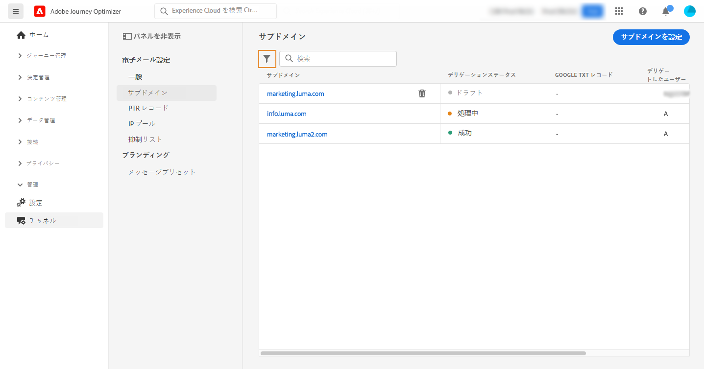
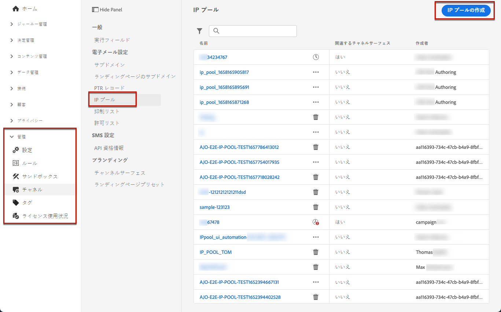
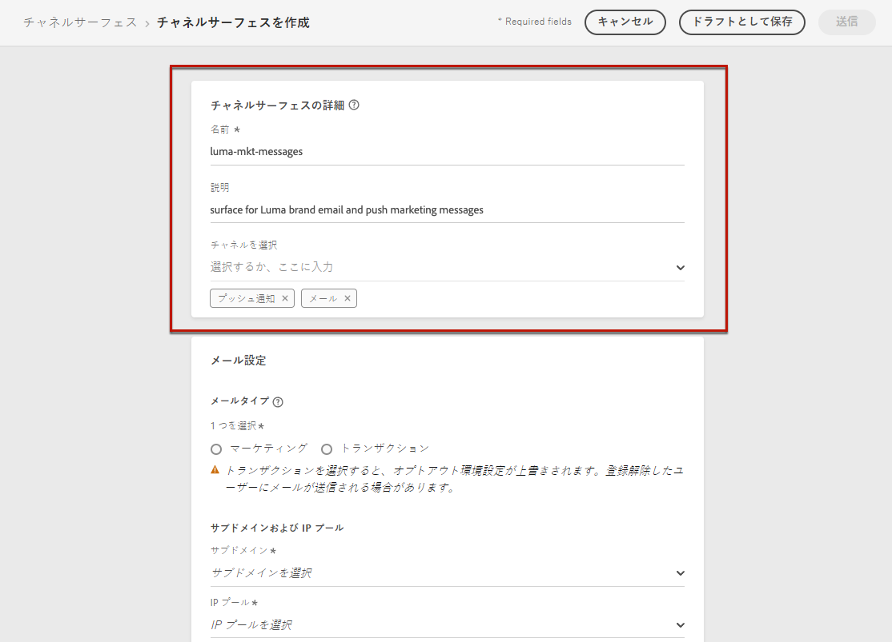
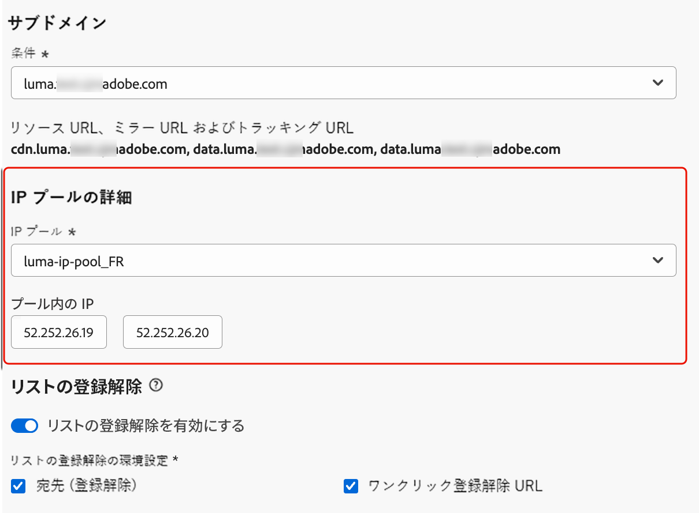
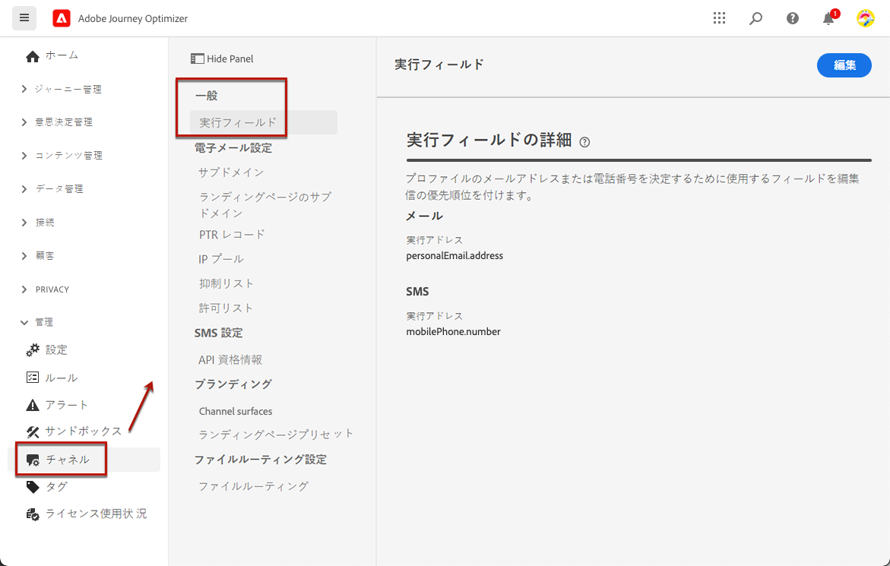
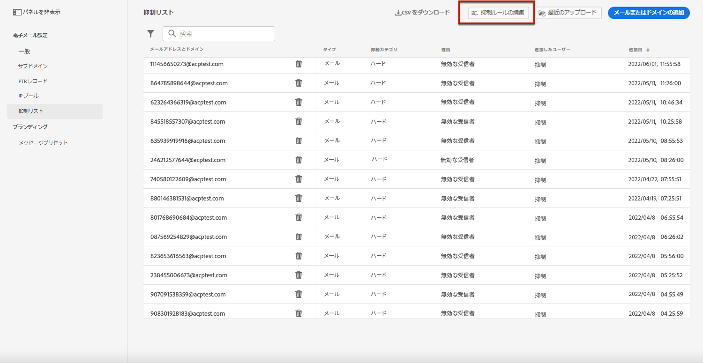

# メール設定の基本を学ぶ {#get-starte-email-config}

>[!BEGINSHADEBOX]

**このページ：**&#x200B;サブドメインのデリゲートや IP プールの作成から、チャネル設定、実行フィールド、再試行の設定までを対象とした、Adobe Journey Optimizer でのメールチャネルの設定に重要な手順について説明します。

>[!ENDSHADEBOX]

Adobe Journey Optimizer でメールチャネルを設定することは、効果的にオーディエンスに関与する、影響力のあるパーソナライズされたメールエクスペリエンスを作成するゲートウェイです。

この節では、[!DNL Journey Optimizer] を通じてメールを送信するために必要な基本的な設定手順について説明します。 また、メールヘッダーの設定方法、複数のブランド向けの設定のパーソナライズ方法、分析用の URL トラッキングを有効にする方法、ユーザーの利便性を考慮したワンクリック登録解除リンクを追加する方法についても説明します。 各トピックは前のトピックに基づいて作成されています。これにより、制御と精度を維持しながらメール戦略を微調整するツールが提供されます。

[!DNL Journey Optimizer] でジャーニーとキャンペーンを通じてメールを送信できるようにするには、いくつかの設定手順を完了する必要があります。 これらの手順を以下に示します。

1. 最適な配信品質を確保しレピュテーションを保護するには、まず [!DNL Journey Optimizer] でメールを送信するのに使用する&#x200B;**サブドメインをアドビにデリゲート**&#x200B;します。 これらのサブドメインによって、追跡する web ページやミラーページの URL などの要素が決まります。 [詳細情報](../configuration/about-subdomain-delegation.md)

   

1. IP プールを作成して、インスタンスでプロビジョニングされた **IP アドレスをグループ化**&#x200B;します。 [詳細情報](../configuration/ip-pools.md)

   

1. **チャネル設定**&#x200B;を作成し、**[!UICONTROL メール]**&#x200B;チャネルを選択します。 [詳細情報](../configuration/channel-surfaces.md)

   

1. 各メールチャネル設定で、メールの配信に必要なすべての&#x200B;**技術的パラメーター**&#x200B;を設定します。 [詳細情報](email-settings.md)

   * ここで、メールの送信に使用するサブドメインと、設定に関連付ける IP プールを選択します。 [詳細情報](email-settings.md#ip-pools)

   

   * **[!UICONTROL 送信者メールの接頭辞]**&#x200B;および&#x200B;**[!UICONTROL エラーメールの接頭辞]**&#x200B;は、現在選択されている[デリゲートされたサブドメイン](../configuration/about-subdomain-delegation.md)を使用します。 オプションで、**[!UICONTROL 送信者名]**&#x200B;および&#x200B;**[!UICONTROL 送信者メール]**&#x200B;は、異なる送信者を特定できます（完全な&#x200B;**送信者**&#x200B;アドレス、そのサブドメインの接尾辞に関連付けられていません）。 [詳細情報](header-parameters.md#sender-header)

   

1. BCC の有効化、分析用の URL トラッキングの定義、ユーザーの利便性を考慮したワンクリック登録解除リンクの追加など、その他の高度なパラメーターを設定して、メールチャネルの設定を完了します。 [詳細情報](email-settings.md)

1. Adobe Experience Platform で使用可能なアドレスが複数ある場合、受信者に優先して使用する&#x200B;**実行フィールド**&#x200B;を決定します。 [詳細情報](../configuration/primary-email-addresses.md)

   

1. 抑制リストにメールアドレスを送信するまでに&#x200B;**再試行**&#x200B;を実行する日数を管理します。 [詳細情報](../configuration/manage-suppression-list.md)

   

:::: landing-cards-container
:::

メール設定の基本を学ぶ

サブドメインのデリゲーション、IP プール、抑制リストの管理など、メール機能を設定する基本的な手順について説明します。

[メール設定の開始](get-started-email-config.md)
:::

:::

メール設定の定義

配信品質、コンプライアンス、カスタマイズを考慮して、BCC、抑制の上書き、URL トラッキングなどの高度な機能によるメール設定を指定します。

[設定](email-settings.md)
:::

:::

リストの登録解除の有効化と設定

「リストの登録解除」機能を有効にして、受信者のオプトアウト用のメールヘッダーにワンクリック登録解除 URL を含める方法について説明します。

[リストの登録解除の設定](list-unsubscribe.md)
:::

:::

メールヘッダーパラメーターの設定

送信者と返信メールアドレスをカスタマイズし、エラーを処理し、メールを転送して、効果的なコミュニケーションを実現します。

[ヘッダーパラメーターの設定](header-parameters.md)
:::

:::

メールチャネル用の URL トラッキングの設定

URL トラッキングパラメーターを設定して、メールキャンペーンの効果を測定して、分析ツールと統合します。

[URL トラッキングの設定](url-tracking.md)
:::

:::

パーソナライズされたメール設定

動的サブドメイン、パーソナライズされたヘッダー、URL トラッキングを設定して、カスタマイズされたメールエクスペリエンスを提供します。

[パーソナライズされたメールの設定](surface-personalization.md)
:::

::::
