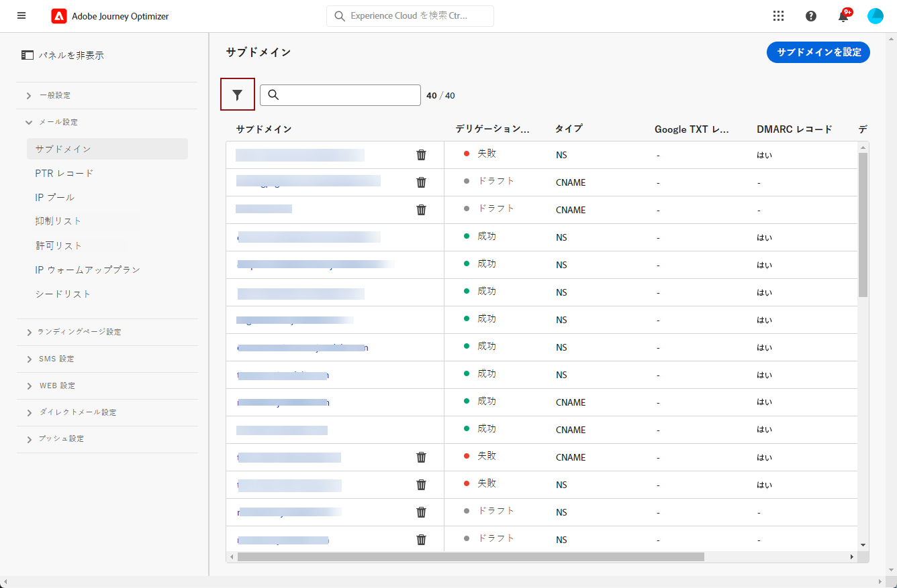

# メール設定の基本を学ぶ {#get-starte-email-config}

[!DNL Journey Optimizer] でジャーニーとキャンペーンを通じてメールを送信できるようにするには、いくつかの設定手順を完了する必要があります。

1. 最適な配信品質を確保しレピュテーションを保護するには、まず [!DNL Journey Optimizer] でメールを送信するために使用するサブドメインをアドビにデリゲートします。これらのサブドメインによって、追跡する web ページやミラーページの URL などの要素が決まります。[詳細情報](../configuration/about-subdomain-delegation.md)

   

1. インスタンスにプロビジョニングされた IP アドレスをグループ化することで、メールの配信品質とレピュテーションを向上させます。[詳細情報](../configuration/ip-pools.md)

   

1. チャネルサーフェスを作成し、**[!UICONTROL メール]**&#x200B;チャネルを選択します。[詳細情報](../configuration/channel-surfaces.md)

   

1. 各メールチャネルサーフェスで、メールの配信に必要なすべての技術的パラメーターを設定します。[詳細情報](email-settings.md)

   * ここで、メールの送信に使用するサブドメインと、サーフェスに関連付ける IP プールを選択します。[詳細情報](email-settings.md#subdomains-and-ip-pools)

   

   * **[!UICONTROL 送信者メール]**&#x200B;および&#x200B;**[!UICONTROL エラーメール]**&#x200B;アドレスでは、現在選択されているデリゲートされたサブドメインを使用する必要があります。[詳細](email-settings.md#email-header)

   

1. Adobe Experience Platform で使用可能なアドレスが複数ある場合、受信者に優先して使用するメールアドレスを決定します。[詳細](../configuration/primary-email-addresses.md)

   

1. 抑制リストにメールアドレスを送信する前に再試行が実行される日数を管理します。[詳細](../configuration/manage-suppression-list.md)

   
