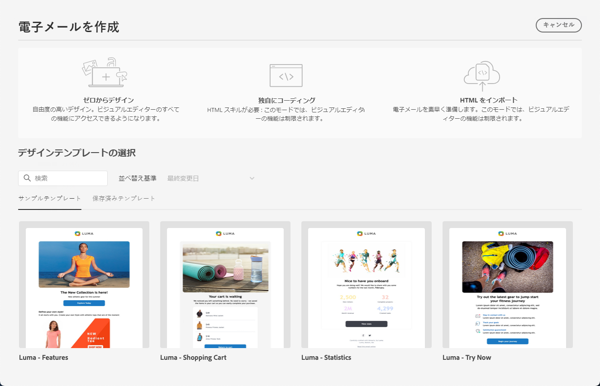
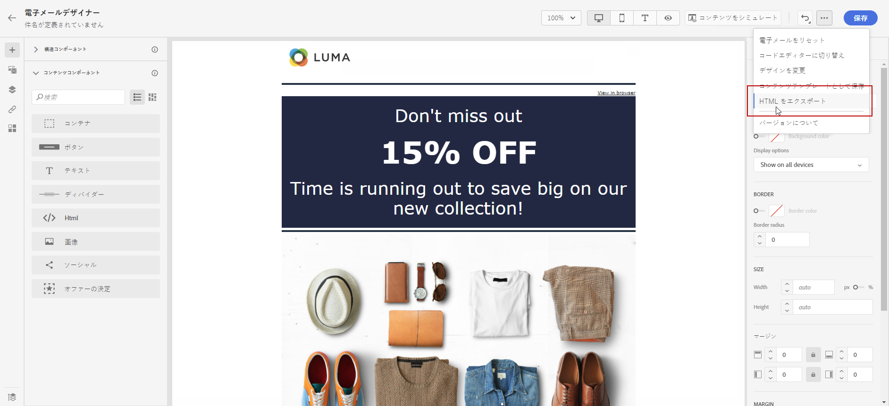

# メールデザインの基本を学ぶ {#get-started-content-design}

[!DNL Journey Optimizer] に既存のコンテンツを読み込むことも、コンテンツデザイン機能を活用することもできます。

* [!DNL Journey Optimizer] **メールデザイン機能**&#x200B;を使用して、レスポンシブなメールのデザインや読み込みを行います。[詳細情報](content-from-scratch.md)

* **Adobe Experience Manager Assets Essentials** を活用してメールを強化し、独自のアセットデータベースを作成および管理します。[詳細情報](../integrations/assets.md)

* **Adobe Stock の写真**&#x200B;を検索しコンテンツを作成し、メールデザインを向上します。[詳細情報](../integrations/stock.md)

* プロファイル属性に基づいてパーソナライズされたメッセージと動的メッセージを作成し、カスタマーエクスペリエンスを強化します。[パーソナライズ機能](../personalization/personalize.md)および[動的コンテンツ](../personalization/get-started-dynamic-content.md)の詳細をご覧ください。

➡️ [この機能をビデオで確認](#video)

## メールデザインのベストプラクティス {#best-practices}

メールを送信する際は、受信者がメールを転送する可能性があることを考慮することが重要です。これにより、メールのレンダリングで問題が発生する可能性があります。これは、転送に使用されるメールプロバイダーでサポートされていない可能性がある CSS クラスを使用する場合に特に当てはまります。例えば、モバイルデバイスで画像を非表示にするのに「is-desktop-hidden」CSS クラスを使用している場合などです。

こうしたレンダリングの問題を最小限にするために、メールのデザイン構造をできるだけ簡単に保つことをお勧めします。デスクトップデバイスとモバイルデバイスの両方で適切に機能する単一のデザインを使用し、複雑な CSS クラスや、すべてのメールクライアントで完全にはサポートされない他のデザイン要素を使用しないようにします。これらのベストプラクティスに従うと、受信者による表示や転送の方法に関係なく、一貫して正しくメールをレンダリングできます。

メールデザインのベストプラクティスについては、以下の表を参照してください。

| 推奨 | 慎重に使用 | 推奨しない |
|-|-|-|
| <ul><li>構造用の<b>静的なテーブルベースのレイアウト</b></li> <li>レイアウトの一貫性を保つための <b>HTML テーブルとネストされたテーブル</b></li> <li><b>テンプレートの幅</b>は 600～800 ピクセル </li> <li>スタイル設定用の<b>シンプルなインライン CSS</b> </li> <li>ユニバーサル互換性のための <b>web セーフフォント</b></li> | <ul><li><b>背景画像</b>は、特定のメールプラットフォームでは表示されない場合があります。</li><li><b>カスタム web フォント</b>にはユニバーサルサポートがありません。</li><li><b>ワイドレイアウト</b>は、小さな画面では適切に表示されない場合があります。</li><li><b>画像マップ</b>の機能は限定的です。</li><li><b>埋め込み CSS</b> は、メール配信中に削除される場合があります。</li> | <ul><li><b>JavaScript</b> は、通常、メール環境ではサポートされていません。</li> <li> <b>`<iframe>`</b> タグは、ほとんどのプラットフォームでブロックされています。 </li> <li><b>Flash</b> は旧式で、サポートされなくなりました。</li> <li><b>埋め込みオーディオ</b>は、多くの場合、再生できません。</li> <li><b>埋め込みビデオ</b>は、多くのメールプラットフォームと互換性がありません。</li> <li> <b>Forms</b> は、メール内では機能しません。</li> <li> `
` レイヤ化はレンダリングの問題を引き起こす可能性があります。</li> |

>[!NOTE]
>
>[欧州アクセシビリティ法](https://eur-lex.europa.eu/legal-content/EN/TXT/?uri=CELEX%3A32019L0882){target="_blank"}では、すべてのデジタル通信がアクセス可能である必要があると規定しています。この節に示すメールデザインのベストプラクティスに加えて、[このページ](accessible-content.md)に記載されている、E メールデザイナーを使用してアクセシブルなコンテンツを作成する際に固有のガイドラインにも必ず従ってください。

## メールコンテンツを作成するための主な手順 {#key-steps}

ジャーニーまたはキャンペーンに[メールを追加](create-email.md)したら、メールコンテンツの作成を開始できます。

1. ジャーニーまたはキャンペーンの設定画面から、**[!UICONTROL コンテンツを編集]**&#x200B;画面に進み、E メールデザイナーにアクセスします。[詳細情報](create-email.md#define-email-content)

   

1. E メールデザイナーのホームページで、次のオプションからメールのデザイン方法を選択します。

   * E メールデザイナーのインターフェイスで&#x200B;**メールをゼロから設計**&#x200B;し、[Adobe Experience Manager Assets](../integrations/assets.md) の画像を活用します。メールコンテンツのデザイン方法については、[この節](content-from-scratch.md)を参照してください。

   * E メールデザイナーで直接 **Raw HTML をコーディングまたは貼り付け**&#x200B;ます。独自のコンテンツのコーディング方法については、[この節](code-content.md)を参照してください。

     >[!NOTE]
     >
     >キャンペーンでは、**[!UICONTROL コンテンツを編集]**&#x200B;画面から「**[!UICONTROL コードエディター]**」ボタンを選択することもできます。[詳細情報](create-email.md#define-email-content)

   * ファイルまたは .zip フォルダーから&#x200B;**既存の HTML コンテンツを読み込み**&#x200B;ます。メールコンテンツの読み込み方法については、[この節](existing-content.md)を参照してください。

   * AI を活用した画像から HTML へのコンバーターを使用して、**画像デザインを HTML テンプレートに変換します**。静的画像を編集可能なメールテンプレートに変換する方法について詳しくは、[この節](image-to-html.md)を参照してください。

   * ビルトインまたはカスタムテンプレートのリストから&#x200B;**既存のコンテンツを選択します**。メールテンプレートの操作方法については、[この節](../email/use-email-templates.md)を参照してください。

   

1. メールコンテンツを定義し、パーソナライズしたら、コンテンツをエクスポートして、検証したり、後で使用したりできます。 「**[!UICONTROL HTML をエクスポート]**」をクリックして、 コンピューターに HTML とアセットを含む zip ファイルを保存します。

   

## チュートリアルビデオ {#video}

メッセージエディターでメールコンテンツを作成する方法を説明します。

>[!VIDEO](https://video.tv.adobe.com/v/3416418?captions=jpn&quality=12)

A/B テストを行うようにコンテンツ実験を設定し、ビジネス目標を最大限に推進するメールコンテンツを探索する方法を説明します。

>[!VIDEO](https://video.tv.adobe.com/v/3447332?captions=jpn)
