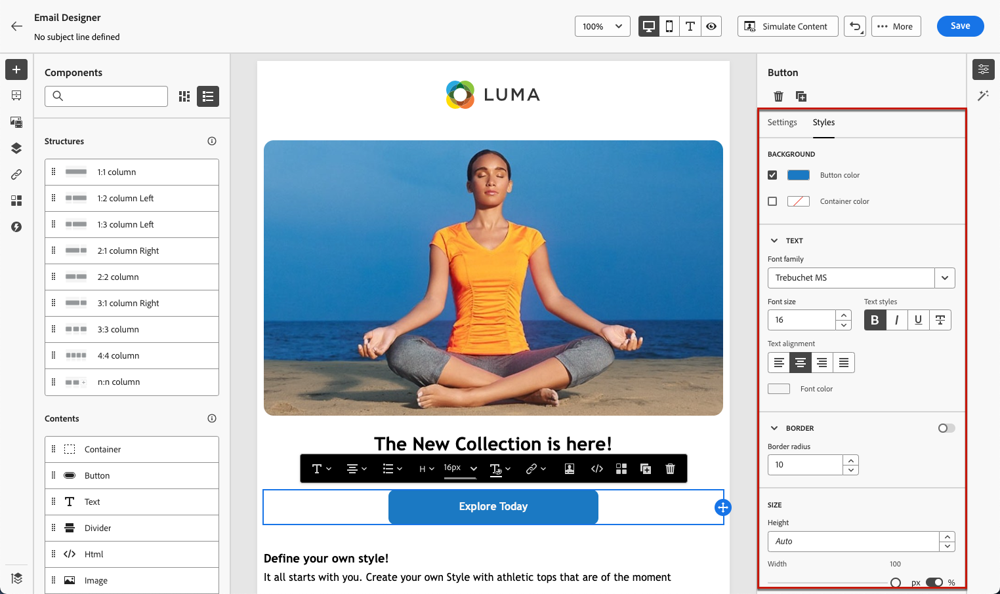

# メールスタイルの基本を学ぶ {#get-started-email-style}

[!DNL Journey Optimizer] でメールコンテンツの作成を開始すると、E メールデザイナーの&#x200B;**[!UICONTROL スタイル]**&#x200B;パネルで多数のスタイルパラメーターおよび属性を調整できます。

変更内容は、メールの本文、構造コンポーネント、コンテンツコンポーネントのいずれかに適用できます。

メールで一部のスタイル設定を調整する方法については、次のリンクを参照してください。

* [メールの背景のパーソナライズ](backgrounds.md)
* [垂直方向の整列とパディングの調整](alignment-and-padding.md)
* [インラインスタイル属性の追加](inline-styling.md)方法を学ぶ
* [メールコンテンツへのカスタム CSS の追加](custom-css.md)方法を学ぶ
* [ダークモードコンテンツの管理](dark-mode.md)方法を学ぶ

>[!NOTE]
>
>[欧州アクセシビリティ法](https://eur-lex.europa.eu/legal-content/EN/TXT/?uri=CELEX%3A32019L0882){target="_blank"}では、すべてのデジタル通信がアクセス可能である必要があると規定しています。[!DNL Journey Optimizer] でコンテンツをデザインする際は、明確さを確保するために色、ラベル、アイコンを調整したり、モバイルやレスポンシブレイアウト向けにデザインを最適化したりするなど、[このページ](../email/accessible-content.md)に示す特定のスタイル設定ガイドラインに必ず従ってください。