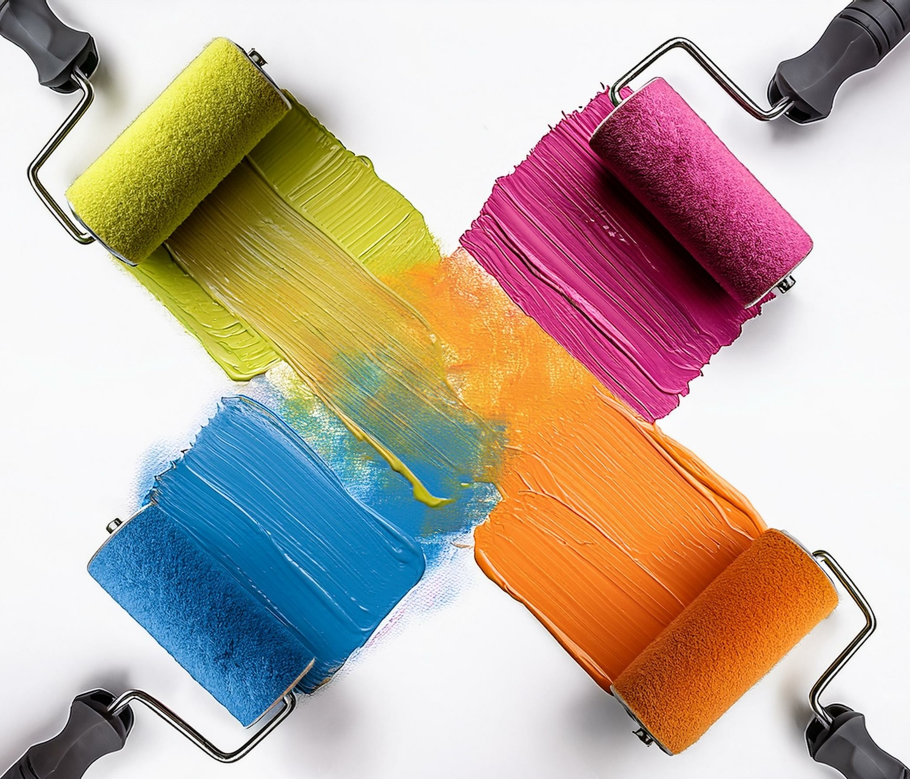

# メールの基本を学ぶ {#get-started-email}

>[!CONTEXTUALHELP]
>id="ajo_homepage_card4"
>title="メールのデザイン"
>abstract="**Adobe Journey Optimizer** を使用して顧客にメールメッセージを送信します。E メールデザイナーで、メッセージの作成、パーソナライズ、プレビューを行うことができます。"

[!DNL Journey Optimizer] を使用して、メールメッセージを顧客に送信します。E メールデザイナーで、メッセージの作成、パーソナライズ、プレビューを行うことができます。

メール配信を作成するには、次の手順を実行します。

* **ジャーニー**&#x200B;の場合：ジャーニーに&#x200B;**[!UICONTROL メール]**&#x200B;アクティビティを追加し、基本設定を定義したら、右側の&#x200B;**[!UICONTROL アクション：メール]**&#x200B;パネルを使用して、メッセージのコンテンツを作成します。[ジャーニーの作成方法を学ぶ](../building-journeys/journey-gs.md)

* **Campaign** の場合：キャンペーンを作成したら、アクションとして「**[!UICONTROL メール]**」を選択し、基本設定を定義します。[キャンペーンの作成方法を学ぶ](../campaigns/create-campaign.md#configure)

>[!IMPORTANT]
>
>メールを初めて作成する場合は、メールチャネルが設定されていることを確認してください。[詳細情報](email-settings.md)

<table style="table-layout:fixed"><tr style="border: 0;">
<td>

<a href="create-email.md"><strong>メールの作成</strong>

</td>
<td>

<a href="get-started-email-design.md"><strong>メールのデザイン</strong></a>

</td>
<td>

<a href="email-opt-out.md"><strong>メールオプトアウトの管理</strong></a>

</td>
<td>

<a href="email-settings.md"><strong>メールチャネルの設定</strong></a>

</td>
</tr></table>

<table style="table-layout:fixed"><tr style="border: 0;">
<td>

<a href="../content-management/generative-email.md"><strong>コンテンツ生成用 AI アシスタント</strong>

</td>
<td>

<a href="../content-management/fragments.md"><strong>メールコンテンツフラグメントの使用</strong></a>

</td>
<td>

<a href="../personalization/personalize.md"><strong>メールコンテンツのパーソナライズ</strong></a>

</td>
<td>

<a href="../integrations/assets.md"><strong>アドビアプリとソリューションの組み合わせ</strong></a>

</td>
</tr></table>

## その他のリソース

* **[メールの作成](create-email.md)** - キャンペーンとジャーニーでメールメッセージを作成する方法を手順を追って説明します。
* **[メールコンテンツのデザイン](get-started-email-design.md)** - メールコンテンツをゼロから、またはテンプレートを使用してデザインする様々な方法を説明します。
* **[メール設定](get-started-email-config.md)** - メールのサーフェス、サブドメイン、IP プールなどのメール設定を構成する方法について説明します。
* **[メールのパーソナライゼーションとスタイル設定](get-started-email-style.md)** - カスタム CSS、整列、パディング、ダークモードのサポートなどの、マスターのスタイル設定手法。
* **[メールのトラッキングと監視](message-tracking.md)** - パフォーマンス分析のために、メッセージの開封数、クリック数を追跡し、URL トラッキングを管理する方法について説明します。
* **[メールチャネルチュートリアル ](https://experienceleague.adobe.com/en/docs/journey-optimizer-learn/tutorials/channels/email-channel){target="_blank"}** - メールの機能とベストプラクティスに関するステップバイステップのビデオチュートリアルをご覧ください。
