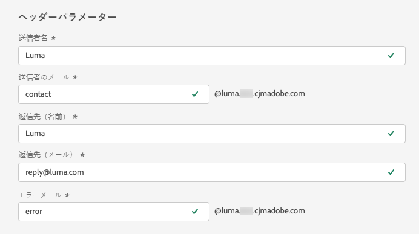
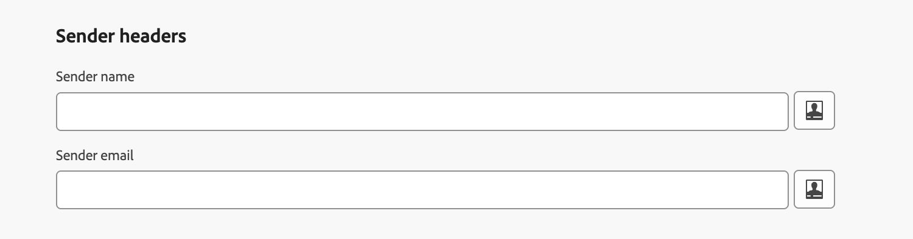

# ヘッダーパラメーター {#email-header}

新しい[メールチャネル設定](email-settings.md)を指定する際に、「**[!UICONTROL ヘッダーパラメーター]**」セクションでは、その設定を使用して送信されるメールのタイプに関連付けられた送信者の名前とメールアドレスを入力します。

>[!NOTE]
>
>メール設定の制御を高めるには、ヘッダーパラメーターをパーソナライズできます。 [詳細情報](../email/surface-personalization.md#personalize-header)
>
>メール設定[&#128279;](../configuration/channel-surfaces.md#edit-channel-surface)を編集する場合、ヘッダーパラメーターに新しい[&#x200B; プロファイル属性](../personalization/personalization-build-expressions.md#sources)を追加することはできません。 新しいチャネル設定を作成する必要があります。

* **[!UICONTROL 送信者名]**：送信者の名前（会社のブランド名など）。

* **[!UICONTROL 送信者メールの接頭辞]**：コミュニケーションに使用するメールアドレス。

* **[!UICONTROL 返信先名]**：受信者がメールクライアントソフトウェアの「**返信**」ボタンをクリックしたときに使用する名前。

* **[!UICONTROL 返信先メール]**：受信者がメールクライアントソフトウェアの「**返信**」ボタンをクリックしたときに使用するメールアドレス。 [詳細情報](#reply-to-email)

* **[!UICONTROL エラーメールの接頭辞]**：メールを配信してから数日後に ISP で発生したすべてのエラー（非同期バウンス）は、このアドレスで受信されます。 また、このアドレスでは、不在通知とチャレンジ応答も受信されます。

  アドビにデリゲートされていない特定のメールアドレスで不在通知とチャレンジ応答を受信したい場合は、[転送プロセス](#forward-email)を設定する必要があります。 その場合は、このインボックスにランディングするメールを処理するために、手動または自動のソリューションを用意してください。

>[!NOTE]
>
>**[!UICONTROL 送信者メールの接頭辞]**&#x200B;および&#x200B;**[!UICONTROL エラーメールの接頭辞]**&#x200B;アドレスは、現在選択されている[デリゲートされたサブドメイン](../configuration/about-subdomain-delegation.md)を使用してメールを送信します。 例えば、デリゲートされたサブドメインが *marketing.luma.com* の場合：
>
>* **[!UICONTROL 送信者メールの接頭辞]**&#x200B;として *contact* と入力します。送信者メールは、*contact@marketing.luma.com* です。
>* **[!UICONTROL エラーメールの接頭辞]**&#x200B;として *error* と入力します。エラーアドレスは、*error@marketing.luma.com* です。

{width="80%"}

>[!NOTE]
>
>**[!UICONTROL 電子メールプレフィックス]**&#x200B;および&#x200B;**[!UICONTROL 電子メールプレフィックス]**&#x200B;から取得する場合、値は文字（A ～ Z）で始まる必要があり、英数字のみを含めることができます。 アンダースコア `_`、ドット `.`、ハイフン `-`文字も使用できます。

## Sender headers {#sender-header}

>[!CONTEXTUALHELP]
>id="ajo_admin_preset_sender_header"
>title="Sender headers"
>abstract="送信エンティティ（送信者）がオーサリングエンティティ（送信者）と異なる場合、これらのオプションフィールドを使用します。例えば、企業の親が子ブランドのメッセージをディスパッチしたり、複数の顧客を送信する代理店などが使用します。 これをサポートするメールクライアントは、通常、「送信者の代理で送信者」としてレンダリングするか、「経由」インジケーターを表示します。"

>[!AVAILABILITY]
>
>この機能は、一連の組織でのみ使用できます（限定提供）。 アクセスするには、アドビ担当者にお問い合わせください。

メッセージを送信するメールボックスは、**From**&#x200B;作成者とは異なる場合があります。例えば、子会社の代理で送信する親組織、複数のブランドの共有マーケティングチーム、複数のクライアントに送信する代理店などが必要です。

つまり、**送信者**&#x200B;はメッセージの作成者（メールの送信者）であり、**送信者**&#x200B;はメッセージの送信を担当するエージェント（実際に送信した送信者）です。 **Sender** フィールドは、送信エンティティが作成者と異なる場合に使用することを目的としています。

この場合、**送信者ヘッダー** セクションの次のフィールドを使用して、メールヘッダーに追加する別の&#x200B;**送信者**&#x200B;の名前と電子メールアドレスを設定できます。

* **[!UICONTROL 送信者名]**: メッセージの送信元&#x200B;**作成者**&#x200B;と異なる場合に、メッセージの送信を担当する関係者の名前。

* **[!UICONTROL 送信者の電子メール]**：その送信者の電子メールアドレス。

{width="80%"}

>[!NOTE]
>
>これらのフィールドはオプションです。 他のヘッダーフィールドと同様に、[&#x200B; パーソナライズ &#x200B;](surface-personalization.md#personalize-header)できます。

**[!UICONTROL 送信者の名前]**&#x200B;と&#x200B;**[!UICONTROL 送信者の電子メール]**&#x200B;が設定されると、[!DNL Journey Optimizer]さんが&#x200B;**送信者** SMTP ヘッダーを電子メール <!--as defined in [RFC 5322](https://datatracker.ietf.org/doc/html/rfc5322#section-3.6.2){target="_blank"}-->に追加します。 これをサポートする電子メールクライアントは、送信者&#x200B;**または**&#x200B;経由&#x200B;**インジケーターの代理で**&#x200B;送信者などの文言を表示する場合があります。

>[!NOTE]
>
>**[!UICONTROL 送信者の名前]**&#x200B;と&#x200B;**[!UICONTROL 送信者の電子メール]**&#x200B;を空のままにした場合、または解決済みの&#x200B;**送信者**&#x200B;が&#x200B;**送信者**&#x200B;と同じ場合、**送信者** ヘッダーは追加されません。

注意：

* **送信者** アドレスは、SPF、DKIM、またはDMARCの調整には使用されません。**形式**&#x200B;の検証のみが実行されます。 SPF、DKIMおよびDMARCは、引き続き&#x200B;**から**&#x200B;のフィールドに依存します。 設定に選択した[&#x200B; デリゲート サブドメイン &#x200B;](../configuration/about-subdomain-delegation.md)は、これらのチェックに使用される送信ドメインのままです。

* **送信者**&#x200B;が設定されており、パーソナライゼーションが受信者の値に解決されない場合、メッセージはその受信者に配信されません。

## メールへの返信 {#reply-to-email}

**[!UICONTROL 返信先メール]**&#x200B;アドレスを定義する場合、有効なアドレスで、正しい形式でタイプミスがない限り、任意のメールアドレスを指定できます。

返信に使用するインボックスは、**エラーメール**&#x200B;アドレスで受信される不在通知とチャレンジ応答を除く、すべての返信メールを受信します。

返信を適切に管理するには、次のレコメンデーションに従ってください。

* メール設定を使用して、送信されるすべての返信メールを受信するのに十分な受信容量が専用のインボックスにあることを確認します。 インボックスがバウンスを返す場合、顧客からの返信が受信されない場合があります。

* 返信には個人を特定できる情報（PII）が含まれている可能性があるので、プライバシーとコンプライアンスの義務に留意して返信を処理する必要があります。

* 返信インボックスでメッセージをスパムとしてマークしないでください。このアドレスに送信される他のすべての返信に影響を与えます。

さらに、**[!UICONTROL 返信先メール]**&#x200B;アドレスを定義する場合は、有効な MX レコード設定を持つサブドメインを使用します。使用しない場合、メール設定の処理が失敗します。

メール設定の送信時にエラーが発生した場合は、入力したアドレスのサブドメインに対して MX レコードが設定されません。 対応する MX レコードの設定について管理者に問い合わせるか、有効な MX レコード設定を持つ別のアドレスを使用します。

>[!NOTE]
>
>入力したアドレスのサブドメインがアドビに[完全にデリゲート](../configuration/delegate-subdomain.md#set-up-subdomain)されたドメインである場合は、アドビ担当者にお問い合わせください。

## メールの転送 {#forward-email}

デリゲートされたサブドメインの [!DNL Journey Optimizer] で受信したすべてのメールを特定のメールアドレスに転送するには、アドビカスタマーケアにお問い合わせください。

>[!NOTE]
>
>**[!UICONTROL 返信先メール]**&#x200B;アドレスに使用するサブドメインがアドビにデリゲートされていない場合、このアドレスでは転送は機能しません。

以下を指定する必要があります。

* 選択した転送メールアドレス。 転送メールアドレスドメインは、アドビにデリゲートされたサブドメインと同じにはできないことに注意してください。
* サンドボックス名。
* 転送メールアドレスを使用する設定名またはサブドメイン。
  <!--* The current **[!UICONTROL Reply to (email)]** address or **[!UICONTROL Error email]** address set at the channel configuration level.-->

>[!NOTE]
>
>* 1つのサブドメインにつき1つの転送メールアドレスしか使用できません。複数の設定で同じサブドメインを使用する場合、すべてのサブドメインに同じ転送メールアドレスを使用する必要があります。
>* 転送が有効になっていない場合、**送信元の電子メール** アドレスに直接送信された電子メールは、デフォルトで破棄されます。

転送メールアドレスはアドビが設定します。 これには 3～4 日かかる場合があります。

完了すると、**[!UICONTROL 返信先メール]**&#x200B;および&#x200B;**エラーメール**&#x200B;アドレスで受信したすべてのメッセージと、**送信者メール**&#x200B;アドレスに送信されたすべてのメールが、指定した特定のメールアドレスに転送されます。

