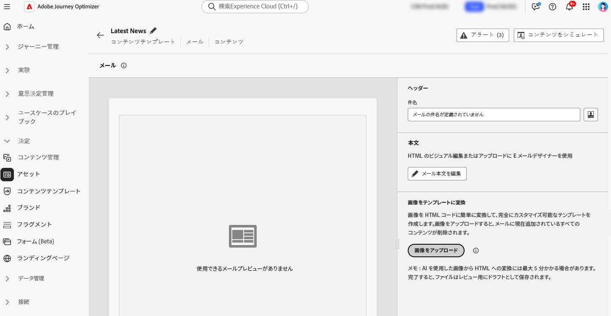
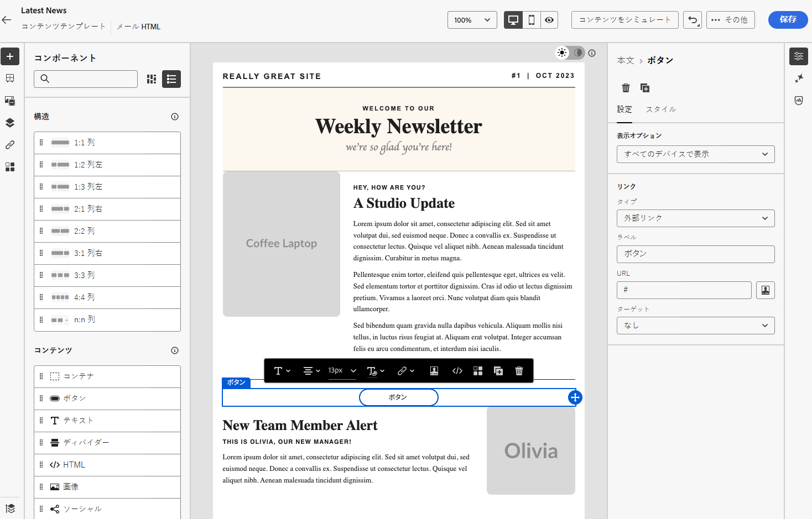

# 画像からHTMLへのコンバーターを使用して、画像をHTML テンプレートに変換する {#image-to-html}

>[!AVAILABILITY]
>
>この機能は、限定提供です。アクセス権を取得するには、アドビ担当者にお問い合わせください。

## 概要 {#overview}

画像からHTMLへのコンバーターは、**コンテンツテンプレート** メニューで利用できる革新的な AI を利用した機能で、静的な画像のデザインを完全にカスタマイズ可能なHTML メールコンテンツテンプレートに変換することで、メールの作成を大幅に高速化します。 このツールを使用すると、マーケターはグラフィックデザイナーやデザインツールのビジュアルデザインを、レスポンシブで編集可能なメールテンプレートに変換できます。このテンプレートをコンテンツテンプレートライブラリに保存して、複数のジャーニーやキャンペーンで再利用できます。

Image to HTML コンバーターは、ジェネレーティブ AI テクノロジーを活用して、画像内のレイアウト、タイポグラフィ、カラー、視覚要素を分析し、クリーンで構造化されたHTML コードを生成します。このコードは、デザインの忠実性を維持しながら、電子メールDesignerとの完全な編集可能性と互換性を確保します。

**主なメリット：**

* **オーサリングの高速化**：デザインモックアップを再利用可能なコンテンツテンプレートに即座に変換することで、メールの作成時間を短縮します
* **Designer-developer ブリッジ**：視覚的なデザインを扱う際に、HTMLで手動コーディングを行う必要がなくなります
* **デザインの忠実性**：編集可能なコンテンツを作成する際に、元のデザインの整合性を維持する
* **再利用性**：複数のジャーニーやキャンペーンで使用するために、テンプレートをコンテンツテンプレート ライブラリに保存する
* **メール互換性**：メールDesignerおよびメールクライアント全体とシームレスに連携するHTMLを生成します

## 前提条件 {#prerequisites}

画像をHTML コンバーターに変換する前に、次のことを確認します。

* メールDesignerを使用したAdobe Journey Optimizerへのアクセス
* メールデザインを含むJPEGまたは PNG 形式の画像ファイル
* 画像/HTML コンバーター機能への限定提供アクセス（Adobe担当者にお問い合わせください）

>[!NOTE]
>
>最適な結果を得るには、クリアな視覚要素と読みやすいテキストを含む高品質の画像を使用します。 標準的なメールサイズに一致させるには、幅 600～800 ピクセルが理想的です。

## 画像のHTML テンプレートへの変換 {#convert-image}

画像デザインを完全にカスタマイズ可能なHTML電子メールテンプレートに変換するには、次の手順に従います。

1. 左側のメニューから **[!UICONTROL コンテンツ管理]**/**[!UICONTROL コンテンツテンプレート]** を選択して、コンテンツテンプレートリストにアクセスします。

1. **[!UICONTROL テンプレートを作成]** をクリックします。

1. テンプレートの詳細を入力し、チャネルとして **[!UICONTROL メール]** を選択し、**[!UICONTROL 作成]** をクリックします。

1. 右側のセクションの「**[!UICONTROL 画像をテンプレートに変換]**」セクションで **[!UICONTROL 画像をアップロード]** ボタンをクリックして、画像ファイルを選択します。

   

   >[!CAUTION]
   >
   >変換用に画像をアップロードすると、**現在メールに追加されているすべてのコンテンツが削除され** 生成されたテンプレートに置き換えられます。 メールに既存のコンテンツがある場合は、必ず保存してから画像の変換を進めてください。

1. 画像を選択し、**[!UICONTROL 開く]** をクリックして、AI を利用した変換プロセスを開始します。

   >[!NOTE]
   >
   >生成プロセスには、画像デザインの複雑さとサイズに応じて最大 5 分かかる場合があります。 AI の処理はバックグラウンドで行われるので、変換処理中に、この画面から移動して他のタスクを実行できます。 画面を開いたままにしておく必要はありません。

1. 変換が完了すると、コンテンツテンプレートは自動的にドラフトとして保存されます。 その後、生成されたHTML テンプレートをメールDesignerキャンバスで確認し、編集できます。

   

1. 変換されたテンプレートが、すべての編集機能を備えたメールDesignerで開きます。 次が可能になりました。

   * テキストコンテンツの編集とパーソナライゼーションの適用
   * 画像の変更とリンクの追加
   * カラー、フォント、スタイル設定の調整
   * コンテンツコンポーネントの追加、削除、並べ替え
   * 他のテンプレートと同様に、すべてのメールDesigner機能を活用します

   

1. テンプレートを調整し、ブランドガイドラインに合わせるために、必要な調整を行います。

1. テンプレートに問題がなければ、「**[!UICONTROL 保存]**」をクリックして、コンテンツテンプレートを保存します。

1. テンプレートがコンテンツテンプレートライブラリで使用できるようになり、ジャーニーやキャンペーンでメールを作成する際に使用できます。 [詳しくは、コンテンツテンプレートの使用方法を参照してください。](use-email-templates.md)

## 変換後のテンプレートをメールで使用 {#use-template}

コンテンツテンプレートを作成して保存すると、ジャーニーやキャンペーンでメールをデザインする際に使用できます。

ジャーニーまたはキャンペーンでメールを作成する際に、**[!UICONTROL コンテンツを編集]** 画面からメールDesignerにアクセスします。

[&#x200B; メールテンプレートの操作 &#x200B;](use-email-templates.md) および [&#x200B; コンテンツテンプレートの作成 &#x200B;](../content-management/content-templates.md) について説明します。

## ベストプラクティス {#best-practices}

画像からHTMLへのコンバーターを使用する際に最適な結果を得るには、次の推奨事項に従います。

**事前準備**

* **既存のコンテンツを保存**：画像をHTMLに変換すると、メール内の既存のコンテンツがすべて置き換えられます。 この機能を使用する前に、必ず現在の作業を保存してください。
* **ワークフローの計画**：メール作成プロセスの開始時に画像をHTML コンバーターに変換するか、現在のすべてのコンテンツを置き換える準備ができていることを確認します。

**画像の準備**

* **解像度**：テキストの認識と要素の検出を向上させるには、高解像度の画像（幅 1,200 ピクセル以上）を使用します
* **明確さ**：テキストがわかりやすく、視覚要素が明確に定義されていることを確認します
* **幅**：一般的なメールクライアントの要件に合わせて、標準のメール幅（600 ～ 800 px）で画像を設計します
* **ファイル形式**:JPEGまたは PNG 形式を使用します – 圧縮された画像や低画質の画像を回避します
* **完全なデザイン**：ヘッダーからフッターまで、完全なメールデザインを 1 つの画像に含めます

**設計上の考慮事項**

* **シンプルなレイアウト**：シンプルで適切に構造化されたレイアウトは、非常に複雑なデザインよりも正確に変換されます
* **標準要素**：一般的なメールデザインパターン（ヘッダー、本文セクション、CTA、フッター）を使用します
* **テキストの読みやすさ**：テキストと背景の十分なコントラストを確保します
* **web セーフフォント**：一般的な web セーフフォントを使用したデザインの方が忠実度が高くなります
* **要素の重なりを避ける**：構造を認識しやすくするために、デザイン要素を明確に分離します

**変換後**

* **ドラフトのレビュー**：変換が完了すると、テンプレートは自動的にドラフトとして保存されます。 時間をかけて、生成されるHTMLを正確に慎重に確認します
* **徹底的にテスト**：様々なメールクライアントおよびデバイスでメールをテストします
* **手動で調整**：メールDesignerの完全な編集機能を使用して、必要に応じて調整を行います
* **ブランドの整合性**：カラー、フォント、スタイルがブランドガイドラインと一致することを確認します
* **Personalization**：必要に応じて、動的コンテンツおよびパーソナライゼーショントークンを追加します
* **アクセシビリティ**：必要に応じて、アクセシビリティ機能を確認および強化します

## 制限事項と考慮事項 {#limitations}

Image to HTML コンバーターを使用する場合は、次の制限事項に注意してください。

* **AI 解釈**:AI は、画像の視覚的解釈に基づいてHTMLを生成します。 複雑なデザインや異常なデザインの場合は、変換後に手動での調整が必要になる場合があります。

* **テキストの正確性**:AI がテキストを正確に認識および再生しようとするとき、常にテキストコンテンツを検証し、必要に応じて修正を行います。

* **動的コンテンツ**：変換プロセスは、画像に基づいて静的HTMLを作成します。 コンバージョン後に、パーソナライゼーション、動的コンテンツ、トラッキングを手動で追加する必要があります。

* **複雑なレイアウト**：複雑なレイヤー、異常な形状、非標準の要素を含む非常に複雑なデザインは、完全に変換されない場合があります。 シンプルなデザインは通常、より良い結果をもたらします。

* **処理時間**：画像の複雑さとサイズによっては、変換プロセスに最大 5 分かかる場合があります。 AI 処理はバックグラウンドで行われるので、画面を開いたままにすることなく他のタスクを実行できます。 変換が完了すると、テンプレートは自動的にドラフトとして保存されます。

* **限定提供**：限定提供機能として、HTML コンバーターの画像は継続的に改善されています。 機能と精度は異なる場合があり、フィードバックは機能の強化に役立ちます。

>[!NOTE]
>
>画像からHTMLへのコンバーターは、メール作成の強力な出発点となるよう設計されています。 生成されたHTMLは、メールDesignerを使用して確認および調整し、正確な要件を満たしていることを確認する必要があります。

## よくある質問 {#faq}

+++画像をHTML コンバーターに使用すると、既存のメールコンテンツはどうなりますか？

画像を変換用にアップロードすると、メール内の既存のコンテンツはすべて削除され、新しく生成されたテンプレートに置き換えられます。 この機能を使用する前に、重要なコンテンツを必ず保存してください。 メール作成プロセスの最初に、画像をHTML コンバーターに使用するのが最適です。

+++

+++サポートされているファイル形式は何ですか？

画像からHTMLへのコンバーターは、JPEG（.jpg、.jpeg）および PNG （.png）画像形式をサポートしています。

+++

+++変換プロセスにはどのくらいの時間がかかりますか？

変換には、画像デザインの複雑さとサイズに応じて、最大 5 分かかる場合があります。 AI 処理はバックグラウンドで行われるので、ユーザーは別のタスクに移動して作業できます。画面を開いたままにしておく必要はありません。 変換が完了すると、ファイルは自動的にドラフトとして保存され、レビューして編集できます。

+++

+++生成したテンプレートを編集できますか？

できます。生成されたHTML テンプレートが、すべての編集機能を備えたメールDesignerで開きます。 テキスト、画像、スタイル設定、レイアウト、構造など、テンプレートのすべての要素を変更できます。

+++

+++変換がデザインと完全に一致しない場合はどうなりますか？

AI はデザインを正確に解釈するために最善を尽くしますが、手動での絞り込みが必要になる場合があります。 メールDesignerを使用して、微調整が必要な要素を調整します。

+++

+++この機能をランディングページやその他のコンテンツタイプに使用できますか？

画像からHTMLへのコンバーターは、現在、メールテンプレート専用に設計されています。 その他のコンテンツタイプの場合は、メールDesignerで使用可能な標準のデザインオプションと読み込みオプションを使用します。

+++

+++この機能を使用するには特別な権限が必要ですか？

HTMLへの画像コンバーターは、限定提供（LA）で利用できます。 この機能を使用するには、限定提供アクセス（アクセス権を取得するには、Adobe担当者にお問い合わせください）と標準のメールDesigner権限が必要です。

+++

+++コンバージョン済みのテンプレートを複数のキャンペーンで再利用できますか？

できます。画像からHTMLへのコンバーターで作成されたテンプレートは、コンテンツテンプレートライブラリに自動的に保存されます。 ジャーニーやキャンペーンをまたいで、任意のメールでアクセスして再利用できます。 [詳細情報](../content-management/content-templates.md)

+++

## 関連トピック {#related-topics}

* [コンテンツテンプレートの基本を学ぶ](../content-management/content-templates.md)
* [コンテンツテンプレートの作成](../content-management/create-content-templates.md)
* [メールテンプレートを使用](use-email-templates.md)
* [メールデザインの基本を学ぶ](get-started-email-design.md)
* [メールコンテンツの読み込み](existing-content.md)
* [コンテンツのゼロからのデザイン](content-from-scratch.md)

