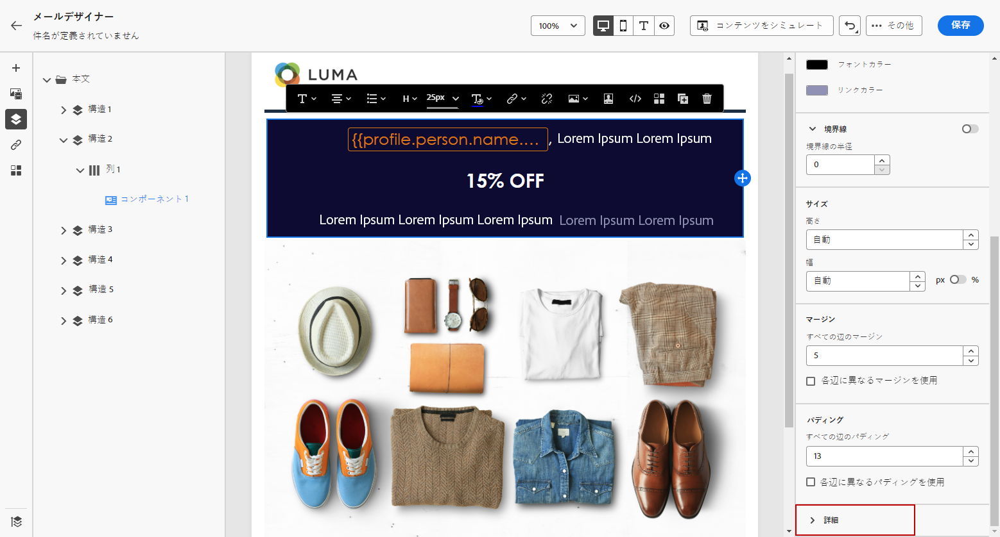
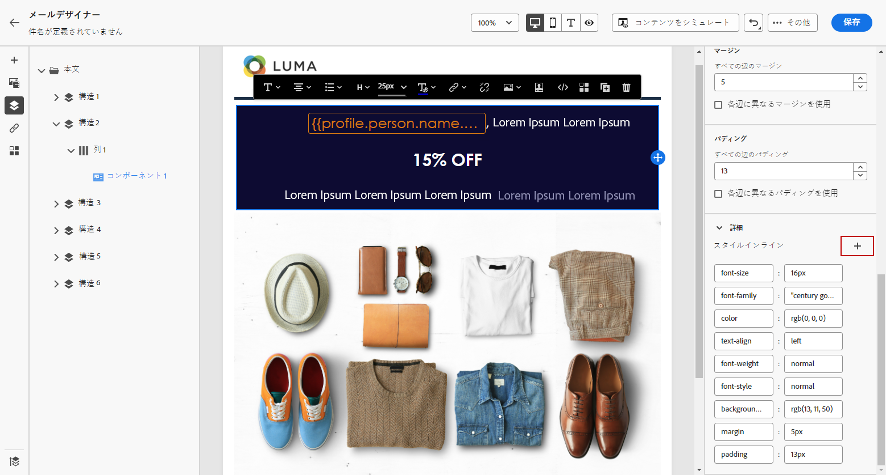

# インラインのスタイル属性の追加 {#inline-styling}

E メールデザイナーインターフェイスで要素を選択し、サイドパネルで設定を表示すると、その要素のインライン属性と属性の値をカスタマイズできます。

1. コンテンツの要素を選択します。

1. 「**[!UICONTROL スタイル]**」タブから、**[!UICONTROL 詳細]**&#x200B;ドロップダウンの下にある&#x200B;**[!UICONTROL スタイルインライン]**&#x200B;設定を検索します。

   

1. 既存の属性の値を変更するか、「**+**」ボタンを使用して新しい属性を追加します。CSS に準拠する任意の属性と値を追加できます。

   

すると、選択した要素にスタイルが適用されます。子要素に特定のスタイル設定属性が定義されていない場合、親要素のスタイル設定が継承されます。
