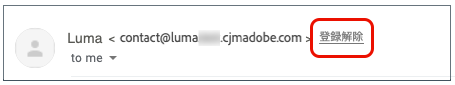
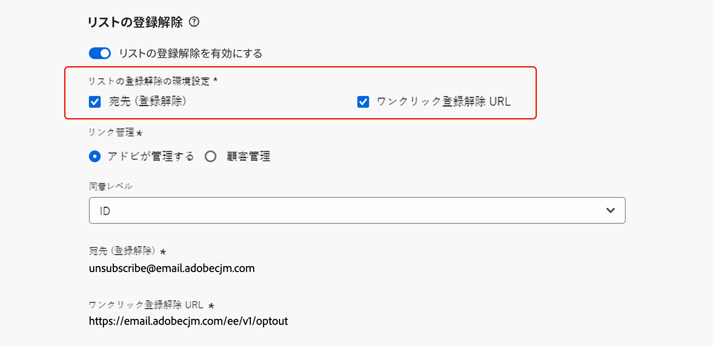
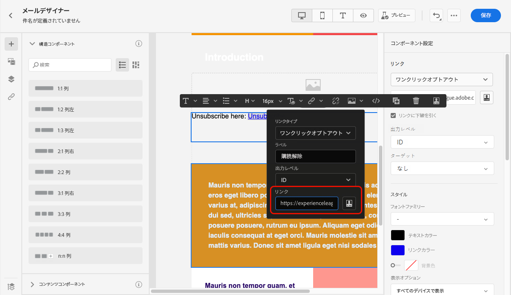
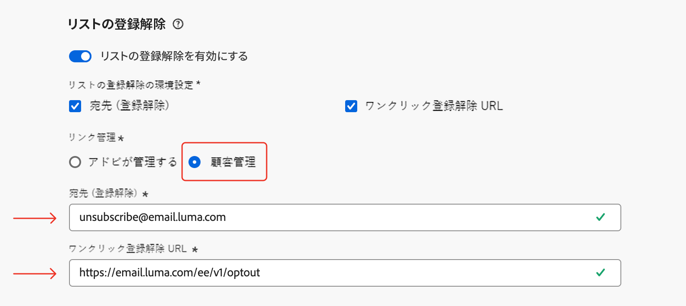

# リスト登録解除{#list-unsubscribe}

<!--Do not modify - Legal Review Done -->

ま [!DNL Adobe Journey Optimizer]、新しいメールチャネル設定を設定する際に、リストから [ サブドメインの選択 ](email-settings.md#subdomains-and-ip-pools) を行うと、「**[!UICONTROL List-Unsubscribe を有効にする]** オプションが表示されます。 これは、デフォルトで有効です。


ワンクリックリスト登録解除 URL は、メール送信者情報の横に表示される登録解除リンクまたはボタンです。受信者はワンクリックでメーリングリストから即座にオプトアウトできます。

例えば、ワンクリック購読解除 URL には、Gmail 内に次のようなリンクが表示されます。



>[!IMPORTANT]
>
>メールヘッダーにワンクリック登録解除 URL を表示するには、受信者のメールクライアントがこの機能をサポートしている必要があります。

E メールクライアントや E メール設定の購読解除設定によっては、E メールヘッダーの購読解除リンクをクリックすると、次のような影響が出ることがあります。

* **宛先（登録解除）**&#x200B;機能を有効にすると、登録解除リクエストは、設定したサブドメインに基づいてデフォルトの登録解除アドレスに送信されます。
* **ワンクリック登録解除 URL** 機能が有効になっている場合や、メール本文コンテンツに登録解除 URL を挿入した場合、受信者が、（設定したサブドメインに基づく）ワンクリック登録解除 URL をクリックすると、チャネルレベルまたは ID レベル（同意の設定方法によって異なる）で直接オプトアウトされます。

>[!NOTE]
>
>購読解除設定を管理する方法については、以下の [ この節 ](#enable-list-unsubscribe) を参照してください。

どちらの場合も、受信者がオプトアウトリンクをクリックすると、購読解除リクエストが適切に処理されます。 対応するプロファイルはすぐにオプトアウトされ、この選択は ](https://experienceleague.adobe.com/docs/experience-platform/profile/ui/user-guide.html?lang=ja#getting-started){target="_blank"}0}Experience Platform} で更新されます。[

>[!NOTE]
>
>場合によっては、ダウンストリームデータ処理が原因で、登録解除イベントがプロファイルレベルで反映されるまでに時間がかかることがあります。 システムが更新されるまでしばらく待ちます。

## リスト登録解除を有効にする {#enable-list-unsubscribe}

>[!CONTEXTUALHELP]
>id="ajo_admin_preset_unsubscribe"
>title="メールへの登録解除 URL の追加"
>abstract="このオプションを有効にすると、メールヘッダーに登録解除 URL が自動的に追加されます。また、メールのコンテンツにワンクリックオプトアウトリンクを挿入することで、メッセージに登録解除 URL を設定することもできます。"
>additional-url="https://experienceleague.adobe.com/ja/docs/journey-optimizer/using/channels/email/email-opt-out#one-click-opt-out" text="メールコンテンツからのワンクリックオプトアウトの設定"

「**[!UICONTROL List-Unsubscribe を有効にする]**」オプションが有効になっている場合、受信者のメールクライアントでサポートされている場合、メールヘッダーには、デフォルトで受信者がメーリングリストから購読解除するために使用できる mailto や URL の両方が含まれます。

>[!NOTE]
>
>このオプションを無効にした場合、メールヘッダーにワンクリック登録解除 URL は表示されません。

リスト登録解除ヘッダーには、2 つのオプションがあり、いずれかまたは両方をオフにしない限り、デフォルトでこれらのオプションが有効になります。

{width="80%"}

* **[!UICONTROL 宛先（登録解除）]** アドレス。登録解除リクエストが自動処理のためにルーティングされる宛先アドレスです。 [!DNL Journey Optimizer] の場合、登録解除のメールアドレスは、（選択したサブドメイン **** に基づいてチャネル設定に表示されるデフォルトの [ 宛先（登録解除 ](email-settings.md#subdomains) アドレスです。<!--With this method, clicking the Unsubscribe link sends a pre-filled email to the unsubscribe address specified in the email header.-->

* **[!UICONTROL ワンクリック購読解除 URL]** は、デフォルトでワンクリックオプトアウト URL により生成されるリスト購読解除ヘッダーです。リストは、[ 選択されたサブドメイン ](email-settings.md#subdomains) に基づいて作成されます。<!--With this method, clicking the Unsubscribe link directly unsubscribes the user, requiring only a single action to unsubscribe.-->

対応するドロップダウンリストから&#x200B;**[!UICONTROL 同意レベル]**&#x200B;を選択できます。チャネルまたはプロファイル ID に固有のものにすることができます。この設定に基づいて、ユーザーがメールのヘッダーにあるリスト登録解除 URL を使用して登録解除すると、[!DNL Adobe Journey Optimizer] においてチャネルレベルまたは ID レベルで同意が更新されます。

## ガードレールとレコメンデーション {#list-unsubscribe-guardrails}

ワンクリストリスト登録解除 URL 機能を使用すると、受信者はコミュニケーションから簡単にオプトアウトできます。 ただし、すべてのメールクライアントがメールヘッダーでこのリンクをサポートしているわけではないので、Adobeではメールの本文に [ ワンクリックオプトアウトリンク ](email-opt-out.md#one-click-opt-out) または [ 登録解除リンク ](email-opt-out.md#add-unsubscribe-link) を追加することをお勧めします。

**[!UICONTROL 宛先（登録解除）]**&#x200B;機能と&#x200B;**[!UICONTROL ワンクリック登録解除 URL]** 機能はオプションです。

* [メール設定](email-settings.md)で「**[!UICONTROL リスト登録解除を有効にする]**」オプションをオンにしている場合は、**宛先（登録解除）**&#x200B;と&#x200B;**ワンクリック登録解除 URL** の両方の方法を有効にすることをお勧めします。すべてのメールクライアントが HTTP メソッドをサポートしているわけではありません。宛先のリスト – 購読解除機能を使用して代わりの受信者を選択すると、送信者の評判を保護し、すべての受信者が購読解除機能を使用できるようになります。

* デフォルトで生成されるワンクリック購読解除 URL を使用しない場合は、この機能のチェックを外すことができます。

   * 「**[!UICONTROL リスト登録解除を有効にする]**」オプションがオンに切り替わり、**[!UICONTROL ワンクリック登録解除 URL]** 機能がオフになっているシナリオで、この設定を使用して作成されたメッセージに[ワンクリックオプトアウトリンク](../email/email-opt-out.md#one-click-opt-out)を追加する場合、リスト登録解除ヘッダーは、メールの本文に挿入したワンクリックオプトアウトリンクをピックアップし、それをワンクリック登録解除 URL 値として使用します。

     

   * メッセージコンテンツにワンクリックオプトアウトリンクを追加せず、チャネル設定でデフォルトの&#x200B;**[!UICONTROL ワンクリック登録解除 URL]** をオンにしていない場合、メールヘッダーにリスト登録解除ヘッダーの一部として URL が渡されることはありません。

  >[!NOTE]
  >
  >メッセージ内での購読解除機能の管理について詳しくは、[ この節 ](../email/email-opt-out.md#unsubscribe-header) を参照してください。

[!DNL Journey Optimizer] では、同意は Experience Platform [同意スキーマ](https://experienceleague.adobe.com/docs/experience-platform/xdm/field-groups/profile/consents.html?lang=ja){target="_blank"}で処理されます。デフォルトでは同意フィールドの値は空で、通信内容の受信に同意したものとして扱われます。このデフォルト値は、リストに記載されている値の 1 つにオンボーディングする際に [ ここ ](https://experienceleague.adobe.com/docs/experience-platform/xdm/data-types/consents.html?lang=ja#choice-values){target="_blank"} して変更したり、[ 同意ポリシー ](../action/consent.md) を使用してデフォルトロジックを上書きしたりできます。

現在、[!DNL Journey Optimizer] は、リストの購読解除機能によってトリガーされる購読解除イベントに、特定のタグを追加しません。 リストの登録解除クリックを他の登録解除アクションと区別する必要がある場合は、外部でカスタムタグ付けを実装するか、トラッキング用に外部ランディングページを活用する必要があります。

## 外部での登録解除データ管理 {#custom-managed}

>[!CONTEXTUALHELP]
>id="ajo_email_config_unsubscribe_custom"
>title="登録解除データの管理方法の定義"
>abstract="**アドビが管理**：同意データは、アドビシステム内でユーザーによって管理されます。<br>**顧客管理**：同意データは、外部システムでユーザーによって管理されます。ユーザーが開始しない限り、アドビシステムで同意データの同期は更新されません。"

>[!CONTEXTUALHELP]
>id="ajo_email_config_unsubscribe_custom_url"
>title="独自のワンクリック登録解除 URL の入力"
>abstract="**ワンクリック登録解除 URL** では、POST リクエストメソッドを使用する必要があります。"

アドビの外部で同意を管理している場合は、「**[!UICONTROL 顧客管理]**」オプションを選択して、カスタムの登録解除メールアドレスと独自のワンクリック登録解除 URL を入力します。

{width="80%"}

**[!UICONTROL ワンクリック登録解除 URL]** は、POST URL にする必要があります。

>[!WARNING]
>
>「**[!UICONTROL 顧客管理]**」オプションを使用している場合、アドビでは登録解除データや同意データを保存しません。「**[!UICONTROL 顧客管理]**」オプションを選択した場合、組織は外部システムを使用することを選択し、そのような外部システムで同意データを管理する責任があります。外部システムと [!DNL Journey Optimizer] の間で同意データの自動同期は行われません。[!DNL Journey Optimizer] のユーザー同意データを更新することを目的に、外部システムから行われる同意データの同期は、組織がデータ転送として開始し、同意データを [!DNL Journey Optimizer] にプッシュバックする必要があります。

### 復号化 API の設定 {#configure-decrypt-api}

**[!UICONTROL 顧客管理]** オプションを選択した状態で、カスタムエンドポイントを入力してキャンペーンやジャーニーで使用する場合、受信者が登録解除リンクをクリックす [!DNL Journey Optimizer] と <!--sent to the custom endpoint -->、同意更新イベントにデフォルトのプロファイル固有のパラメーターが追加されます。

これらのパラメーターは、暗号化された形式でエンドポイントに送信されます。したがって、外部の同意システムは、アドビから送信されたパラメーターを復号化することを目的に、[Adobe Developer](https://developer.adobe.com){target="_blank"} を通じて特定の API を実装する必要があります。

これらのパラメーターを取得する GET 呼び出しは、使用しているリスト登録解除オプション（**[!UICONTROL ワンクリック登録解除 URL]** または&#x200B;**[!UICONTROL 宛先（登録解除）]**）によって異なります。

<!--To configure the API to send back the information to [!DNL Adobe Journey Optimizer] when a recipient has unsubscribed using the List unsubscribe option with custom endpoints, follow the steps below.-->

+++ ワンクリック登録解除 URL

「**[!UICONTROL ワンクリック登録解除 URL]**」オプションを使用して、登録解除リンクをクリックすると、ユーザーは直接登録解除されます。

GET 呼び出しは次のとおりです。

エンドポイント：https://platform.adobe.io/journey/imp/consent/decrypt

クエリパラメーター：

* **params**：暗号化されたペイロードが格納されています
* **pid**：暗号化されたプロファイル ID

これら 2 つのパラメーターは、カスタムエンドポイントに送信される同意更新イベントに含まれます。

ヘッダー要件：

* x-api-key
* x-gw-ims-org-id
* 認証（技術アカウントからのユーザートークン）

サンプルパラメーターと同意応答を次に示します。

| クエリーパラメーター | サンプルペイロード |
|---------|----------|
| pid | {<br>&quot;pid&quot; : &quot;5142733041546020095851529937068211571&quot;,<br>&quot;pns&quot; : &quot;CRMID&quot;,<br>&quot;e&quot;    : &quot;john@google.com&quot;,<br>&quot;ens&quot; : &quot;Email&quot;,<br>} |
| params | {<br>&quot;m&quot; : &quot;messageExecutionId&quot;,<br>&quot;ci&quot; : &quot;campaignId&quot;,<br>&quot;jv&quot; : &quot;journeyVersionId&quot;,<br>&quot;ja&quot; : &quot;journeyActionId&quot;,<br>&quot;s&quot; : &quot;sandboxId&quot;,<br>&quot;us&quot; : &quot;unsubscribeScope&quot;<br>} |

同意応答：

```
{
    "profileNameSpace": " CRMID ",
    "profileId": "5142733041546020095851529937068211571",
    "emailAddress": "john@google.com",
    "emailNameSpace": "Email",
    "sandboxId": "sandboxId",
    "optOutLevel": "channel",
    "channelType": "email",
    "timestamp": "2024-11-26T14:25:09.316930Z"
}
```

+++

+++ 宛先（登録解除）

「**[!UICONTROL 宛先（登録解除）]**」オプションを使用して、登録解除リンクをクリックすると、事前に入力されたメールが、指定された登録解除アドレスに送信されます。

GET 呼び出しは次のとおりです。

エンドポイント：https://platform.adobe.io/journey/imp/consent/decrypt

クエリパラメーター：

* **emailParams**：**params**（暗号化されたペイロード）と **pid**（暗号化されたプロファイル ID）パラメーターを含む文字列。

**params** および **pid** パラメーターは、カスタムエンドポイントに送信される同意更新イベントに含まれます。

ヘッダー要件：

* x-api-key
* x-gw-ims-org-id
* 認証（技術アカウントからのユーザートークン）

サンプルパラメーターと同意応答を次に示します。

| クエリーパラメーター | サンプルペイロード |
|---------|----------|
| emailParams | {<br>&quot;p&quot; : &quot;profileId&quot;,<br>&quot;pn&quot; : &quot;profileNamespace&quot;,<br>&quot;en&quot; : &quot;emailNamespace&quot;,<br>&quot;ci&quot; : &quot;campaignId&quot;,<br>&quot;jv&quot; : &quot;journeyVersionId&quot;,<br>&quot;ja&quot; : &quot;journeyActionId&quot;,<br>&quot;si&quot; : &quot;sandboxId&quot;,<br>&quot;us&quot;: &quot;unsubscribeScope&quot;<br>} |

同意応答：

```
{
    "profileNameSpace": " CRMID ",
    "profileId": "5142733041546020095851529937068211571",
    "emailAddress": "john@google.com",
    "emailNameSpace": "Email",
    "sandboxId": "sandboxId",
    "optOutLevel": "channel",
    "channelType": "email",
    "timestamp": "2024-11-26T14:25:09.316930Z"
}
```

+++
