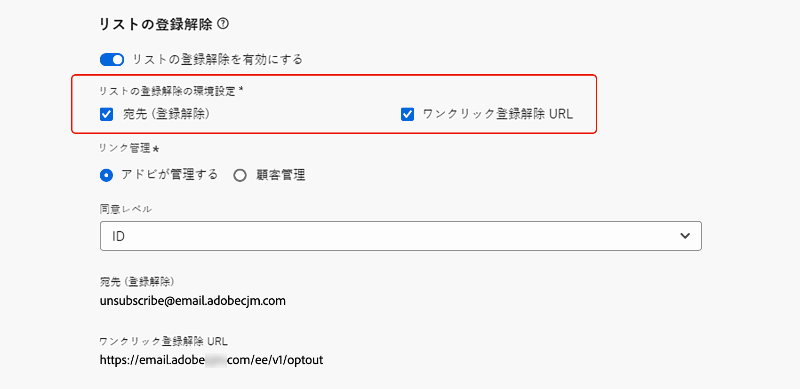

# リストの登録解除{#list-unsubscribe}

<!--Do not modify - Legal Review Done -->

新しいメールチャネルの設定で、リストから [ サブドメインの選択 ](email-settings.md#subdomains-and-ip-pools) を実行すると、「**[!UICONTROL List-Unsubscribe を有効にする]**」オプションが表示されます。

## リストの購読解除を有効にする {#enable-list-unsubscribe}

このオプションはデフォルトで有効になっており、次のようなワンクリック登録解除 URL がメールヘッダーに含まれます。

>[!NOTE]
>
>このオプションを無効にした場合、メールヘッダーにワンクリック購読解除 URL は表示されません。

リスト登録解除ヘッダーには 2 つのオプションが用意されており、いずれかのオプションまたは両方をオフにしない限り、デフォルトで有効になっています。

{width="80%"}

* **[!UICONTROL 宛先（登録解除）]**&#x200B;アドレスは、登録解除リクエストが自動処理にルーティングされる宛先アドレスです。

  [!DNL Journey Optimizer] の場合、登録解除のメールアドレスは、（選択したサブドメイン **[!UICONTROL に基づいてチャネル設定に表示されるデフォルトの [ 宛先（登録解除）]** アドレス ](#subdomains-and-ip-pools) す。<!--With this method, clicking the Unsubscribe link sends a pre-filled email to the unsubscribe address specified in the email header.-->

* **[!UICONTROL ワンクリック登録解除 URL]**：デフォルトでは、ワンクリックオプトアウト URL で生成されるリスト登録解除ヘッダーです。リスト登録解除ヘッダーは、チャネル設定で設定および指定するサブドメインに基づいています。<!--With this method, clicking the Unsubscribe link directly unsubscribes the user, requiring only a single action to unsubscribe.-->

対応するドロップダウンリストから **[!UICONTROL 同意レベル]** を選択できます。 チャネルまたはプロファイル ID に固有のものにすることができます。この設定に基づいて、ユーザーがメールのヘッダーでリスト登録解除 URL を使用して登録解除すると、チャネルレベルまたは ID レベルのいずれかで [!DNL Adobe Journey Optimizer] で同意が更新されます。

**[!UICONTROL 宛先（登録解除）]**&#x200B;機能と&#x200B;**[!UICONTROL ワンクリック登録解除 URL]** 機能はオプションです。

デフォルトで生成されたワンクリック登録解除 URL を使用しない場合は、この機能をオフにできます。「**[!UICONTROL リスト登録解除を有効にする]**」オプションがオンに切り替わり、**[!UICONTROL ワンクリック登録解除 URL]** 機能がオフになっているシナリオで、この設定を使用して作成されたメッセージに[ワンクリックオプトアウトリンク](../email/email-opt-out.md#one-click-opt-out)を追加する場合、リスト登録解除ヘッダーは、メールの本文に挿入したワンクリックオプトアウトリンクをピックアップし、それをワンクリック登録解除 URL 値として使用します。

>[!NOTE]
>
>メッセージコンテンツにワンクリックオプトアウトリンクを追加せず、チャネル設定でデフォルトの&#x200B;**[!UICONTROL ワンクリック登録解除 URL]** をオンにしていない場合、メールヘッダーにリスト登録解除ヘッダーの一部として URL が渡されることはありません。

メッセージ内での購読解除機能の管理について詳しくは、[ この節 ](../email/email-opt-out.md#unsubscribe-header) を参照してください。

## 登録解除データを外部で管理 {#custom-managed}

>[!CONTEXTUALHELP]
>id="ajo_email_config_unsubscribe_custom"
>title="購読解除データの管理方法を定義"
>abstract="**Adobe管理**：同意データは、Adobe システム内でユーザーによって管理されます。 **顧客管理**：同意データは外部システムでユーザーによって管理され、ユーザーによって開始されない限り、同意データの同期はAdobe システムで更新されません。"

>[!AVAILABILITY]
>
>この機能は、少数の顧客向けに限定提供（LA）でリリースされています。

Adobe以外で同意を管理している場合は、「**[!UICONTROL 顧客管理]**」オプションを選択して、カスタム購読解除メールアドレスと独自のワンクリック購読解除 URL を入力します。

{width="80%"}

>[!WARNING]
>
>**[!UICONTROL 顧客が管理]** オプションを使用している場合、Adobeには、登録解除データや同意データは保存されません。 **[!UICONTROL 顧客が管理]** オプションを使用すると、組織は外部システムの使用を選択し、そのような外部システムで同意データを管理する責任を負います。 外部システムと [!DNL Journey Optimizer] の間では、同意データの自動同期はありません。 [!DNL Journey Optimizer] でユーザーの同意データを更新するために外部システムから提供される同意データの同期は、同意データを [!DNL Journey Optimizer] にプッシュし直すデータ転送として、組織が開始する必要があります。

## 復号化 API の設定 {#configure-decrypt-api}

**[!UICONTROL 顧客管理]** オプションを選択した状態で、カスタムエンドポイントを入力してキャンペーンやジャーニーで使用する場合、受信者が登録解除リンクをクリックす [!DNL Journey Optimizer] と、同意更新イベントにデフォルトのプロファイル固有のパラメーターが追加されます <!--sent to the custom endpoint -->。

これらのパラメーターは、暗号化された方法でエンドポイントに送信されます。 したがって、外部同意システムでは、Adobeから送信されるパラメーターを復号化するために ](https://developer.adobe.com){target="_blank"}0}Adobe Developer} を介して特定の API を実装する必要があります。[

これらのパラメーターを取得するGET呼び出しは、使用しているリスト登録解除オプション **[!UICONTROL ワンクリック登録解除 URL]** または **[!UICONTROL 宛先（登録解除）]** によって異なります。

<!--To configure the API to send back the information to [!DNL Adobe Journey Optimizer] when a recipient has unsubscribed using the List unsubscribe option with custom endpoints, follow the steps below.-->

+++ ワンクリック購読解除 URL

**[!UICONTROL ワンクリック登録解除 URL]** オプションを使用して、登録解除リンクをクリックすると、ユーザーの登録が直接解除されます。

GETの呼び出しは次のとおりです。

エンドポイント：https://platform.adobe.io/journey/imp/consent/decrypt

クエリパラメーター：

* **params**：暗号化されたペイロードが格納されています
* **pid**：暗号化されたプロファイル ID

これら 2 つのパラメーターは、カスタムエンドポイントに送信される同意更新イベントに含まれます。

ヘッダー要件：

* x-api-key
* x-gw-ims-org-id
* 認証（技術アカウントからのユーザートークン） 

+++

+++ 宛先（購読解除）

**[!UICONTROL 宛先（登録解除）]** オプションを使用して、登録解除リンクをクリックすると、事前入力済みのメールが指定した登録解除アドレスに送信されます。

GETの呼び出しは次のとおりです。

エンドポイント：https://platform.adobe.io/journey/imp/consent/decrypt

クエリパラメーター：

* **emailParams**:**params** （暗号化されたペイロード）と **pid** （暗号化されたプロファイル ID）のパラメーターを含む文字列。

**params** パラメーターと **pid** パラメーターは、カスタムエンドポイントに送信される同意更新イベントに含まれます。

ヘッダー要件：

* x-api-key
* x-gw-ims-org-id
* 認証（技術アカウントからのユーザートークン） 

+++
