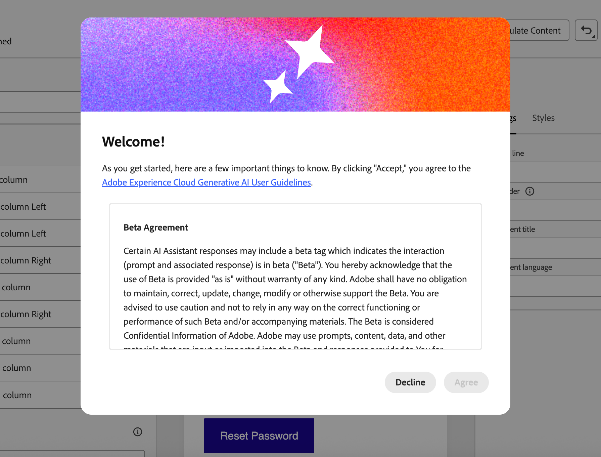

# AI インボックス用のメールの最適化 {#email-text-optimizer}

>[!BEGINSHADEBOX]

**このページでは、**&#x200B;電子メール Designerで専用の電子メールを生成および調整する方法を説明します。これにより、AIを活用した受信トレイ クライアントが、オファーやCTAで要約と回答を基に電子メールを作成できるようになります。

>[!ENDSHADEBOX]

[!DNL Adobe Journey Optimizer]には、AIを活用した受信トレイのエクスペリエンスを向上させるために、特定のバージョンのメッセージを作成できるメールチャネル機能が搭載されています（[!DNL Gmail]の[!DNL Apple Intelligence]や[!DNL Google Gemini]など）。これにより、より正確に質問に答え、コンテンツに基づいてメールを要約して、より良い結果を得ることができます。

この機能を利用することで、メッセージの専用バージョンを生成して改善できるので、AIを活用した受信トレイのエクスペリエンスでは、自動生成されたテキストや無関係なコンテキストではなく、オファー、CTA、詳細が表示される可能性が高まります。

<!--
>[!NOTE]
>
>This optimized for AI inboxes text version is not the same as the default or custom plain text version of your messages. [Learn more](text-version-email.md)
-->

## 仕組み {#how-it-works}

受信者がAIを利用した受信トレイで尋ねる一般的な質問は、*このメールの内容*&#x200B;です。 または&#x200B;*これらのオファーは何ですか？*

* これらのAI アシスタントが提供する回答は、短い要約です（例えば、メッセージがプロモーションであること、VIPへの早期アクセスとセールに言及していること、商品カテゴリへのリンクが含まれているなど）。 しかし、アシスタントが効果的に表示されるテキストから推測しているため、マーケターが気にかけていた目標は省略されています。必ずしも、意図したストーリー全体を把握しているわけではありません。

* また、アシスタントは企業に関連する割引やクーポンを積極的に検索し、それを回答に組み込むため、利用者はメッセージが実際に約束したことだけを見る必要がなくなります。 この行動は、エンドユーザーにとっては有用ですが、送信時に実際の条件を追跡するための回答を必要とするマーケターの制御を希薄化します。

これらの問題を回避するために、[!DNL Journey Optimizer]はメッセージの特定のバージョンを追加して、クーポン、割引範囲、コールトゥアクション、その他の優先事項が明確な線形コピーで前面に表示されるようにします。<!--This version is different from the HTML view and default or custom plain text version of your messages.-->

その目的は、受信トレイ AIを利用して、定義されたオファーやアクションの要約とQ&amp;Aを実施することです。これは、デフォルトの薄いテキスト部分や、関連のないweb サイトの結果に依存するのではなく可能です。

>[!IMPORTANT]
>
>AI アシスタントの正確な行動は、受信トレイのプロバイダーとモデルのバージョンによって異なります。 電子メールが配信された後、外部AI クライアントが提供する回答や要約は、間違っていたり、不完全であったり、web結果と混在したりする可能性があります。
>
>「AI受信トレイ用にメールを最適化」機能は、Journey Optimizerで専用バージョンを生成するだけです。サードパーティアシスタントがメッセージをどのように解釈または表示するかを保証するものではありません。 サードパーティの受信トレイ AIの[制限とリスクについて詳しくは、こちらを参照してください](#inbox-ai-risks)。

## 推奨ユースケース {#use-cases}

<!--
* **Critical details only in images** — Offers, promo codes, or deadlines shown in banners or graphics are invisible in plain text. Use the optimizer (and manual edits) so the same facts appear as text, improving extraction by AI summaries and text-only clients.
-->

* **高密度または断片化されたコンテンツ** – 電子メールのコンテンツをスキャンするのが困難な場合、最適化によって、明示的なオファーとリンクを含む、より明確で直線的なストーリーを生成できます。

* **受信トレイのQ&amp;A**&#x200B;の制御 – 受信者が&#x200B;*受信者に電子メールの内容*&#x200B;または&#x200B;*オファーの内容*&#x200B;を尋ねることを期待する場合、AI バージョン用に最適化された強力なバージョンは、部分的な要約を削減し、承認済みコピーに関連付けられていないwebで補足された回答への依存を回避します。

## AIによる受信トレイへの送信を最適化する {#optimize-with-ai}

>[!IMPORTANT]
>
>この機能を使用する前に、関連する[&#x200B; リスクと制限事項](#inbox-ai-risks)をお読みください。
>
>この機能にアクセスするには、[!DNL Journey Optimizer]で生成AIを初めて使用する場合に表示される使用許諾契約書に同意する必要があります。 詳しくは、[Adobe Experience Cloud生成AI ユーザーガイドライン &#x200B;](https://www.adobe.com/jp/legal/licenses-terms/adobe-gen-ai-user-guidelines.html){target="_blank"}を参照してください。

[!DNL Journey Optimizer]でのAI インボックス エクスペリエンス用にメールのコンテンツを最適化するには、次の手順に従います。

1. [電子メール Designer](content-from-scratch.md)で電子メールを開きます（ワークフローに応じて、キャンペーン、ジャーニー、またはテンプレートから）。

1. AIによる読み取りと要約の主要な情報を強調表示する改善バージョンを生成するには、**[!UICONTROL AI インボックス用に最適化]** ボタンをクリックします。

   {zoomable="yes" width="80%"}

1. [!DNL Journey Optimizer]で生成AIを初めて使用する場合は、使用許諾契約書に同意するよう求められます。 詳しくは、[Adobe生成AI ユーザーガイドライン &#x200B;](https://www.adobe.com/jp/legal/licenses-terms/adobe-gen-ai-user-guidelines.html){target="_blank"}を参照してください。

   Journey Optimizerの{width=50%}

   「**[!UICONTROL 同意]**」をクリックして続行します。

1. 生成されたバージョンは、**[!UICONTROL AI インボックス オプティマイザー]** ウィンドウに表示されます。

   {zoomable="yes" width="80%"}

   >[!NOTE]
   >
   >最適化されたバージョンは、メールのHTMLやテキストビューとは異なります。 デザイン、レイアウト、画像は変更されません。

1. 自動的に生成されたコンテンツを編集するには、**[!UICONTROL 編集を有効にする]** トグルを選択し、必要に応じて手動で変更します。

1. バージョンに問題がなければ、「**[!UICONTROL メールを最適化]**」ボタンをクリックして確認します。 **[!UICONTROL 再最適化]** ボタンを使用して、新しいバージョンを生成することもできます。

1. **[!UICONTROL HTML]** ビューにリダイレクトされ、メールはAI受信箱に対して正常に最適化されました。 再度アクセスするか、最適化バージョンを編集するには、**[!UICONTROL AI インボックス用に最適化]** ボタンをクリックします。

   {zoomable="yes" width="80%"}

1. 最適化バージョンが表示されます。 **[!UICONTROL 最適化を削除]**&#x200B;するか、**[!UICONTROL 最適化を再最適化]**&#x200B;して新しいバージョンを生成します。

   {zoomable="yes" width="80%"}

   >[!NOTE]
   >
   >元のHTML コンテンツに変更を加えた場合は、生成されたAI受信箱のバージョンを新しいコンテンツと一致するように再最適化する必要があります。

## サードパーティの受信トレイ AIのリスクと制限 {#inbox-ai-risks}

AI インボックス用メールの最適化機能を使用すると、メールプロバイダーが[!DNL Journey Optimizer]の送信を処理する方法について、メールのバージョンを準備できます。 それらの業者の商品を管理することはありません。 メッセージが配信されると、[!DNL Gmail]、[!DNL Apple] Mail、[!DNL Outlook]またはその他のクライアントのAI機能は、Adobeではなく、それぞれの条件、モデル、ポリシーに従って動作します。

* **予測不可能なプレゼンテーション** – 概要、通知の詳細、会話形式の回答により、オファーの省略、価格や日付の誤り、関連のないweb結果とのコンテンツの結合、承認済みコピーとの一致を失う言い換えなどが発生する可能性があります。 この動作は、ベンダーがモデルまたはUIを予告なく更新すると変更される可能性があります。

* **HTMLと同等の保証はありません** — プレビューまたはアシスタントの回答に依存する受信者は、HTMLの完全なデザイン、画像、または法的なフッターを見ることはできません。 彼らが信じる「メッセージ」は、AIが生成した短いダイジェストからのみ来る可能性があります。

* **プライバシー、コンプライアンス、データ使用** – 受信トレイ AIは、プロバイダーのプライバシーポリシー、保持、地域のルールに従って、プロバイダーのインフラストラクチャ上のメッセージ コンテンツを処理する場合があります。 規制が厳しい業界の企業は、電子メールの作成方法に関係なく、このような機能の受信者による使用が義務に影響するかどうかを評価する必要があります。[!DNL Journey Optimizer]

* **ブランドおよび法的な露出** – 不正確または不完全なAIによる要約でも、プロモーション、条件、オプトアウト言語に関する顧客の混乱や紛争が生じる可能性があります。 [!DNL Journey Optimizer]では、最適化されたバージョンの電子メールがサードパーティのモデルによって正確に再現されることを保証しません。

* [!DNL Journey Optimizer]の&#x200B;**[!UICONTROL AI インボックス用に最適化]** — メール Designerのオーサリング時間コントロールは、エンドユーザーのインボックス アシスタントとは別になっています。 送信前に生成されたコンテンツを必ず確認する。

## 関連トピック {#related-topics}

* [メールデザインの基本を学ぶ](get-started-email-design.md)
* Adobeの生成機能について詳しくは、[AI アシスタントの基本を学んでコンテンツを作成する](../content-management/gs-generative.md)を参照してください。
