# リンクの追加とメッセージの追跡 {#tracking}

[!DNL Journey Optimizer] を使用すると、受信者の行動を監視するために、コンテンツにリンクを追加し送信済みメッセージをトラッキングすることができます。

## トラッキングの有効化 {#enable-tracking}

ジャーニーやキャンペーン内でメッセージを作成する際に、「**[!UICONTROL メール開封数]**」オプションや「**[!UICONTROL メールのクリック数]**」オプションをオンにすることで、メールメッセージレベルでのトラッキングを有効にすることができます。

>[!BEGINTABS]

>[!TAB ジャーニーでのトラッキングの有効化]

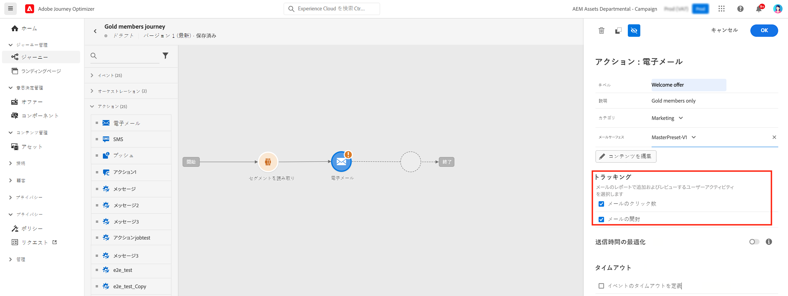

>[!TAB キャンペーンでのトラッキングの有効化]

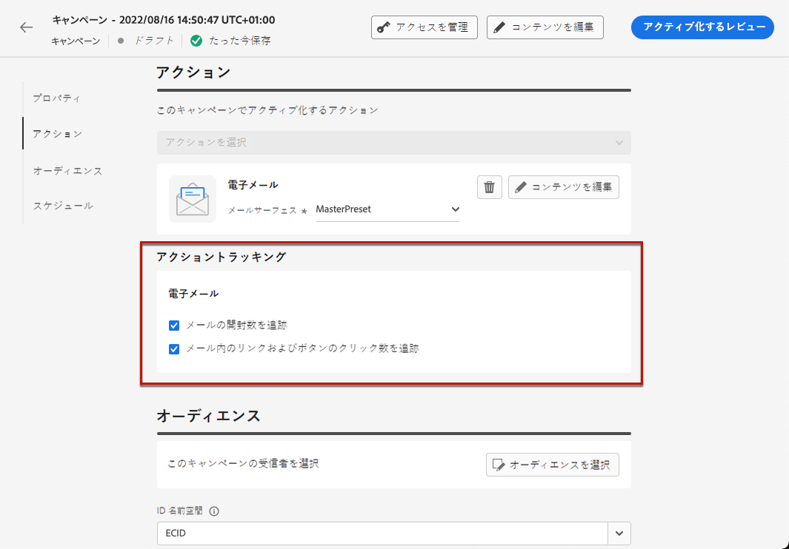

>[!ENDTABS]

>[!NOTE]
>
>デフォルトでは、両方のオプションが有効になっています。

これにより、次の方法で受信者の行動を追跡できます。

* **[!UICONTROL メール開封数]**：開封されたメッセージ。
* **[!UICONTROL メールのクリック数]**：メール内のリンクのクリック数。

## リンクの挿入 {#insert-links}

メッセージをデザインする際に、リンクをコンテンツに追加できます。

>[!NOTE]
>
>[トラッキングが有効](#enable-tracking)になっている場合、メッセージコンテンツに含まれるすべてのリンクがトラッキングされます。

メールコンテンツにリンクを挿入するには、次の手順に従います。

1. 要素を選択し、コンテキストツールバーの「**[!UICONTROL リンクを挿入]**」をクリックします。

   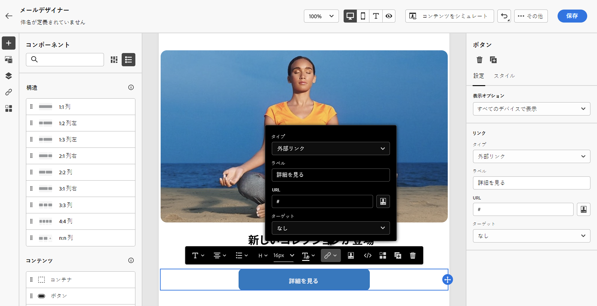

1. 作成するリンクのタイプを選択します。

   * **[!UICONTROL 外部リンク]**：外部 URL へのリンクを挿入します。

   * **[!UICONTROL ランディングページ]**：ランディングページへのリンクを挿入します。[詳細情報](../landing-pages/get-started-lp.md)

   * **[!UICONTROL ワンクリックオプトアウト]**：ユーザーがオプトアウトの確認を求められることなく、コミュニケーションを素早く登録解除できるリンクを挿入します。[詳細情報](email-opt-out.md#one-click-opt-out)

   * **[!UICONTROL 外部のオプトイン／購読]**：ブランドからのコミュニケーションの受信を同意するリンクを挿入します。

   * **[!UICONTROL 外部オプトアウト／購読解除]**：ブランドからのコミュニケーションの受信を解除するリンクを挿入します。オプトアウト管理の詳細については、[この節](email-opt-out.md#opt-out-management)を参照してください。

   * **[!UICONTROL ミラーページ]**：web ブラウザーにメールコンテンツを表示するためのリンクを追加します。[詳細情報](#mirror-page)

1. 対応するフィールドに目的の URL を入力するか、ランディングページを選択して、リンク設定とスタイルを定義します。[詳細情報](#adjust-links)

   >[!NOTE]
   >
   >URL を解釈する場合、[!DNL Journey Optimizer] は URI 構文（[RFC 3986 標準](https://datatracker.ietf.org/doc/html/rfc3986){target="_blank"}）に準拠しており、URL 内の一部の特殊な国際文字が無効になります。配達確認またはメールを送信しようとした際に、コンテンツに追加された URL に関するエラーが返された場合は、回避策として文字列を URL エンコードできます。

1. リンクをパーソナライズできます。[詳細情報](../personalization/personalization-syntax.md#perso-urls)

1. 変更を保存します。

1. リンクを作成したら、右側の&#x200B;**[!UICONTROL 設定]**&#x200B;パネルと&#x200B;**[!UICONTROL スタイル]**&#x200B;パネルから変更できます。

   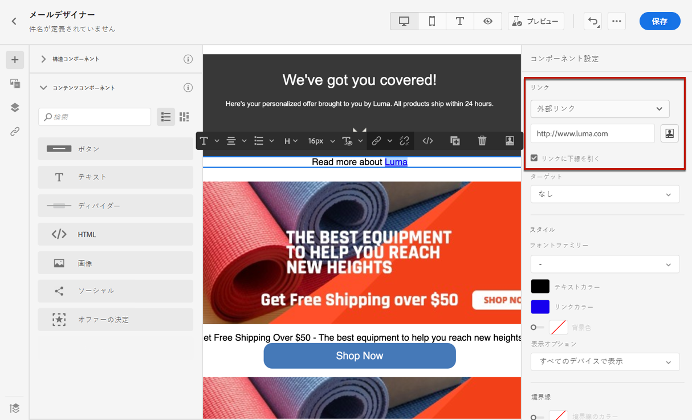

>[!NOTE]
>
>マーケティングタイプの電子メールメッセージには、[オプトアウトリンク](../privacy/opt-out.md#opt-out-management)を含める必要があります。これはトランザクションメッセージには必要ありません。メッセージカテゴリ（**[!UICONTROL マーケティング]**&#x200B;または&#x200B;**[!UICONTROL トランザクション]**）は、メッセージの作成時に[チャネル設定](../configuration/channel-surfaces.md#email-type)に定義されます。

## リンクを調整 {#adjust-links}

右側の&#x200B;**[!UICONTROL 設定]**&#x200B;パネルと&#x200B;**[!UICONTROL スタイル]**&#x200B;パネルを使用してリンクを調整できます。リンクに下線を引いたり、リンクの色を編集したり、リンクのターゲットを選択したりできます。

1. リンクが挿入された&#x200B;**[!UICONTROL テキスト]**&#x200B;コンポーネントで、リンクを選択します。

1. 「**[!UICONTROL 設定]**」タブの&#x200B;**[!UICONTROL ターゲット]**&#x200B;ドロップダウンで、オーディエンスのリダイレクト方法を選択します。

   * **[!UICONTROL なし]**：クリックしたフレームと同じフレームでリンクを開きます（デフォルト）。
   * **[!UICONTROL 空白]**：リンクを新しいウィンドウまたは新しいタブで開きます。
   * **[!UICONTROL セルフ]**：クリックしたフレームと同じフレームでリンクを開きます。
   * **[!UICONTROL 親]**：親フレームでリンクを開きます。
   * **[!UICONTROL トップ]**：ウィンドウ全体でリンクを開きます。

   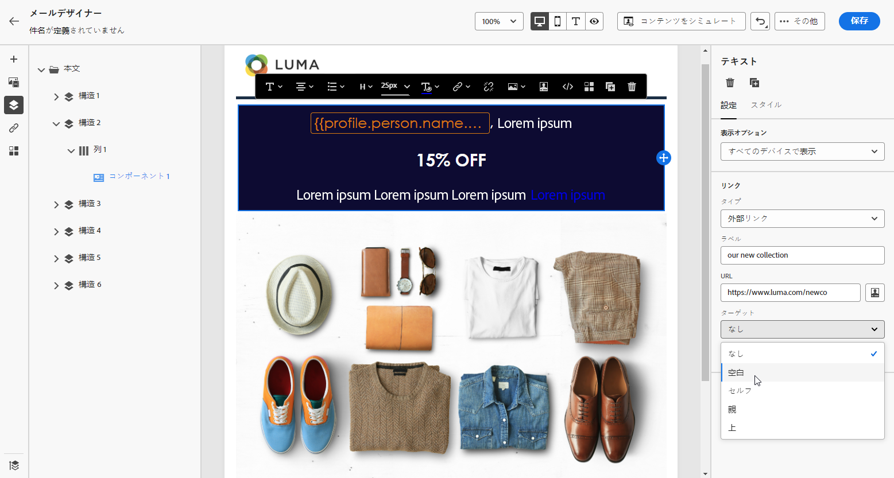

1. 「**[!UICONTROL リンクに下線を引く]**」にチェックを入れると、リンクのラベルテキストに下線を引くことができます。

   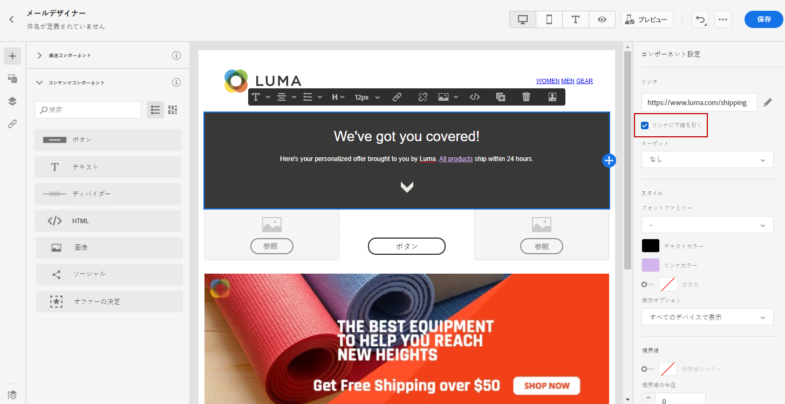

1. リンクの色を変更するには、「**[!UICONTROL スタイル]**」タブから「**[!UICONTROL リンクの色]**」をクリックします。

   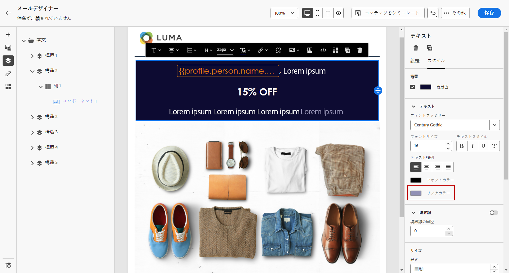

1. 変更を保存します。

## ミラーページへのリンク {#mirror-page}

ミラーページは、web ブラウザーを使用してオンラインでアクセス可能な HTML ページです。その内容はメールの内容と同じです。

メールにミラーページへのリンクを追加するには、[リンクを挿入](#insert-links)し、リンクのタイプとして「**[!UICONTROL ミラーページ]**」を選択します。

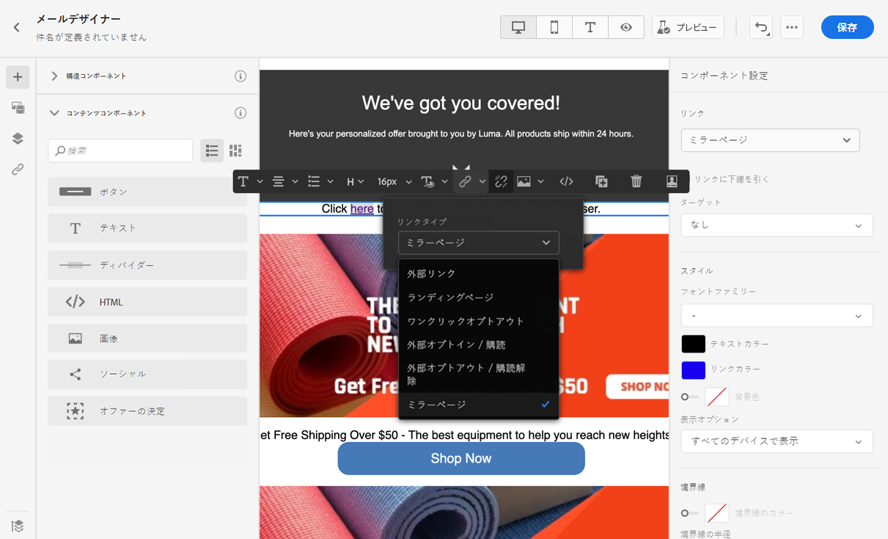

ミラーページが自動的に作成されます。

>[!IMPORTANT]
>
>ミラーページのリンクは自動生成され、編集できません。これらには、元のメールのレンダリングに必要な、暗号化されたパーソナライズされたデータがすべて含まれています。その結果、値が大きいパーソナライズ属性を使用すると、長いミラーページの URL が生成される可能性があり、URL の長さが最大長の web ブラウザーでリンクが機能しなくなる可能性があります。

メールが送信され、受信者がミラーページのリンクをクリックすると、メールの内容がデフォルトの web ブラウザーに表示されます。

>[!NOTE]
>
>テストプロファイルに送信される[配達確認](../content-management/proofs.md)では、ミラーページへのリンクはアクティブになっていません。最終的なメッセージでのみアクティブ化されます。

ミラーページの保持期間は 60 日です。この期間が経過すると、ミラーページは使用できなくなります。

## トラッキングの管理 {#manage-tracking}

[E メールデザイナー](content-from-scratch.md)を使用すると、追跡する URL を管理できます（各リンクのトラッキングタイプの編集など）。

1. 左側のペインの「**[!UICONTROL リンク]**」アイコンをクリックし、追跡するコンテンツのすべての URL のリストを表示します。

   このリストを使用すると、一元的なビューを表示したり、メールコンテンツ内の各 URL を見つけたりできます。

1. リンクを編集するには、対応する鉛筆アイコンをクリックします。

1. 必要に応じて、「**[!UICONTROL トラッキングタイプ]**」を変更できます。

   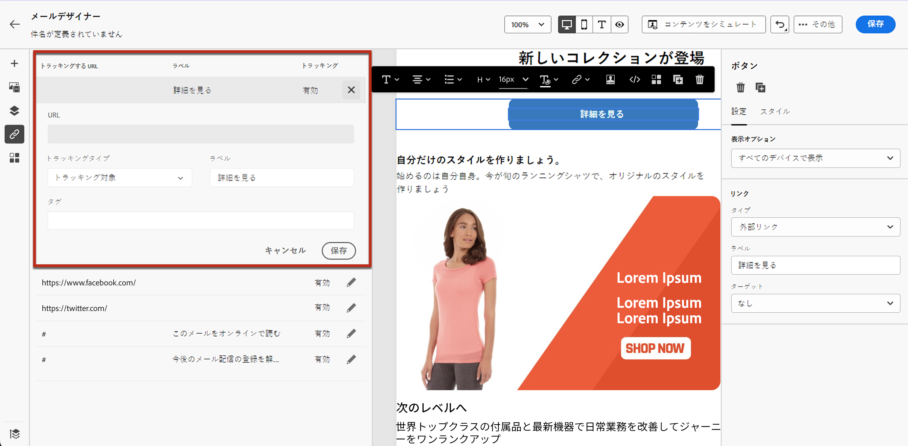

   追跡する URL ごとに、トラッキングモードを次のいずれかの値に設定できます。

   * **[!UICONTROL トラッキング対象]**：この URL のトラッキングを有効化します。
   * **[!UICONTROL オプトアウト]**：この URL をオプトアウトまたは購読解除 URL とみなします。
   * **[!UICONTROL ミラーページ]**：この URL をミラーページの URL とみなします。
   * **[!UICONTROL なし]**：この URL のトラッキングを有効化しません。

開封数とクリック数に関するレポートは、[ライブレポート](../reports/live-report.md)と[グローバルレポート](../reports/global-report.md)で利用できます。

## URL トラッキングのパーソナライズ {#url-tracking}

通常 [URL トラッキング](email-settings.md#url-tracking)は設定レベルで管理されますが、プロファイル属性はサポートされていません。現在、これを実行する唯一の方法は、E メールデザイナーで [URL をパーソナライズ](../personalization/personalization-syntax.md#perso-urls)することです。

パーソナライズした URL トラッキングパラメーターをリンクに追加するには、次の手順に従います。

1. リンクを選択し、コンテキストツールバーの「**[!UICONTROL リンクを挿入]**」をクリックします。

1. パーソナライゼーションアイコンを選択します。これは、**外部リンク**、**購読解除リンク**&#x200B;および&#x200B;**オプトアウト**&#x200B;のタイプのリンクでのみ使用できます。

   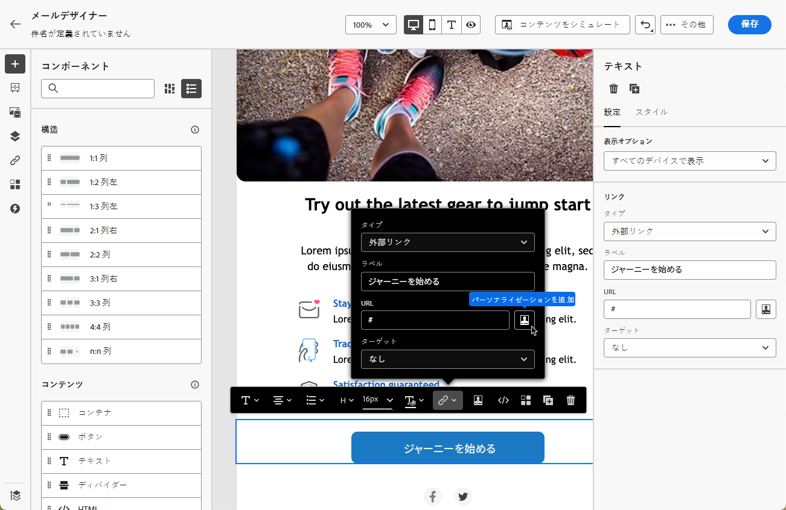

1. URL トラッキングパラメーターを追加し、パーソナライゼーションエディターから目的のプロファイル属性を選択します。

   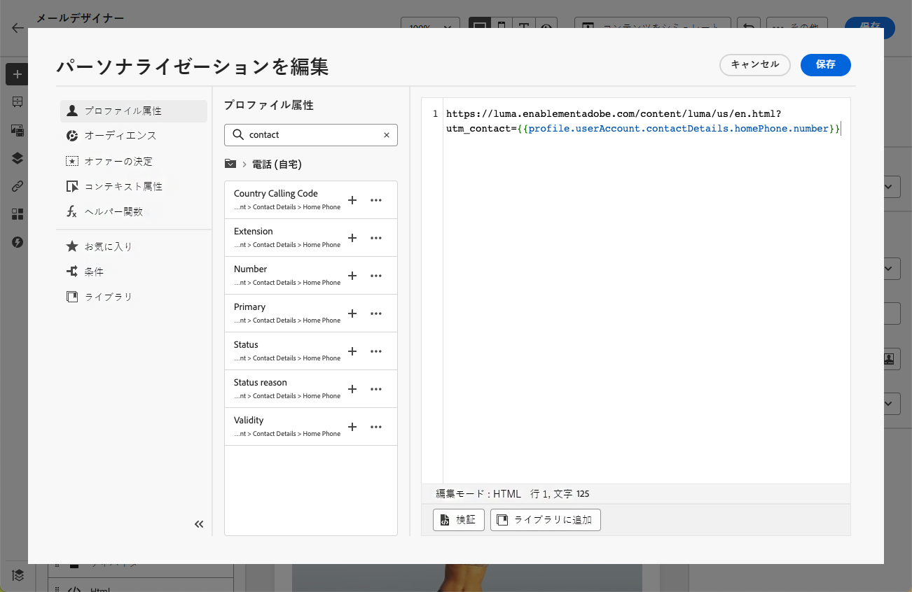

1. 変更を保存します。

1. このトラッキングパラメーターを追加する各リンクに対して、上記の手順を繰り返します。

現在は、メールを送信すると、このパラメーターが URL の末尾に自動的に追加されます。その後、このパラメーターを web 分析ツールまたはパフォーマンスレポートで取得できます。

>[!NOTE]
>
>最終的な URL を確認するには、[配達確認を送信](../content-management/preview-test.md#send-proofs)し、配達確認を受信したらメールのコンテンツにあるリンクをクリックします。URL にはトラッキングパラメーターを表示する必要があります。上記の例では、最終的な URL は次のようになります：<https://luma.enablementadobe.com/content/luma/us/en.html?utm_contact=profile.userAccount.contactDetails.homePhone.number>
