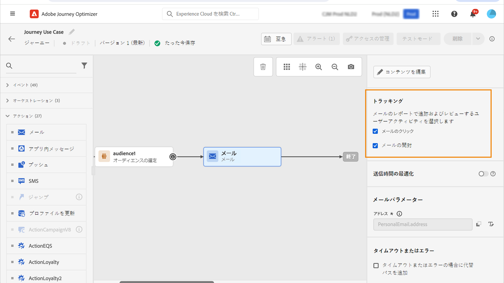
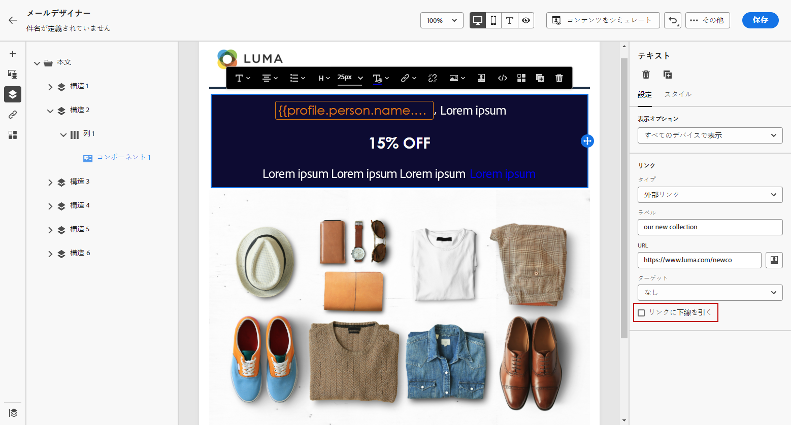

# リンクの追加とメッセージの追跡 {#tracking}

[!DNL Journey Optimizer] を使用すると、受信者の行動を監視するために、コンテンツにリンクを追加し送信済みメッセージをトラッキングすることができます。

## トラッキングの有効化 {#enable-tracking}

以下のタブに示すように、ジャーニーやキャンペーン内でメッセージを作成する際に、「**[!UICONTROL メール開封数]** や **[!UICONTROL メールのクリック数]** のオプションをオンにすることで、メールメッセージレベルでのトラッキングを有効にできます。

>[!BEGINTABS]

>[!TAB ジャーニーでのトラッキングの有効化]

>[!TAB キャンペーンでのトラッキングの有効化]

>[!ENDTABS]

>[!NOTE]
>
>デフォルトでは、両方のオプションが有効になっています。

有効にすると、これらのオプションでメッセージの受信者の動作が追跡されます。

* **[!UICONTROL メール開封数]** 指標は、開封されたメッセージの数を確認します。
* **[!UICONTROL メールのクリック数]** 指標は、メール内のリンクのクリック数を計算します。

## リンクの挿入 {#insert-links}

[トラッキングが有効](#enable-tracking)になっている場合、メッセージコンテンツに含まれるすべてのリンクがトラッキングされます。

メールコンテンツにリンクを挿入するには、次の手順に従います。

1. 要素（テキストまたは画像）を選択し、コンテキストツールバーから **[!UICONTROL リンクを挿入]** をクリックします。

   

1. 作成するリンクのタイプを選択します。

   * **[!UICONTROL 外部リンク]** を選択して、外部 URL へのリンクを挿入します。

   * 「**[!UICONTROL ランディングページ]**」を選択して、ランディングページへのリンクを挿入します。 [詳細情報](../landing-pages/get-started-lp.md)

   * 「**[!UICONTROL ワンクリックオプトアウト]**」を選択してリンクを挿入し、ユーザーがオプトアウトの確認を求められることなく、コミュニケーションを素早く購読解除できるようにします。 [詳細情報](email-opt-out.md#one-click-opt-out)

   * **[!UICONTROL 外部のオプトイン/購読]** を選択して、ブランドからのコミュニケーションの受信を同意するリンクを挿入します。

   * **[!UICONTROL 外部オプトアウト/購読解除]** を選択して、ブランドからのコミュニケーションの受信を解除するリンクを挿入します。 オプトアウト管理の詳細については、[この節](email-opt-out.md#opt-out-management)を参照してください。

   * **[!UICONTROL ミラーページ]** を選択して、メールのミラーページへのリンクを追加します。 [詳細情報](#mirror-page)

1. 対応するフィールドに目的の URL を入力するか、ランディングページを選択して、リンク設定とスタイルを定義します。[詳細情報](#adjust-links)

   >[!NOTE]
   >
   >URL を解釈する場合、[!DNL Journey Optimizer] は URI 構文（[RFC 3986 標準](https://datatracker.ietf.org/doc/html/rfc3986){target="_blank"}）に準拠しており、URL 内の一部の特殊な国際文字が無効になります。配達確認またはメールを送信しようとした際に、コンテンツに追加された URL に関するエラーが返された場合は、回避策として文字列を URL エンコードできます。

1. リンクをパーソナライズできます。[詳細情報](../personalization/personalization-syntax.md#perso-urls)

1. 変更を保存します。

1. リンクを作成したら、右側の&#x200B;**[!UICONTROL 設定]**&#x200B;パネルと&#x200B;**[!UICONTROL スタイル]**&#x200B;パネルから変更できます。

   

>[!NOTE]
>
>マーケティングタイプの電子メールメッセージには、[オプトアウトリンク](../privacy/opt-out.md#opt-out-management)を含める必要があります。これはトランザクションメッセージには必要ありません。メッセージカテゴリ（**[!UICONTROL マーケティング]**&#x200B;または&#x200B;**[!UICONTROL トランザクション]**）は、メッセージの作成時に[チャネル設定](../configuration/channel-surfaces.md#email-type)に定義されます。

## ミラーページへのリンク {#mirror-page}

ミラーページは、メールのオンラインバージョンです。 ミラーページへのリンクを追加することは、メールマーケティングのベストプラクティスです。 ユーザーは、インボックスで表示しようとした際にレンダリングの問題や壊れた画像が発生した場合などに、メールのミラーページを参照できます。アクセシビリティ上の理由から、またはソーシャル共有を促進するために、オンラインバージョンを提供することもお勧めします。

Adobe Journey Optimizerで生成されるミラーページには、すべてのパーソナライゼーションデータが含まれます。

メールにミラーページへのリンクを追加するには、[リンクを挿入](#insert-links)し、リンクのタイプとして「**[!UICONTROL ミラーページ]**」を選択します。

ミラーページが自動的に作成されます。 メールが送信され、受信者がミラーページのリンクをクリックすると、メールの内容がデフォルトの web ブラウザーに表示されます。

ミラーページの保持期間は **60 日** です。 その後は、ミラーページを使用できなくなります。

>[!CAUTION]
>
>* ミラーページのリンクは自動生成され、編集できません。これらには、元のメールのレンダリングに必要な、暗号化されたパーソナライズされたデータがすべて含まれています。その結果、値が大きいパーソナライズ属性を使用すると、長いミラーページの URL が生成される可能性があり、URL の長さが最大長の web ブラウザーでリンクが機能しなくなる可能性があります。
>
>* テストプロファイルに送信される[配達確認](../content-management/proofs.md)では、ミラーページへのリンクはアクティブになっていません。最終メッセージでのみアクティブになります。

## リンクの外観とターゲットのカスタマイズ {#adjust-links}

リンクに下線を引いたり、色を変更したり、ターゲットを選択したりするなど、リンクを調整できます。  これらの変更は、コンテンツエディターの右側のセクションにある **[!UICONTROL 設定]** パネルと **[!UICONTROL スタイル]** パネルで設定します。

### Target {#link-target}

**target** 属性は、リンクされたページを開く場所を制御するために使用されます。 アンカータグにターゲット属性を追加すると、リンクを新しいタブ、同じタブ、別のフレームのどれで開くかを指定できます。

リンクのターゲットを定義するには、次の手順に従います。

1. リンクが挿入された&#x200B;**[!UICONTROL テキスト]**&#x200B;コンポーネントで、リンクを選択します。

1. 「**[!UICONTROL 設定]**」タブで、「**[!UICONTROL ターゲット]**」ドロップダウンでリンクを開く場所を選択します。

   * **[!UICONTROL なし]**：クリックしたフレームと同じフレームでリンクを開きます（デフォルト）。
   * **[!UICONTROL 空白]**：リンクを新しいウィンドウまたは新しいタブで開きます。
   * **[!UICONTROL セルフ]**：クリックしたフレームと同じフレームでリンクを開きます。
   * **[!UICONTROL 親]**：親フレームでリンクを開きます。
   * **[!UICONTROL トップ]**：ウィンドウ全体でリンクを開きます。

   

1. 変更を保存します。

### リンクに下線を引く {#link-underline}

「**[!UICONTROL リンクに下線を引く]**」オプションをオンにすると、リンクのラベルに下線を引くことができます。

### リンクカラー {#link-color}

リンクの色を変更するには、「**[!UICONTROL スタイル]**」タブから「**[!UICONTROL リンクの色]**」をクリックします。

## トラッキングの管理 {#manage-tracking}

[E メールデザイナー](content-from-scratch.md)を使用すると、追跡する URL を管理できます（各リンクのトラッキングタイプの編集など）。

1. 左側のペインの「**[!UICONTROL リンク]**」アイコンをクリックし、追跡するコンテンツのすべての URL のリストを表示します。

   このリストを使用すると、一元的なビューを表示したり、メールコンテンツ内の各 URL を見つけたりできます。

1. リンクを編集するには、対応する鉛筆アイコンをクリックします。

1. 必要に応じて、「**[!UICONTROL トラッキングタイプ]**」を変更できます。

   

   追跡する URL ごとに、トラッキングモードを次のいずれかの値に設定できます。

   * **[!UICONTROL トラッキング対象]**：この URL のトラッキングを有効化します。
   * **[!UICONTROL オプトアウト]**：この URL をオプトアウトまたは購読解除 URL とみなします。
   * **[!UICONTROL ミラーページ]**：この URL をミラーページの URL とみなします。
   * **[!UICONTROL なし]**：この URL のトラッキングを有効化しません。

開封数とクリック数に関するレポートは、[ライブレポート](../reports/live-report.md)と[Customer Journey Analytics レポート](../reports/report-gs-cja.md)で利用できます。

## URL トラッキングのパーソナライズ {#url-tracking}

通常 [URL トラッキング](email-settings.md#url-tracking)は設定レベルで管理されますが、プロファイル属性はサポートされていません。現在、これを実行する唯一の方法は、E メールデザイナーで [URL をパーソナライズ](../personalization/personalization-syntax.md#perso-urls)することです。

パーソナライズした URL トラッキングパラメーターをリンクに追加するには、次の手順に従います。

1. リンクを選択し、コンテキストツールバーの「**[!UICONTROL リンクを挿入]**」をクリックします。

1. パーソナライゼーションアイコンを選択します。これは、**外部リンク**、**購読解除リンク**&#x200B;および&#x200B;**オプトアウト**&#x200B;のタイプのリンクでのみ使用できます。

   

1. URL トラッキングパラメーターを追加し、パーソナライゼーションエディターから目的のプロファイル属性を選択します。

   

1. 変更を保存します。

1. このトラッキングパラメーターを追加する各リンクに対して、上記の手順を繰り返します。

現在は、メールを送信すると、このパラメーターが URL の末尾に自動的に追加されます。その後、このパラメーターを web 分析ツールまたはパフォーマンスレポートで取得できます。

>[!NOTE]
>
>最終的な URL を確認するには、[配達確認を送信](../content-management/preview-test.md#send-proofs)し、配達確認を受信したらメールのコンテンツにあるリンクをクリックします。URL にはトラッキングパラメーターを表示する必要があります。上記の例では、最終的な URL は次のようになります：<https://luma.enablementadobe.com/content/luma/us/en.html?utm_contact=profile.userAccount.contactDetails.homePhone.number>
