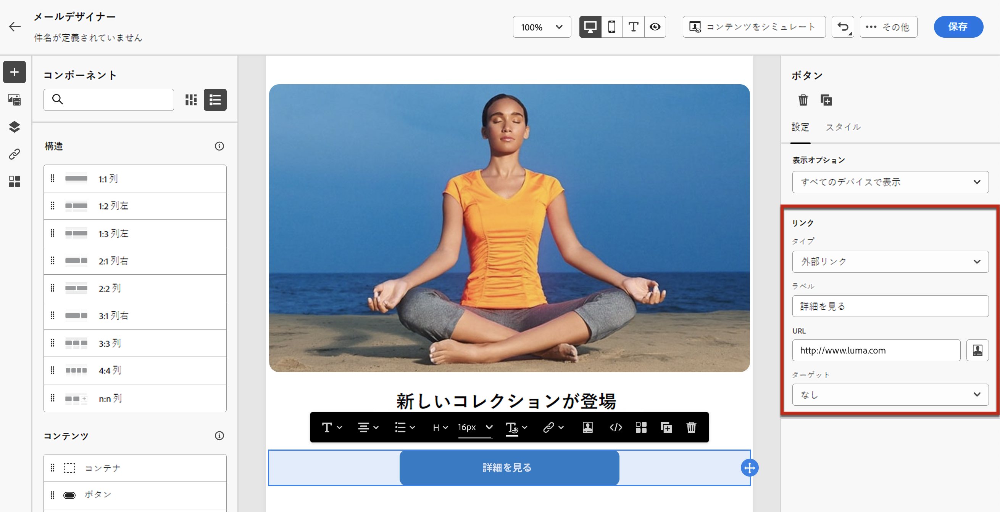
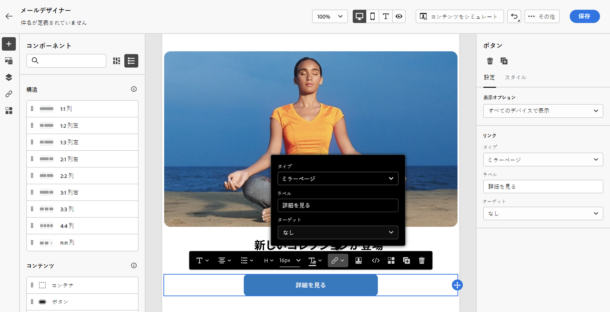

# リンクの追加と追跡メッセージ {#tracking}

を使用 [!DNL Journey Optimizer] して、コンテンツへのリンクを追加し、受信者の動作を監視するために送信されたメッセージを追跡します。

## トラッキングを有効にする {#enable-tracking}

メッセージを送信またはキャンペーン内に作成するときに、 **[!UICONTROL Email opens]** **[!UICONTROL Click on email]** メッセージを電子メールメッセージレベルで追跡できるようにすることができます。

>[!BEGINTABS]

>[!TAB 旅での追跡の有効化]

>[!TAB キャンペーンでの追跡の有効化]

>[!ENDTABS]

>[!NOTE]
>
>どちらのオプションも初期設定では有効になっています。

これにより、次の方法で受信者の動作を追跡することができます。

* **[!UICONTROL Email opens]**: 開かれたメッセージを表示します。
* **[!UICONTROL Click on email]**: 電子メール内のリンクをクリックします。

## リンクの挿入 {#insert-links}

メッセージをデザインするときに、コンテンツへのリンクを追加することができます。

>[!NOTE]
>
>追跡が有効になって ](#enable-tracking) いると [ 、メッセージコンテンツに含まれているすべてのリンクが追跡されます。

電子メールコンテンツにリンクを挿入するには、次の手順を実行します。

1. エレメントを選択し、状況に応じたツールバーでをクリック **[!UICONTROL Insert link]** します。

   

1. 作成するリンクの種類を選択します。

   * **[!UICONTROL External link]**: 外部 URL へのリンクを挿入します。

   * **[!UICONTROL Landing page]**: ランディングページへのリンクを挿入します。 詳しくは、ここを [ 参照してください。](../landing-pages/get-started-lp.md)

   * **[!UICONTROL One click Opt-out]**: オプトアウトを確認せずに、ユーザーが通信を速やかに購読できるようにするには、リンクを挿入します。 詳しくは、ここを  参照してください。

   * **[!UICONTROL External Opt-in/Subscription]**: ブランドから情報を受け取るためのリンクを挿入します。

   * **[!UICONTROL External Opt-out/Unsubscription]**: 作成した web ページを使用して、自分のブランドから配信を中止するためのリンクを挿入します。 この節 ](../privacy/opt-out.md#opt-out-management) では [ 、オプトアウトの管理について詳しく説明しています。

   * **[!UICONTROL Mirror page]**: Web ブラウザーに電子メールのコンテンツを表示するには、リンクを挿入します。 詳しくは、ここを  参照してください。

   

1. リンクを個人用に設定することができます。 この節 ](../personalization/personalization-syntax.md#perso-urls) では、 [ 個人用の url について詳しく説明しています。

1. 変更内容を保存します。

1. 作成したリンクは、右側のペインで変更 **[!UICONTROL Component settings]** することもできます。

   * リンクを編集して、その種類を変更することができます。
   * リンクに下線を表示するか、または、対応するオプションをオンにしないかを選択できます。

   

>[!NOTE]
>
>マーケティングタイプの電子メールメッセージには脱退リンク ](../privacy/opt-out.md#opt-out-management) が含ま [ れている必要があります。これは、トランザクションメッセージには必要ありません。メッセージカテゴリー **[!UICONTROL Marketing]** **[!UICONTROL Transactional]** は、チャネルサーフェス ](../configuration/channel-surfaces.md#email-type) (メッセージプリセット) レベルとメッセージの作成時に [ 定義されます。

## ミラーページへのリンク {#mirror-page}

ミラーページは、web ブラウザーを使用してオンラインで利用可能な HTML ページです。 その内容は、電子メールの内容と同じです。

電子メールの鏡像ページへのリンクを追加するには、 [ リンク ](#insert-links) を挿入し、リンクの種類としてを選択 **[!UICONTROL Mirror page]** します。

「ミラー」ページが自動的に作成されます。

>[!IMPORTANT]
>
>ミラーページのリンクは自動的に生成され、編集できません。 これには、元の電子メールをレンダリングするために必要なすべての暗号化されたパーソナライズされたデータが含まれています。 そのため、大規模な属性を使用すると、非常に長いミラーページの Url が生成されることがあります。これにより、Url が最大長の web ブラウザーでのリンクを防止できます。

電子メールが送信されると、受信者が「ミラーページ」リンクをクリックすると、電子メールの内容が初期設定の web ブラウザーに表示されます。

>[!NOTE]
>
>[テストプロファイルに送信された校正 ](preview.md#send-proofs) には、ミラーページへのリンクはアクティブではありません。最終的なメッセージの中でのみアクティブ化されます。

ミラーページの保存期間は60日です。 その後、ミラーページを使用することはできなくなります。

## 追跡の管理 {#manage-tracking}

[電子メールデザイナー ](content-from-scratch.md) を使用すると、追跡する url を管理することができます。これは、各リンクの追跡タイプを編集する場合などに使用されます。

1. **[!UICONTROL Links]**&#x200B;左側のペインでアイコンをクリックすると、追跡対象のコンテンツのすべての url のリストが表示されます。

   このリストを使用すると、中央表示を使用して、電子メールコンテンツ内の各 URL を検索することができます。

1. リンクを編集するには、対応する鉛筆のアイコンをクリックします。

   

1. 必要に応じて、次の **[!UICONTROL Tracking Type]** ように変更することができます。

   

   追跡対象 URL ごとに、トラッキングモードを次のいずれかの値に設定できます。

   * **[!UICONTROL Tracked]**: この URL でトラッキングを有効にします。
   * **[!UICONTROL Opt out]**: この URL は、オプトアウトまたは unsubscription URL とみなされます。
   * **[!UICONTROL Mirror page]**: この URL はミラーページの URL であるとします。
   * **[!UICONTROL Never]**: この URL の追跡はアクティブ化しないでください。 <!--This information is saved: if the URL appears again in a future message, its tracking is automatically deactivated.-->

オープニングとクリックに関するレポートは、 [ ライブレポート ](../reports/live-report.md) と [ グローバルレポート ](../reports/global-report.md) で使用できます。
