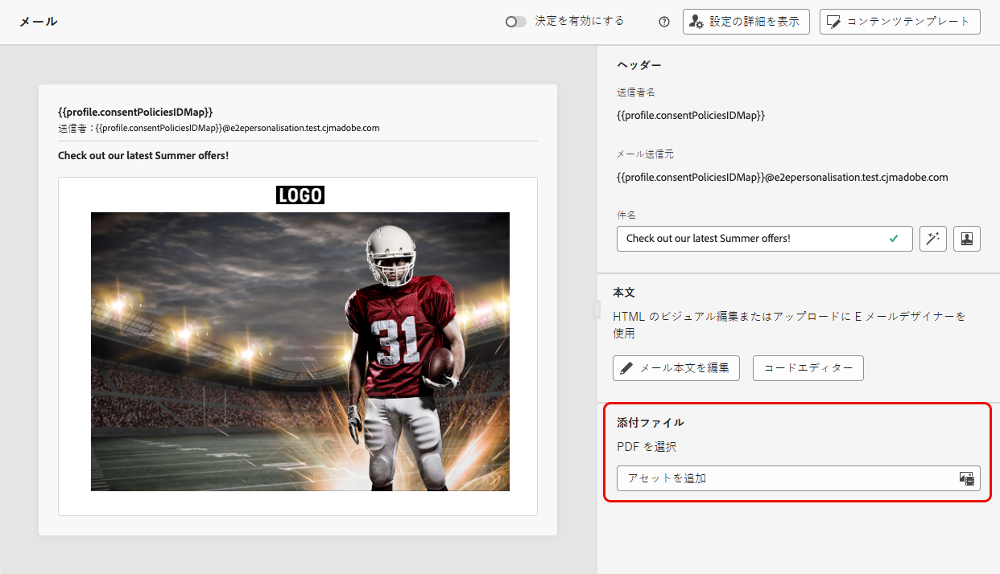
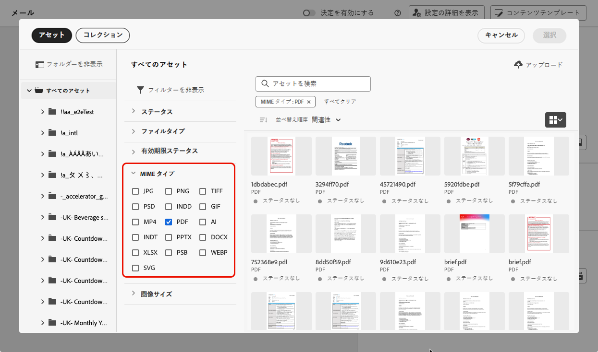
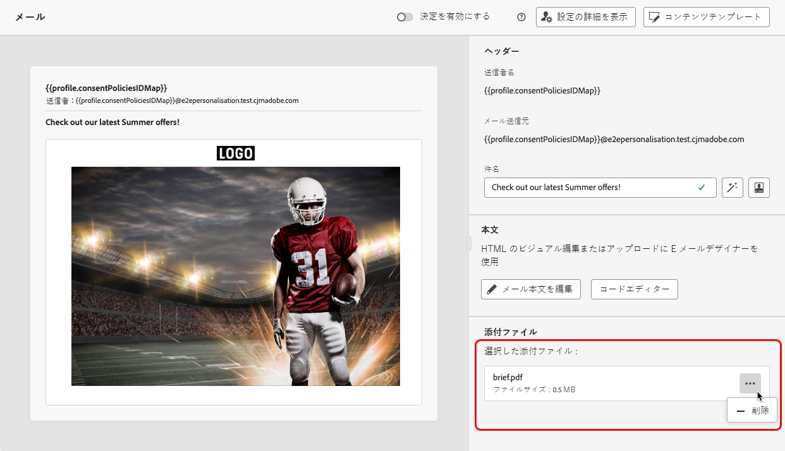

# メールへの PDF ファイルの添付 {#pdf-attachments}

>[!CONTEXTUALHELP]
>id="ajo_pdf_attachments"
>title="PDF 添付ファイルの追加"
>abstract="メールに添付する PDF ファイルを参照して選択します。 プロファイルごとに、年間最大 6 件の PDF 添付ファイル付きメッセージを送信できます。各添付ファイルの最大許容ファイルサイズは 5 MB です。 追加のサイズまたはボリュームは、添付ファイルパックアドオンを購入できます。詳しくは、アドビ担当者にお問い合わせください。"

[!DNL Journey Optimizer] を使用して送信するメールメッセージに静的 PDF ファイルを添付できます。

>[!IMPORTANT]
>
>* プロファイルごとに、年間最大 6 件の PDF 添付ファイル付きメッセージを送信できます。
>
>* 各添付ファイルの最大許容ファイルサイズは 5 MB です。
>
>その他のサイズまたはボリュームについては、PDF添付ファイルアドオンを購入できます。 詳しくは、アドビ担当者にお問い合わせください。

PDF ファイルをメールメッセージに添付するには、次の手順に従います。

1. ジャーニーまたはキャンペーンでメールを作成します。[詳細情報](create-email.md)

1. ジャーニーまたはキャンペーンの「**[!UICONTROL コンテンツ]**」タブで、「**[!UICONTROL 添付ファイル]**」セクションから「**[!UICONTROL アセットを追加]**」を選択します。

   

1. Assets Essentials リポジトリが表示されます。

   >[!NOTE]
   >
   >メッセージをデザインする際は、Journey Optimizer インターフェイス内から Assets Essentials リポジトリに直接アクセスします。組み込みの [!DNL Assets Essentials] ユーザーインターフェイスについて詳しくは、[Experience Manager Assets Essentials ドキュメント](https://experienceleague.adobe.com/docs/experience-manager-assets-essentials/help/introduction.html?lang=ja){target="_blank"}を参照してください。

1. 「**[!UICONTROL MIME タイプ]**」セクションの **[!UICONTROL PDF]** フィルターを使用して、正しいファイル形式への選択を制限します。

   

   >[!NOTE]
   >
   >添付ファイルは、PDF 形式のみ許可されます。

1. 任意のファイルを選択します。

   * 一度に選択できるファイルは 1 つだけです。
   * 各添付ファイルの最大許容ファイルサイズは 5 MB です。

1. 完了したら、選択したファイルの名前とサイズが「**[!UICONTROL 添付ファイル]**」セクションに表示されます。

   ファイル名の横にある「その他のアクション」アイコンを使用して、選択したファイルを削除できます。

   

>[!NOTE]
>
>メッセージを[コンテンツテンプレート](../content-management/create-content-templates.md)として保存した場合、PDF 添付ファイルはテンプレートに保持されません。保存したコンテンツテンプレートから新しいメールを作成する場合は、ファイルを再添付する必要があります。
