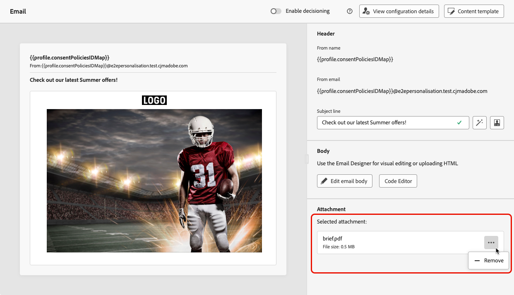

# メールへのPDF ファイルの添付 {#pdf-attachments}

>[!CONTEXTUALHELP]
>id="ajo_pdf_attachments"
>title="PDF添付ファイルの追加"
>abstract="メールに添付するPDF ファイルを参照して選択します。 PDF添付ファイルを含むメッセージは、プロファイルごとに年間 6 件まで送信できます。 各添付ファイルの最大許容ファイルサイズは 5 MB です。  任意のサイズまたはボリュームを追加する場合は、添付ファイルパックアドオンを購入できます。 詳しくは、アドビ担当者にお問い合わせください。"

>[!AVAILABILITY]
>
>この機能は、限定提供です。アクセス権を取得するには、アドビ担当者にお問い合わせください。

[!DNL Journey Optimizer] を使用して送信するメールメッセージに静的PDF ファイルを添付できます。

>[!IMPORTANT]
>
>* プロファイルごとに、年間最大 6 件の PDF 添付ファイル付きメッセージを送信できます。
>
>* 各添付ファイルの最大許容ファイルサイズは 5 MB です。
>
>追加のサイズまたはボリュームについては、添付ファイルパックアドオンを購入できます。詳しくは、アドビ担当者にお問い合わせください。

メールメッセージにPDF ファイルを添付するには、次の手順に従います。

1. ジャーニーまたはキャンペーンにメールを作成します。 [詳細情報](create-email.md)

1. ジャーニーまたはキャンペーンの「**[!UICONTROL コンテンツ]**」タブで、「**[!UICONTROL 添付ファイル]**」セクションの「**[!UICONTROL アセットを追加]**」を選択します。

   

1. Assets Essentials リポジトリが表示されます。

   >[!NOTE]
   >
   >メッセージを設計する際は、Journey Optimizer インターフェイス内から直接 Assets Essentials リポジトリにアクセスします。 組み込みの [!DNL Assets Essentials] ユーザーインターフェイスについて詳しくは、[Experience Manager Assets Essentials ドキュメント ](https://experienceleague.adobe.com/docs/experience-manager-assets-essentials/help/introduction.html?lang=ja){target="_blank"} を参照してください。

1. 「**[!UICONTROL MIME タイプ]**」セクションの **[!UICONTROL PDF]** フィルターを使用して、正しいファイル形式に限定します。

   

   >[!NOTE]
   >
   >添付ファイルに使用できるのはPDF形式のみです。

1. 任意のファイルを選択します。

   * 一度に選択できるファイルは 1 つだけです。
   * 各添付ファイルの最大許容ファイルサイズは 5 MB です。

1. 完了すると、選択したファイルの名前とサイズが「**[!UICONTROL 添付ファイル]**」セクションに表示されます。

   ファイル名の横にある「その他のアクション」アイコンを使用して、選択したファイルを削除できます。

   

>[!NOTE]
>
>メッセージを [ コンテンツテンプレート ](../content-management/create-content-templates.md) として保存した場合、PDFの添付ファイルはテンプレートと共に保持されません。 保存したコンテンツテンプレートから新しいメールを作成する場合は、ファイルを再添付する必要があります。
