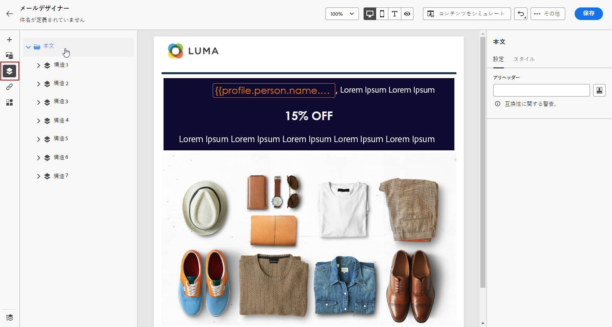
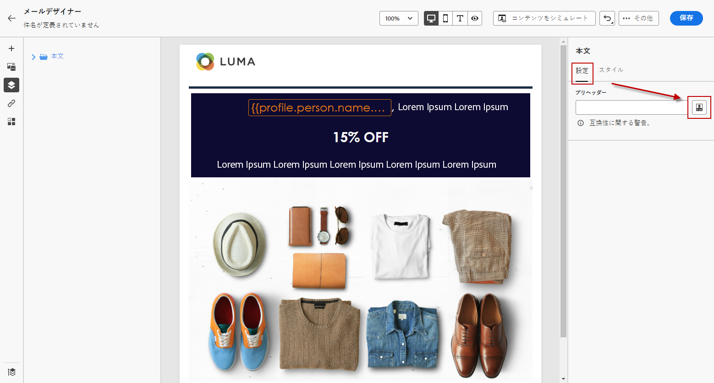
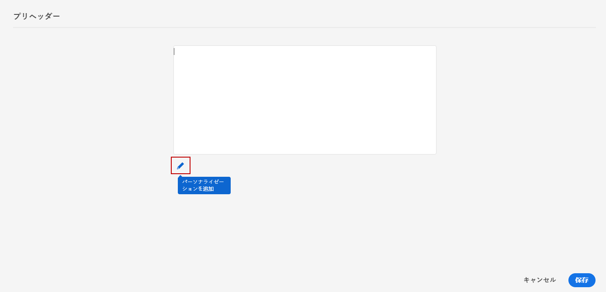
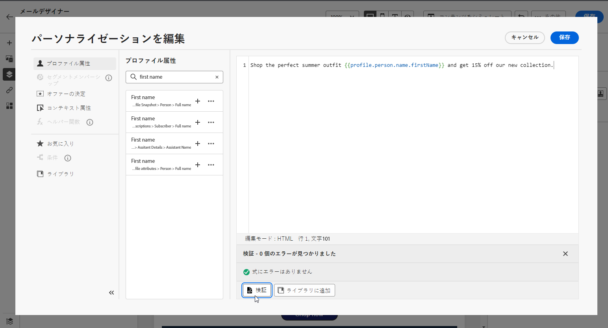

# プレヘッダーの追加 {#preheader}

>[!CONTEXTUALHELP]
>id="ac_edition_preheader"
>title="プレヘッダーの追加"
>abstract="Preheader は、電子メールクライアントから電子メールを表示しているときに、件名行の後に続く短い要約テキストです。 多くの場合は、電子メールの概要を示しますが、通常は1文にすぎません。"

Preheader は、電子メールクライアントから電子メールを表示しているときに、件名行の後に続く短い要約テキストです。

多くの場合は、電子メールの概要を示しますが、通常は1文にすぎません。

>[!NOTE]
>
>Preheaders は、すべての電子メールクライアントでサポートされるわけではありません。 サポートされていない場合、preheader は表示されません。

電子メールプレヘッダーを定義するには、次の手順に従います。

1. 電子メールデザイナーで、少なくとも a **[!UICONTROL Structure components]** を追加して、電子メールのデザインを開始します。

1. **[!UICONTROL Navigation tree]**&#x200B;左側のペインでアイコンをクリックして、を選択 **[!UICONTROL Body]** します。

   

1. **[!UICONTROL Body settings]**&#x200B;右側のペインで、フィールドの **[!UICONTROL Preheader]** 横にある「編集」アイコンをクリックして、コンテンツを追加します。

   

1. プリヘッダを追加します。 アイコンをクリック **[!UICONTROL Add personalization]** して、さらにカスタマイズすることもできます。

   

1. **[!UICONTROL Edit Personalization]**&#x200B;ウィンドウで、または **[!UICONTROL Personalization fields]** を **[!UICONTROL Dynamic content]** 追加 **[!UICONTROL Content block]** することができます。

1. このボタンをクリック **[!UICONTROL Validate]** して、パーソナル化の構文を確認します。

   

1. をクリック **[!UICONTROL Save]** します。

これで、電子メールの preheader が設定されました。
