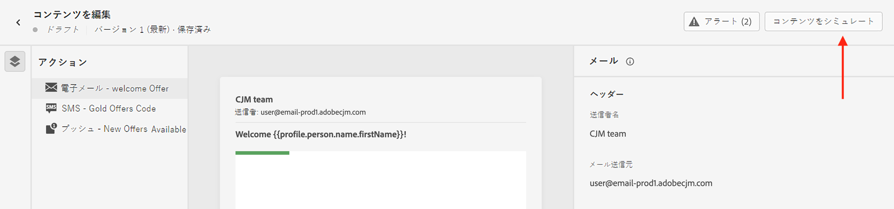
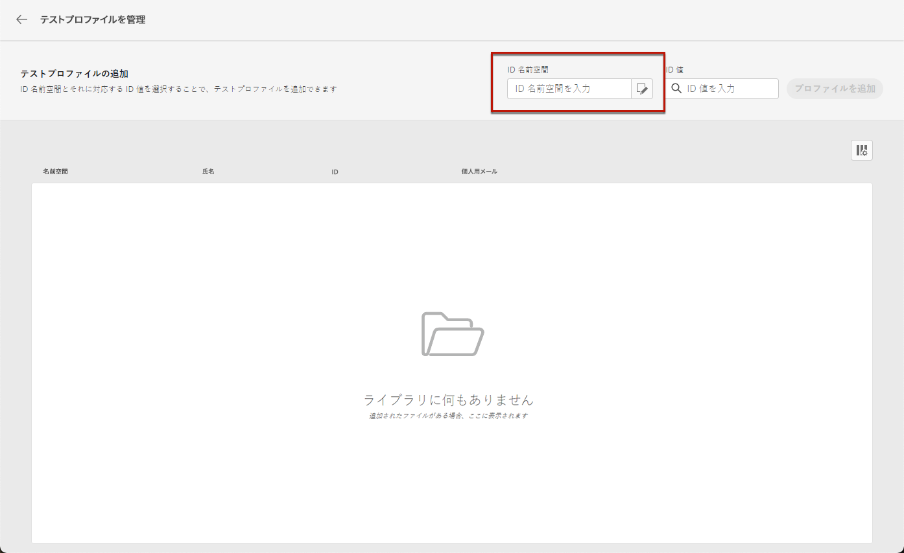

# メッセージのプレビューとテスト {#preview-and-proof}

E メールコンテンツを定義したら、テストプロファイルを使用してプレビューおよびテストできます。 [パーソナライズされたコンテンツ](../personalization/personalize.md)を挿入した場合は、このコンテンツがメッセージにどのように表示されるかを、テストプロファイルデータを使用して確認できます。

メールのコンテンツやパーソナライズ機能の設定で発生し得るエラーを検出するには、配達確認をテストプロファイルに送信します。最新のコンテンツを検証するには、変更が加えられるたびに配達確認を送信する必要があります。

>[!CAUTION]
>
>メッセージのプレビューや配達確認の送信を行うには、テストプロファイルを使用可能にしておく必要があります。
>
>テストプロファイルの作成方法については、[このページ](../segment/creating-test-profiles.md)を参照してください。

E メールコンテンツをテストするには、次の手順を実行する必要があります。

* [テストプロファイルの選択](#select-test-profiles)
* [メッセージのプレビューを確認する](#preview-your-messages)

その後、テストプロファイルに[配達確認を送信](#send-proofs)できるようになります。

さらに、**Litmus** アカウントを [!DNL Journey Optimizer] に活用すると、よく使うメールクライアントで、**メールのレンダリング**&#x200B;を即座にプレビューすることができます。すべてのインボックスでメールコンテンツが適切に表示され、正しく機能することを確認できます。Litmus メールプレビューのロックを解除する方法については、[この節](#email-rendering)を参照してください。。

>[!CAUTION]
>
>メッセージをプレビューしたり、配達確認を送信したりすると、プロファイルのパーソナライゼーションデータのみが表示されます。イベント情報などのコンテキストデータに基づくパーソナライゼーションは、ジャーニーのコンテキストでのみテストできます。[このユースケース](../personalization/personalization-use-case.md)でのパーソナライゼーションのテスト方法を説明します。

➡️ メールのプレビューと配達確認の方法については、[このビデオ](#video-preview)をご覧ください

## テストプロファイルの選択 {#select-test-profiles}

>[!CONTEXTUALHELP]
>id="ac_preview_testprofiles"
>title="メッセージのプレビューとテスト"
>abstract="メッセージコンテンツを定義したら、テストプロファイルを使用してプレビューとテストを行うことができます。"
>additional-url="https://experienceleague.adobe.com/docs/journey-optimizer/using/email/preview.html?lang=en#email-rendering" text="メールのレンダリング"
>additional-url="https://experienceleague.adobe.com/docs/journey-optimizer/using/email/preview.html?lang=en#preview-email" text="プレビュー"

[テストプロファイル](../segment/creating-test-profiles.md)を使用すると、定義したターゲティング条件に一致しない、追加の受信者をターゲットに設定できます。

テストプロファイルを選択する手順は、次のとおりです。

1. 内 [コンテンツを編集](create-email.md#define-email-content) 画面または E メールデザイナーで、 **[!UICONTROL コンテンツをシミュレート]** ボタンをクリックして、テストプロファイルの選択にアクセスします。

   

1. 選択 **[!UICONTROL テストプロファイルの管理]**.

   

1. テストプロファイルの識別に使用する名前空間を選択するには、**[!UICONTROL ID 名前空間]**&#x200B;の選択アイコンをクリックします。

   

   Adobe Experience Platform の ID 名前空間については、[この節](../segment/get-started-identity.md)を参照してください。

   以下の例では、**メール**&#x200B;名前空間を使用します。

1. 検索フィールドで名前空間を探して選択し、「**[!UICONTROL 選択]**」をクリックします。

   

1. 内 **[!UICONTROL ID 値]** フィールドで、テストプロファイルを識別する値（ここでは E メールアドレス）を入力し、 **[!UICONTROL プロファイルを追加]**.

   <!---->

1. メッセージにパーソナライゼーションを追加した場合は、他のプロファイルを追加して、プロファイルデータに応じて様々な種類のメッセージをテストできるようにします。 追加すると、選択したフィールドの下にプロファイルが表示されます。

   

   メッセージのパーソナライゼーションの要素に基づいて、各テストプロファイルのデータがリストの関連する列に表示されます。

### メールのプレビュー {#preview-email}

1 回 [テストプロファイル](#select-test-profiles) を選択すると、e メールコンテンツをプレビューできます。 次の手順に従います。

1. 内 [コンテンツを編集](create-email.md#define-email-content) 画面または E メールデザイナーで、 **[!UICONTROL コンテンツをシミュレート]** 」ボタンをクリックします。

1. テストプロファイルを選択します。列内で利用可能な値を確認できます。右向きや左向きの矢印を使用して、データを参照します。

   

   >[!NOTE]
   >
   >テストプロファイルをさらに追加するには、「 **[!UICONTROL テストプロファイルの管理]**. [詳細情報](#select-test-profiles)

1. 列を追加または削除するには、リストの上にある「**[!UICONTROL データを選択]**」アイコンをクリックします。

   

   リストの最後に、現在のメッセージに固有のパーソナライゼーションフィールドを表示できます。この例では、プロファイルの市区町村、姓、名を使用しています。これらのフィールドを選択し、テストプロファイルにこれらの値が入力されていることを確認します。

1. メッセージプレビューでは、パーソナライズされた要素が、選択したテストプロファイルデータに置き換えられます。

   例えば、次のメッセージの場合、メールのコンテンツと件名の両方がパーソナライズされています。

   

1. メッセージの各バリエーションに対してメールのレンダリングをプレビューするには、別のテストプロファイルを選択します。

## 配達確認の送信  {#send-proofs}

配達確認は、メッセージをメインオーディエンスに送信する前にテストできる、特定のメッセージです。配達確認の受信者は、メッセージのレンダリング、コンテンツ、パーソナライゼーションの設定、構成などを確認します。

[テストプロファイル](#select-test-profiles)を選択すると、配達確認を送信できるようになります。

1. 内 **[!UICONTROL シミュレート]** 画面で、 **[!UICONTROL 配達確認を送信]** 」ボタンをクリックします。

   

1. **[!UICONTROL 配達確認を送信]**&#x200B;ウィンドウで、受信者のメールアドレスを入力し、「**[!UICONTROL 追加]**」をクリックして、自分自身または組織のメンバーに配達確認を送信します。

   なお、配達確認配信には、最大 10 人の受信者を追加できます。

   

1. 次に、メッセージコンテンツのパーソナライズに使用される&#x200B;**テストプロファイル**&#x200B;を選択します。

   配達確認の各受信者は、選択したテストプロファイルと同じ数のメッセージを受信します。例えば、受信者のメールを 5 件追加し、10 個のテストプロファイルを選択した場合は、50 件の配達確認メッセージを送信することになり、各受信者はそのうち 10 件を受信します。

1. 必要に応じて、配達確認の件名行にプレフィックスを追加できます。英数字と特殊文字（など）のみ。- _ ( ) [ ] は、件名行のプレフィックスとして使用できます。

1. 「**[!UICONTROL 配達確認を送信]**」をクリックします。

   

1. 戻る  **[!UICONTROL シミュレート]** 画面で、  **[!UICONTROL 配達確認を表示]** ボタンをクリックしてステータスを確認します。

   

メッセージコンテンツを変更するたびに、配達確認を送信することをお勧めします。

>[!NOTE]
>
>送信された配達確認で、ミラーページへのリンクがアクティブになっていません。 最終的なメッセージでのみアクティブ化されます。

## E メールのレンダリングを使用 {#email-rendering}

**Litmus** アカウントを [!DNL Journey Optimizer] に使用すると、よく使うメールクライアントで&#x200B;**メールのレンダリング**&#x200B;を即座にプレビューできます。

メールのレンダリング機能にアクセスするには、次が必要です。

* Litmus アカウントを持っていること
* [テストプロファイルの選択](#select-test-profiles)

その後、以下の手順をおこないます。

1. 内 [コンテンツを編集](create-email.md#define-email-content) 画面または E メールデザイナーで、 **[!UICONTROL コンテンツをシミュレート]** 」ボタンをクリックします。

1. を選択します。 **[!UICONTROL E メールをレンダリング]** 」ボタンをクリックします。

   

1. 右上のセクションで、「**Litmus アカウントを接続**」をクリックします。

   

1. 資格情報を入力し、ログインします。

   

1. 「**テストを実行**」ボタンをクリックして、メールのプレビューを生成します。

1. よく使うデスクトップ、モバイル、Web ベースのクライアントでメールの内容を確認します。

   

>[!CAUTION]
>
>**Litmus** アカウントを [!DNL Journey Optimizer] に接続する際は、テストメッセージが Litmus に送信されることに同意する必要があります。一度送信すると、これらのメールはアドビでは管理できなくなります。その結果、テストメッセージに含まれる可能性のあるパーソナライゼーションデータも含め、Litmus データ保持メールポリシーがこれらのメールに適用されます。

## ハウツービデオ {#video-preview}

受信ボックス間での E メールのレンダリングをテストする方法、テストプロファイルに対してパーソナライズされた E メールをプレビューする方法、配達確認を送信する方法を説明します。

>[!VIDEO](https://video.tv.adobe.com/v/334239?quality=12)
