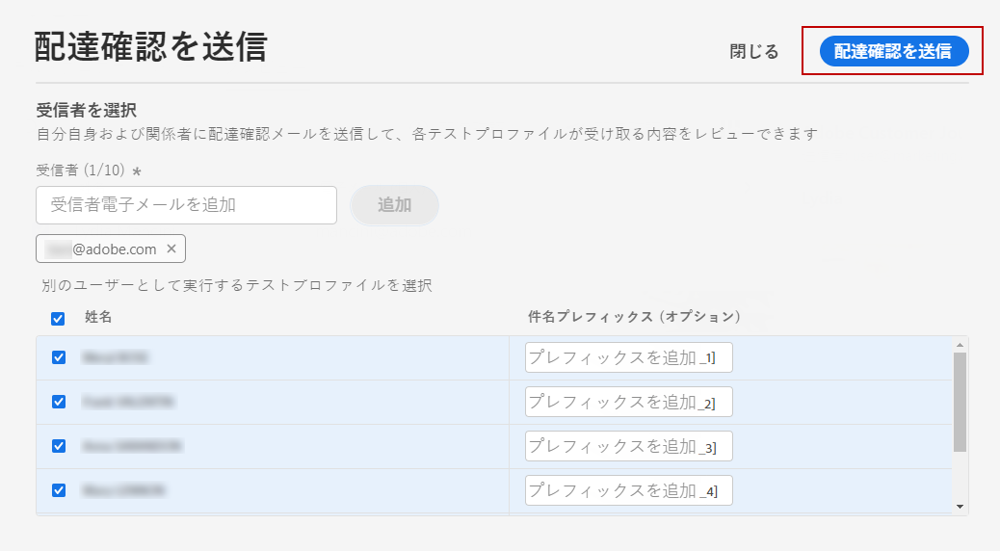
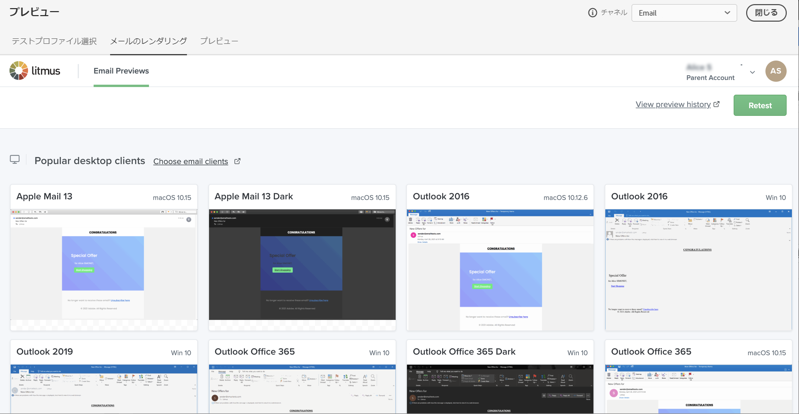

# メッセージのプレビューとテスト {#preview-and-proof}

電子メールコンテンツの定義が完了したら、テストプロファイルを使用してプレビューおよびテストを行うことができます。 パーソナライズされたコンテンツ ](../personalization/personalize.md) を挿入 [ した場合は、そのコンテンツがメッセージにどのように表示されるかを確認するには、「プロファイルデータをテスト」を使用します。

電子メールコンテンツや個人用設定の設定で発生する可能性のあるエラーを検出するには、実験用のプロファイルに実験を送信します。 変更が加えられるたびに校正を行い、最新のコンテンツを検証する必要があります。

>[!CAUTION]
>
>メッセージをプレビューして、校正刷りを送信するには、使用可能なテストプロファイルが必要です。
>
>このページ ](../segment/creating-test-profiles.md) で [ テストプロファイルを作成する方法について説明します。

電子メールのコンテンツをテストするには、次の操作を行う必要があります。

* [「プロファイルのテスト」を選択します。](#select-test-profiles)
* [メッセージプレビューの確認](#preview-your-messages)

これにより、試験用のプロファイルをテストプロファイルに送信 ](#send-proofs) する [ ことができます。

さらに、Litmus **アカウントを使用して** 、人気のある電子メールクライアントでの電子メールのレンダリング **を即座にプレビュー** でき [!DNL Journey Optimizer] ます。このようにすると、電子メールコンテンツが美しく表示され、すべての受信トレイで正しく動作するようになります。 この節 ](#email-rendering) では、Litmus 電子メールプレビューの [ ロックを解除する方法について説明します。

>[!CAUTION]
>
>メッセージをプレビューしたり、校正を送信するときは、プロファイル個人用設定データのみが表示されます。 イベント情報などの context データに基づくパーソナル化は、旅のコンテキストにおいてのみテストできます。 このユースケース ](../personalization/personalization-use-case.md) で [ パーソナル化をテストする方法について説明します。

➡️ [ このビデオで電子メールのプレビューと検証を行う方法について説明しています。](#video-preview)

## 「プロファイルのテスト」を選択します。 {#select-test-profiles}

>[!CONTEXTUALHELP]
>id="ac_preview_testprofiles"
>title="メッセージのプレビューとテスト"
>abstract="作成したメッセージコンテンツについては、テストプロファイルを使用してプレビューとテストを行うことができます。"
>additional-url="https://experienceleague.adobe.com/docs/journey-optimizer/using/email/preview.html?lang=en#email-rendering" text="電子メールによるレンダリング"
>additional-url="https://experienceleague.adobe.com/docs/journey-optimizer/using/email/preview.html?lang=en#preview-email" text="プレビュー"

定義されているターゲット条件に一致しないその他の受信者をターゲットとするには、テストプロファイル ](../segment/creating-test-profiles.md) を使用 [ します。

テストプロファイルを選択するには、次の手順に従います。

1. コンテンツ ](create-email.md#define-email-content) の [ 編集画面または電子メールデザイナーで、ボタンをクリック **[!UICONTROL Simulate content]** して、テストプロファイルの選択にアクセスします。

   

1. を選択 **[!UICONTROL Manage test profiles]** します。

   

1. 選択アイコンをクリック **[!UICONTROL Identity namespace]** して、テストプロファイルの識別に使用する名前空間を選択します。

   

   この節 ](../segment/get-started-identity.md) では、Adobe エクスペリエンス Platform identity 名前空間 [ について詳しく説明しています。

   次の例では、Email **名前空間を使用** します。

1. 「検索」フィールドを使用して名前空間を検索し、選択してをクリックします。 **[!UICONTROL Select]**

   

1. **[!UICONTROL Identity value]**「」フィールドに、テストプロファイルを識別する値 (電子メールアドレスを入力してください) を入力し、をクリック **[!UICONTROL Add profile]** します。

   <!---->

1. メッセージにパーソナライズを追加した場合は、プロファイルデータに応じて異なる種類のメッセージが表示されるように、他のプロファイルを追加します。 プロファイルは、一度追加されると、選択したフィールドの下に一覧表示されます。

   

   このリストでは、メッセージのパーソナル化エレメントに基づいて、関連する列の各テストプロファイルに関するデータが表示されます。

### 電子メールプレビュー {#preview-email}

[プロファイル ](#select-test-profiles) が選択されている場合は、電子メールのコンテンツをプレビューすることができます。以下の手順に従います。

1. 「コンテンツ ](create-email.md#define-email-content) の [ 編集」画面または電子メールデザイナーで、ボタンをクリック **[!UICONTROL Simulate content]** します。

1. テストプロファイルを選択します。 列に表示されている値を確認することができます。 右向き矢印または左向き矢印を使用して、データを参照します。

   

   >[!NOTE]
   >
   >さらにテストプロファイルを追加するには、を選択 **[!UICONTROL Manage test profiles]** します。 [詳細情報](#select-test-profiles)

1. リストの上の **[!UICONTROL Select data]** アイコンをクリックして、列を追加または削除します。

   

   リストの最後にある現在のメッセージに固有の個人用設定フィールドが表示されます。 この例では、プロファイルの市、名、姓の順に示します。 これらのフィールドを選択し、これらの値がテストプロファイルに設定されていることを確認してください。

1. メッセージプレビューでは、パーソナライズされたエレメントは、選択したテストプロファイルデータに置き換えられます。

   例えば、このメッセージについては、電子メールのコンテンツと電子メールの件名の両方が個人用になっています。

   

1. メッセージの各バリアントの電子メールレンダリングをプレビューするには、他のテストプロファイルを選択します。

## 校正刷りの送信 {#send-proofs}

「校正」とは、メッセージをメインユーザーに送信する前にテストすることを可能にする具体的なメッセージです。 このような場合、メッセージの承認は、レンダリング、コンテンツ、パーソナル化設定、構成の各受信者が担当することになります。

[プロファイル ](#select-test-profiles) が選択されている場合は、校正刷りを送信することができます。

1. **[!UICONTROL Simulate]**&#x200B;画面で、ボタンをクリック **[!UICONTROL Send proof]** します。

   

1. **[!UICONTROL Send proof]**&#x200B;ウィンドウで、宛先の電子メールアドレスを入力し、「」をクリック **[!UICONTROL Add]** して自分または組織のメンバーに証明を送信します。

   最大10個までの受信者を確認することができます。

   

1. 次に、メッセージコンテンツをパーソナライズするのに使用するテストプロファイル **を選択** します。

   各校正の受信者には、選択されたテストプロファイルの数だけメッセージが受信されます。 例えば、5つの受信者の電子メールを1つずつ選択し、10個のテストプロファイルを選択した場合は、50の校正メッセージが送信されます。各受信者には、それらのうち10個が表示されます。

1. 必要に応じて、校正の題名行に接頭辞を追加することができます。 英数文字と、などの特殊文字のみを入力します。- _ ( ) [ ] は、subject 行に接頭辞として使用できます。

1. をクリック **[!UICONTROL Send proof]** します。

   

1. 画面に  **[!UICONTROL Simulate]** 戻り、状態を確認するためのボタンをクリックし  **[!UICONTROL View proofs]** ます。

   

このような場合は、メッセージコンテンツに変更を加えるたびに校正刷りを送信することをお勧めします。

>[!NOTE]
>
>証明が送信されるときに、ミラーページへのリンクはアクティブではありません。 最終的なメッセージの中でのみアクティブ化されます。

## 電子メールによるレンダリングの使用 {#email-rendering}

Litmus **アカウントを使用して** 、人気の電子メールクライアントで電子メールのレンダリング **を即座にプレビュー** でき [!DNL Journey Optimizer] ます。

電子メールによるレンダリング機能にアクセスするには、次の操作を行います。

* Litmus アカウント
* [「プロファイルのテスト」を選択します。](#select-test-profiles)

次に、次の手順を実行します。

1. 「コンテンツ ](create-email.md#define-email-content) の [ 編集」画面または電子メールデザイナーで、ボタンをクリック **[!UICONTROL Simulate content]** します。

1. **[!UICONTROL Render email]**&#x200B;ボタンを選択します。

   

1. 右上の「Litmus アカウント **を使用」をクリックし** ます。

   

1. サインイン情報を入力し、サインインします。

   

1. 「テスト **を実行」ボタンをクリックすると、** 電子メールプレビューが生成されます。

1. 一般的なデスクトップ、モバイルおよび web ベースのクライアントで電子メールのコンテンツを確認してください。

   

>[!CAUTION]
>
>Litmus **アカウント [!DNL Journey Optimizer] をに接続** している場合は、テストメッセージが Litmus に送信されることに同意する必要があります。送信すると、これらの電子メールは Adobe によって管理されなくなります。結果として、Litmus data retention の電子メールポリシーは、これらの電子メールに適用されます。このテストメッセージには、個人用設定データも含まれています。

## 操作方法のビデオ {#video-preview}

受信トレイ間で電子メールのレンダリングをテストする方法、パーソナライズされた電子メールをテストプロファイルに対してプレビューする方法、および校正刷りを送信する方法について説明します。

>[!VIDEO](https://video.tv.adobe.com/v/334239?quality=12)
