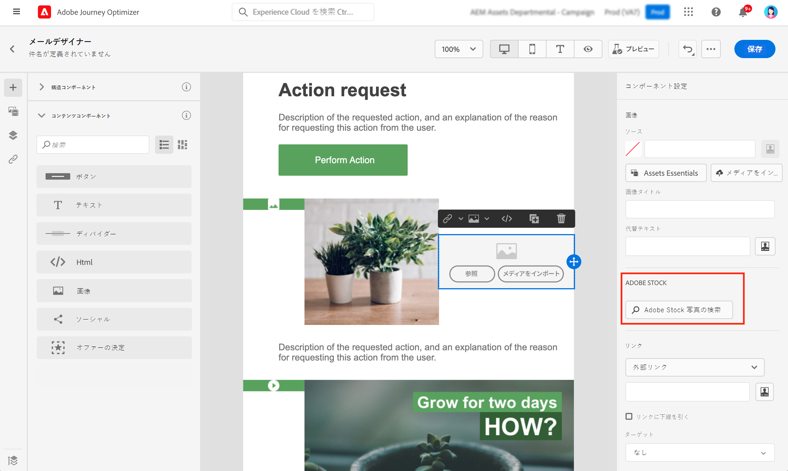
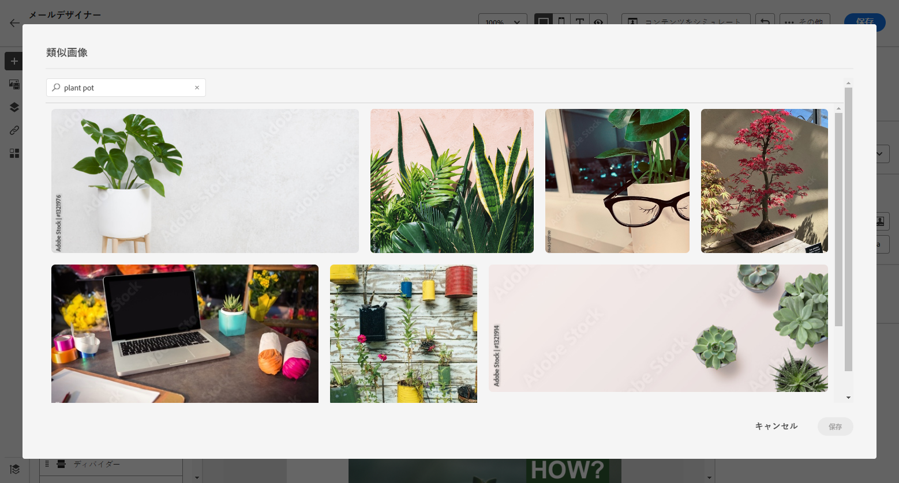
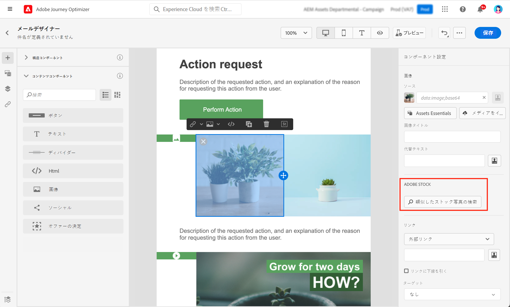
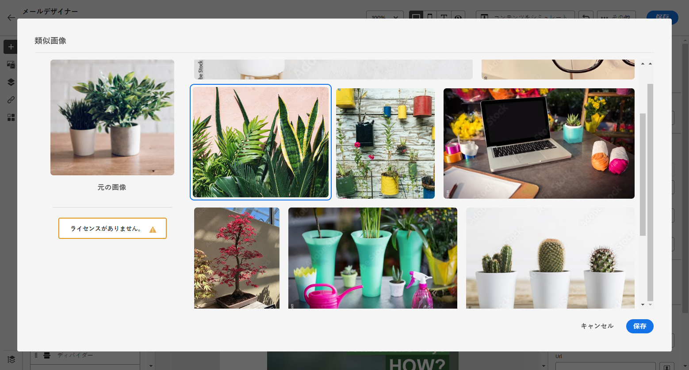
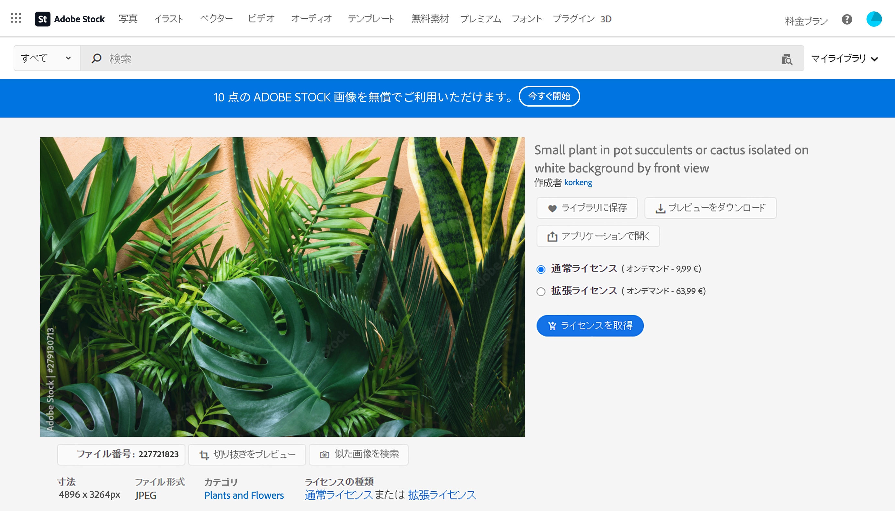
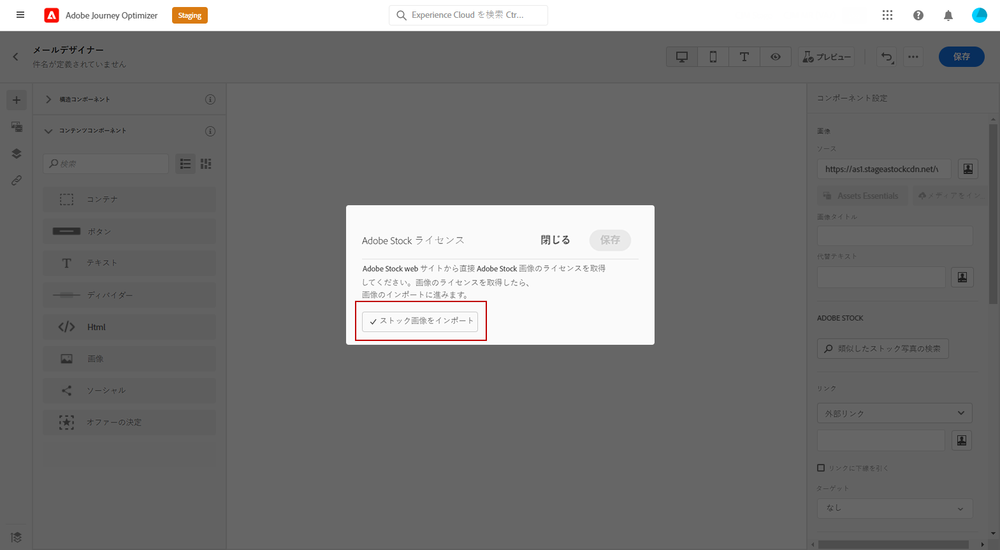

# 画像の [!DNL Adobe Stock] 操作 {#stock}

## での作業の開始 [!DNL Adobe Stock] {#get-started-stock}

[!DNL Adobe Stock]および Email Designer 統合プラグインを使用すると [!DNL Adobe Journey Optimizer] 、画像を簡単に移動、ライセンス、保存し、メッセージのオーサリングに使用することができます。

[Adobe Stock ](https://helpx.adobe.com/stock/get-started.html) {target = &quot;_blank&quot;} を使用すると、何百万もの高画質、およぶ、無料の写真、ビデオ、イラスト、ベクトルグラフィックにアクセスできます。 使用するアセットには、クレジットパックを購入することも、必要なアセット用に1つの Standard または Extended のライセンスのみを購入することもできます。 Adobe Stock には、アセットの無料コレクションも用意されています。

で [!DNL Adobe Journey Optimizer] は、から [!DNL Adobe Stock] 電子メールに画像を直接アップロードし、オプションを使用し **[!UICONTROL Find Adobe Stock photos]** てフォルダーに **[!UICONTROL Assets]** 追加することができます。また、 **[!UICONTROL Find Similar Stock photos]** このオプションを使用すると、配信に使用されるアセットの内容、色、コンポジションに適合するイメージを検索することもできます。

## パーミッション{#stock-permissions}

**[!UICONTROL Find Adobe Stock photos]**&#x200B;および **[!UICONTROL Find Similar Image]** オプションは、Aem アセットエッセンシャル製品プロファイルにアクセスできるユーザーでも使用できます。

詳細については、アセットの基礎に関するドキュメント ](https://experienceleague.adobe.com/docs/experience-manager-assets-essentials/help/get-started-admins/deploy-administer.html#add-users-to-essentials) ({target = &quot;_blank&quot;} を [ 参照してください。

## からのイメージの挿入 [!DNL Adobe Stock] {#add-stock-image}

コンテンツにイメージ [!DNL Adobe Stock] を追加するには、次の手順に従います。

1. **[!UICONTROL Content components]**&#x200B;電子メールデザイナーのセクションで、画像 **をドラッグ &amp; ドロップ** します。

1. 電子メールデザイナーの左側にあるボタンを **[!UICONTROL Find Adobe Stock photos]** クリックします。

   

1. ライブラリを参照するか、検索フィールドに用語を入力します。

   

1. 選択したイメージを選択し、をクリック **[!UICONTROL Save]** します。

   選択されたイメージがライセンスされていない場合は、ライセンス ](#license-stock-image) を取得する必要があり [ ます。

## 類似した写真の検索 {#similar-stock-image}

電子メールコンテンツに含まれている既存のイメージは、のからの [!DNL Adobe Stock] 写真に置き換えることができます。 このオプションは、使用可能なすべての画像 (ライセンス供与されている、ライセンスなしの Stock イメージ、アセットフォルダー内のイメージ) で使用できます。

類似した写真を閲覧するには、次の手順に従います。

1. 置き換えるイメージを選択します。
1. **[!UICONTROL Find similar Stock photos]**&#x200B;ボタンをクリックして、イメージのコンテンツ、色、コンポジションと一致するアセット [!DNL Adobe Stock] を表示します。

   

1. 選択したイメージを選択し、をクリック **[!UICONTROL Save]** します。

   

   選択されたイメージがライセンスされていない場合は、ライセンス ](#license-stock-image) を取得する必要があり [ ます。

1. 必要に応じて、メニューを使用 **[!UICONTROL Components settings]** して画像をカスタマイズします。 [コンポーネント設定 ](content-components.md) について説明します。

## ライセンスを取得します。 [!DNL Adobe Stock] {#license-stock-image}

イメージに既にライセンスが供与されている場合は、アイコンで  表示されます。 それ以外の場合は、ライセンスを使用する必要があります。

イメージのライセンスを作成するには、次の手順に従います。

1. このアイコンを選択し、 **[!UICONTROL License Adobe Stock image]** アイコンをクリックします。

   

   これにより、 [!DNL Adobe Stock] そのユーザーの web サイトにリダイレクトされます。

   

1. [!DNL Adobe Stock]画像をダウンロードして透かしを削除するには、web サイトでアセットを購入する必要があります。

   この購入は、Adobe Stock の平面図または購読によって異なります。 複数の Adobe Stock アカウントを使用している場合は、最後に使用された Stock ID にリダイレクトされることに注意してください。 このような場合は、アセットのライセンスを取得する前に、正しいアカウントにサインインしていることを確認してください。

   Adobe Stock のマニュアル ](https://stock.adobe.com/plans) に記載されている [ adobe stock のプランと価格について詳しくは、「target = &quot;_blank&quot;}」を参照してください。

   >[!WARNING]
   > ライセンスされていないイメージを含む電子メールが送信されると、そのイメージのライセンスを持たないフォームにウォーターマークが残ります。

1. 購入が完了したら、で [!DNL Adobe Journey Optimizer] 電子メールに戻ることができます。また、ライセンスイメージがアセットにインポートされるように選択 **[!UICONTROL Import stock image]** することもできます。

   

1. アセットを保存するフォルダーを選択します。 に [!DNL Assets Essentials] ついて詳しくは、この [ ページ ](assets-essentials.md#get-started-assets-essentials) を参照してください。

## 関連トピック{#stock-related-topics}

* [旅のオプティマイザーでの電子メールのデザイン](get-started-email-design.md)
* [電子メールデザイン用のコンポーネント設定](content-components.md)
* [Adobe Stock はじめに {target = &quot;_blank&quot;} というようになりまし ](https://helpx.adobe.com/stock/get-started.html) た。

