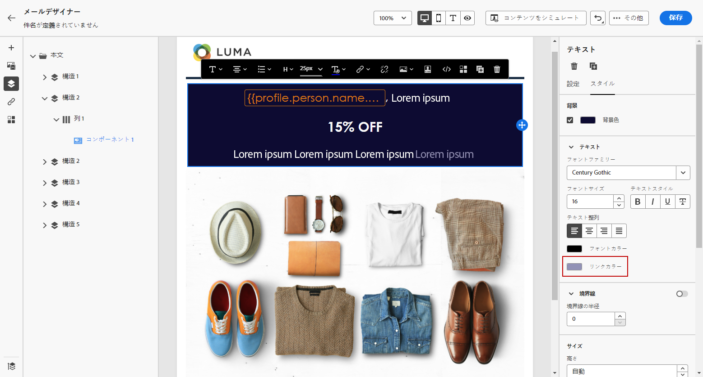

# リンクのスタイルの定義 {#styling-links}

リンクに下線を表示して、電子メールデザイナーでカラーとターゲットを選択できます。

1. リンクが挿入されているテキスト **[!UICONTROL Content component]** で、リンクを選択します。

1. **[!UICONTROL Component settings]**&#x200B;メニューで、 **[!UICONTROL Underline link]** リンクのラベルテキストにアンダーラインを設定します。

   

1. 次のいずれか **[!UICONTROL Target]** の操作を行います。

   * **[!UICONTROL None]**: クリックしたのと同じフレーム内でリンクを開きます (初期設定)。
   * **[!UICONTROL Blank]**: 新しいウィンドウまたはタブにリンクを表示します。
   * **[!UICONTROL Self]**: クリックしたのと同じフレーム内でリンクを開きます。
   * **[!UICONTROL Parent]**: 親フレーム内のリンクを開きます。
   * **[!UICONTROL Top]**: ウィンドウの本文全体にリンクを表示します。

   

1. リンクの色を変更するには、「オン **[!UICONTROL Link color]** 」をクリックします。

   

1. 必要なカラーを選択します。

1. 変更内容を保存します。
