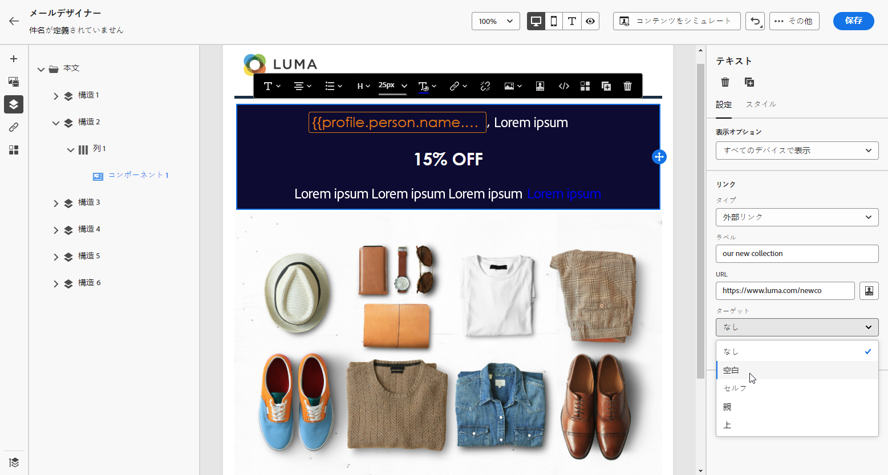

# リンクのスタイルの定義 {#styling-links}

E メールデザイナーでリンクに下線を引き、リンクの色とターゲットを選択できます。

1. リンクが挿入されるテキスト&#x200B;**[!UICONTROL コンテンツコンポーネント]**&#x200B;で、リンクを選択します。

1. 次の **[!UICONTROL 設定]** タブで、オーディエンスのリダイレクト方法を選択します。 **[!UICONTROL ターゲット]** ドロップダウン：

   * **[!UICONTROL なし]**：クリックしたフレームと同じフレームでリンクを開きます（デフォルト）。
   * **[!UICONTROL 空白]**：リンクを新しいウィンドウまたは新しいタブで開きます。
   * **[!UICONTROL セルフ]**：クリックしたフレームと同じフレームでリンクを開きます。
   * **[!UICONTROL 親]**：親フレームでリンクを開きます。
   * **[!UICONTROL トップ]**：ウィンドウ全体でリンクを開きます。

   

1. チェック **[!UICONTROL リンクに下線を引く]** リンクのラベルテキストに下線を引く場合。

   

1. リンクの色を変更するには、 **[!UICONTROL リンクの色]** から **[!UICONTROL スタイル]** タブをクリックします。

   

1. 変更を保存します。
