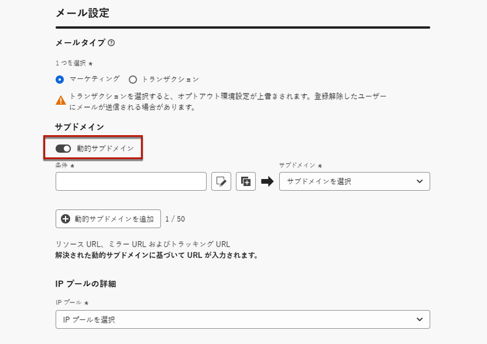
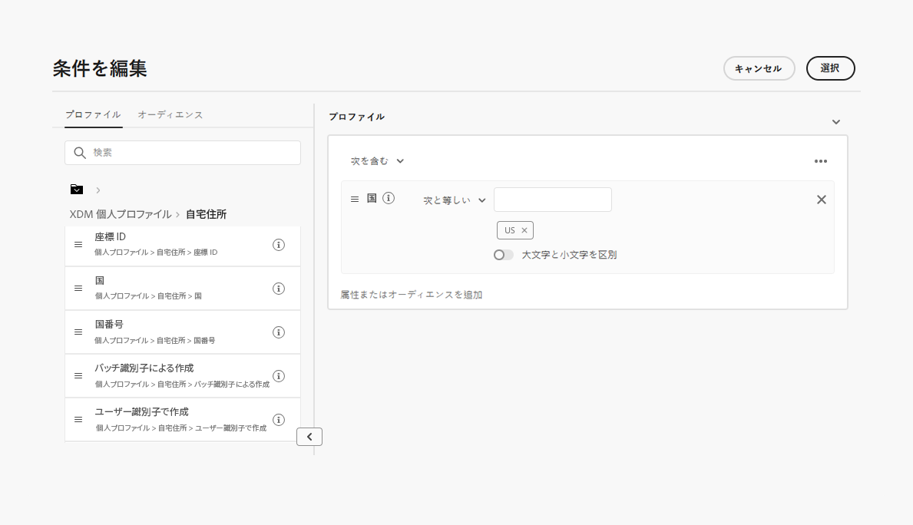
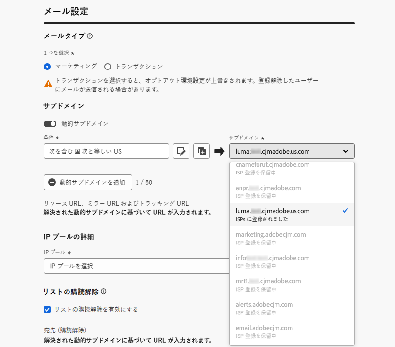
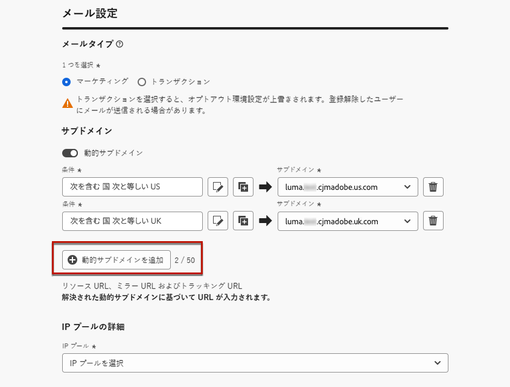
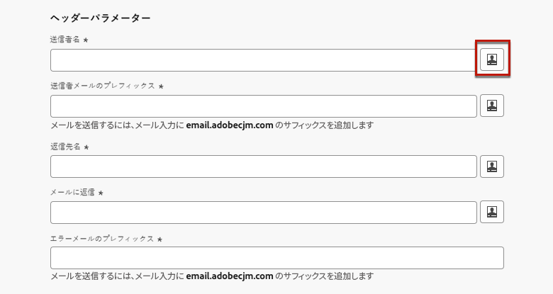
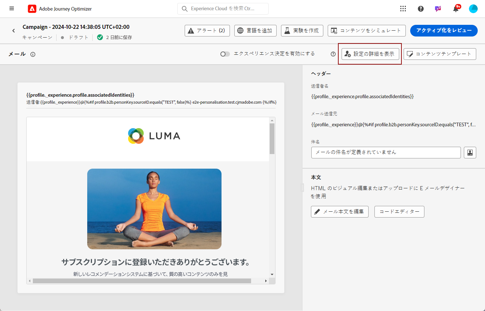
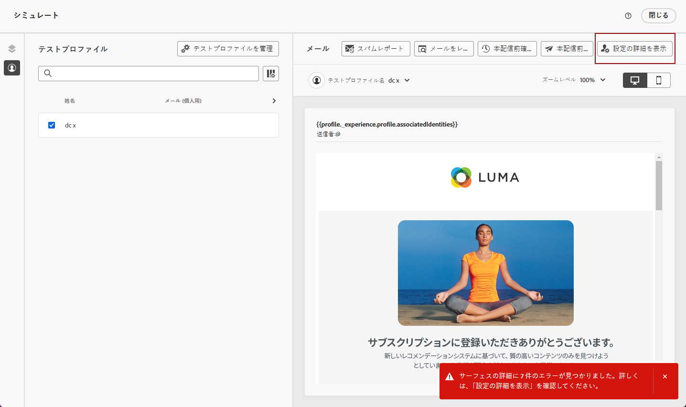
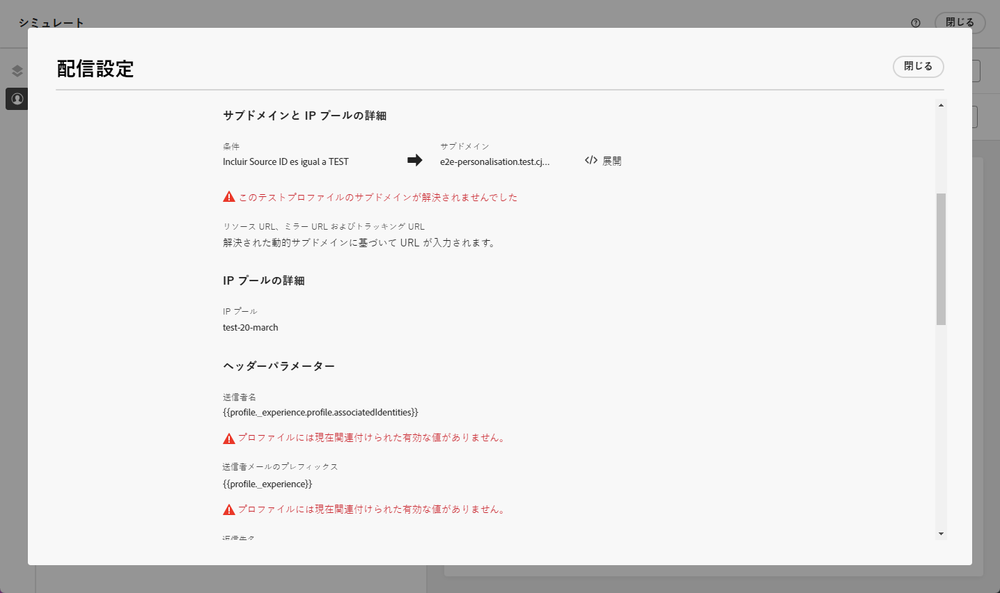

# メール設定のパーソナライズ {#surface-personalization}

メール設定の柔軟性と制御を高めるために、[!DNL Journey Optimizer] では、メール設定の作成時にサブドメイン、ヘッダーおよび URL トラッキングパラメーターに、パーソナライズされた値を定義できます。

## 動的サブドメインを追加 {#dynamic-subdomains}

>[!CONTEXTUALHELP]
>id="ajo_surface_perso_not_available"
>title="パーソナライゼーションを利用できません"
>abstract="この設定は、パーソナライゼーション属性なしで作成されました。パーソナライゼーションが必要な場合に解決する手順については、ドキュメントを参照してください。"

>[!CONTEXTUALHELP]
>id="ajo_surface_dynamic_subdomain"
>title="動的サブドメインを有効にする"
>abstract="メール設定を作成する際に、パーソナライゼーションエディターを使用して定義した条件に基づいて、動的サブドメインを設定できます。最大 50 個の動的サブドメインを追加できます。"

メール設定を作成する際に、特定の条件に基づいて動的サブドメインを設定できます。

例えば、国別に専用のメールアドレスからメッセージを送信するという法的制約がある場合は、動的サブドメインを使用できます。これにより、国ごとに複数の設定を作成する代わりに、異なる国に対応する複数の送信サブドメインを含む単一の設定を作成できます。次に、様々な国に拠点を持つ顧客を 1 つのキャンペーンに統合してターゲットにすることができます。

メールチャネル設定で動的サブドメインを定義するには、以下の手順に従います。

1. 設定を作成する前に、ユースケースに応じて、メールの送信に使用するサブドメインを設定します。[方法についてはこちらを参照](../configuration/about-subdomain-delegation.md)

   例えば、国ごとに異なるサブドメインを使用する場合、米国に固有のサブドメインと、英国に固有のサブドメインをそれぞれ 1 つ設定します。

1. チャネル設定を作成します。[方法についてはこちらを参照](../configuration/channel-surfaces.md)

1. **[!UICONTROL メール]**&#x200B;チャネルの選択

1. **サブドメイン**&#x200B;セクションで、**[!UICONTROL 動的サブドメイン]**&#x200B;オプションを有効にします。

   

1. 最初の&#x200B;**[!UICONTROL 条件]**&#x200B;フィールドの横にある「編集」アイコンを選択します。

1. [パーソナライゼーションエディター](../personalization/personalization-build-expressions.md)が開きます。この例では、`Country`等しい`US`のような条件を設定します。

   

1. この条件に関連付けるサブドメインを選択します。[詳しくは、サブドメインを参照してください。](../configuration/about-subdomain-delegation.md)

   >[!NOTE]
   >
   >[フィードバックループ](../reports/deliverability.md#feedback-loops)登録が保留中のため、特定のサブドメインは現在選択できません。この処理には、最大 10 営業日かかる場合があります。完了したら、使用可能なすべてのサブドメインから選択できます。<!--where FL registration happens? is it when delegating a subdomain and you are awaiting from subdomain validation? or is it on ISP side only?-->

   

   米国在住のすべての受信者は、その国で選択されたサブドメインを使用してメッセージを受信します。つまり、関連するすべての URL（ミラーページ、トラッキング URL、登録解除リンクなど）は、そのサブドメインに基づいて設定されます。

1. 必要に応じて他の動的サブドメインを設定します。最大 50 の項目を追加できます。

   

   <!--Select the [IP pool](../configuration/ip-pools.md) to associate with the configuration. [Learn more](email-settings.md#subdomains-and-ip-pools)-->

1. その他すべての[メール設定](email-settings.md)を定義して、設定を[送信](../configuration/channel-surfaces.md#create-channel-surface)します。

1 つ以上の動的サブドメインを設定に追加すると、この設定で解決された動的サブドメインに基づいて、次の項目が入力されます。

* すべての URL（リソース URL、ミラーページ URL およびトラッキング URL）

* [URL の登録解除](email-settings.md#list-unsubscribe)

* **送信元メール**&#x200B;および&#x200B;**エラーメール**&#x200B;サフィックス

>[!NOTE]
>
>動的サブドメインを設定してから&#x200B;**[!UICONTROL 動的サブドメイン]**&#x200B;オプションを無効にすると、すべての動的な値が削除されます。サブドメインを選択し、設定を送信して変更を有効にします。

## ヘッダーのパーソナライズ {#personalize-header}

また、設定で定義されているすべてのヘッダーパラメーターに対してパーソナライゼーションを使用することもできます。

例えば、ブランドが複数ある場合は、単一の設定を作成し、メールヘッダーにパーソナライズされた値を使用できます。これにより、様々なブランドから送信されるすべてのメールが、正しい&#x200B;**送信元**&#x200B;の名前とメールアドレスを使用して、各顧客に送信されるようになります。同様に、受信者がメールクライアントソフトウェアの「**返信**」ボタンを押した際、**返信先**&#x200B;の名前とメールアドレスが、適切なユーザーの正しいブランドに対応するようにする必要があります。

設定ヘッダーパラメーターにパーソナライズされた変数を使用するには、次の手順に従います。

>[!NOTE]
>
>「**[!UICONTROL エラーメールの接頭辞]**」フィールドを除く、すべての「**[!UICONTROL ヘッダーパラメーター]**」フィールドをパーソナライズできます。

1. 通常どおりにヘッダーパラメーターを定義します。[方法についてはこちらを参照](email-settings.md#email-header)

1. 各フィールドに対して、編集アイコンを選択します。

   

1. [パーソナライゼーションエディター](../personalization/personalization-build-expressions.md)が開きます。必要に応じて条件を定義し、変更を保存します。

   <!--For example, set a condition such as each recipient receives an email from their own brand representative.-->

   >[!NOTE]
   >
   >選択できるのは、**[!UICONTROL プロファイル属性]**&#x200B;と&#x200B;**[!UICONTROL ヘルパー関数]**&#x200B;のみです。

   例えば、顧客プロファイルに詳細が保存される関係マネージャーに代わって送信されたメールを動的に処理し、すべての顧客が関係マネージャーにリンクされるようにするとします。[ジャーニー](../building-journeys/journey-gs.md)では、プロファイル属性から取得した関係マネージャーパラメーターを使用して、メールのヘッダー（送信者名、送信者のメール、返信先のアドレス）をパーソナライズできます。

   <!--The examples below use event parameters, which are currently not available.
    
    Let's say you want to handle dynamically emails sent on behalf of a sales assistant, where the sales assistant is retrieved from an event or campaign contextual parameters. For example: In a [journey](../building-journeys/journey-gs.md), when a purchase event is linked to the sales assistant of a specific shop, the email header (sender name, sender email, reply to address) can be personalized with the sales assistant parameters, taken from the event attributes. In an [API-triggered campaign](../campaigns/api-triggered-campaigns.md), initiated externally by a sales assistant, the triggered email can be sent on behalf of the sales assistant and the header personalization values taken from campaign contextual parameters.-->

1. パーソナライゼーションを追加する各パラメーターに対して、上記の手順を繰り返します。

>[!NOTE]
>
>1 つ以上の動的サブドメインを設定に追加した場合、**送信元メール**&#x200B;と&#x200B;**エラーメール**&#x200B;のサフィックスは、解決された[動的サブドメイン](#dynamic-subdomains)に基づいて入力されます。

## パーソナライズした URL トラッキングの使用 {#personalize-url-tracking}

パーソナライズした URL トラッキングパラメーターを使用するには、次の手順に従います。

1. メールチャネル設定の「**[!UICONTROL URL トラッキングパラメーター]**」セクションに移動します。[詳細情報](url-tracking.md)

1. 各フィールドの横にある編集アイコンをクリックします。コンテキスト属性に加えて、プロファイル属性を選択できます。

1. [パーソナライゼーションエディター](../personalization/personalization-build-expressions.md)から、目的のプロファイル属性を選択します。

1. パーソナライズする各トラッキングパラメーターに対して、上記の手順を繰り返します。

これで、メールを送信すると、パーソナライズしたパラメーターが URL の末尾に自動的に追加されます。その後、このパラメーターを web 分析ツールまたはパフォーマンスレポートで取得できます。

## 設定の詳細を表示 {#view-surface-details}

キャンペーンまたはジャーニーでパーソナライズされた設定を含む設定を使用する場合、キャンペーンまたはジャーニー内で設定の詳細を直接表示できます。次の手順に従います。

1. メールの[キャンペーン](../campaigns/create-campaign.md)または[ジャーニー](../building-journeys/journey-gs.md)を作成します。

1. 「**[!UICONTROL コンテンツを編集]**」ボタンを選択します。

1. 「**[!UICONTROL 設定の詳細を表示]**」ボタンをクリックします。

   

1. **[!UICONTROL 配信設定]**&#x200B;ウィンドウが表示されます。動的サブドメインやパーソナライズされたヘッダーパラメーターを含む、すべての設定を表示できます。

   >[!NOTE]
   >
   >この画面上のすべての情報は、読み取り専用です。

1. 「**[!UICONTROL 展開]**」を選択して、動的サブドメインの詳細を表示します。

   

## 設定を確認 {#check-configuration}

キャンペーンやジャーニーでパーソナライズされた設定を使用する際に、テストプロファイルを使用してメールコンテンツをプレビューし、定義した動的設定で潜在的なエラーを確認できます。次の手順に従います。

>[!NOTE]
>
>テストプロファイルに加えて、[!DNL Journey optimizer] を使用すると、CSV／JSON ファイルからアップロードした、または手動で追加したサンプル入力データを使用してコンテンツをプレビューし、本配信前確認を送信することで、コンテンツの様々なバリアントをテストできます。[コンテンツバリエーションのシミュレート方法を学ぶ](../test-approve/simulate-sample-input.md)

テストプロファイルを使用してコンテンツをプレビューするには、次の手順に従います。

1. メッセージのコンテンツを編集画面または E メールデザイナーで、「**[!UICONTROL コンテンツをシミュレート]**」ボタンをクリックします。[詳細情報](../content-management/preview.md)

1. [テストプロファイル](../content-management/test-profiles.md)を選択します。

1. エラーが表示された場合は、「**[!UICONTROL 設定の詳細を表示]**」ボタンをクリックします。

   

1. エラーの詳細については、**[!UICONTROL 配信設定]**&#x200B;画面を確認してください。

   

考えられるエラーは次のとおりです。

* 選択したテストプロファイルの&#x200B;**サブドメイン**&#x200B;が解決されませんでした。例えば、設定で、異なる国に対応する複数の送信サブドメインを使用しているにもかかわらず、選択したプロファイルに `Country` 属性の値が定義されていないか、属性が `France` に設定されているが、設定済みの値がその設定内のサブドメインに関連付けられていないとします。

* 選択したプロファイルには、1 つ以上の&#x200B;**ヘッダーパラメーター**&#x200B;に関連付けられた値がありません。

これらのエラーのいずれかが発生すると、選択したテストプロファイルにメールが送信されません。

このタイプのエラーを回避するには、定義したヘッダーパラメーターで、ほとんどのプロファイルの値を含むパーソナライズされた属性を使用してください。値が見つからない場合、メールの配信品質に影響を与える可能性があります。

>[!NOTE]
>
>配信品質について詳しくは、[この節](../reports/deliverability.md)を参照してください。
