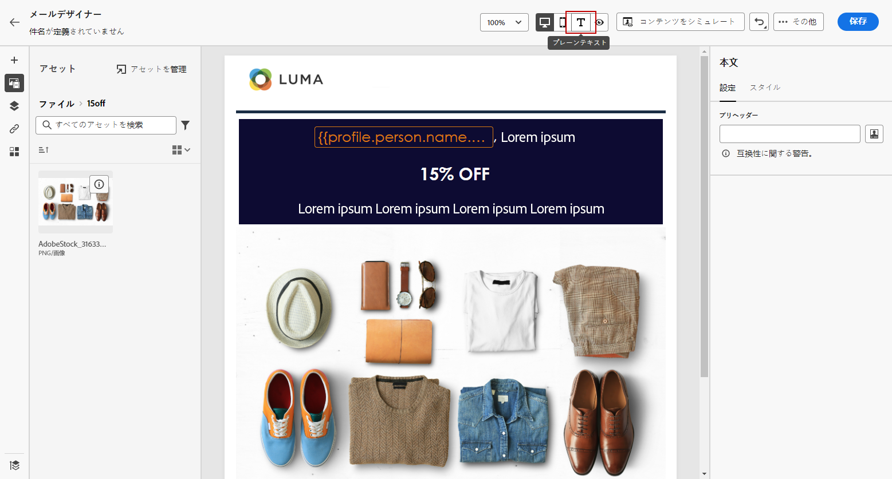
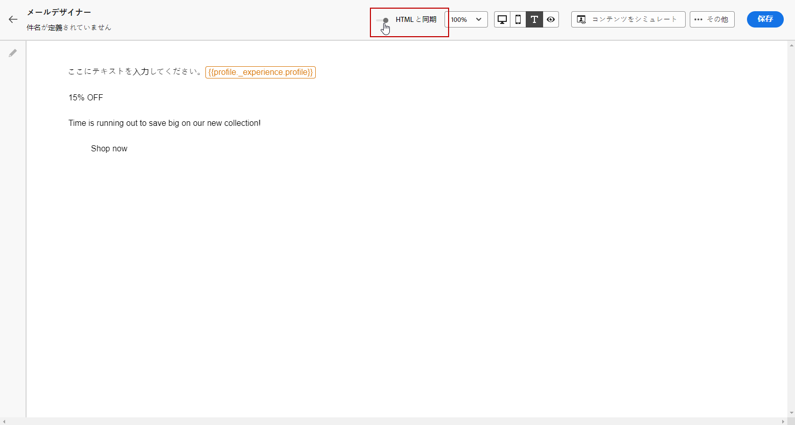
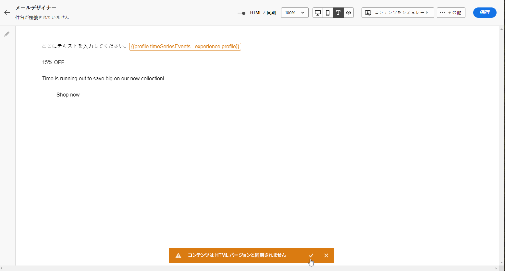

# メールのテキストバージョンの作成 {#text-version-email}

HTML コンテンツを表示できない場合に使用するため、メール本文のテキストバージョンを作成することをお勧めします。

デフォルトでは、E メールデザイナーは、パーソナライゼーションフィールドを含め、メールの&#x200B;**[!UICONTROL プレーンテキスト]**&#x200B;バージョンを作成します。このバージョンは自動的に生成され、HTML バージョンの内容と同期されます。

別の内容のプレーンテキストバージョンを使用するには、次の手順に従います。

1. メールから「**[!UICONTROL プレーンテキスト]**」アイコンを選択します。

   

1. 「**[!UICONTROL HTML と同期]**」切替スイッチで同期を無効にします。

   

1. チェックマークをクリックして、選択を確定します。

   

1. その後、必要に応じてプレーンテキストバージョンを編集します。

>[!CAUTION]
>
>* **[!UICONTROL プレーンテキスト]**&#x200B;表示で加えた変更は、HTML 表示には反映されません。
>
>* プレーンテキストの内容を更新した後にもう一度「**[!UICONTROL HTML と同期]**」オプションを有効にすると、変更は失われ、HTML バージョンから生成されたテキストの内容に置き換えられます。
