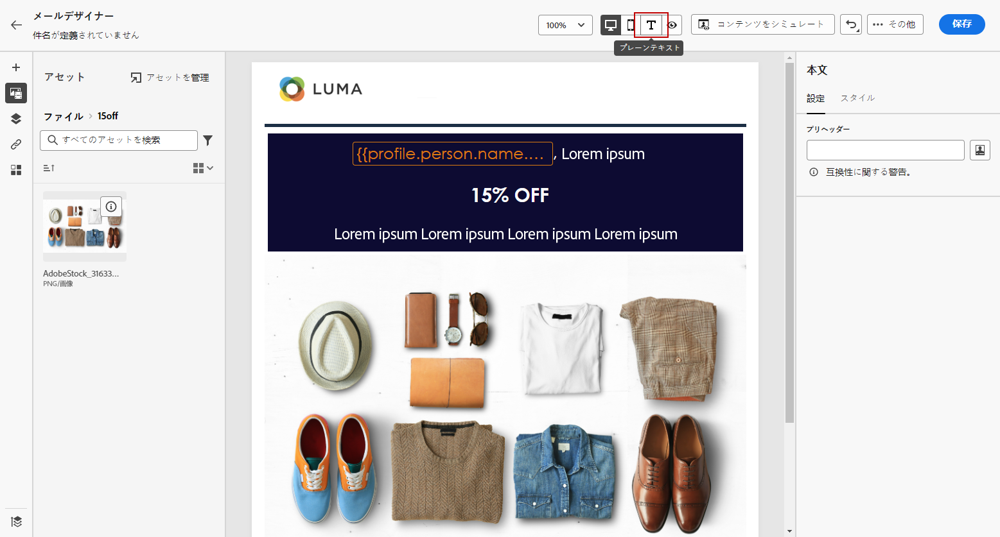
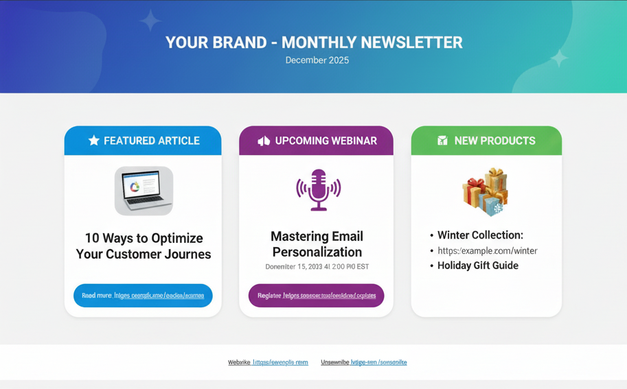

# メールのテキストバージョンの管理 {#text-version-email}

HTML コンテンツを表示できない場合に使用するため、メール本文のテキストバージョンを作成することをお勧めします。

セキュリティの観点では、HTMLのメールでは、悪意のあるスクリプト、トラッキングピクセル、リッチなフォーマットやリンクにもとづくフィッシング攻撃などのリスクが生じる可能性があるため、プレーンテキスト版を提供することが重要です。 プレーンテキストは、攻撃サーフェスを軽減し、多くの場合、HTMLを制限または削除するセキュリティに配慮した受信者や企業の電子メールシステムに好まれます。 両方のバージョンを提供することで、受信者はセキュリティとプライバシーの要件に合った形式を選択できます。

## デフォルトのテキストバージョンへのアクセス {#plain-text-default}

デフォルトでは、E メールデザイナーは、パーソナライゼーションフィールドを含め、メールの&#x200B;**[!UICONTROL プレーンテキスト]**&#x200B;バージョンを作成します。このバージョンは自動的に生成され、HTML バージョンの内容と同期されます。

デフォルトのテキストバージョンにアクセスするには、メールコンテンツから「**[!UICONTROL プレーンテキスト]**」アイコンを選択します。



## カスタムテキストバージョンの使用 {#plain-text-custom}

別の内容のプレーンテキストバージョンを使用するには、次の手順に従います。

1. メールから「**[!UICONTROL プレーンテキスト]**」アイコンを選択します。

1. **[!UICONTROL HTMLとの同期]**&#x200B;切り替えスイッチを使用して、同期を無効にします。 チェックマークをクリックして、選択を確定します。

   

1. その後、必要に応じてカスタムプレーンテキストバージョンを編集できます。

>[!CAUTION]
>
> * 同期が無効になっている場合、**[!UICONTROL プレーンテキスト]** ビューで行われた変更は、HTML ビューに反映されません。
>
> * プレーンテキストの内容を更新した後にもう一度「**[!UICONTROL HTML と同期]**」オプションを有効にすると、変更は失われ、HTML バージョンから生成されたテキストの内容に置き換えられます。

## AI受信箱のテキストバージョンを最適化する {#optimize-plain-text-ai}

AIを活用した受信トレイ機能（[!DNL Gmail]、[!DNL Outlook]、[!DNL Apple Mail]の要約など）は、**[!UICONTROL AI受信トレイに最適化]** ボタンを使用して、主要なオファーと詳細を表示するのに役立ちます。 このアクションは、メッセージのテキスト部分から読み取りやすい情報アシスタントに焦点を当てた改善されたプレーンテキストバージョンを生成します。

{zoomable="yes" width="80%"}

>[!IMPORTANT]
>
>この機能を使用する場合、**[!UICONTROL HTMLと同期]** オプションは自動的に無効になります。

完全なチュートリアルと推奨されるシナリオについては、[AI受信箱のメールテキストの最適化](../content-management/llm-email-optimizer.md)を参照してください。

## カスタムプレーンテキストバージョンの使用例 {#when-to-use}

カスタムプレーンテキストバージョンを作成する場合と自動同期を使用する場合を把握することで、最適なメール配信と読みやすさを確保できます。

### カスタムプレーンテキストを使用する（同期を無効にする）:

* **複雑なHTML レイアウト** - HTMLの電子メールには、複数列のレイアウト、テーブル、または複雑なCSSが含まれており、プレーンテキストにうまく変換されません。
* **視覚的な内容** – 電子メールは画像に大きく依存しており、画像が無効なクライアントに対して説明的なテキストの代替案を提供します。
* **異なるメッセージ構造** - プレーンテキスト読み取り用に最適化された、簡略化または再編成されたメッセージ構造を提供します。
* **アクセシビリティ要件** - アクセシビリティ標準を満たすには、特定のプレーンテキスト形式が必要です。
* **従来のメールクライアント** – 古いメールクライアント（Outlook 2003、テキストのみのモバイルクライアントなど）のユーザーで、特別な形式のコンテンツが必要なユーザーがオーディエンスに含まれます。
* **ASCII形式** - ASCII アート、テーブル、特定の改行など、特定のプレーンテキスト形式を含める必要があります。

### 次の場合は、自動同期（デフォルト）を使用します。

* **シンプルなHTML デザイン** - HTMLの電子メールは、シンプルで直線的な構造を持ち、プレーンテキストによく変換されます。
* **一貫性のあるコンテンツ** - HTMLとプレーンテキストのバージョン間で正確な一貫性を維持する必要があります。
* **頻繁な更新** - メールコンテンツを定期的に更新し、手作業による重複を避けたい。
* **Personalizationが正常に機能する** - パーソナライゼーションフィールドは両方の形式で正しく機能します。
* **時間の制約** – 追加のプレーンテキストのカスタマイズなしで、メールをすばやく起動する必要があります。

## 実践例 {#practical-examples}

次の例では、カスタムプレーンテキストを使用するか、自動同期するかを決定するのに役立つ実際のシナリオを示します。 それぞれの例では、決定の背景にあるコンテキスト、推奨されるアプローチ、根拠を説明しています。

+++例1：複雑なレイアウトのマーケティングニュースレター

**シナリオ：**&#x200B;画像、スタイル設定されたボタン、色分けされたセクションを含む複数列のニュースレター。



**推奨事項：** カスタムプレーンテキストを使用する（同期を無効にする）。

**カスタムプレーンテキストを使用する理由：** HTML版では、バナー画像、スタイル設定されたボタン、色分けされたセクションを含む3列のグリッドレイアウトが使用されています。 こうしたビジュアル要素は、自動同期によってプレーンテキストにうまく変換されないため、コンテンツが乱雑で読みにくい状態になります。 カスタムプレーンテキストバージョンでは、明確なセクションヘッダーと適切にフォーマットされたリンクを使用して、コンテンツを線形でスキャンしやすい形式に再構築できます。

**カスタムプレーンテキストの例：**

```
================================================
YOUR BRAND - MONTHLY NEWSLETTER
December 2025
================================================

🌟 FEATURED ARTICLE
"10 Ways to Optimize Your Customer Journeys"
Read more: https://example.com/articles/optimize-journeys

📢 UPCOMING WEBINAR
"Mastering Email Personalization"
December 15, 2025 at 2:00 PM EST
Register: https://example.com/webinar/register

📦 NEW PRODUCTS
- Winter Collection: https://example.com/winter
- Holiday Gift Guide: https://example.com/gifts

================================================
Website: https://example.com
Unsubscribe: https://example.com/unsubscribe
================================================
```

+++

+++例2：取引注文確認

**シナリオ：**&#x200B;構造化データを使用した注文確認（注文番号、品目、価格、配送詳細情報）。


**推奨事項：**&#x200B;自動同期を使用します。

**自動シンクが機能する理由：**&#x200B;注文の確認には、HTMLからプレーンテキストに自然に変換される、シンプルで直線的な構造があります。 情報は論理的に流れ（注文の詳細→商品→合計→出荷）、注文番号や顧客名などのパーソナライゼーションフィールドは両方の形式で同じように機能します。 構造化された表形式のデータは、手作業による調整を必要とせずにクリーンに変換されるため、明確さを維持しながら時間を節約できます。

+++

+++例3：リッチメディアを使用したイベント招待

**シナリオ：**&#x200B;背景画像、埋め込みビデオ、インタラクティブ要素を含むイベント招待。


**推奨事項：** カスタムプレーンテキストを使用する（同期を無効にする）。

**カスタムプレーンテキストを使用する理由：** HTML版では、背景画像、ビデオ埋め込み、インタラクティブなRSVP ボタンなど、視覚的な効果が重視されています。 自動同期を実行すると、これらの要素が削除され、壊れた参照を含む混乱しやすいテキストバージョンが残ります。 プレーンテキストのカスタムバージョンを使用すると、明確なイベントの詳細、話者の情報、直接登録リンクを、視覚的な要素なしで機能する整理整頓された形式で提供できます。

**カスタムプレーンテキストの例：**

```
YOU'RE INVITED!
Annual Customer Summit 2025

📅 When: March 15-17, 2025
📍 Where: San Francisco Convention Center
         123 Market Street, San Francisco, CA

KEYNOTE SPEAKERS
- Jane Smith, CEO TechCorp: "The Future of Digital Marketing"
- John Doe, Chief Innovation Officer: "AI and Customer Experience"

REGISTER NOW: https://example.com/summit/register
Early bird discount ends February 1st

Full agenda: https://example.com/summit/agenda
Questions: events@example.com | 1-800-555-0123
```

+++

## よくあるユースケース {#common-use-cases}

次のユースケースは、カスタムプレーンテキストバージョンの作成（同期の無効化）が有益な場合を示しています。 それぞれの例は、HTML バージョンがもたらす課題と、カスタムプレーンテキストソリューションがそれに対処する方法を示しています。

+++ユースケース 1：商品カタログメール

**課題：** HTMLには、画像、価格、購入ボタンが表示された商品のグリッドが表示されます

**プレーンテキストソリューション：**&#x200B;明確な商品名、価格、直接リンクを含む構造化リストを作成する

```
FEATURED PRODUCTS
=================

1. Premium Leather Wallet
   Price: $89.99
   View product: https://example.com/product/wallet
   
2. Designer Sunglasses
   Price: $129.99
   View product: https://example.com/product/sunglasses
```

+++

+++ユースケース 2：ウェルカムメールシリーズ

**課題：**&#x200B;会社のロゴとスタイル設定された形式のブランドのウェルカムメール

**プレーンテキストの解決策：** ASCII アートまたはテキスト形式を使用して視覚的階層を作成する

```
***************************************************
*                                                 *
*     WELCOME TO [BRAND NAME]                    *
*     We're thrilled to have you!                *
*                                                 *
***************************************************
```

+++

+++ユースケース 3：調査またはフィードバックの依頼

**チャレンジ：** HTMLには、スタイル設定されたボタンとフォーム要素が含まれています

**プレーンテキストソリューション：**&#x200B;明確なテキストリンクと指示を提供する

```
We'd love your feedback!
------------------------

Please take 2 minutes to complete our survey:
https://example.com/survey/customer-feedback

Your input helps us improve our service.
```

+++

## よくある質問 {#faq}

**パーソナライゼーションフィールドはプレーンテキストで動作しますか？**\
はい、`{{profile.firstName}}`のようなパーソナライゼーションフィールドは、HTML版とプレーンテキスト版の両方で同じように機能します。

**プレーンテキストのバージョンをテストするにはどうすればよいですか？**
* 電子メールDesignerの&#x200B;**[!UICONTROL プレーンテキスト]**&#x200B;表示に切り替えます。 [方法についてはこちらを参照](#text-version-email)
* 古いバージョンのPineや基本的なモバイルメールアプリなど、テキストのみのメールクライアントにテストメールを送信します。

**プレーンテキストバージョンの作成を忘れた場合はどうなりますか？**\
HTMLからプレーンテキスト版が自動的に生成されます。プレーンテキスト版は、最適なフォーマットではないかもしれませんが、テキストのみのクライアントへの配信は確実に行われます。

**HTMLとプレーンテキストで異なるパーソナライゼーションを使用できますか？**\
はい、同期を無効にすると、異なるパーソナライゼーションフィールドやコンテンツの使用など、各バージョンを個別にカスタマイズできます。

**プレーンテキストのみをサポートする電子メールクライアントはどれですか？**\
テキストのみのクライアントは非常に少なくなりましたが、一部の企業のメールポリシー、アクセシビリティツール、および古いモバイルデバイスでは、プレーンテキストが表示される場合があります。 また、HTMLのレンダリングが失敗した場合のフォールバックにもなります。

**プレーンテキストバージョンはどのくらいの頻度で更新する必要がありますか？**\
HTMLのコンテンツに大きな変更を加えるたびに更新します。 コアメッセージが同じままの場合、HTMLの軽微な調整では、プレーンテキストの更新が必要にならない場合があります。

**プレーンテキストメールにリンクを含めることはできますか？**\
はい。完全なURL （例：https://example.com/page）を含めると、ほとんどのメールクライアントで自動的にクリック可能になります。

**プレーンテキストに画像を含める必要がありますか？**\
プレーンテキストは画像をサポートしていません。 代わりに、画像が示す内容を説明するか、オンラインで表示するためのリンクを提供します。
