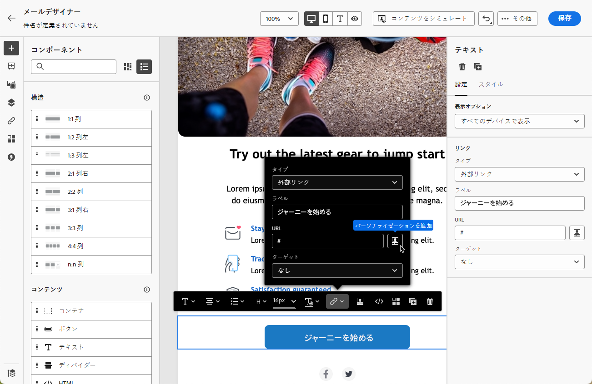
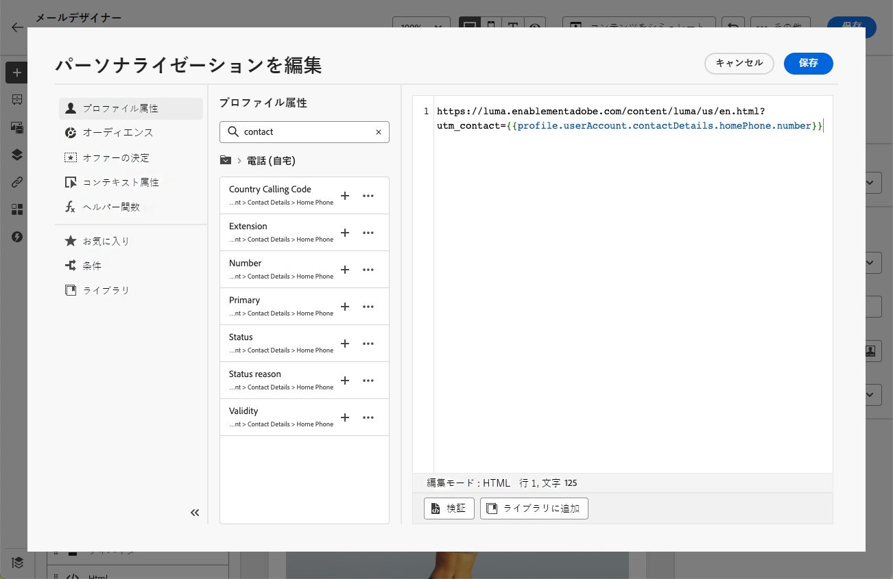

# メールのURLのパーソナライズ {#url-personalization}

パーソナライズされたURLを使用すると、受信者固有のリンクの生成や動的パラメーターの追加など、[!DNL Journey Optimizer]電子メールメッセージを通じてコンテクストに即したエクスペリエンスを提供できます。

プロファイル属性に応じて、受信者をweb サイトの特定のページやパーソナライズされたマイクロサイトに誘導します。

## URLのパーソナライズ {#personalize-url}

URLをパーソナライズするには、次の手順に従います。

1. 電子メール Designerで、コンテンツ内の要素を選択し、コンテキストツールバーを使用して[ リンクを挿入](message-tracking.md#insert-links)します。

   >[!IMPORTANT]
   >
   >Personalizationは、**[!UICONTROL 外部リンク]**、**[!UICONTROL 購読解除リンク]**&#x200B;および&#x200B;**[!DNL Opt-Out]**&#x200B;でのみ使用できます。 適切なリンクタイプを選択してください。

1. パーソナライゼーションアイコンを選択します。

   

1. パーソナライゼーションエディターを使用して、URLをパーソナライズするプロファイル属性を追加します。

1. 変更を保存します。

パーソナライズされたURLの例を次に示します。

* `https://www.adobe.com/users/{{profile.person.name.lastName}}`
* `https://www.adobe.com/users?uid={{profile.person.name.firstName}}`
* `https://www.adobe.com/usera?uid={{context.journey.technicalProperties.journeyUID}}`
* `https://www.adobe.com/users?uid={{profile.person.crmid}}&token={{context.token}}`

>[!NOTE]
>
>パーソナライゼーションエディターでは、パーソナライズされた URL を編集する際、セキュリティ上の理由から、ヘルパー関数とオーディエンスメンバーシップが無効になります。
>
>スペースは、URL 内で使用されるパーソナライゼーショントークンではサポートされていません。

信頼性の高いレンダリングとトラッキングを行うには、以下の[ ベストプラクティスとガードレール ](#best-practices)に従ってください。

## 完全/ベース URLのパーソナライズ {#personalize-complete-base-url}

Journey Optimizerでは、URLの&#x200B;**entire** URLまたは&#x200B;**base domain**&#x200B;のパーソナライズもサポートしています。例：

```html
<a href="{{profile.social.link}}" />
<a href="{{profile.social.baseUrl}}/profile" />
<a href="https://{{profile.social.baseUrl}}/profile" />
```

>[!IMPORTANT]
>
>URLの完全なパーソナライズまたはベースのパーソナライズを有効にするには、Adobeに連絡し、許可されたドメインのリストを提供します。 これは、安全でないリダイレクトを防ぐために必要です。

## URL トラッキングパラメーターのパーソナライズ {#personalize-url-tracking-parameters}

[URL トラッキング ](url-tracking.md)はチャネル設定レベルで管理され、メッセージコンテンツに含まれるすべてのURLに適用されます。 電子メールDesignerでは、個々のリンクのURL トラッキングパラメーターをパーソナライズすることもできます。 これにより、受信者固有のパラメーターを1つのリンクに追加できます（例えば、Web分析ツールに識別子を渡すために）。

これを行うには、[ リンクを挿入](message-tracking.md#insert-links)し、パーソナライゼーションアイコンを選択し、URL トラッキングパラメーターを追加して、[ パーソナライゼーションエディター](../personalization/personalization-build-expressions.md)から選択したプロファイル属性を選択します。



このトラッキングパラメーターを追加する各リンクに対して、上記の手順を繰り返します。

これで、メールが送信されると、このパラメーターがURLの最後に自動的に追加されます。 その後、このパラメーターを web 分析ツールまたはパフォーマンスレポートで取得できます。

>[!NOTE]
>
>最終的な URL を確認するには、[配達確認を送信](../content-management/proofs.md)し、配達確認を受信したらメールのコンテンツにあるリンクをクリックします。 URL にはトラッキングパラメーターを表示する必要があります。 例：<https://luma.enablementadobe.com/content/luma/us/en.html?utm_contact=profile.userAccount.contactDetails.homePhone.number>

<!--
## Best practices and guardrails {#best-practices}

To keep links valid, clickable, and trackable, follow the best practices and guardrails below.

### Braces for dynamic URLs {#use-braces}

When inserting a URL that contains personalization, use three curly braces (`{{{ ... }}}`) for the dynamic portion of the URL. This prevents escaping from altering special characters (for example `/` and `+`) and helps avoid broken URLs, incorrect redirects, or tracking issues.

Here is an example:

```html
<a href="https://example.com/path/{{{profile.person.customSlug}}}?ref={{{context.system.source.id}}}">View details</a>
```

>[!IMPORTANT]
>
>Using raw output (`{{{ ... }}}`) means the value is inserted as-is. Only use it with values you trust and that are intended to be URL-safe (for example, values you generate or validate upstream).

### Correct URL tracking {#enable-url-tracking}

* When using personalization to generate the URL, ensure the resolved value starts with `http`/`https` for every recipient. Otherwise, tracking may not be applied and the link may not behave as expected.

* Do not use dynamic logic such as `let`, `each`, or `if` statements directly in the personalization editor's URL field. These are disabled for security reasons.

* If your scenario involves complex logic to generate personalized URLs, avoid placing that logic directly in the personalization editor's URL field. Instead:
    * Add the necessary logic and statements in the HTML content above or near the URL field.
    * Generate and store personalized attributes separately, then reference them in your email content.

### URL encoding and length {#encoding}

* URI syntax rules ([RFC 3986 standard](https://datatracker.ietf.org/doc/html/rfc3986){target="_blank"}) apply to all URLs in your email content. However, personalized URLs are more likely to surface encoding issues because recipient-specific values can introduce reserved characters (for example in query parameters). Therefore, ensure your dynamic values are URL-encoded (especially spaces, `&`, `#`, `%`, and `+`) and avoid using `+` for query values.

* Very long URLs can be truncated or rejected by browsers, mail clients, or downstream systems. For example, mirror page URLs can grow significantly when runtime personalization is heavy. Keep personalized payloads small and avoid embedding large objects into URLs.

### Recommended validation steps {#validation}

Before activating a journey or campaign, follow the recommendations below:

* Send a [proof](../content-management/proofs.md) and click links to confirm the resolved URL starts with `http`/`https` and keeps the expected structure.
* If tracking parameters are appended, confirm the final URL includes them (either via configuration-level URL tracking or per-link tracking parameters).
-->
