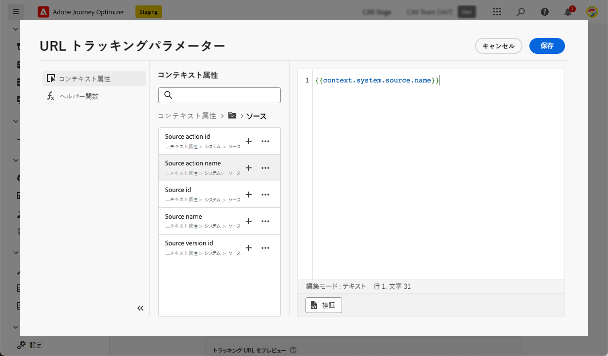
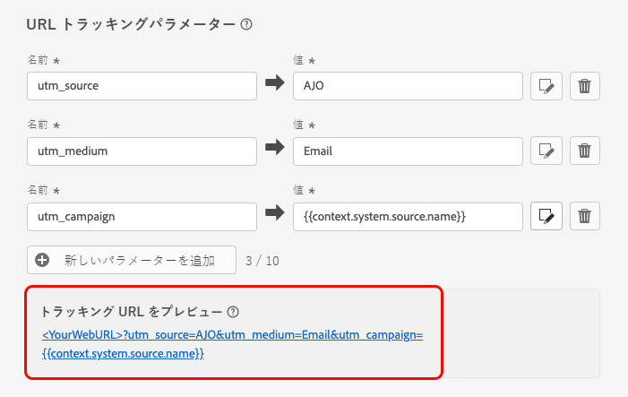

# URL トラッキング {#url-tracking}

>[!CONTEXTUALHELP]
>id="ajo_admin_preset_utm"
>title="URL トラッキングパラメーターの定義"
>abstract="このセクションを使用すると、メールコンテンツに存在する URL にトラッキングパラメーターを自動的に追加できます。この機能はオプションです。"

>[!CONTEXTUALHELP]
>id="ajo_admin_preset_url_preview"
>title="URL トラッキングパラメーターのプレビュー"
>abstract="メールコンテンツに存在する URL にトラッキングパラメーターを追加する方法を確認します。"

新しい[メールチャネル設定](email-settings.md)を指定する際に、**[!UICONTROL URL トラッキングパラメーター]**&#x200B;を定義し、チャネルをまたいでマーケティング活動の有効性を測定できます。この機能のアクティブ化はオプションです。

対応する節で定義したパラメーターは、メールメッセージコンテンツに含まれる URL の末尾に追加されます。その後、これらのパラメーターを Adobe Analytics や Google Analytics などの web 分析ツールで取得し、様々なパフォーマンスレポートを作成できます。

「**[!UICONTROL 新しいパラメーターを追加]**」ボタンを使用して最大 10 個のトラッキングパラメーターを追加できます。

{width="80%"}

URL トラッキングパラメーターを設定するには、目的の値を&#x200B;**[!UICONTROL 名前]**&#x200B;および&#x200B;**[!UICONTROL 値]**&#x200B;フィールドに直接入力することができます。

また、[パーソナライゼーションエディター](../personalization/personalization-build-expressions.md)を使用して各&#x200B;**[!UICONTROL 値]**&#x200B;フィールドを編集することもできます。「編集」アイコンをクリックして、エディターを開きます。ここから、利用可能なコンテキスト属性を選択したり、テキストを直接編集したりできます。

パーソナライゼーションエディターでは、次の事前定義済みの値を使用できます。

* **メッセージプロファイル ID**：配信内の各ターゲットプロファイルに送信される各メッセージを一意に識別するメッセージ指向の属性。

* **オファー ID**：メールで使用されるオファーの ID。

* **ソースアクション ID**：ジャーニーまたはキャンペーンに追加されたメールアクションの ID。

* **ソースアクション名**：ジャーニーまたはキャンペーンに追加されたメールアクションの名前。

* **ソース ID**：メールの送信に使用されたジャーニーまたはキャンペーンの ID。

* **ソース名**：メールの送信に使用されたジャーニーまたはキャンペーンの名前。

* **ソースバージョン ID**：メールの送信に使用されたジャーニーまたはキャンペーンのバージョンの ID。

>[!NOTE]
>
>テキスト値の入力と、パーソナライゼーションエディターからのコンテキスト属性の使用を組み合わせることができます。各「**[!UICONTROL 値]**」フィールドには、5 KB の制限までの文字数を含めることができます。

<!--You can drag and drop the parameters to reorder them.-->

以下に、Adobe Analytics および Google Analytics 互換 URL の例を示します。

* Adobe Analytics 互換 URL：`www.YourLandingURL.com?cid=email_AJO_{{context.system.source.id}}_image_{{context.system.source.name}}`

* Google Analytics 互換 URL：`www.YourLandingURL.com?utm_medium=email&utm_source=AJO&utm_campaign={{context.system.source.id}}&utm_content=image`

結果のトラッキング URL を動的にプレビューできます。パラメーターを追加、編集、または削除するたびに、プレビューが自動的に更新されます。

>[!NOTE]
>
>また、メールコンテンツ内のリンクに動的にパーソナライズされたトラッキングパラメーターを追加することもできます。[詳細情報](surface-personalization.md#personalize-url-tracking)
