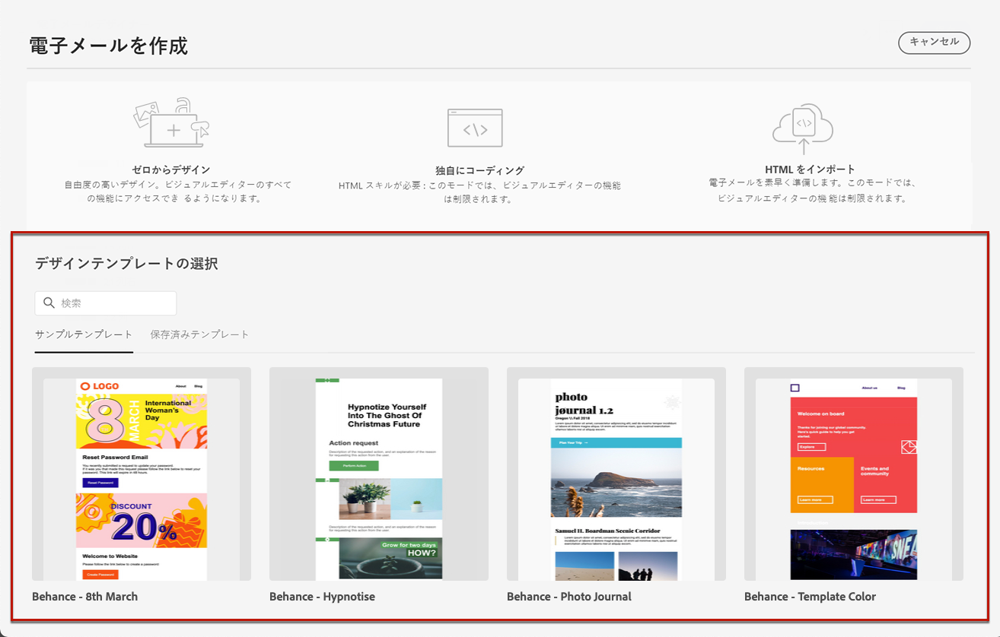
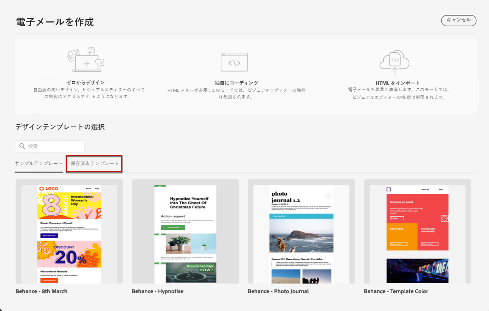
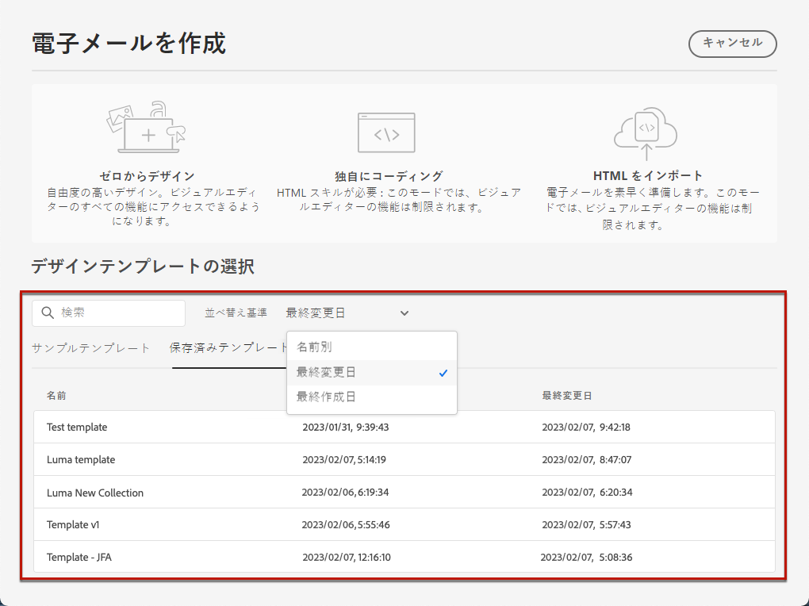
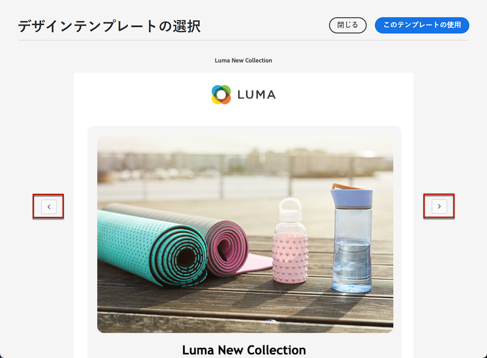

# メールテンプレートを使用 {#email-templates}

>[!CONTEXTUALHELP]
>id="ajo_use_template"
>title="テンプレートからコンテンツを作成"
>abstract="メールコンテンツの作成を開始するには、標準テンプレートまたはカスタムの既存のテンプレート（ゼロから作成された、または以前のメールからテンプレートとして保存されたもの）を選択します。"

「**[!UICONTROL メールを作成]**」画面から、「**[!UICONTROL デザインテンプレートを選択]**」セクションを使用して、テンプレートからコンテンツを作成します。

次の中から選択できます。

* **サンプルテンプレート**. この [!DNL Journey Optimizer] インターフェイスには、20 個の標準メールテンプレートが用意されており、このテンプレートから選択できます。

* **保存済みテンプレート**.また、次のいずれかの方法でカスタムテンプレートを使用することもできます。

   * 「**[!UICONTROL コンテンツテンプレート]**」メニューを使用してゼロから作成する。[詳細情報](../content-management/content-templates.md#content-templates)

   * 「**[!UICONTROL コンテンツテンプレートとして保存]**」オプションを使用して、ジャーニーまたはキャンペーンの電子メールから保存する。[詳細情報](../content-management/content-templates.md#video-templates)

サンプルまたは保存済みのテンプレートの 1 つを使用してコンテンツの作成を開始するには、次の手順に従います。

1. メール「**[!UICONTROL コンテンツを編集]**」画面から [E メールデザイナーへアクセス](get-started-email-design.md)します。

1. 「**[!UICONTROL 電子メールを作成]**」画面では、「**[!UICONTROL サンプルテンプレート]**」タブがデフォルトで選択されています。 

1. カスタムテンプレートを使用するには、「**[!UICONTROL 保存済みのテンプレート]**」タブに移動します。

   

1. 現在のサンドボックスに作成されたすべての[コンテンツテンプレート](../content-management/content-templates.md#content-templates)のリストが表示されます。**[!UICONTROL 名前別]**、**[!UICONTROL 最終変更日]**&#x200B;および&#x200B;**[!UICONTROL 最終作成日]**&#x200B;で並べ替え可能です。

   

1. リストから目的のテンプレートを選択します。

1. 選択したら、右向きや左向きの矢印を使用して、1 つのカテゴリのすべてのテンプレート（選択内容に応じてサンプルまたは保存済みのテンプレート）間を移動できます。

   

1. 画面右上の「**[!UICONTROL このテンプレートを使用]**」をクリックします。

1. E メールデザイナーを使用して、必要に応じてコンテンツを編集します。
