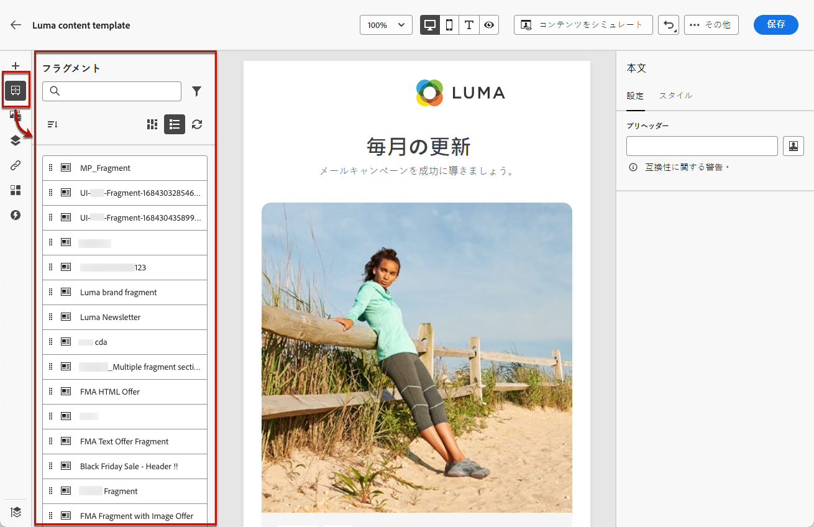
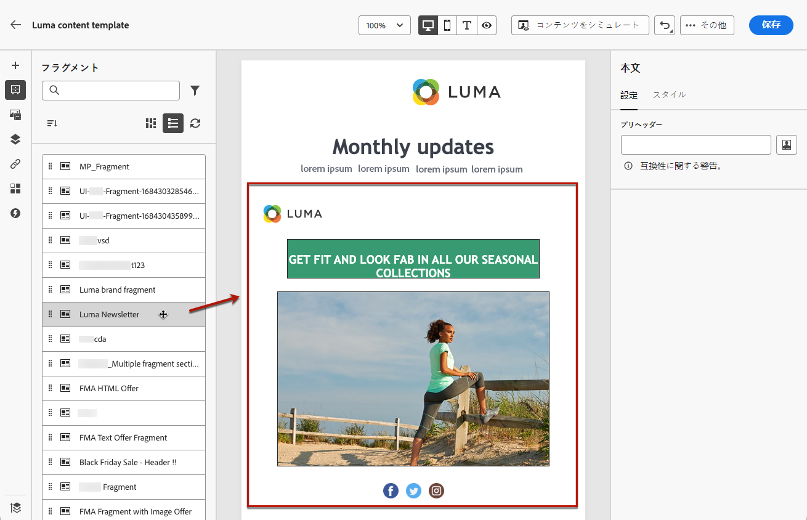
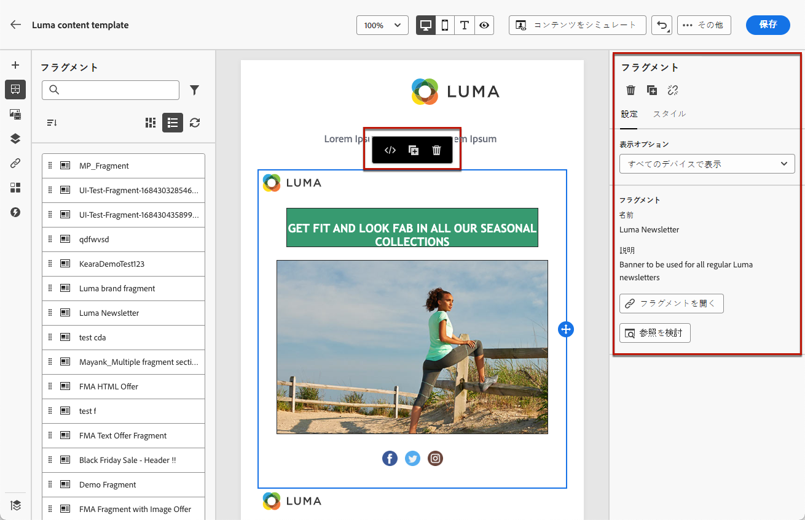
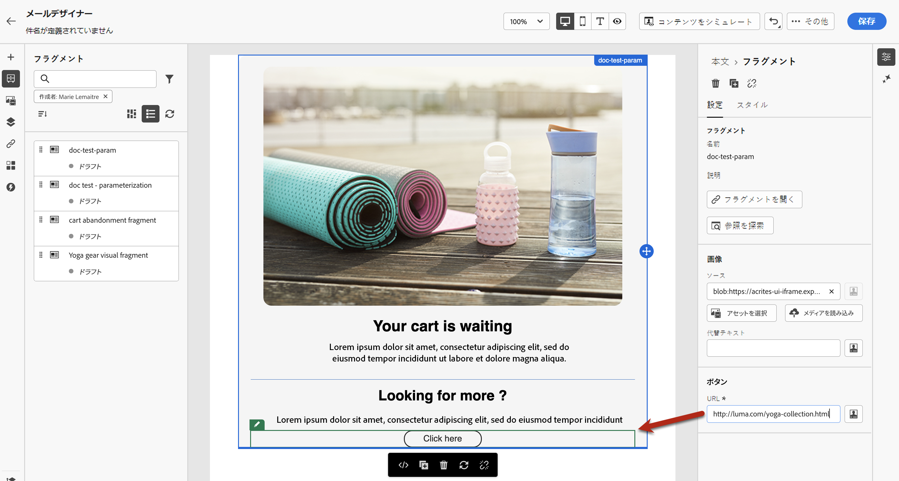
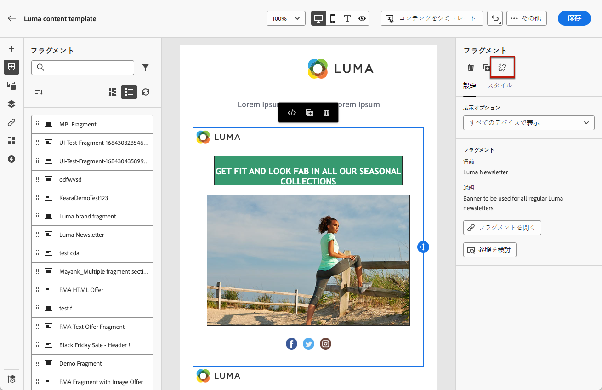

# メールへのビジュアルフラグメントの追加 {#use-visual-fragments}

フラグメントは、Journey Optimizer キャンペーン、ジャーニー、コンテンツテンプレート全体で 1 つ以上のメールで参照できる再利用可能なコンポーネントです。この機能を使用すると、マーケティングユーザーが改善されたデザインプロセスでメールコンテンツをすばやく組み立てるために使用できる複数のカスタムコンテンツブロックを事前に作成できます。 [詳しくは、フラグメントの作成と管理の方法を参照してください](../content-management/fragments.md)。

➡️ [フラグメントの管理、作成、使用方法について詳しくは、このビデオをご覧ください](../content-management/fragments.md#video-fragments)

## フラグメントの使用 {#use-fragment}

メールにフラグメントを使用するには、次の手順に従います。

>[!NOTE]
>
>1 回の配信で最大 30 個のフラグメントを追加できます。フラグメントをネストできるのは 1 レベルまでです。

1. [E メールデザイナー](get-started-email-design.md)を使用して、メールまたはテンプレートのコンテンツを開きます。

1. 左パネルから「**[!UICONTROL フラグメント]**」アイコンを選択します。

   

1. 現在のサンドボックスで作成されたすべてのビジュアルフラグメントのリストが表示されます。フラグメントは作成日で並べ替えられます。最近追加したビジュアルフラグメントがリストの最初に表示されます。次のことができます。

   * ラベルの入力を開始して、特定のフラグメントを検索します。
   * フラグメントを昇順または降順に並べ替えます。
   * フラグメントの表示方法（カード表示またはリスト表示）を変更します。
   * リストの更新

   >[!NOTE]
   >
   >コンテンツの編集中に一部のフラグメントが変更または追加された場合、リストは最新の変更内容に更新されます。

1. リストからフラグメントを挿入する領域にドラッグ＆ドロップします。

   

   >[!CAUTION]
   >
   >**ドラフト**&#x200B;または&#x200B;**ライブ**&#x200B;フラグメントをコンテンツに追加できます。ただし、ジャーニーまたはキャンペーンでドラフトステータスのフラグメントを使用している場合、そのジャーニーまたはキャンペーンはアクティブ化できません。ジャーニーまたはキャンペーンの公開時に、ドラフトフラグメントにエラーが表示されるので、公開するには承認する必要があります。

1. 他のコンポーネントと同様に、コンテンツ内でフラグメントを移動できます。

1. フラグメントを選択すると、右側に対応するパネルが表示されます。ここから、コンテンツからフラグメントを削除したり、複製したりできます。また、これらのアクションは、フラグメントの上部に表示されるコンテキストメニューから直接実行することもできます。

   

1. 「**[!UICONTROL 設定]**」タブから、次の操作を実行できます。

   * フラグメントを表示するデバイスを選択します。
   * 必要に応じて、新しいタブでフラグメントを開いて編集します。[詳細情報](../content-management/fragments.md#fragments)
   * 参照を探索します。[詳細情報](../content-management/fragments.md#visual-expression)

1. 「**[!UICONTROL スタイル]**」タブを使用して、フラグメントをさらにカスタマイズできます。

1. 必要に応じて、元のフラグメントの継承を解除できます。[詳細情報](#break-inheritance)

1. 必要な数のフラグメントを追加し、変更内容を&#x200B;**[!UICONTROL 保存]**&#x200B;します。

### フラグメントで動的コンテンツを使用する場合の制限事項 {#fragment-dynamic-content}

>[!CAUTION]
>
>動的コンテンツ（条件付きコンテンツ）を含むフラグメントを操作する場合、次の制限事項に注意してください。
>
>**フラグメントと動的コンテンツのネストはサポートされていません。** 動的コンテンツを含むフラグメントは、動的コンテンツも含むロックが解除されたフラグメント内に配置することはできません。 このサポートされていない設定は、次の原因となる可能性があります。
>
>* 条件付きコンテンツマッピングの喪失
>* E メールDesignerでの互換モードの警告
>* メールのレンダリングに一貫性がない
>
>**推奨されるアプローチ：** メール内で動的コンテンツと共に複数のフラグメントを使用する場合、各フラグメントをメールレベルの独自の構造ブロックに直接追加します。 これにより、適切な機能が保証され、上記の問題が回避されます。

## 動的コンテンツを含むフラグメントのベストプラクティス {#fragment-best-practices}

ビジュアルフラグメントと動的コンテンツ（条件付きコンテンツ）を使用する場合は、次のベストプラクティスに従います。

* **メールを適切に構造化**：動的コンテンツを含むフラグメントでメールを作成する場合、各フラグメントをメールレベルの専用の構造ブロックに追加します。 動的コンテンツを含むフラグメントは、動的コンテンツも含む、ロックが解除された他のフラグメント内にネストしないでください。

* **事前に計画**：メールにフラグメントを追加する前に、動的コンテンツを含むフラグメントを特定し、それに応じてレイアウトを計画します。 これにより、設定の問題を防ぎ、最初からクリーンな構造を確保できます。

* **再利用可能なフラグメントを慎重に設計**：動的コンテンツを含むフラグメントを作成する場合は、使用方法を検討します。 フラグメントを他のフラグメント内にネストする必要がある場合は、親フラグメントと子フラグメントの両方に動的コンテンツを追加しないでください。

* **トラブルシューティング**：条件付きコンテンツマッピングが失われたり、互換性モードの警告が表示されたりする場合は、次の手順に従います。
   * 動的コンテンツを含んだネストされたフラグメントのメール構造を確認する
   * 動的コンテンツを含む各フラグメントをメールレベルで独自の構造ブロックに移動して再構築します。
   * 保存して、条件付きコンテンツマッピングが適切に復元されていることを確認します

## 暗黙的変数の使用 {#implicit-variables-in-fragments}

暗黙的変数は、既存のフラグメント機能を強化して、コンテンツの再利用性とスクリプトのユースケースの効率を向上させます。フラグメントでは入力変数を使用し、キャンペーンおよびジャーニーコンテンツで使用可能な出力変数を作成できます。

暗黙的変数の使用方法については、[この節](../personalization/use-expression-fragments.md#implicit-variables)を参照してください。

## 編集可能フィールドのカスタマイズ {#customize-fields}

選択したフラグメントの特定の部分が編集可能になった場合、フラグメントをコンテンツに追加した後で、そのデフォルト値を上書きできます。 [詳しくは、フラグメントをカスタマイズ可能にする方法を参照してください](../content-management/customizable-fragments.md)

フラグメント内の編集可能フィールドをカスタマイズするには、次の手順に従います。

1. コンテンツにフラグメントを追加します。

1. これを選択すると、右側にプロパティパネルが開きます。

   フラグメント内のすべての編集可能フィールドが「**設定**」タブの「**フラグメント**」セクションに表示されます。

1. 右側のパネルで編集可能なフィールドを選択すると、中央のプレビューパネルでそのフィールドが緑色でハイライト表示され、コンテンツ内の場所を簡単に特定できます。

   次の例では、画像の&#x200B;**ソース**&#x200B;と&#x200B;**代替テキスト**&#x200B;のほか、「ここをクリック」ボタンの **URL** が編集可能です。

   

## 継承の解除 {#break-inheritance}

ビジュアルフラグメントを編集すると、変更内容が同期されます。これらは、そのフラグメントを含むすべてのドラフトまたはライブのジャーニー／キャンペーンおよびコンテンツテンプレートに自動的に生成されます。

メールまたはコンテンツテンプレートに追加すると、フラグメントはデフォルトで同期されます。ただし、元のフラグメントからの継承を解除することはできます。フラグメントのコンテンツは現在のデザインにコピーされ、変更内容は同期されなくなります。

継承を解除するには、次の手順に従います。

1. フラグメントを選択します。

1. コンテキストツールバーのロック解除アイコンをクリックします。

   

1. そのフラグメントは、元のフラグメントにリンクされなくなったスタンドアロン要素になります。コンテンツ内の他のコンテンツコンポーネントと同様に編集します。[詳細情報](content-components.md)
