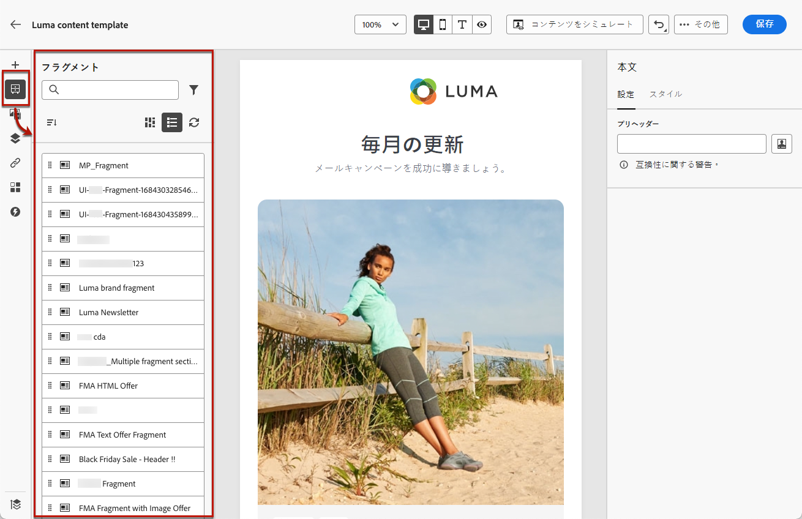
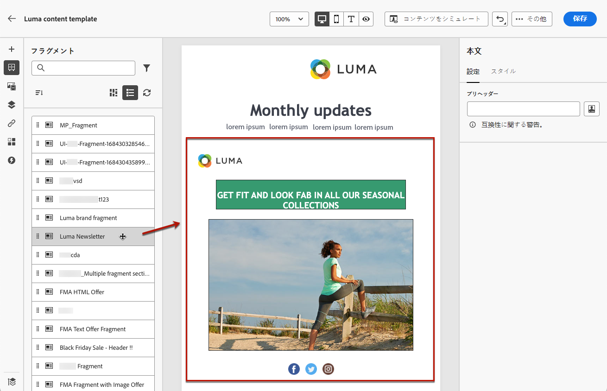
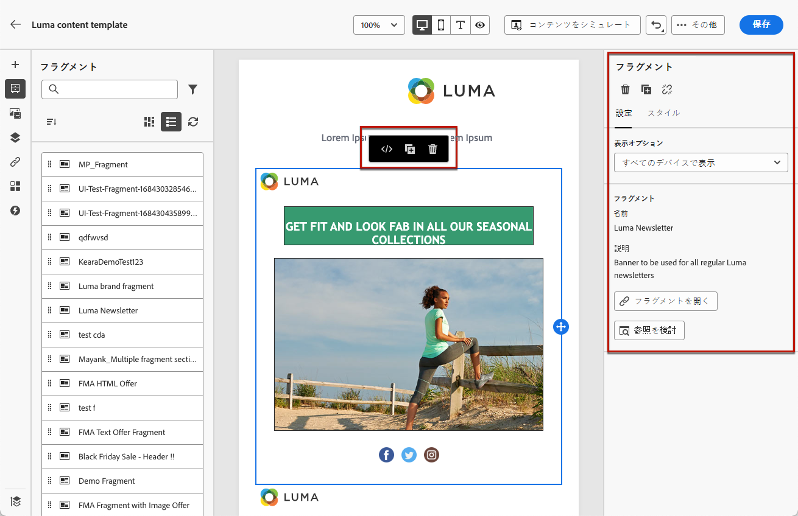
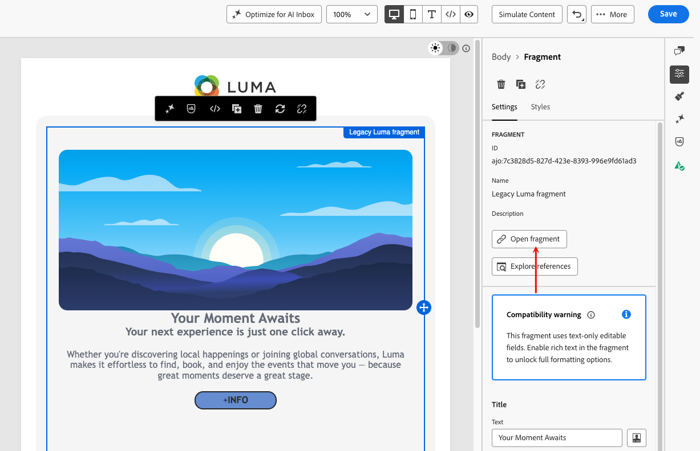
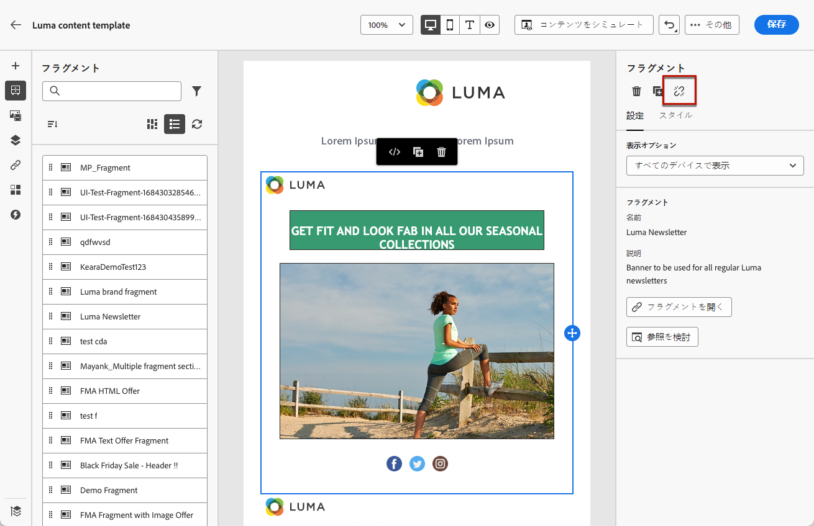
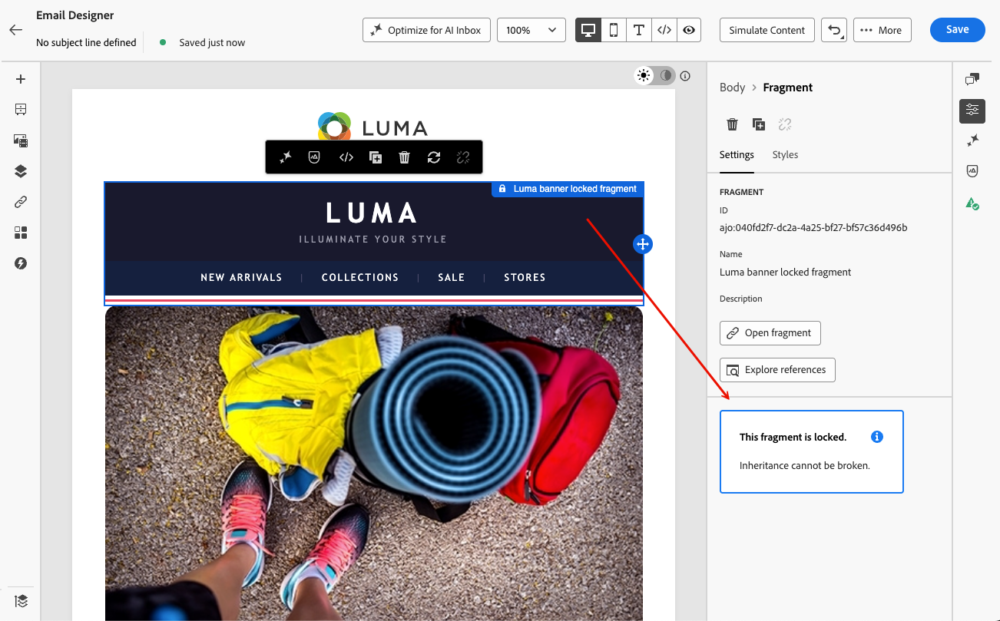

# メールへのビジュアルフラグメントの追加 {#use-visual-fragments}

>[!BEGINSHADEBOX]

**このページ：**&#x200B;では、再利用可能なビジュアルフラグメントをメールに挿入し、編集可能なフィールドをカスタマイズし、元のフラグメントとの継承を解除または維持する方法について説明します。

>[!ENDSHADEBOX]

フラグメントは、Journey Optimizer キャンペーン、ジャーニー、コンテンツテンプレート全体で 1 つ以上のメールで参照できる再利用可能なコンポーネントです。 この機能を使用すると、マーケティングユーザーが改善されたデザインプロセスでメールコンテンツを迅速に組み立てるために使用できる複数のカスタムコンテンツブロックを事前に作成できます。 [詳しくは、フラグメントの作成と管理の方法を参照してください](../content-management/fragments.md)。

➡️ [フラグメントの管理、作成、使用方法について詳しくは、このビデオを参照してください。](../content-management/fragments.md#video-fragments)

## フラグメントの使用 {#use-fragment}

メールにフラグメントを使用するには、次の手順に従います。

>[!NOTE]
>
>1 回の配信で最大 30 個のフラグメントを追加できます。 フラグメントをネストできるのは 1 レベルまでです。

1. [E メールデザイナー](get-started-email-design.md)を使用して、メールまたはテンプレートのコンテンツを開きます。

1. 左パネルから「**[!UICONTROL フラグメント]**」アイコンを選択します。

   

1. 現在のサンドボックスで作成されたすべてのビジュアルフラグメントのリストが表示されます。 フラグメントは作成日で並べ替えられます。最近追加したビジュアルフラグメントがリストの最初に表示されます。 実行できる操作は、次のとおりです。

   * ラベルの入力を開始して、特定のフラグメントを検索します。
   * フラグメントを昇順または降順に並べ替えます。
   * フラグメントの表示方法（カード表示またはリスト表示）を変更します。
   * リストの更新

   >[!NOTE]
   >
   >コンテンツの編集中に一部のフラグメントが変更または追加された場合、リストは最新の変更内容に更新されます。

1. リストからフラグメントを挿入する領域にドラッグ＆ドロップします。

   

   >[!CAUTION]
   >
   >任意の&#x200B;**ドラフト**&#x200B;または&#x200B;**ライブ**&#x200B;フラグメントをコンテンツに追加できます。 ただし、ジャーニーまたはキャンペーンでドラフトステータスのフラグメントを使用している場合、そのジャーニーまたはキャンペーンはアクティブ化できません。 ジャーニーまたはキャンペーンの公開時に、ドラフトフラグメントにエラーが表示されるので、公開するには承認する必要があります。

1. 他のコンポーネントと同様に、コンテンツ内でフラグメントを移動できます。

1. フラグメントを選択すると、右側に対応するパネルが表示されます。 ここから、コンテンツからフラグメントを削除したり、複製したりできます。 また、これらのアクションは、フラグメントの上部に表示されるコンテキストメニューから直接実行することもできます。

   

1. 「**[!UICONTROL 設定]**」タブから、次の操作を実行できます。

   * フラグメントを表示するデバイスを選択します。
   * フラグメントを新しいタブで開き、必要に応じて編集します。 [詳細情報](../content-management/manage-fragments.md#edit-fragments)
   * 参照を探索します。 [詳細情報](../content-management/fragments.md#visual-expression)

1. 必要に応じて、元のフラグメントの継承を解除できます。 [詳細情報](#break-inheritance)

   ロックを解除したら、フラグメントを他のコンポーネントとしてさらにカスタマイズし、「**[!UICONTROL スタイル]**」タブを使用できます。

1. 必要な数のフラグメントを追加し、変更内容を&#x200B;**[!UICONTROL 保存]**&#x200B;します。

## フラグメントでの条件付きコンテンツの管理 {#fragment-dynamic-content}

条件付きコンテンツを含むビジュアルフラグメントを使用する場合は、次のガイドラインに従います。 [詳しくは、動的コンテンツを参照してください。](../personalization/dynamic-content.md#emails)

>[!CAUTION]
>
>**条件付きコンテンツを含むフラグメントのネストはサポートされていません。** コンディショナルコンテンツを含むフラグメントを、コンディショナルコンテンツも含むロック解除されたフラグメント内に配置することはできません。 このサポートされていない設定により、次の問題が発生する場合があります。
>
>* 条件付きコンテンツバリアントマッピングの消失
>* E メールデザイナーでの互換性モードに関する警告
>* メールレンダリングの一貫性の欠如

**電子メールを適切に構造化する：**&#x200B;条件付きコンテンツで複数のフラグメントを使用する場合は、各フラグメントを電子メールレベルの独自の構造ブロックに直接追加します。 条件付きコンテンツを含むロック解除されたフラグメント内で、条件付きコンテンツを含むフラグメントをネストすることは避けてください。

**事前に計画：** メールにフラグメントを追加する前に、条件付きコンテンツを含むフラグメントを特定し、それに応じてレイアウトを計画します。 これにより、設定の問題を防ぎ、最初からクリーンな構造を確保できます。

**再利用可能なフラグメントを慎重にデザイン：**&#x200B;条件付きコンテンツを含むフラグメントを作成する場合、それらの使用方法を検討してください。 フラグメントを他のフラグメント内にネストする必要がある場合は、親フラグメントと子フラグメントの両方にコンディショナルコンテンツを追加しないでください。

**トラブルシューティング：**&#x200B;条件付きコンテンツバリアントのマッピングまたは互換性モードの警告が失われた場合は、次の手順に従います。

* 条件付きコンテンツを含むネストされたフラグメントのメール構造を確認する
* 条件付きコンテンツを含む各フラグメントを、メールレベルで独自の構造ブロックに移動して再構築します
* 条件付きコンテンツのバリエーションが適切に復元されていることを保存して確認します

## 暗黙的変数の使用 {#implicit-variables-in-fragments}

暗黙的変数は、既存のフラグメント機能を強化して、コンテンツの再利用性とスクリプトのユースケースの効率を向上させます。 フラグメントでは入力変数を使用し、キャンペーンおよびジャーニーコンテンツで使用可能な出力変数を作成できます。

暗黙的変数の使用方法については、[この節](../personalization/use-expression-fragments.md#implicit-variables)を参照してください。

## 編集可能フィールドのカスタマイズ {#customize-fields}

選択したフラグメントの一部が編集可能になっている場合は、そのフラグメントをコンテンツに追加した後で、そのデフォルト値を上書きできます。 [ フラグメントをカスタマイズ可能にする方法について説明します](../content-management/customizable-fragments.md)

メールで使用されるフラグメントで編集可能なフィールドをカスタマイズするには、次の手順に従います。

1. カスタマイズ可能なフラグメントをメールコンテンツに追加し、それを選択して、右側の&#x200B;**[!UICONTROL フラグメント]** ペインを開きます。

1. フラグメント内のすべての編集可能なフィールドは、**[!UICONTROL 設定]** タブのフラグメントプロパティの下に表示されます。

   次の例では、画像ソースと代替テキストだけでなく、「タイトル」/「サブタイトル」フィールドと「詳細情報」ボタンのURLも編集できます。

   

1. 中央のキャンバスの編集可能なフィールドにカーソルを合わせます。 フィールドが緑色でハイライト表示され、含まれているテキストをクリックすると鉛筆アイコンが表示されます。

   {width="80%" align="center"}

1. 中央の電子メールDesigner キャンバスで、フィールドテキストをインラインで直接編集します。

   >[!NOTE]
   >
   >コンテンツ内の編集可能なフィールドを簡単に見つけるには、右側のパネルから選択することもできますが、これらのフィールドは中央のキャンバスでのみ編集できます。

1. **[!UICONTROL テキスト]**、**[!UICONTROL ボタン]**、および&#x200B;**[!UICONTROL Html]** コンポーネントの場合、メールDesignerのツールバーでは、太字、斜体、ハイパーリンクなどのリッチテキスト書式設定オプションにもアクセスできます。

   メールDesigner ツールバーの

   >[!TIP]
   >
   >リッチテキスト編集機能が導入される前に作成されたフラグメントでは、デフォルトで編集可能フィールドがテキストのみのモードに設定されています。 完全な書式設定オプションを有効にするには、**[!UICONTROL フラグメントを開く]** ボタンを使用してフラグメントエディターに移動し、**[!UICONTROL 有効にする]**&#x200B;をクリックしてリッチテキストモードをロック解除し、**[!UICONTROL フラグメントを保存]**&#x200B;します。 [詳細情報](../content-management/customizable-fragments.md#rich-text-visual)

   {width="50%" align="center" zoomable="yes"}

1. 「**[!UICONTROL コンテンツをシミュレート]**」をクリックして、編集可能なコンテンツとスタイルのレンダリング方法を確認できます。 [コンテンツのプレビューの詳細情報](../content-management/preview-test.md)

>[!CAUTION]
>
>ボタンコンポーネントの&#x200B;**ラベル**&#x200B;と&#x200B;**URL**&#x200B;の両方をフラグメントで編集可能にした場合、トラッキングレポートにはボタンラベルの代わりにURLが表示されます。 [詳しくは、トラッキングを参照してください](message-tracking.md)

## 継承の解除 {#break-inheritance}

ビジュアルフラグメントを編集すると、変更内容が同期されます。 これらは、そのフラグメントを含むすべてのドラフトまたはライブのジャーニー／キャンペーンおよびコンテンツテンプレートに自動的に生成されます。

メールまたはコンテンツテンプレートに追加すると、フラグメントはデフォルトで同期されます。 ただし、元のフラグメントからの継承を解除することはできます。 フラグメントのコンテンツは現在のデザインにコピーされ、変更内容は同期されなくなります。

継承を解除するには、次の手順に従います。

1. フラグメントを選択します。

1. コンテキストツールバーのロック解除アイコンをクリックします。

   

1. そのフラグメントは、元のフラグメントにリンクされなくなったスタンドアロン要素になります。 コンテンツ内の他のコンテンツコンポーネントと同様に編集します。 [詳細情報](content-components.md)

### ロックされたフラグメント {#locked-fragments}

フラグメントが作成者によってロックされている場合、ロック解除アイコンはグレー表示され、継承の解除に使用できません。

ロックされたフラグメントはどこに現れても同期されたままであり、ブランド基準やコンプライアンス要件に違反する可能性のあるローカル編集が行われるのを防ぎます。

フラグメントをロックする方法については、[このセクション ](../content-management/create-fragments.md#lock-visual-fragment)を参照してください。

>[!NOTE]
>
>フラグメント作成者は、フラグメント設定で&#x200B;**[!UICONTROL 継承を解除できるようにする]**&#x200B;に動作をリセットすることで、後で将来の使用のために設定を変更できます。

