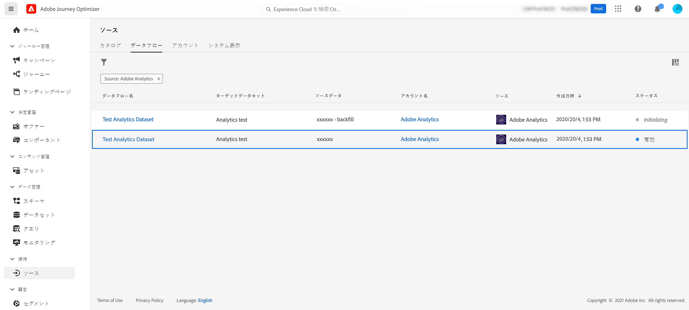

# Adobe Analytics データの活用{#analytics-data}

既にキャプチャし、Adobe Experience PlatformにストリーミングしているAdobe Analyticsのすべての行動イベントデータを活用して、ジャーニーをトリガーし、顧客に対するエクスペリエンスを自動化できます。

>[!NOTE]
>
>この節では、ルールベースのイベントと、Adobe Analytics データを使用する必要があるお客様が対象です。

この機能を有効にするには、使用するレポートスイートをAdobe Experience Platformでアクティブ化する必要があります。 これを行うには、以下の手順に従います。

1. Adobe Experience Platformに接続し、 **[!UICONTROL ソース]**.
1. 「 Adobe Analytics 」セクションで、「 **[!UICONTROL データを追加]**:使用可能なAdobe Analyticsレポートスイートのリストが表示されます。

1. 有効にするレポートスイートを選択し、 **[!UICONTROL 次へ]** および **[!UICONTROL 完了]**.

1. ソースデータ ID をベータプログラムの連絡窓口と共有します。

これにより、そのレポートスイートの Analytics ソースコネクタが有効になります。データが入ってくるたびに、データはエクスペリエンスイベントに変換され、Adobe Experience Platform に送信されます。

Adobe Analytics ソースコネクタについて詳しくは、[Adobe Experience Platform のドキュメント](https://experienceleague.adobe.com/docs/experience-platform/sources/connectors/adobe-applications/analytics.html?lang=ja){target=&quot;_blank&quot;}と[チュートリアルl](https://experienceleague.adobe.com/docs/experience-platform/sources/ui-tutorials/create/adobe-applications/analytics.html?lang=ja){target=&quot;_blank&quot;}を参照してください。
