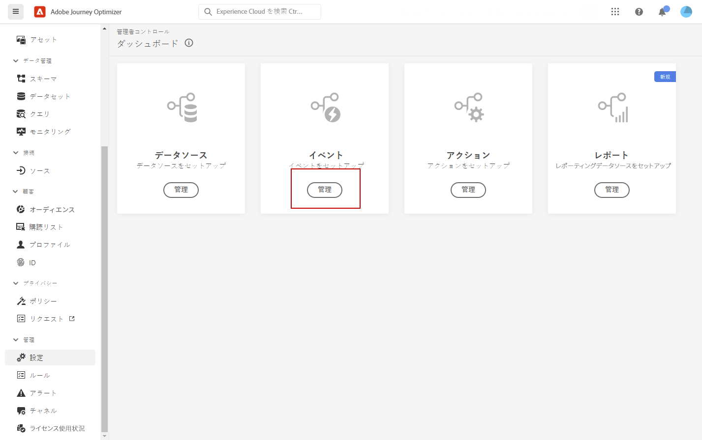

# Adobe Analyticsデータの操作 {#analytics-data}

ジャーニーをトリガーし、顧客に対するエクスペリエンスを自動化するために、Adobe Analyticsまたは Web SDK を通じて既に取り込んでいるすべての Web 行動イベントデータを活用し、Adobe Experience Platformにストリーミングできます。

これをAdobe Analyticsで機能させるには、以下をおこなう必要があります。

1. 使用するレポートスイートをアクティブ化します。 [詳細情報](#leverage-analytics-data)
1. Journey OptimizerでAdobe Analyticsデータソースを使用できるようにします。 [詳細情報](#activate-analytics-data)
1. ジャーニーに特定のイベントを追加します。 [詳細情報](#event-analytic)

>[!NOTE]
>
>この節の説明は、ルールベースのイベントと、Adobe Analyticsまたは Web SDK データを使用する必要があるお客様にのみ当てはまります。
> 
>Adobe Customer Journey Analyticsを使用している場合は、 [このページ](../reports/cja-ajo.md).

## Adobe Analyticsまたは Web SDK データの設定 {#leverage-analytics-data}

Adobe AnalyticsまたはAdobe Experience Platform Web SDK からのデータをジャーニーで使用するには、有効にする必要があります。

これを行うには、以下の手順に従います。

1. 次を参照： **[!UICONTROL ソース]** メニュー

1. 「Adobe Analytics」セクションで、「**[!UICONTROL データを追加]**」を選択します。

   

1. 使用可能な Adobe Analytics レポートスイートのリストから、有効にする&#x200B;**[!UICONTROL レポートスイート]**&#x200B;を選択します。次に、「**[!UICONTROL 次へ]**」をクリックします。

   

1. デフォルトスキーマまたはカスタムスキーマを使用するかどうかを選択します。

1. **[!UICONTROL データフローの詳細]**&#x200B;画面から、「**[!UICONTROL データフロー名]**」を選択します。

1. 設定が完了したら、「**[!UICONTROL 終了]**」をクリックします。

   

これにより、そのレポートスイートの Analytics ソースコネクタが有効になります。データが入ってくるたびに、データはエクスペリエンスイベントに変換され、Adobe Experience Platform に送信されます。

Adobe Analytics ソースコネクタについて詳しくは、[Adobe Experience Platform ドキュメント](https://experienceleague.adobe.com/docs/experience-platform/sources/connectors/adobe-applications/analytics.html?lang=ja){target="_blank"} and [tutorial](https://experienceleague.adobe.com/docs/experience-platform/sources/ui-tutorials/create/adobe-applications/analytics.html?lang=ja){target="_blank"}を参照してください。

## この設定を有効化 {#activate-analytics-data}

この設定が完了したら、Adobeに連絡して、Journey Optimizer環境でこのデータソースを使用できるようにします。 この手順は、Adobe Analyticsデータソースに対してのみ必要です。 次の手順を実行します。

1. データソース ID を取得します。 この情報は、ユーザーインターフェイスで使用できます。から作成したデータソースを参照します。 **データフロー** タブ **ソース** メニュー これを見つける最も簡単な方法は、Adobe Analyticsのソースをフィルタリングすることです。
1. 次の詳細については、Adobeカスタマーケアにお問い合わせください。

   * 件名：ジャーニーに対するAdobe Analyticsイベントの有効化

   * コンテンツ：環境で AA イベントを使用できるようにしてください。

      * 組織 ID :&quot;XXX@AdobeOrg&quot;

      * データソース ID:&quot;ID:xxxxx&quot;

1. 環境の準備が整ったことを確認したら、ジャーニーでAdobe Analyticsデータを使用できます。

## Adobe Analytics または Web SDK データを使用したイベントでのジャーニーの作成 {#event-analytics}

Adobe AnalyticsまたはAdobe Experience Platform Web SDK データに基づいてイベントを作成し、ジャーニーで使用できるようになりました。

次の例では、買い物かごに製品を追加したユーザーをターゲットにする方法を説明します。

* 注文が完了すると、2 日後にフィードバックを求めるフォローアップ電子メールがユーザーに送信されます。
* 注文が完了していない場合、注文を完了するように促す電子メールがユーザーに届きます。

1. Adobe Journey Optimizer から、**[!UICONTROL 設定]**&#x200B;メニューにアクセスします。

1. 次に、**[!UICONTROL イベント]**&#x200B;カードから「**[!UICONTROL 管理]**」を選択します。

   

1. 「**[!UICONTROL イベントを作成]**」をクリックします。画面の右側にイベント設定ペインが開きます。

1. 次の&#x200B;**[!UICONTROL イベント]**&#x200B;パラメーターを入力します。

   * **[!UICONTROL 名前]**：**[!UICONTROL イベント]**&#x200B;の名前をパーソナライズします。
   * **[!UICONTROL タイプ]**：**[!UICONTROL 単一]**&#x200B;タイプを選択します。[詳細情報](../event/about-events.md)
   * **[!UICONTROL イベント ID タイプ]**：**[!UICONTROL ルールベース]**&#x200B;のイベント ID タイプを選択します。[詳細情報](../event/about-events.md#event-id-type)
   * **[!UICONTROL スキーマ]**:Analytics または WebSDK のスキーマを選択 [次より前に作成](#leverage-analytics-data).
   * **[!UICONTROL フィールド]**：「ペイロード」フィールドを選択します。[詳細情報](../event/about-creating.md#define-the-payload-fields)
   * **[!UICONTROL イベント ID 条件]**:ジャーニーを識別するイベントを識別する条件を定義します。

      ここでは、顧客が買い物かごにアイテムを追加すると、イベントがトリガーされます。
   * **[!UICONTROL プロファイル識別子]**:ペイロードフィールドからフィールドを選択するか、数式を定義して、イベントに関連付けられた人物を識別します。

   

1. 設定したら、「**[!UICONTROL 保存]**」を選択します。

イベントの準備が整ったら、それを使用するジャーニーを作成します。

1. 次の **[!UICONTROL ジャーニー]** メニューを開くか、ジャーニーを作成します。 詳しくは、[この節](../building-journeys/journey-gs.md)を参照してください。

1. 以前に設定した Analytics イベントをジャーニーに追加します。

   

1. 注文が完了した場合にトリガーされるイベントを追加します。

1. **[!UICONTROL イベントメニュー]**&#x200B;から、「**[!UICONTROL イベントのタイムアウトを定義]**」および「**[!UICONTROL タイムアウトパスを設定]**」オプションを選択します。

   

1. タイムアウトパスから、**[!UICONTROL メール]**&#x200B;アクションを追加します。このパスは、注文を完了していない顧客にメールを送信して、買い物かごがまだ使用可能であることを通知するために使用されます。

1. **[!UICONTROL 待機]**&#x200B;アクティビティをメインパスの後に追加し、必要な期間に設定します。

   

1. 次に、**[!UICONTROL メールアクション]**&#x200B;を追加します。このメールでは、顧客は注文に関するフィードバックを提供するよう求められます。

ジャーニーをテストして公開できるようになりました。 [詳細情報](../building-journeys/publishing-the-journey.md)

