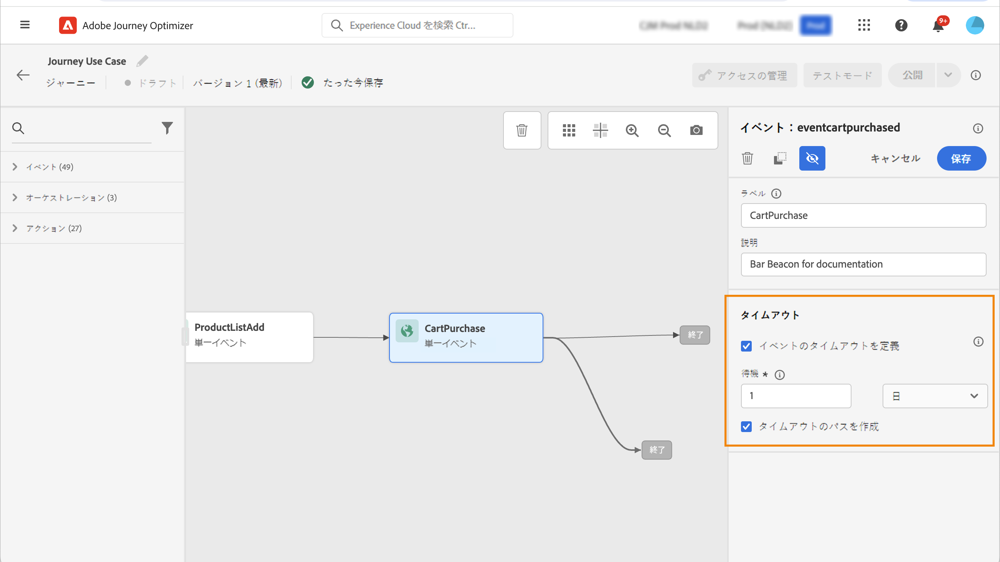

# Adobe Analytics データの操作 {#analytics-data}

ジャーニーをトリガー化し顧客向けのエクスペリエンスを自動化するために、Adobe Analytics、Web SDK、Adobe Experience Platformへのストリーミングを通じて既に取得しているあらゆる web 行動イベントデータを活用できます。

これを Adobe Analytics で操作するには、次の手順に従う必要があります。

1. 使用するレポートスイートをアクティベートします。[詳細情報](#leverage-analytics-data)
1. Journey Optimizer を有効にして、Adobe Analytics データソースを使用できるようにします。[詳細情報](#activate-analytics-data)
1. ジャーニーに特定のイベントを追加します。[詳細情報](#event-analytic)

>[!NOTE]
>
>この節は、ルールベースのイベントと、Adobe Analytics データを使用する必要があるお客様が対象です。
> 
>Adobe Customer Journey Analytics を使用している場合は、[このページ](../reports/cja-ajo.md)を参照してください。
>

## Adobe Analytics または Web SDK データの設定 {#leverage-analytics-data}

ジャーニーで使用するには、Adobe Analytics または Adobe Experience Platform Web SDK のデータを有効にする必要があります。

これを行うには、以下の手順に従います。

1. **[!UICONTROL ソース]**&#x200B;メニューを参照します。

1. 「Adobe Analytics」セクションで、「**[!UICONTROL データを追加]**」を選択します。

   

1. 使用可能な Adobe Analytics レポートスイートのリストから、有効にする&#x200B;**[!UICONTROL レポートスイート]**&#x200B;を選択します。次に、「**[!UICONTROL 次へ]**」をクリックします。

   

1. デフォルトスキーマまたはカスタムスキーマを使用するかどうかを選択します。

1. **[!UICONTROL データフローの詳細]**&#x200B;画面から、「**[!UICONTROL データフロー名]**」を選択します。

1. 設定が完了したら、「**[!UICONTROL 終了]**」をクリックします。

   

これにより、そのレポートスイートの Analytics ソースコネクタが有効になります。データが入ってくるたびに、データはエクスペリエンスイベントに変換され、Adobe Experience Platform に送信されます。

Adobe Analytics ソースコネクタについて詳しくは、[Adobe Experience Platform のドキュメント](https://experienceleague.adobe.com/docs/experience-platform/sources/connectors/adobe-applications/analytics.html?lang=ja){target="_blank"}と[チュートリアル](https://experienceleague.adobe.com/docs/experience-platform/sources/ui-tutorials/create/adobe-applications/analytics.html?lang=ja){target="_blank"}を参照してください。

## この設定のアクティベート {#activate-analytics-data}

この設定が完了したら、アドビにお問い合わせし、Journey Optimizer 環境でこのデータソースを使用できるようにしてください。この手順は、Adobe Analytics データソースにのみ必要です。次の手順を実行します。

1. データソース ID を取得します。 この情報は、ユーザーインターフェイスで利用できます。**ソース**&#x200B;メニューの「**データフロー**」タブから、作成したデータソースを参照します。これを検索する最も簡単な方法は、Adobe Analytics ソースでフィルタリングすることです。
1. アドビカスタマーケアにお問い合わせして、次の詳細を伝えます。

   * 件名：ジャーニーの Adobe Analytics イベントを有効にする

   * コンテンツ：AA イベントを使用する環境を有効にしてください。

      * 組織 ID：「XXX@AdobeOrg」

      * データソース ID：「ID:xxxxx」

1. 環境の準備が整っていることを確認したら、ジャーニーで Adobe Analytics データを使用できます。

## Adobe Analytics または Web SDK データを使用したイベントでのジャーニーの作成 {#event-analytics}

ジャーニーで使用する Adobe Analytics または Adobe Experience Platform Web SDK データに基づいてイベントを作成できるようになりました。

次の例では、買い物かごに製品を追加したユーザーをターゲットにする方法を説明します。

* 注文が完了すると、2 日後にフィードバックを求めるフォローアップメールが届きます。
* 注文が完了していない場合は、注文を完了するように通知するメールが届きます。

1. Adobe Journey Optimizer から、**[!UICONTROL 設定]**&#x200B;メニューにアクセスします。

1. 次に、**[!UICONTROL イベント]**&#x200B;カードから「**[!UICONTROL 管理]**」を選択します。

   

1. **[!UICONTROL イベントを作成]** をクリックします。 画面の右側にイベント設定ペインが開きます。

1. 次の&#x200B;**[!UICONTROL イベント]**&#x200B;パラメーターを入力します。

   * **[!UICONTROL 名前]**：**[!UICONTROL イベント]**&#x200B;の名前をパーソナライズします。
   * **[!UICONTROL タイプ]**：**[!UICONTROL 単一]**&#x200B;タイプを選択します。[詳細情報](../event/about-events.md)
   * **[!UICONTROL イベント ID タイプ]**：**[!UICONTROL ルールベース]**&#x200B;のイベント ID タイプを選択します。[詳細情報](../event/about-events.md#event-id-type)
   * **[!UICONTROL スキーマ]**：[以前に作成した](#leverage-analytics-data) Analytics または WebSDK スキーマを選択します。
   * **[!UICONTROL フィールド]**：「ペイロード」フィールドを選択します。[詳細情報](../event/about-creating.md#define-the-payload-fields)
   * **[!UICONTROL イベント ID 条件]**：ジャーニーをトリガーするイベントを識別する条件を定義します。

     ここでは、顧客が買い物かごにアイテムを追加すると、イベントがトリガーされます。
   * **[!UICONTROL プロファイル識別子]**：ペイロードフィールドからフィールドを選択するか、イベントに関連付けられたユーザーを識別する式を定義します。

   

1. 設定したら、「**[!UICONTROL 保存]**」を選択します。

イベントの準備が整ったら、それを使用するジャーニーを作成します。

1. **[!UICONTROL ジャーニー]**&#x200B;メニューから、ジャーニーを開くか作成します。詳しくは、[この節](../building-journeys/journey-gs.md)を参照してください。

1. 以前に設定した Analytics イベントをジャーニーに追加します。

   

1. 注文が完了した場合にトリガーされるイベントを追加します。

1. **[!UICONTROL イベントメニュー]**&#x200B;から、「**[!UICONTROL イベントのタイムアウトを定義]**」および「**[!UICONTROL タイムアウトパスを設定]**」オプションを選択します。

   

1. タイムアウトパスから、**[!UICONTROL メール]**&#x200B;アクションを追加します。このパスは、注文を完了していない顧客にメールを送信して、買い物かごがまだ使用可能であることを通知するために使用されます。

1. **[!UICONTROL 待機]**&#x200B;アクティビティをメインパスの後に追加し、必要な期間に設定します。

   

1. 次に、**[!UICONTROL メールアクション]**&#x200B;を追加します。このメールでは、顧客は注文に関するフィードバックを提供するよう求められます。

これで、ジャーニーをテストして公開できます。[詳細情報](../building-journeys/publishing-the-journey.md)

